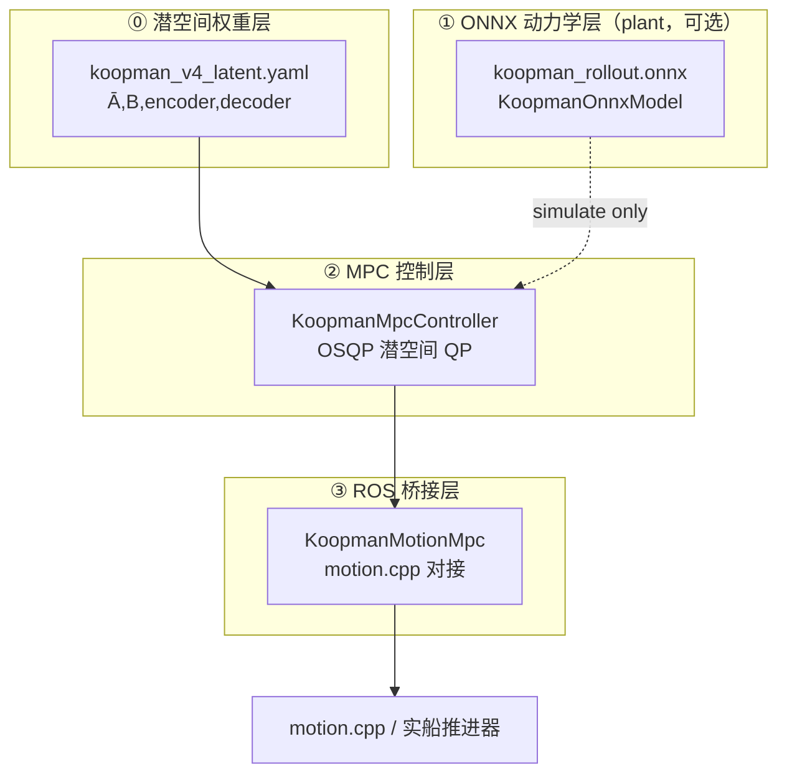
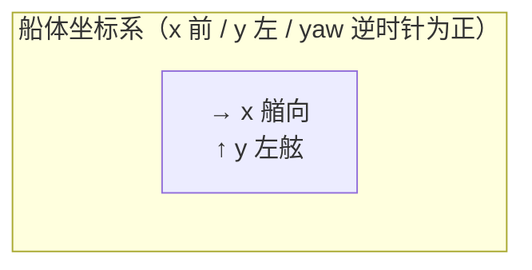
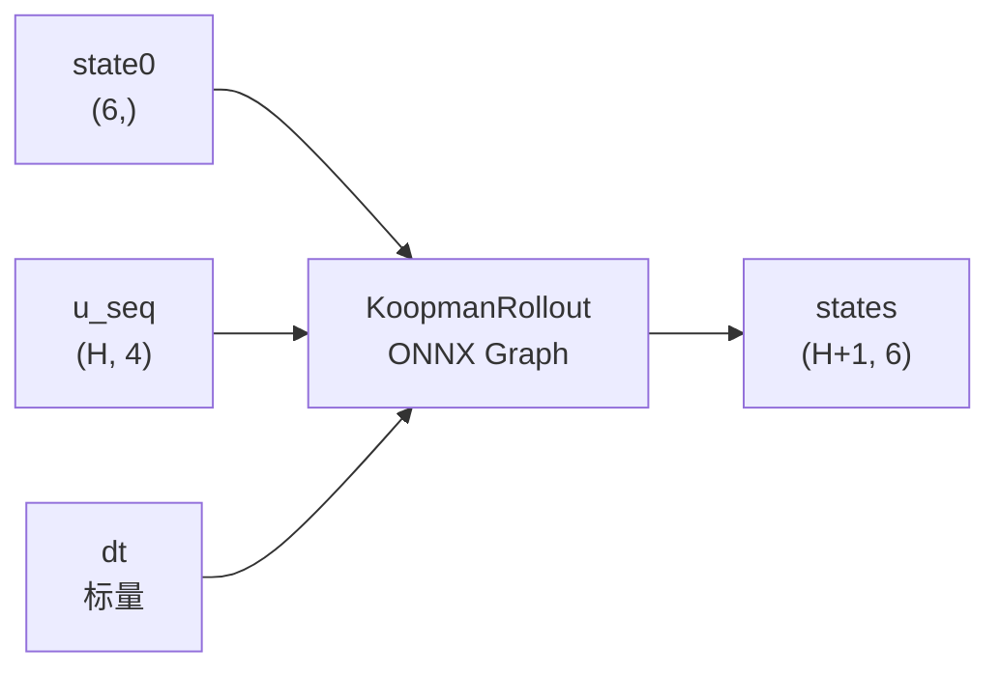
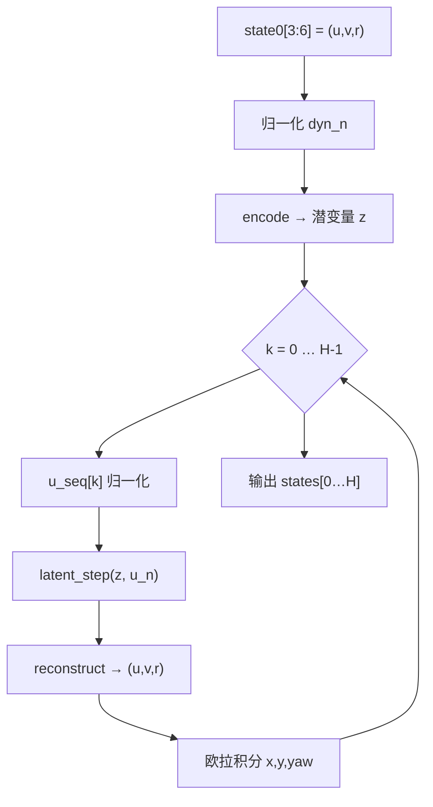
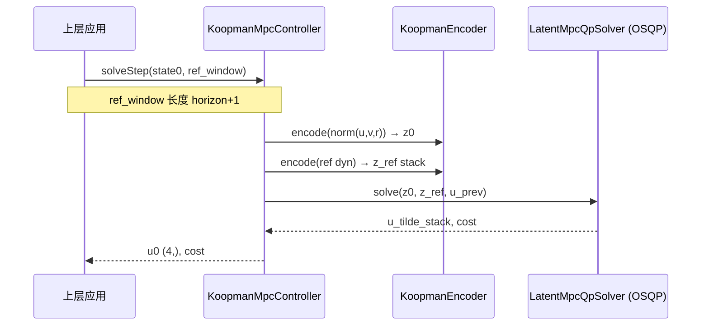
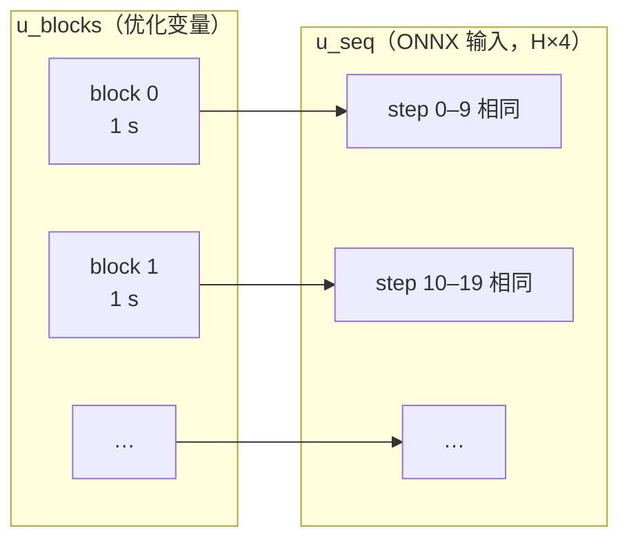
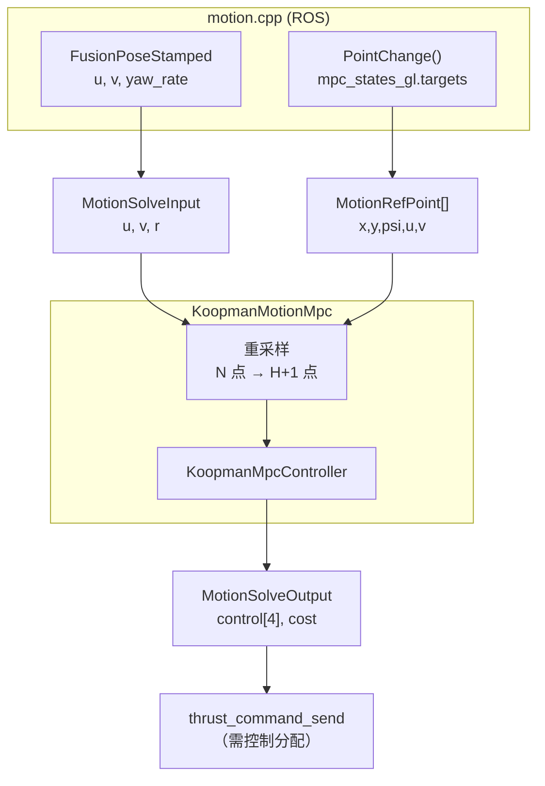
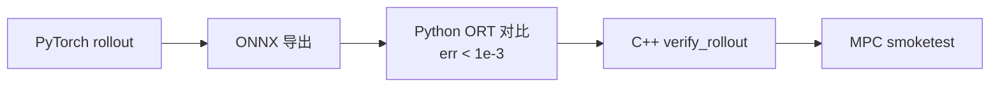

# Koopman v4 模型输入输出接口说明

> 适用模型：`HorizontalKoopmanModelV4DictInput`  
> 部署文件：`cpp/koopman_mpc/weights/koopman_rollout.onnx`  
> 当前版本：H=200（20 s @ dt=0.1），checkpoint `run_v4_20260520_034545`

---

## 1. 总览

本仓库对外暴露 **三层接口**，自底向上依次为：



| 层级 | 类 / 文件 | 调用方 | 作用 |
|------|-----------|--------|------|
| ⓪ Latent | `KoopmanLatentModel` + `KoopmanEncoder` | MPC | 潜空间动力学与编码（YAML） |
| ① ONNX | `KoopmanOnnxModel` | demo `simulate` | 闭环仿真被控对象（**不参与 optimize**） |
| ② MPC | `KoopmanMpcController` | demo、motion | OSQP 优化 4 维控制 |
| ③ 桥接 | `KoopmanMotionMpc` | `motion.cpp` | 参考重采样 + 单步 MPC |

---

## 2. 坐标系与物理量定义

### 2.1 状态向量 `state` — 6 维

所有接口统一使用 **船体坐标系（Body Frame）**：



| 索引 | 符号 | 名称 | 单位 | 说明 |
|:----:|:----:|------|:----:|------|
| 0 | x | 纵向位置 | m | 相对当前时刻船体原点 |
| 1 | y | 横向位置 | m | 左舷为正 |
| 2 | yaw | 航向角 | rad | 相对当前艏向 |
| 3 | u | 纵向速度 | m/s | 船体坐标系 |
| 4 | v | 横向速度 | m/s | 船体坐标系 |
| 5 | r | 艏摇角速度 | rad/s | 逆时针为正 |

**motion.cpp 约定**：每步 MPC 求解时，当前位置取原点，即 `state0 = [0, 0, 0, u, v, r]`。

### 2.2 控制向量 `u` — 4 维

与训练数据集 `ctrl` 字段一致（见 `docs/MPC使用指南.md`）：

| 索引 | 名称 | 典型来源 | 训练集统计（mean / std） |
|:----:|------|----------|--------------------------|
| 0 | 左推进器油门 / 推力 | `port_thruster_throttle` | 47.05 / 44.92 |
| 1 | 左推进器舵角 | `port_thruster_angle` (rad) | 0.045 / 19.12 |
| 2 | 右推进器油门 / 推力 | `starboard_thruster_throttle` | 47.05 / 44.91 |
| 3 | 右推进器舵角 | `starboard_thruster_angle` (rad) | 0.045 / 19.12 |

MPC 默认约束（与 `model_meta.json` 一致）：

```
u_min = [-100, -35, -100, -35]
u_max = [ 100,  35,  100,  35]
```

---

## 3. ① ONNX 模型接口（核心）

### 3.1 文件与依赖

| 项目 | 值 |
|------|-----|
| 文件 | `koopman_rollout.onnx` |
| Runtime | ONNX Runtime C++ ≥ 1.26 |
| Opset | 18 |
| 类 | `koopman_control::KoopmanOnnxModel` |

### 3.2 数据流图



### 3.3 输入输出规格

```
┌─────────────────────────────────────────────────────────────┐
│                    koopman_rollout.onnx                      │
├──────────────┬──────────────┬───────────────────────────────┤
│   输入名     │    Shape     │           说明                │
├──────────────┼──────────────┼───────────────────────────────┤
│  state0      │    (6,)      │ 初始状态 [x,y,yaw,u,v,r]      │
│  u_seq       │   (H, 4)     │ 未来 H 步控制序列             │
│  dt          │    ()        │ 积分步长，固定 0.1            │
├──────────────┼──────────────┼───────────────────────────────┤
│  states      │  (H+1, 6)    │ 开环 rollout 状态序列         │
└──────────────┴──────────────┴───────────────────────────────┘
          当前 H = 200  →  states shape = (201, 6)
```

| 张量 | dtype | Shape（当前模型） | 内存布局 |
|------|-------|-------------------|----------|
| `state0` | float32 | `(6,)` | `[x, y, yaw, u, v, r]` |
| `u_seq` | float32 | `(200, 4)` | 行主序，第 k 行 = 第 k 步控制 |
| `dt` | float32 | 标量 | 固定 `0.1` |
| `states` | float32 | `(201, 6)` | `states[k]` = 第 k 步状态，k=0…200 |

### 3.4 内部计算流程（与训练对齐）



动力学归一化参数（ONNX 图内已 baked-in，来自 `model_meta.json`）：

| 参数 | u | v | r |
|------|---|---|---|
| dyn_mean | 2.251 | 0.0002 | -0.0001 |
| dyn_std | 1.531 | 0.225 | 0.015 |

### 3.5 C++ 调用示例

```cpp
#include "koopman_control/koopman_onnx_model.hpp"

koopman_control::KoopmanOnnxModel model("cpp/koopman_mpc/weights/koopman_rollout.onnx");
int H = model.horizon();  // 200

std::array<float, 6> s0{0, 0, 0, 1.5f, 0.f, 0.01f};
std::vector<float> u_flat(H * 4, 0.f);  // 长度 800
// ... 填充 u_flat ...

auto states_flat = model.rollout(s0, u_flat, 0.1f);
// states_flat.size() == (H+1)*6 == 1206
// states_flat[k*6 + j] → 第 k 步第 j 维状态
```

### 3.6 Python / onnxruntime 调用示例

```python
import numpy as np
import onnxruntime as ort

sess = ort.InferenceSession("cpp/koopman_mpc/weights/koopman_rollout.onnx")
H = sess.get_inputs()[1].shape[0]  # 200

state0 = np.zeros(6, dtype=np.float32)
u_seq  = np.zeros((H, 4), dtype=np.float32)
dt     = np.array(0.1, dtype=np.float32)

states = sess.run(None, {"state0": state0, "u_seq": u_seq, "dt": dt})[0]
# states.shape == (201, 6)
```

---

## 4. ② MPC 控制器接口

### 4.1 单步求解数据流



> **注意**：`solveStep` 内**不调用** ONNX。ONNX 仅在 `simulate()` 闭环 demo 中作 plant 前向。

### 4.2 输入输出

| 接口 | 输入 | 输出 |
|------|------|------|
| `solveStep` | `state0 (6,)`<br/>`ref_window (horizon+1, 6)`<br/>可选 `u_prev_applied (4,)` | `u0 (4,)`, `cost`；可选 `MpcSolveTiming`（`qp_solve_ms`, `osqp_iters`） |
| `simulate` | `state0`, 全长 `ref_traj`, 可选 `ref_ctrl`, `max_steps` | `MpcTrajectory`（需构造时提供 ONNX plant） |

**参考窗口 `ref_window`**：与 `state0` 同一坐标系下，未来 horizon 步的期望状态：

```
ref_window[k] = [x_ref, y_ref, yaw_ref, u_ref, v_ref, r_ref]   k = 0…horizon
```

潜空间参考由每步 `encode([u_ref,v_ref,r_ref])` 构造（Tier-1）。当启用 **Tier-2 位姿跟踪**
（`w_xy>0` 或 `w_yaw>0`）时，`ref_window` 的 `[x_ref,y_ref,yaw_ref]` 也进入代价（见 §4.5）。

### 4.3 代价函数构成（潜空间 QP）

| 参数 | 默认值 | 含义 |
|------|--------|------|
| `horizon` | 20 | MPC 预测步数（与 latent YAML 一致） |
| `dt` | 1.0 | MPC 时间步（秒） |
| `opt_control_steps` | 2 | 参与优化的控制步数 |
| `control_hold_steps` | 1 | 控制零阶保持块大小 |
| `w_z` | 1.0 | 潜空间跟踪权重 |
| `w_u` | 0.0001 | 控制幅值惩罚 |
| `w_du` | 0.05 | 控制增量惩罚 |
| `w_xy` | 0.0 | **Tier-2** 平面位置跟踪（>0 启用） |
| `w_yaw` | 0.0 | **Tier-2** 艏向跟踪（>0 启用） |
| `sqp_iters` | 2 | **Tier-2** SQP 外迭代次数 |
| `throttle_du_max` / `rudder_du_max` | 15 / 3.5 | 块间变化速率硬约束 |
| `osqp_eps_abs` / `osqp_eps_rel` | 1e-4 | OSQP 容差 |
| `osqp_max_iter` | 4000 | OSQP 最大迭代 |

**变化速率约束**：作用于相邻控制块之间。首块相对 `u_prev`（`MotionSolveInput.has_u_prev` 或内部 warm-start）。

### 4.5 Tier-2 物理位姿跟踪（可选）

`w_xy>0` 或 `w_yaw>0` 且 latent YAML 含 `decoder` 时启用。位姿 `(x,y,ψ)` 来自
`decoder(z) → (u,v,r)` 的船体系欧拉积分（非线性），在标称轨迹处一阶线性化为
`P_pose ≈ p_free + Φ·U`，叠加进同一 OSQP：`P += 2ΦᵀQ_pΦ`，`q += 2ΦᵀQ_p b`。

- **SQP 外迭代**（`sqp_iters`）：解→开环 rollout 更新标称轨迹→重解，降低长程线性化误差。
- **yaw 环绕**：标称角误差经 `wrapAngle` 后再线性化。
- **坐标系**：实船经 motion 桥接时须把全局参考变换到当前船体系（见 §5.2）。
- 位姿仅作**软约束**（代价项），不引入硬约束，避免不可行。

详见 [`docs/潜空间QP-MPC实现.md`](../../docs/潜空间QP-MPC实现.md)。

### 4.4 控制块（control move blocking）

预测步数 H 不变，优化变量可分组为 **控制块**：



| 配置 | 含义 |
|------|------|
| `control_hold_steps: 1` | 每 MPC 步可独立变化控制（默认） |
| `control_hold_steps: k` | 每 k 个 MPC 步共用一个控制块 |
| `opt_control_steps: m` | 仅优化前 m 个控制步（其余 hold 最后优化值） |

`opt_control_steps: 2` + `hold: 1` → 优化变量维度为 **2×4 = 8**（默认 yaml）。

---

## 5. ③ motion.cpp 桥接接口

### 5.1 与 Elane 控制节点的对接



### 5.2 结构体字段对照

| motion.cpp / `mpc_state` | `MotionRefPoint` | Koopman `ref_window[k]` |
|----------------------------|------------------|-------------------------|
| `.x` | `.x` | `[0]` |
| `.y` | `.y` | `[1]` |
| `.psi` | `.psi` | `[2]` |
| `.u` | `.u` | `[3]` |
| `.v` | `.v` | `[4]` |
| （无） | `.r`（可填 0） | `[5]` |

| FusionPoseStamped | `MotionSolveInput` |
|-------------------|---------------------|
| `velocity.x` | `.u` |
| `velocity.y` | `.v` |
| `yaw_rate_` | `.r` |
| 上一拍 Koopman 控制（可选） | `.has_u_prev`, `.u_prev[4]` |
| 当前全局位姿（Tier-2 必需） | `.x`, `.y`, `.psi`, `.has_pose=true` |

**Tier-2 坐标系**：启用位姿跟踪时，须把当前全局位姿填入 `MotionSolveInput.{x,y,psi}` 并置
`has_pose=true`；桥接层据此把全局参考变换到「以当前船位为原点、当前艏向为 x 轴」的船体系，
而 `state0` 仍取 `[0,0,0,u,v,r]`，保证预测位姿与参考位姿同一坐标系。`has_pose=false` 时不变换
（与历史 Tier-1 行为一致）。

### 5.3 参考重采样示意

motion 侧通常只有 **N ≈ 20~40** 个参考点，MPC 需要 **horizon+1** 个点（默认 21 点 @ dt=1 s）：

```
motion 参考时间轴:  t = 0.5, 1.5, 2.5, …, (N-1)*ref_dt + 0.5
                         ↓ 线性插值
MPC 参考时间轴:     t = 0, 1, 2, …, horizon   （共 horizon+1 点）
```

```cpp
koopman_control::MotionSolveInput in;
in.u = fusion_vx;
in.v = fusion_vy;
in.r = yaw_rate;

for (const auto& t : mpc_states_gl.targets) {
    koopman_control::MotionRefPoint p{t.x, t.y, t.psi, t.u, t.v, 0.f};
    in.ref.push_back(p);
}

koopman_control::MotionSolveOutput out;
koopman_mpc_helper_.solveStep(in.u, in.v, in.r, targets, out);
// out.control[0..3] → 4 维 Koopman 控制
```

---

## 6. 张量形状速查表

### 6.1 当前部署模型（H=200）

| 场景 | 变量 | Shape | 元素个数 |
|------|------|-------|----------|
| ONNX 输入 | state0 | 6 | 6 |
| ONNX 输入 | u_seq | 200 × 4 | 800 |
| ONNX 输出 | states | 201 × 6 | 1206 |
| MPC 参考 | ref_window | 201 × 6 | 1206 |
| MPC 输出 | u0 | 4 | 4 |
| MPC 内部 | u_flat | 800 | 800 |
| 优化变量（有效） | u_blocks[0:4) × 4 维 | 16 | 16（hold=10, opt=40 步） |

### 6.2 历史短 horizon 模型（H=20，旧版）

| 变量 | Shape |
|------|-------|
| u_seq | (20, 4) |
| states | (21, 6) |

> 更换 horizon 必须 **重新导出 ONNX**（`export_v4_onnx.py --pred_len H`），C++ 会从 `u_seq` shape 自动读取 H。

---

## 7. 时间轴关系

```mermaid
gantt
    title 单次 ONNX rollout 时间覆盖（H=200, dt=0.1）
    dateFormat X
    axisFormat %S s

    section 预测
    k=0 state0           :0, 1
    k=1 … k=199 中间步    :1, 199
    k=200 终点 state     :199, 1
```



| 量 | 公式 | 当前值 |
|----|------|--------|
| MPC 预测时长 | horizon × dt | 20 s（默认 horizon=20, dt=1） |
| ONNX 细步 rollout | H × dt_onnx | 20 s（H=200, dt=0.1） |
| 控制更新（MPC） | hold × dt | 默认每 1 s 可变（hold=1） |
| motion 定时器 | 独立配置 | 0.5 s（2 Hz） |
| MPC 执行 | 每 timer 触发一次 `solveStep` | 仅应用 u0 |

---

## 8. 导出与验证

### 8.1 导出权重

```bash
# 潜空间 YAML（MPC 必需）
python3 new_v4_dict_input/export_v4_encode_weights.py \
  --ckpt checkpoints/run_v4_20260520_034545/koopman_v4_best.pth \
  --horizon 20 \
  --out cpp/koopman_mpc/weights/koopman_v4_latent.yaml

# ONNX plant（闭环仿真，可选）
python3 new_v4_dict_input/export_v4_onnx.py \
  --ckpt checkpoints/run_v4_20260520_034545/koopman_v4_best.pth \
  --pred_len 200 \
  --out_dir cpp/koopman_mpc/weights
```

### 8.2 验证清单



| 步骤 | 命令 | 通过标准 |
|------|------|----------|
| PT vs ONNX | `export_v4_onnx.py` | max_abs_err ≤ 1e-3 |
| C++ rollout | `verify_rollout` | max_abs_err ≤ 1e-3 |
| MPC 冒烟 | `koopman_mpc_cpp --smoketest` | xy_rmse < 8 m |

### 8.3 性能参考（CPU）

| 操作 | 耗时（参考） |
|------|---------------|
| 单次 ONNX rollout（H=200） | ~3–10 ms |
| 单次 MPC solveStep（OSQP） | ~1–20 ms（与 horizon、OSQP 迭代有关） |

Benchmark：`python3 new_v4_dict_input/benchmark_v4_onnx.py --pred_len 200`

---

## 9. 相关文件索引

| 文件 | 说明 |
|------|------|
| `cpp/koopman_control/include/koopman_control/koopman_onnx_model.hpp` | ONNX C++ 封装 |
| `cpp/koopman_control/include/koopman_control/mpc_controller.hpp` | MPC 求解器 |
| `cpp/koopman_control/include/koopman_control/motion_bridge.hpp` | motion 桥接 |
| `cpp/koopman_mpc/weights/model_meta.json` | 归一化参数与 horizon |
| `koopman/export/rollout.py` | PyTorch rollout 定义 |
| `new_v4_dict_input/export_v4_encode_weights.py` | 潜空间 YAML 导出（encoder + decoder） |
| `new_v4_dict_input/export_v4_onnx.py` | ONNX plant 导出脚本 |
| `cpp/koopman_control/src/koopman_decoder.cpp` | Tier-2 decoder 前向 + Jacobian |
| `cpp/koopman_control/src/pose_linearize.cpp` | Tier-2 位姿灵敏度 Φ |
| `cpp/koopman_control/config/mpc_config.yaml` | MPC 默认参数 |
| `cpp/koopman_control/README_CN.md` | 集成与构建说明 |
| `docs/潜空间QP-MPC实现.md` | QP 推导与模块说明 |

---

## 10. 常见问题

**Q: OSQP 需要单独安装吗？**  
A: 不需要。`koopman_control` 的 CMake 通过 FetchContent 自动拉取 OSQP v0.6.3。

**Q: solveStep 会调用 ONNX 吗？**  
A: **不会**。优化仅用潜空间矩阵 + OSQP。ONNX 仅在 `simulate()` 闭环 demo 中推进被控对象。

**Q: `state0` 必须用船体系原点吗？**  
A: MPC 与 motion 约定用 `[0,0,0,u,v,r]`；离线仿真可直接传全局坐标，但参考 `ref_window` 须同一坐标系。

**Q: 如何启用位姿 (x,y,yaw) 跟踪（Tier-2）？**  
A: 设 `w_xy>0`/`w_yaw>0`（需 latent YAML 含 `decoder`）。motion 路径还须在 `MotionSolveInput` 填当前全局位姿 `{x,y,psi}` 并置 `has_pose=true`，桥接层会把全局参考变换到船体系。详见 §4.5。

**Q: 4 维控制能直接发给推进器吗？**  
A: 训练语义为 `[左油门, 左舵角, 右油门, 右舵角]`，与 `Thrusters_CMD` 一致；上船前仍需限幅与安全逻辑。

**Q: latent horizon 与 ONNX H 必须相同吗？**  
A: **不必**。latent MPC 默认 horizon=20（dt=1 s）；ONNX plant 可为 H=200（dt=0.1 s 细步 rollout）。`KoopmanMotionMpc` 仅依赖 latent YAML。

**Q: 如何确认当前 ONNX 的 H？**

```python
import onnx
m = onnx.load("cpp/koopman_mpc/weights/koopman_rollout.onnx")
for inp in m.graph.input:
    print(inp.name, [d.dim_value for d in inp.type.tensor_type.shape.dim])
# u_seq: [200, 4]
```
