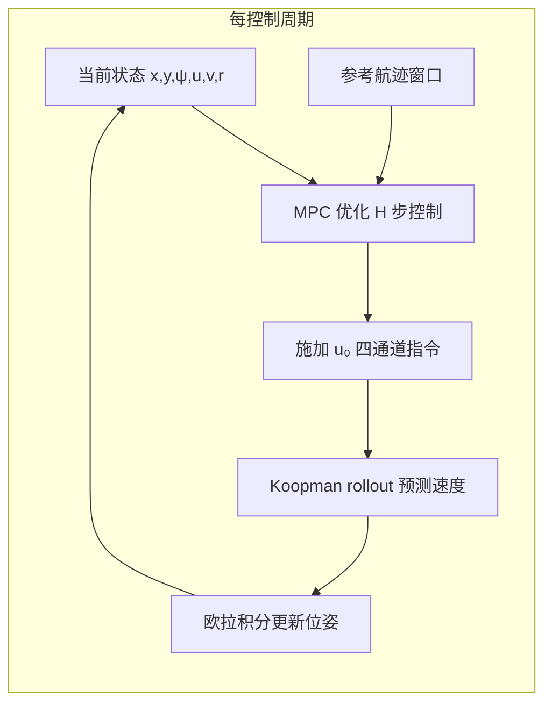

# MPC 航迹跟踪使用指南

本文档说明如何在本仓库中使用 **基于 Deep-Koopman 模型的模型预测控制（MPC）** 做船舶平面航迹跟踪，并记录最近一次可行性验证结果。

相关代码：

| 组件 | 路径 |
|------|------|
| Python 控制器 | `koopman/mpc/controller.py` |
| Python CLI | `scripts/mpc_track.py` |
| C++ 实现 | `cpp/koopman_mpc/` |
| 默认模型 | `checkpoints/koopman_v3a_best.pth` |

---

## 1. 可行性结论（已验证）

在仓库当前环境下，**Python 与 C++ 两套 MPC 均可正常运行**，且跟踪测试集真值航迹时精度良好。

| 测试项 | 命令 / 条件 | 结果 | 结论 |
|--------|-------------|------|------|
| Python 冒烟 | `--smoketest`（直线参考，30 步） | xy RMSE **0.042 m** | 通过 |
| Python 段跟踪 | `data/koopman_test.npz` segment 0，80 步 | xy RMSE **0.11 m**，艏向 **0.14°** | 通过 |
| Python 圆周 | `--ref circle`，60 步 | xy RMSE **0.37 m**（合成路径较难） | 可运行，需调参 |
| C++ 冒烟 | `koopman_mpc_cpp --smoketest` | xy RMSE **0.017 m** | 通过 |

**推荐用法**：用 **测试集某段真值航迹** 作为参考（`--ref segment`），与训练数据分布一致，跟踪效果最好。合成直线/圆周可用于快速试验，但可能需要增大 `w_xy` 或 `opt_iters`。

验证时间：2026-05-17；模型：`koopman_v3a_best.pth`；`horizon=20`，`dt=0.1 s`。

---

## 2. 算法原理（简要）



1. **预测模型**：已训练的 `HorizontalKoopmanModelV3`（与 `scripts/eval.py` 相同 checkpoint）。
2. **状态**：平面位姿 `(x, y, ψ)` + 船体速度 `(u, v, r)`，共 6 维；控制为 4 维推进器 `[左油门, 左舵角, 右油门, 右舵角]`。
3. **滚动时域**：每步优化未来 `H`（默认 20）个控制，只执行第一个，再重新优化（receding horizon）。
4. **代价函数**（最小化）：
   - 位置误差 `w_xy · ||(x,y) - (x_ref,y_ref)||²`
   - 艏向误差 `w_yaw · (ψ - ψ_ref)²`（角度差归一化到 [-π,π]）
   - 速度误差 `w_vel · ||(u,v,r) - ref||²`
   - 控制幅值 `w_u · ||u||²`
   - 控制变化率 `w_du · ||Δu||²`
5. **约束**：油门 ∈ [-100, 100]，舵角 ∈ [-35, 35]（与数据集一致）。
6. **求解器**：对控制序列用 **Adam** 迭代优化（默认 40 次），上一步解移位作为 warm-start。

位姿积分与评估脚本一致（船体坐标系，固定 `dt=0.1 s`）：

```
ẋ = u·cos(ψ) - v·sin(ψ)
ẏ = u·sin(ψ) + v·cos(ψ)
ψ̇ = r
```

---

## 3. 环境与依赖

```bash
pip install -r requirements.txt
```

需要：

- 已训练 checkpoint（默认 `checkpoints/koopman_v3a_best.pth`）
- 参考航迹数据（段跟踪时用 `data/koopman_test.npz`）
- PyTorch（CPU 即可，单段 80 步约 1–2 分钟）

C++ 版额外需要：`g++`、`cmake`、LibTorch（`pip install torch` 自带），见 [cpp/koopman_mpc/README.md](../cpp/koopman_mpc/README.md)。

---

## 4. Python 使用

### 4.1 命令行（推荐）

在**仓库根目录**执行：

```bash
# 快速自检（约 1 分钟）
python3 scripts/mpc_track.py --smoketest

# 跟踪测试集第 0 段真值航迹（推荐）
python3 scripts/mpc_track.py \
    --ckpt checkpoints/koopman_v3a_best.pth \
    --data data/koopman_test.npz \
    --segment 0 \
    --steps 150 \
    --horizon 20 \
    --opt_iters 40 \
    --out_dir eval_out/mpc_seg0

# 合成圆周路径
python3 scripts/mpc_track.py --ref circle --steps 100 --out_dir eval_out/mpc_circle

# 合成直线路径
python3 scripts/mpc_track.py --ref line --steps 80 --out_dir eval_out/mpc_line
```

根目录兼容入口（等价）：

```bash
python3 run_mpc_tracking.py --segment 0 --steps 80
```

### 4.2 命令行参数

| 参数 | 默认 | 说明 |
|------|------|------|
| `--ckpt` | `checkpoints/koopman_v3a_best.pth` | Koopman 权重 |
| `--data` | `data/koopman_test.npz` | `segment` 模式的数据集 |
| `--ref` | `segment` | `segment` / `line` / `circle` |
| `--segment` | `0` | 参考段索引 |
| `--steps` | `150` | 闭环仿真步数 |
| `--horizon` | `20` | MPC 预测步长（建议与训练 `pred_len` 一致） |
| `--opt_iters` | `40` | 每步 Adam 迭代次数 |
| `--w_xy` | `10` | 位置跟踪权重 |
| `--w_yaw` | `5` | 艏向跟踪权重 |
| `--w_vel` | `0.5` | 速度跟踪权重 |
| `--out_dir` | `eval_out/mpc` | 输出目录 |
| `--device` | `cpu` | `cpu` 或 `cuda` |
| `--smoketest` | — | 快速自检后退出 |

### 4.3 输出文件

| 文件 | 内容 |
|------|------|
| `mpc_metrics.json` | `xy_rmse_m`、`yaw_rmse_deg`、`final_xy_err_m` 等 |
| `mpc_trajectory.npz` | `state`、`control`、`ref_state`、`t` |
| `mpc_tracking_overview.png` | 轨迹、误差、艏向、控制四宫格 |
| `mpc_velocities.png` | u/v/r 曲线 |

### 4.4 在 Python 代码中调用

```python
import sys
from pathlib import Path

sys.path.insert(0, str(Path(".").resolve()))
from koopman.paths import setup_repo
setup_repo()

import numpy as np
from koopman.mpc import KoopmanMPC, MPCConfig, segment_to_state_ctrl, tracking_metrics

# 加载参考航迹
raw = np.load("data/koopman_test.npz", allow_pickle=True)["datas"]
ref_state, ref_ctrl = segment_to_state_ctrl(raw[0])

# 配置并创建控制器
cfg = MPCConfig(horizon=20, opt_iters=40, w_xy=10.0, w_yaw=5.0)
mpc = KoopmanMPC.from_checkpoint("checkpoints/koopman_v3a_best.pth", cfg)

# 闭环仿真
traj = mpc.simulate(
    ref_state[0],           # 初始状态 [x,y,yaw,u,v,r]
    ref_state,              # 完整参考 (T,6)
    ref_ctrl=ref_ctrl,      # 可选：用于 warm-start
    max_steps=80,
)

metrics = tracking_metrics(traj)
print("xy RMSE [m]:", metrics["xy_rmse_m"])

# 单步求解（自定义参考窗口）
ref_win = [ref_state[i] for i in range(21)]  # horizon+1 个点
u0, cost = mpc.solveStep(ref_state[0], ref_win)
# u0: [port_thr, port_ang, stbd_thr, stbd_ang]
```

`MPCConfig` 完整字段见 `koopman/mpc/controller.py`。

---

## 5. C++ 使用

### 5.1 构建与测试

```bash
bash cpp/koopman_mpc/build.sh
```

将自动：导出 TorchScript → 编译 → rollout 数值对照 → MPC 冒烟。

### 5.2 运行

```bash
./cpp/koopman_mpc/build/koopman_mpc_cpp \
    --weights cpp/koopman_mpc/weights \
    --ref cpp/koopman_mpc/weights/cpp_test_ref.json \
    --steps 40 --horizon 20 --opt_iters 25
```

**注意**：C++ 版 TorchScript 导出时 **固定 `horizon=20`**，`--horizon` 必须为 20。

---

## 6. 调参建议

| 现象 | 建议 |
|------|------|
| 平面误差偏大 | 增大 `--w_xy`（如 20–50），或增加 `--opt_iters` |
| 艏向振荡 | 增大 `--w_yaw`，增大 `--w_du` 抑制控制抖动 |
| 控制饱和频繁 | 检查参考航迹是否超出训练分布；略降 `w_xy` |
| 优化太慢 | 减少 `--steps` 或 `--opt_iters`；使用 GPU `--device cuda`（需自行验证） |
| 圆周/直线跟踪差 | 优先用 `--ref segment`；或延长 `opt_iters`、提高 `w_xy` |

`horizon` 建议保持 **20**，与 v3a 训练时的多步预测长度一致；过短会削弱预见性，过长则优化变量增多、耗时增加。

---

## 7. 与训练 / 评估的关系

| 阶段 | 脚本 | 说明 |
|------|------|------|
| 训练 | `scripts/train_v2.py` | 得到 `checkpoints/koopman_v3a_best.pth` |
| 开环评估 | `scripts/eval.py` | 固定控制序列 rollout，看长期误差是否发散 |
| 闭环 MPC | `scripts/mpc_track.py` | 在线优化控制，跟踪参考航迹 |

MPC **不重新训练模型**；若更换 checkpoint，无需改 MPC 代码，只需 `--ckpt` 指向新文件。重新训练后若需跑 C++，请重新执行 `cpp/koopman_mpc/build.sh` 以更新 `koopman_rollout.pt`。

---

## 8. 常见问题

**Q: 报错找不到 checkpoint？**  
确认 `checkpoints/koopman_v3a_best.pth` 存在，或用 `--ckpt` 指定 v3 权重。

**Q: `segment` 索引越界？**  
`python3 -c "import numpy as np; print(len(np.load('data/koopman_test.npz',allow_pickle=True)['datas']))"` 查看段数。

**Q: MPC 与实船闭环的区别？**  
本仓库为**仿真闭环**：状态由 Koopman 模型推进。上实船需增加状态估计、通信延时、执行器接口与安全限幅，本 MPC 模块可作为**内环速度/轨迹控制律**的原型。

**Q: 能否跟踪任意 (x,y) 航点序列？**  
可以。构造 `ref_state` 数组 `(T,6)`，填入目标 `(x,y,ψ)` 及可选 `(u,v,r)`，调用 `mpc.simulate(state0, ref_state, ...)`。航点间建议插值保证参考连续。

---

## 9. 复现本次验证

```bash
# Python
python3 scripts/mpc_track.py --smoketest
python3 scripts/mpc_track.py --segment 0 --steps 80 --opt_iters 30 \
    --out_dir eval_out/mpc_test_seg0

# C++（需已 build）
./cpp/koopman_mpc/build/koopman_mpc_cpp --smoketest \
    --weights cpp/koopman_mpc/weights \
    --ref cpp/koopman_mpc/weights/cpp_test_ref.json
```

预期：冒烟通过；segment 0 的 xy RMSE 约 **0.1 m** 量级。
