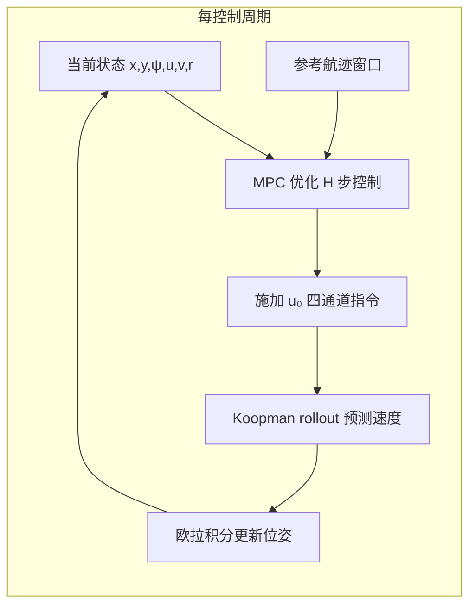

# MPC 航迹跟踪使用指南

本文档说明如何在本仓库中使用 **基于 Deep-Koopman 模型的模型预测控制（MPC）** 做船舶平面航迹跟踪，并记录 Python / C++ 两套实现的求解器差异与验证结果。

相关代码：

| 组件 | 路径 |
|------|------|
| Python 控制器 | `koopman/mpc/controller.py` |
| Python CLI | `scripts/mpc_track.py` |
| 可导出 rollout | `koopman/export/rollout.py` |
| C++ MPC | `cpp/koopman_mpc/` |
| ONNX 导出 / 验证 | `cpp/koopman_mpc/scripts/export_onnx.py`、`verify_pipeline.py` |
| 默认模型 | `checkpoints/koopman_v3a_best.pth` |

---

## 1. 可行性结论（已验证）

在仓库当前环境下，**Python 与 C++ 两套 MPC 均可正常运行**，且跟踪测试集真值航迹时精度良好。

| 测试项 | 命令 / 条件 | 结果 | 结论 |
|--------|-------------|------|------|
| PT vs ONNX | `export_onnx.py` | max abs err ≈ **3.3e-6** | 通过 |
| Python rollout vs ONNX | `rollout_check.npz` | ≈ **2.4e-7** | 通过 |
| C++ rollout vs Python | `verify_rollout` | ≈ **2.4e-7** | 通过 |
| Python 冒烟 | `--smoketest`（直线参考，30 步） | xy RMSE **0.042 m** | 通过 |
| Python 段跟踪 | `data/koopman_test.npz` segment 0，80 步 | xy RMSE **0.11 m**，艏向 **0.14°** | 通过 |
| C++ 冒烟 | `koopman_mpc_cpp --smoketest` | xy RMSE **0.012 m** | 通过 |

**推荐用法**：用 **测试集某段真值航迹** 作为参考（`--ref segment`），与训练数据分布一致，跟踪效果最好。

验证时间：2026-05-17；模型：`koopman_v3a_best.pth`；`horizon=20`，`dt=0.1 s`。

---

## 2. 算法原理（简要）



1. **预测模型**：已训练的 `HorizontalKoopmanModelV3`（与 `scripts/eval.py` 相同 checkpoint）。
2. **状态**：平面位姿 `(x, y, ψ)` + 船体速度 `(u, v, r)`，共 6 维；控制为 4 维推进器 `[左油门, 左舵角, 右油门, 右舵角]`。
3. **滚动时域**：每步优化未来 `H`（默认 20）个控制，只执行第一个，再重新优化（receding horizon）。
4. **代价函数**（最小化）：
   - 位置误差 `w_xy · ||(x,y) - (x_ref,y_ref)||²`
   - 艏向误差 `w_yaw · (ψ - ψ_ref)²`（角度差归一化到 [-π,π]）
   - 速度误差 `w_vel · ||(u,v,r) - ref||²`
   - 控制幅值 `w_u · ||u||²`
   - 控制变化率 `w_du · ||Δu||²`
5. **约束**：油门 ∈ [-100, 100]，舵角 ∈ [-35, 35]（与数据集一致）；Python 在优化中对 `u` clamp，C++ 每步 Adam 更新后同样 clamp。

位姿积分与评估脚本一致（船体坐标系，固定 `dt=0.1 s`）：

```
ẋ = u·cos(ψ) - v·sin(ψ)
ẏ = u·sin(ψ) + v·cos(ψ)
ψ̇ = r
```

---

## 3. 求解器说明（Python vs C++）

两套实现 **代价函数与滚动时域框架相同**，**优化器与梯度来源不同**：

| 项目 | Python | C++ |
|------|--------|-----|
| **类型** | 无约束 NLP + 盒约束投影 | 同左 |
| **优化器** | `torch.optim.Adam` | 自实现 **Adam**（β₁=0.9, β₂=0.999） |
| **梯度** | PyTorch **autograd**（可微 rollout） | **前向差分**数值梯度（ε=1e-3） |
| **动力学前向** | PyTorch 模型 | **ONNX Runtime**（`koopman_rollout.onnx`） |
| **默认 `opt_iters`** | 40 | 40（冒烟可降至 8） |
| **专用 NLP 求解器** | 无（非 Ipopt/OSQP） | 无 |

因此 C++ 每步 MPC 需多次 ONNX 前向（约 `80 × opt_iters` 次，H=20 时），通常比 Python 慢，但便于无 PyTorch 环境部署。

> **关于 CppAD + Ipopt**：可与 Ipopt 组成标准 NLP 求解器，但要求目标/动力学在 CppAD 可微代码中表达；**ONNX Runtime 前向无法直接接入 CppAD**。若未来改用 CppAD+Ipopt，需在 C++ 中重写可微 rollout（或导出权重到 CppAD 图），ONNX 仍可作为部署对照。

---

## 4. 环境与依赖

```bash
pip install -r requirements.txt
```

需要：

- 已训练 checkpoint（默认 `checkpoints/koopman_v3a_best.pth`）
- 参考航迹数据（段跟踪时用 `data/koopman_test.npz`）
- PyTorch（CPU 即可，单段 80 步约 1–2 分钟）

**C++ 版额外需要**：

| 依赖 | 说明 |
|------|------|
| `g++`、`cmake` | `build.sh` 会通过 `setup_cloud_deps.sh` 在 Debian/Ubuntu 上自动安装 |
| ONNX Runtime C++ | `build.sh` 下载至 `cpp/koopman_mpc/third_party/onnxruntime` |
| Python 导出工具 | `onnx`、`onnxruntime`、`onnxscript`（导出 `.onnx` 时用） |

详见 [cpp/koopman_mpc/README.md](../cpp/koopman_mpc/README.md)。

---

## 5. Python 使用

### 5.1 命令行（推荐）

在**仓库根目录**执行：

```bash
# 快速自检（约 1 分钟）
python3 scripts/mpc_track.py --smoketest

# 跟踪测试集第 0 段真值航迹（推荐）
python3 scripts/mpc_track.py \
    --ckpt checkpoints/koopman_v3a_best.pth \
    --data data/koopman_test.npz \
    --segment 0 \
    --steps 150 \
    --horizon 20 \
    --opt_iters 40 \
    --out_dir eval_out/mpc_seg0

# 合成圆周路径
python3 scripts/mpc_track.py --ref circle --steps 100 --out_dir eval_out/mpc_circle

# 合成直线路径
python3 scripts/mpc_track.py --ref line --steps 80 --out_dir eval_out/mpc_line
```

### 5.2 命令行参数

| 参数 | 默认 | 说明 |
|------|------|------|
| `--ckpt` | `checkpoints/koopman_v3a_best.pth` | Koopman 权重 |
| `--data` | `data/koopman_test.npz` | `segment` 模式的数据集 |
| `--ref` | `segment` | `segment` / `line` / `circle` |
| `--segment` | `0` | 参考段索引 |
| `--steps` | `150` | 闭环仿真步数 |
| `--horizon` | `20` | MPC 预测步长（建议与训练 `pred_len` 一致） |
| `--opt_iters` | `40` | 每步 Adam 迭代次数 |
| `--w_xy` | `10` | 位置跟踪权重 |
| `--w_yaw` | `5` | 艏向跟踪权重 |
| `--w_vel` | `0.5` | 速度跟踪权重 |
| `--out_dir` | `eval_out/mpc` | 输出目录 |
| `--device` | `cpu` | `cpu` 或 `cuda` |
| `--smoketest` | — | 快速自检后退出 |

### 5.3 输出文件

| 文件 | 内容 |
|------|------|
| `mpc_metrics.json` | `xy_rmse_m`、`yaw_rmse_deg`、`final_xy_err_m` 等 |
| `mpc_trajectory.npz` | `state`、`control`、`ref_state`、`t` |
| `mpc_tracking_overview.png` | 轨迹、误差、艏向、控制四宫格 |
| `mpc_velocities.png` | u/v/r 曲线 |

### 5.4 在 Python 代码中调用

```python
from koopman.paths import setup_repo
setup_repo()

import numpy as np
from koopman.mpc import KoopmanMPC, MPCConfig, segment_to_state_ctrl, tracking_metrics

raw = np.load("data/koopman_test.npz", allow_pickle=True)["datas"]
ref_state, ref_ctrl = segment_to_state_ctrl(raw[0])

cfg = MPCConfig(horizon=20, opt_iters=40, w_xy=10.0, w_yaw=5.0)
mpc = KoopmanMPC.from_checkpoint("checkpoints/koopman_v3a_best.pth", cfg)

traj = mpc.simulate(ref_state[0], ref_state, ref_ctrl=ref_ctrl, max_steps=80)
print("xy RMSE [m]:", tracking_metrics(traj)["xy_rmse_m"])
```

`MPCConfig` 完整字段见 `koopman/mpc/controller.py`。

---

## 6. C++ 使用（ONNX）

### 6.1 导出与构建

```bash
# 完整流程：依赖、下载 ORT、导出 ONNX、编译、rollout/MPC 验证
bash cpp/koopman_mpc/build.sh

# 仅导出 ONNX 并做 PT/ONNX 精度检查
python3 cpp/koopman_mpc/scripts/export_onnx.py \
    --ckpt checkpoints/koopman_v3a_best.pth

# 端到端复验（需已 build）
python3 cpp/koopman_mpc/scripts/verify_pipeline.py
```

生成物目录 `cpp/koopman_mpc/weights/`（gitignore）：

| 文件 | 说明 |
|------|------|
| `koopman_rollout.onnx` | C++ MPC 使用的 rollout |
| `model_meta.json` | 归一化参数、验证误差等 |
| `cpp_test_ref.json` | C++ 冒烟用参考航迹 |
| `rollout_check.npz` | Python/C++ rollout 对照 |

可选：`export_torchscript.py` 仍可生成 `koopman_rollout.pt`，但 **C++ MPC 默认读 ONNX**。

### 6.2 运行

```bash
export LD_LIBRARY_PATH=cpp/koopman_mpc/third_party/onnxruntime/lib:$LD_LIBRARY_PATH

./cpp/koopman_mpc/build/koopman_mpc_cpp \
    --weights cpp/koopman_mpc/weights \
    --ref cpp/koopman_mpc/weights/cpp_test_ref.json \
    --steps 40 --horizon 20 --opt_iters 25

./cpp/koopman_mpc/build/koopman_mpc_cpp --smoketest \
    --weights cpp/koopman_mpc/weights \
    --ref cpp/koopman_mpc/weights/cpp_test_ref.json
```

**注意**：ONNX 导出时 **固定 `horizon=20`**，`--horizon` 必须为 20。

---

## 7. 调参建议

| 现象 | 建议 |
|------|------|
| 平面误差偏大 | 增大 `--w_xy`（如 20–50），或增加 `--opt_iters` |
| 艏向振荡 | 增大 `--w_yaw`，增大 `--w_du` 抑制控制抖动 |
| 控制饱和频繁 | 检查参考航迹是否超出训练分布；略降 `w_xy` |
| Python 优化太慢 | 减少 `--steps` 或 `--opt_iters` |
| C++ 优化太慢 | 减少 `--opt_iters`（冒烟默认 8）；数值梯度代价高 |
| 圆周/直线跟踪差 | 优先用 `--ref segment` |

`horizon` 建议保持 **20**，与 v3a 训练时的多步预测长度一致。

---

## 8. 与训练 / 评估的关系

| 阶段 | 脚本 | 说明 |
|------|------|------|
| 训练 | `scripts/train_v2.py` | 得到 `checkpoints/koopman_v3a_best.pth` |
| 开环评估 | `scripts/eval.py` | 固定控制序列 rollout |
| 闭环 MPC（Python） | `scripts/mpc_track.py` | Adam + autograd |
| 闭环 MPC（C++） | `cpp/koopman_mpc/build.sh` | ONNX + 数值梯度 Adam |

MPC **不重新训练模型**。更换 checkpoint 后：

- Python：仅需 `--ckpt` 指向新文件；
- C++：重新运行 `build.sh` 或 `export_onnx.py` 更新 `koopman_rollout.onnx`。

---

## 9. 常见问题

**Q: 报错找不到 checkpoint？**  
确认 `checkpoints/koopman_v3a_best.pth` 存在，或用 `--ckpt` 指定。

**Q: C++ 构建失败 `cannot find -lstdc++`？**  
运行 `bash cpp/koopman_mpc/scripts/setup_cloud_deps.sh` 或 `build.sh`（内部会调用）；确保使用 `g++` 而非缺库的 `clang` 默认链接。

**Q: C++ 运行找不到 `libonnxruntime.so`？**  
设置 `LD_LIBRARY_PATH` 包含 `cpp/koopman_mpc/third_party/onnxruntime/lib`。

**Q: MPC 与实船闭环的区别？**  
本仓库为**仿真闭环**；上实船需状态估计、执行器接口与安全限幅。

**Q: 能否用 CppAD/Ipopt 替换 C++ 求解器？**  
可以，但需可微 C++ rollout，不能仅靠 ONNX 黑盒；见 §3。

---

## 10. 复现本次验证

```bash
# Python
python3 scripts/mpc_track.py --smoketest
python3 scripts/mpc_track.py --segment 0 --steps 80 --opt_iters 30 \
    --out_dir eval_out/mpc_test_seg0

# C++ 全流程
bash cpp/koopman_mpc/build.sh
python3 cpp/koopman_mpc/scripts/verify_pipeline.py
```

预期：Python segment 0 的 xy RMSE 约 **0.1 m**；C++ 冒烟 xy RMSE 约 **0.01 m** 量级（步数较少、参考航迹不同，不宜直接数值对比）。
