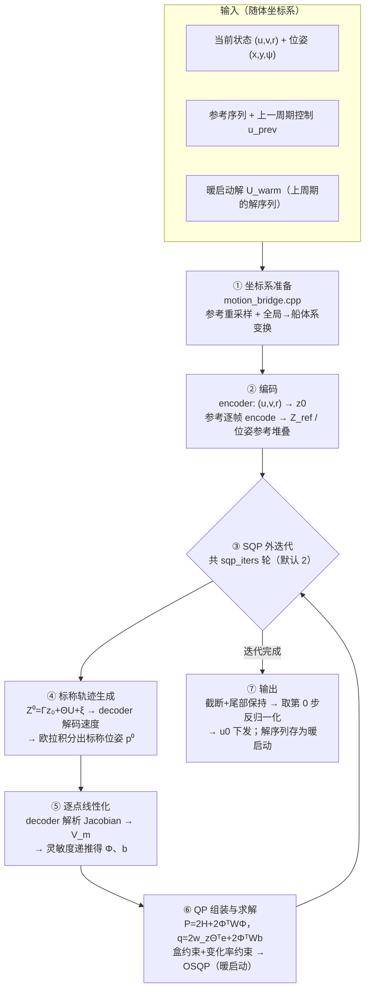
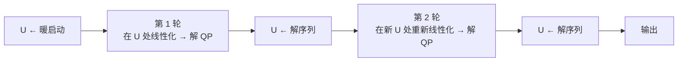
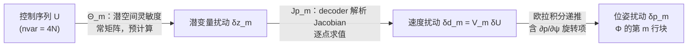
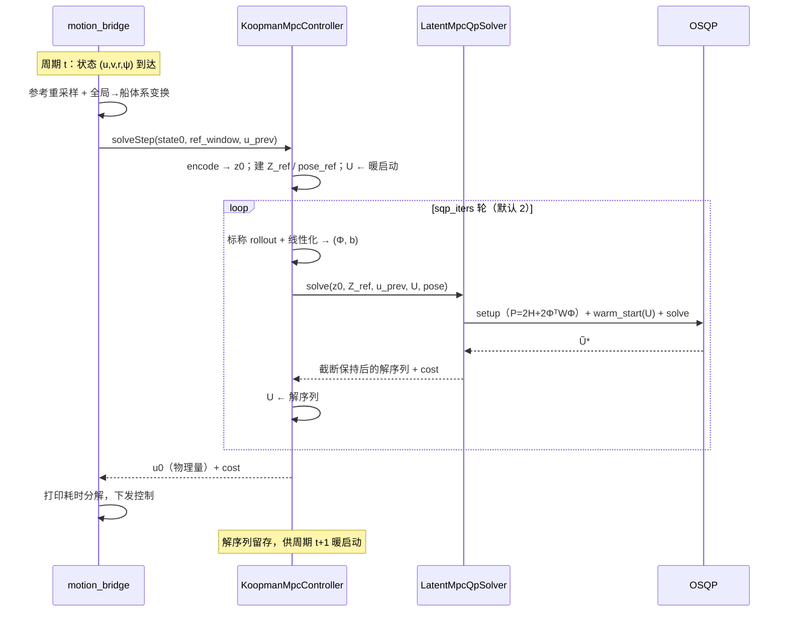

# Tier-2 位姿跟踪 MPC 求解流程详解

本文详细讲解 v4 潜空间 OSQP-MPC 在**开启 Tier-2 位姿跟踪**后，一个控制周期内从传感器状态到
控制量下发的完整求解过程。总体架构与 Tier-1 推导见《潜空间QP-MPC实现.md》，本文聚焦求解流程本身，
所有公式与代码逐一对应。

**启用条件**：`w_xy > 0` 或 `w_yaw > 0`，且 latent YAML 含 `decoder` 权重
（`KoopmanMpcController::poseTrackingEnabled`，`mpc_controller.cpp:50`；旧 YAML 无 decoder 时静默禁用，退化为纯 Tier-1）。

## 1. 全流程总览



一个控制周期 = ① 坐标系准备 → ② 编码 → ③ SQP 外迭代（每轮含 ④⑤⑥）→ ⑦ 输出。
以下逐节展开。

## 2. ① 坐标系准备（`motion_bridge.cpp`）

`KoopmanMotionMpc::solve` 是 motion.cpp 侧的入口，先做两件事：

**参考重采样**（`resampleMotionRefToHorizon`，`motion_bridge.cpp:58`）：参考序列按
`ref_dt=1.0 s`、`ref_time_offset=0.5 s` 线性插值，取 t_k = k·dt（k=0..N）得到 H+1 帧参考窗口，
每帧含 (x, y, ψ, u, v, r)。

**全局→船体系变换**（`buildRefWindow`，`motion_bridge.cpp:150`）：`has_pose` 时把参考位姿
变换到"以当前船位为原点、当前艏向为 x 轴"的随体坐标系：

\[
p_{body} = R(-\psi_{cur})\,(p_{global} - p_{cur}),\qquad
\psi_{body} = \mathrm{wrap}(\psi_{global} - \psi_{cur})
\]

参考中的速度分量 (u,v,r) 本就是船体系量，保持不变。相应地，送入 `solveStep` 的 `state0`
位姿直接置零（`motion_bridge.cpp:111`）——MPC 内部一切位姿量都在这个随体系中表示，
**每个控制周期重建一次坐标系**，避免全局坐标数值过大带来的精度问题。

## 3. ② 编码（`mpc_controller.cpp:114-126`）

进入 `KoopmanMpcController::solveStep` 后：

- 当前动力学状态 dyn=(u,v,r) 归一化（`normalizeDyn`），经 `encoder_.encode` 得 **z₀ ∈ R⁴⁸**；
- 参考窗口逐帧取 (u,v,r) 归一化后 encode，堆叠成 **Z_ref ∈ R^{48N}**（`buildRefLatentStack`，供 Tier-1 潜空间跟踪项）；
- Tier-2 开启时另建**位姿参考堆叠** pose_ref ∈ R^{3N}（`buildRefPoseStack`），第 k 块对应第 k 步的 (x,y,ψ)；
- 位姿初值 pose0 = (0,0,0)（随体系原点）。

同时准备**标称控制序列 U**（SQP 线性化工作点）：优先取上一周期保存的暖启动解
`u_warm_tilde_`，首周期为全零（`mpc_controller.cpp:130-132`）。

## 4. ③ SQP 外迭代框架

位姿传播含 decoder（GELU 网络）与旋转矩阵 sin/cos 两处非线性，无法直接写进凸 QP。
策略是**序列二次规划（SQP）**：在当前标称控制序列 U 处把位姿约束线性化，解一个凸 QP，
用解更新标称轨迹，重复 `sqp_iters` 轮（默认 2，Tier-1 单独使用时只跑 1 轮）。



每轮 QP 都以上一轮的解暖启动 OSQP，第二轮的线性化工作点已经比暖启动更接近真解，
因此 2 轮即可显著修正长 horizon 下的线性化漂移（继续增加轮数收益递减，且每轮约多花一倍求解时间）。

## 5. ④ 标称轨迹生成（`pose_linearize.cpp:32-75`）

给定当前标称 U，分三步生成标称轨迹：

**潜空间 rollout**（精确线性传播，与 condensed 矩阵口径一致）：

\[
Z^0 = \Gamma z_0 + \Theta U + \xi
\]

**逐步解码物理速度**：对每个预测步 m=1..N，取 z_m⁰ 经 decoder 前向并还原物理量纲：

\[
d_m = \mathrm{diag}(\sigma_{dyn})\cdot \mathrm{MLP}(z_m^0) + \mu_{dyn} \in \mathbb{R}^3
\quad (u_m, v_m, r_m)
\]

**船体系欧拉积分出标称位姿**（沿用 rollout 约定：速度 d_m 配本步开始时的艏向 ψ_{m−1}）：

\[
\begin{bmatrix} x_m^0 \\ y_m^0 \end{bmatrix}
= \begin{bmatrix} x_{m-1}^0 \\ y_{m-1}^0 \end{bmatrix}
+ \Delta t\, R(\psi_{m-1}^0) \begin{bmatrix} u_m \\ v_m \end{bmatrix},
\qquad
\psi_m^0 = \psi_{m-1}^0 + \Delta t\, r_m
\]

## 6. ⑤ 逐点线性化：灵敏度 Φ 与偏置 b

目标：把"位姿误差"写成控制序列 U 的仿射函数。链条是
U →(Θ)→ z →(decoder)→ d →(欧拉积分)→ p，逐环求导再相乘。



**第一环：decoder 解析 Jacobian**（`koopman_decoder.cpp:128`）。decoder 是 Linear/GELU 交替的 MLP，
Jacobian 逐层链式累乘：Linear 层 J ← W·J；GELU 层 J ← diag(gelu′(h))·J（逐元素导数）；
最后乘 diag(σ_dyn) 还原物理量纲，得 Jp_m（3×48），在标称点 z_m⁰ 处求值。

**第二环：速度灵敏度**。潜空间扰动对 U 的灵敏度就是 Θ 的第 m 行块（常矩阵），故

\[
V_m = J_{p,m}\cdot \Theta_m \quad (3 \times nvar)
\]

**第三环：位姿灵敏度递推**（`pose_linearize.cpp:77-114`）。对欧拉积分逐步求导，
S^x_m、S^y_m、S^ψ_m 表示 ∂p_m/∂U 的 nvar 维行向量（初值为 0）：

\[
\begin{aligned}
S^x_m &= S^x_{m-1} + \Delta t(\cos\psi^0\, V_u - \sin\psi^0\, V_v)
        + \underbrace{(-u_m \sin\psi^0 - v_m \cos\psi^0)\,\Delta t}_{\partial x_m/\partial\psi_{m-1}}\, S^\psi_{m-1}\\
S^y_m &= S^y_{m-1} + \Delta t(\sin\psi^0\, V_u + \cos\psi^0\, V_v)
        + \underbrace{(u_m \cos\psi^0 - v_m \sin\psi^0)\,\Delta t}_{\partial y_m/\partial\psi_{m-1}}\, S^\psi_{m-1}\\
S^\psi_m &= S^\psi_{m-1} + \Delta t\, V_r
\end{aligned}
\]

第三项是关键：ψ_{m−1} 的扰动经旋转矩阵的导数传入位置——正是它把"艏向误差"与"位置误差"耦合起来，
忽略它会导致转弯工况下位姿梯度明显错误。Φ（3N × nvar）的第 m 行块即 (S^x_m; S^y_m; S^ψ_m)。

**偏置 b**（`pose_linearize.cpp:116-131`）：把仿射展开锚定在标称轨迹的实测误差上——

\[
b = \underbrace{(p^0 - p_{ref})}_{\text{标称位姿误差}} - \Phi U^0
\quad\Rightarrow\quad
e_{pose} \approx \Phi U + b
\]

yaw 分量先做 `wrapAngle` 折到 ±π 再相减，避免 2π 跳变污染梯度。
权重向量 wq 逐步取 (w_xy, w_xy, w_yaw)。

## 7. ⑥ QP 组装与 OSQP 求解（`latent_mpc_qp.cpp`）

### 7.1 目标函数：Tier-1 基底 + 位姿叠加

Tier-1 部分（H 预计算一次，不随 SQP 轮次变化）：

\[
H = w_z \Theta^T\Theta + w_u I + w_{du} D^T D,\qquad
P_0 = 2H,\qquad q_0 = 2 w_z \Theta^T (Z_{free} - Z_{ref})
\]

位姿软约束项（每轮重建）：

\[
J_{pose} = \|W^{1/2}(\Phi U + b)\|^2
\;\Longrightarrow\;
\boxed{P = P_0 + 2\Phi^T W \Phi,\qquad q = q_0 + 2\Phi^T W b}
\]

W = diag(wq)。实现上先对 Φ 按行乘 wq 再做 Φᵀ(WΦ)，避免显式构造 W（`latent_mpc_qp.cpp:246-273`）。
ΦᵀWΦ 半正定，叠加后 Hessian 仍半正定，**问题保持凸 QP**。

### 7.2 约束：只管控制量

约束矩阵 A（2·nvar × nvar）只含两类硬约束，位姿不进入约束：

| 约束 | 形式 | 说明 |
|---|---|---|
| 盒约束 | (u_min−μ)/σ ≤ ũ ≤ (u_max−μ)/σ | 物理幅值映射到归一化空间；油门 ±100、舵 ±35 |
| 变化率约束 | k=0：\|ũ₀−ũ_prev\| ≤ du_max/σ；k≥1：\|ũ_k−ũ_{k−1}\| ≤ du_max/σ | 首步锚定上一周期实际下发量；油门 15/周期、舵 3.5/周期 |

### 7.3 OSQP 求解

- P 取上三角转 CSC、A 转 CSC，每次 solve 重建 workspace（nvar=40 的小问题，开销可忽略）；
- `eps_abs=eps_rel=1e-4`、`max_iter=4000`、`warm_start=1`，并以上一轮/上一周期的 U
  `osqp_warm_start_x`——SQP 第二轮和相邻控制周期的求解因此都只需少量迭代；
- 求解失败直接抛异常，由上层决定降级。

## 8. ⑦ 输出与周期衔接（`mpc_controller.cpp:145-166`）

最后一轮 QP 解出后：

1. **截断 + 尾部保持**（`expandToFull`）：保留前 `opt_control_steps`（默认 2）步，
   第 2..N−1 步覆写为最后优化步的常值——用保守的尾部策略换鲁棒性；
2. 解序列存入 `u_warm_tilde_`，作为**下一控制周期**的暖启动与 SQP 标称初值；
3. 取第 0 步的 4 维控制，反归一化（ũ·σ_ctrl + μ_ctrl）得物理量 u0 下发；
4. `motion_bridge` 打印耗时分解：`total / ref_resample / qp_solve / osqp_iters / status / cost`，
   可在线观测单次求解毫秒级耗时。

相邻周期的时间线：



## 9. 配置与调优

| 参数（`mpc_config.yaml`） | 默认 | 作用与调优 |
|---|---|---|
| `w_xy` | 0（关闭） | 平面位置跟踪权重；开启建议 0.5–2.0，过大易与艏向/潜空间项打架 |
| `w_yaw` | 0（关闭） | 艏向跟踪权重；与 `w_xy` 配合开启 |
| `sqp_iters` | 2 | SQP 外迭代轮数；>2 收益小、耗时近似线性增长 |
| `w_z` / `w_u` / `w_du` | 1.0 / 1e-4 / 0.05 | Tier-1 潜空间跟踪 / 幅值 / 平滑权重，Tier-2 开启后仍生效 |
| `throttle_du_max` / `rudder_du_max` | 15 / 3.5 | 每周期控制变化上限（物理量），限制位姿环的调节速度 |

开启 Tier-2 的前提：`koopman_v4_latent.yaml` 含 `decoder` 段（由 `export_v4_encode_weights.py`
导出）；否则 `decoder_.loaded()` 为 false，自动退化为纯 Tier-1，不报错。

## 10. 验证

```bash
python3 tests/test_pose_linearize.py            # decoder Jacobian 与 Φ 的二阶收敛性（float64 数值微分对照）
# C++ 端到端（含 OSQP）：构建后运行
./verify_pose_linearize cpp/koopman_mpc/weights/koopman_v4_latent.yaml
```

`test_pose_linearize.py` 用数值微分验证解析 Jacobian 与 Φ 的正确性（二阶收敛即梯度正确），
`verify_pose_linearize` 在 C++ 侧对同一份 latent YAML 做端到端复核，保证 Python 训练口径与
C++ 部署口径一致。

## 11. 设计要点回顾

- **位姿只作代价项（软约束）**：欠驱动系统 + 线性化近似下，硬约束可能无可行解；
  软约束永远有解，误差以代价形式被权衡（详见《潜空间QP-MPC实现.md》§4.5）；
- **线性化锚定实测误差**：b = 标称误差 − ΦU⁰，使仿射模型在标称点处零误差，SQP 轮次间逐步外推；
- **yaw 全程 wrap 处理**：参考变换、标称误差两处都先 wrapAngle，杜绝 2π 跳变；
- **H 不变、只重建位姿项**：Tier-1 的 Hessian 一次预计算，SQP 每轮只需重建 ΦᵀWΦ 与 q，
  计算开销集中在 N×nvar 规模的矩阵乘上；
- **暖启动贯穿始终**：SQP 轮次间、控制周期间都以旧解暖启动，OSQP 实际迭代次数很低。
