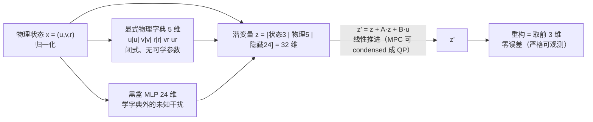
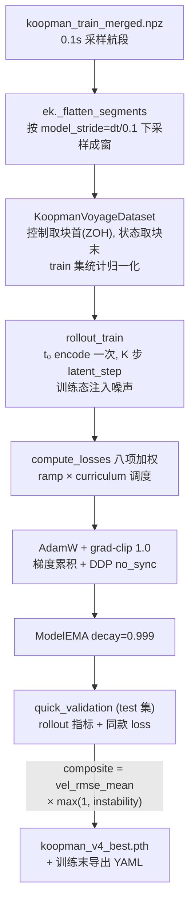

# Koopman 模型逐行设计文档（v1/v2、v4 模型与 v4 训练管线）

> 本文逐行解释工程中的两代 Koopman 模型实现，并说明每一处设计"为什么是这样"：
> - **上篇**：`koopman/model_v1_v2.py`（128 行）——v1/v2 共用的 `HorizontalKoopmanModel`，物理先验 + 严格可观测架构；
> - **下篇**：`new_v4_dict_input/model_v4_dict_input.py`（209 行）——v4 `HorizontalKoopmanModelV4DictInput`，字典输入 + decoder 架构；
> - **对照篇**：两代差异对照表与演进逻辑；
> - **续篇**：`new_v4_dict_input/train_v4_dict_input.py`（1255 行）——v4 训练管线逐块解释（数据窗口、rollout、损失栈、curriculum、best 选择与导出）。
>
> 背景与谱系演进见《工程全景说明文档.md》§3；损失的量化问题另见《v4代价函数设计分析.md》《v4多步训练代价函数分析.md》。

# 上篇：model_v1_v2.py（v1/v2）

## 1. 文件定位与整体设计思想

该模型是 **Koopman 算子理论**在船舶水平面动力学上的落地：非线性动力学
`x' = f(x, u)`（x=[u,v,r]：纵向速度、横向速度、艏摇角速度）被"升维"到一个 32 维潜空间，
在潜空间里用**线性**系统 `z' = z + A(z) + B(u)` 近似推进。升维的基函数（观测量）分三类：



三个核心设计思想（后文逐行展开）：

1. **物理先验当基函数**：把流体力学里已知的二次阻尼、科里奥利耦合直接写死成字典项，神经网络只补"课本外"的部分——注释里"极大减轻神经网络的死记硬背负担"就是这个意思；
2. **严格可观测**：状态本身放在潜变量的前 3 维，重构 = 切片，**重构误差恒为零**，训练信号全部打在"预测准不准"上而非"解码对不对"上（v1 用加速度 MSE 当主损失导致漂移的教训）；
3. **残差/欧拉参数化**：学的是增量 `A(z)` 而非矩阵本身，有效矩阵 `Ā = I + A.weight` 初始 ≈ 单位阵，天然贴合"小 dt 下状态缓变"的先验，也让谱半径（稳定性）便于监控和惩罚。

## 2. 逐行解释

### 2.1 导入（L1-4）

```python
import math
from typing import List, Tuple, Optional, Type
import torch
import torch.nn as nn
```

- `math`：仅用于 L79 的 `math.sqrt(5)`（PyTorch Linear 默认初始化参数）；
- `typing` 的 `List/Tuple/Optional/Type`：函数签名标注用；注意 `Tuple` 实际未被使用，属无害的冗余导入；
- 只依赖 PyTorch，不依赖工程内任何模块——**模型库是纯 `nn.Module`，无 IO、无 CLI**，这是全工程的架构纪律（见《架构重构方案.md》§4.1）。

### 2.2 ResidualConvBlock（L6-22）——带残差的特征增强块

```python
class ResidualConvBlock(nn.Module):
    """带残差连接的 1D 特征增强块"""
    def __init__(self, in_dim, out_dim, activation=nn.GELU, dropout=0.1):
        super().__init__()
        self.fc = nn.Linear(in_dim, out_dim)
        self.conv = nn.Conv1d(out_dim, out_dim, kernel_size=3, padding=1, groups=out_dim)
        self.act = activation()
        self.drop = nn.Dropout(dropout)
        self.shortcut = nn.Identity() if in_dim == out_dim else nn.Linear(in_dim, out_dim)
```

- **L10 `fc`**：真正承担特征变换的是这个全连接层；
- **L11 `conv`**：`groups=out_dim` 的 depthwise Conv1d，kernel=3/padding=1。**但必须指出：这是一个已知的名不副实的设计**——forward 中特征轴长度恒为 1（L18 `unsqueeze(-1)` 造出长度 1 的"序列"），kernel=3 的卷积在长度 1 的轴上退化为**逐通道缩放**，没有任何跨位置感受野。它无害但无用，v4 保留同名结构仅为兼容旧 ckpt（见《架构重构方案.md》C-3）；
- **L12 `act = activation()`**：默认 GELU。选 GELU 而非 ReLU 的原因：小网络回归任务里 GELU 平滑可导、在负半轴不死，对归一化到 0 附近的速度量更友好；
- **L13 `drop`**：dropout=0.1 正则。**已知问题**：它让 `encode(target)` 在训练模式下带随机性，导致"目标编码 ≠ rollout 轨迹编码"的轻微不一致——v3 因此把 encoder dropout 显式置 0（`model_v3.py:103-105` 有注释记录）；
- **L14 `shortcut`**：残差分支。维度变了用 Linear 投影，不变则 Identity——标准 ResNet 做法，保证深层堆叠时梯度可直通。

```python
    def forward(self, x):
        identity = self.shortcut(x)      
        out = self.fc(x).unsqueeze(-1)          
        out = self.conv(out).squeeze(-1)            
        out = self.act(out)
        out = self.drop(out)
        return out + identity
```

- **L17** 先算残差分支（短路优先，主路无论学成什么样输出至少是输入的良态变换）；
- **L18-19** `[B, out]` → `[B, out, 1]` 过卷积再挤回去——即上面说的"长度 1 上的伪卷积"；
- **L22** `out + identity`：残差求和。为什么整体要残差式：encoder 堆了 3 层（见 L68），残差让 3 层块在初始化时近似恒等映射，训练初期的预测完全由物理字典主导，黑盒部分从"不添乱"开始学起。

### 2.3 res_mlp（L24-33）——MLP 组装器

```python
def res_mlp(sizes, activation=nn.GELU, dropout=0.1) -> nn.Sequential:
    layers = []
    for i in range(len(sizes) - 1):
        in_dim, out_dim = sizes[i], sizes[i + 1]
        is_last = (i == len(sizes) - 2)
        if not is_last:
            layers.append(ResidualConvBlock(in_dim, out_dim, activation, dropout))
        else:
            layers.append(nn.Linear(in_dim, out_dim))
    return nn.Sequential(*layers)
```

- 按 `sizes` 列表逐层组装；**中间层用残差块，最后一层用裸 Linear**（L32）。
- 为什么最后一层不加激活/dropout：隐藏特征要作为 Koopman 潜变量的一部分被线性矩阵 A/B 使用，输出层必须保持**无界线性读出**——加 GELU 会压缩负半轴信息，加 dropout 会给潜空间注入噪声。

### 2.4 BaseKoopmanModel.spectral_radius（L35-43）——稳定性监控基类

```python
class BaseKoopmanModel(nn.Module):
    def spectral_radius(self) -> torch.Tensor:
        A_diff = self.A.weight
        I = torch.eye(A_diff.size(0), device=A_diff.device)
        A_eff = I + A_diff
        try:
            return torch.max(torch.abs(torch.linalg.eigvals(A_eff)))
        except:
            return torch.linalg.svdvals(A_eff).max()
```

- **L37-39 `A_eff = I + A_diff`**：这是理解全文件的关键——`latent_step`（L118）是 `z + A(z)` 的残差形式，所以真正决定动力学的是 `Ā = I + A.weight`，谱半径必须对 Ā 求；
- **L41 `eigvals`**：ρ(Ā) = max|λ|，>1 意味着存在指数发散模态，多步 rollout 必漂。训练时它被 `L_stab` 惩罚（`train_v2.py:487`），训练启动时也被记录（`train_v2.py:979`）；
- **L42-43 兜底**：eig 分解偶尔不收敛（矩阵病态时抛异常），退化为最大奇异值——谱半径的凸上界，宁可保守不可漏报。裸 `except` 粗糙但此处意图明确：监控函数不许把训练打断。

### 2.5 HorizontalKoopmanModel.__init__（L45-74）——潜空间的构成

```python
class HorizontalKoopmanModel(BaseKoopmanModel):
    """
    【终极版：物理先验 + 严格可观测架构 (Physics-Informed Strict Koopman)】
    - z = [物理状态(3), 显式物理字典(5), 黑盒隐藏特征(24)]
    - 将二次阻尼、科里奥利力强行作为基函数，极大减轻神经网络的死记硬背负担。
    """
```

- 类名 "Horizontal" 指船舶**水平面三自由度**运动（surge/sway/yaw），不含垂荡横摇纵摇；
- docstring 的"终极版"是 v2 定稿时的历史用语（实际上后面还有 v3/v4），阅读时应理解为"v2 版定型"。

```python
    def __init__(self, state_dim=3, control_dim=4, hidden_dim=24):
        ...
        self.pif_dim = 5 
        self.latent_dim = state_dim + self.pif_dim + hidden_dim 
        self.encoder_mlp = res_mlp([state_dim, 64, 64, 64, hidden_dim], dropout=0.1)
        self.A = nn.Linear(self.latent_dim, self.latent_dim, bias=True) 
        self.B = nn.Linear(self.control_dim, self.latent_dim, bias=False)
        self.reset_parameters()
```

- **L53 `state_dim=3`**：[u, v, r]；
- **L54 `control_dim=4`**：4 个推进器通道（左右舷油门 ×2 + 舵 ×2 的 4 通道指令，与数据集 `Thrusters_CMD` 对齐）；
- **L55 `hidden_dim=24`**：黑盒特征预算。为什么只给 24：总潜空间 32 维里物理已占 8 维，隐藏维越多越容易"绕过物理字典去过拟合噪声"，24 是表达力与正则的折中（注释"只需补充 24 维未知特征"）；
- **L61-62 `pif_dim=5`**：显式物理字典 5 项，见 §2.6；
- **L65 `latent_dim = 3+5+24 = 32`**：潜空间总维数。维数选择受两端约束：Koopman 理论要求足够rich的观测量张成不变子空间，而部署端 QP 的 Hessian 规模随潜维平方增长——32 维是精度与 MPC 实时性的平衡点；
- **L68 encoder 结构 `[3, 64, 64, 64, 24]`**：3 个残差块 + 末层 Linear；输入只有 3 维状态，所以物理字典（非线性项）与 MLP（任意非线性）是并联两条路——字典给"确定的已知"，MLP 学"剩余的未知"；
- **L71 `A` 带 bias**：注释已说明——归一化空间里状态的稳态不是原点（比如巡航油门对应非零均值），`A.bias` 吸收这个非零平衡点，避免强迫 `A.weight` 去拟合截距；
- **L72 `B` 不带 bias**：控制为零时控制贡献必须严格为零，偏置已由 `A.bias` 统一承担，B 再加 bias 会造成可辨识性冲突（两个常数项无法分配）。

### 2.6 reset_parameters（L76-82）——初始化即先验

```python
    def reset_parameters(self) -> None:
        for m in self.encoder_mlp.modules():
            if isinstance(m, nn.Linear):
                nn.init.kaiming_uniform_(m.weight, a=math.sqrt(5))
        nn.init.normal_(self.A.weight, mean=0.0, std=0.01)
        nn.init.zeros_(self.A.bias)
        nn.init.xavier_uniform_(self.B.weight, gain=0.1)
```

- **L77-79** encoder 用 `kaiming_uniform(a=√5)`——这就是 PyTorch Linear 的默认初始化，显式写一遍是为了重置语义明确；
- **L80 `A.weight ~ N(0, 0.01)`**：全文件最重要的一行。`Ā = I + A.weight ≈ I + 小扰动`，即**初始化时模型就是"下一步 ≈ 当前步"的恒等预测器**——对 dt=1s 的缓变船舶状态这是极佳起点，且初始谱半径 ≈1，处于稳定边界，训练只需做"微调"而非"搜索"；
- **L81 `A.bias = 0`**：初始无偏置，平衡点从零开始学；
- **L82 `B` xavier(gain=0.1)**：控制通道初始影响压小（gain 0.1），避免训练初期随机的大 B 把潜变量打乱——先让 A 学稳自由响应，再让 B 学控制响应。

### 2.7 compute_physics_informed_features（L84-103）——物理字典

```python
        u = x[..., 0:1]; v = x[..., 1:2]; r = x[..., 2:3]
        uu = u * torch.abs(u)   # 二次阻尼
        vv = v * torch.abs(v)
        rr = r * torch.abs(r)
        vr = v * r              # 科里奥利/向心耦合
        ur = u * r
        return torch.cat([uu, vv, rr, vr, ur], dim=-1)
```

- 为什么选这 5 项：它们来自船舶操纵性方程（Abkowitz/MMG 族）中最主导的非线性项——
  - **二次阻尼 `u|u|` 等**：水动力阻力在高航速下近似与速度平方成正比；写成 `u*|u|` 而非 `u²` 是为了**保号**（阻力永远与速度反向，`u²` 在 u<0 时符号错误，倒车工况会学反）；
  - **`vr`, `ur`**：水平面运动方程里的科里奥利/向心耦合项（如 `ü` 方程含 `vr`，`ṙ` 方程含 `ur`）；
- 用 `x[..., 0:1]` 切片保维（而非 `[..., 0]`），保证对 `[..., 3]` 任意前导维（[B,3] 或 [B,K,3]）都成立——这是 `encode` 能被直接用在 [B,K,3] 目标序列上的原因（`train_v2.py:478`）；
- 这些项**闭式、无可学参数**：它们不学习，只把"正确的函数形式"摆在 A 面前，A 只需学一个线性权重就等价于辨识出了水动力系数。这正是"减轻死记硬背"的含义；
- 已知局限：无界。归一化输入若因外推变大，二次项会平方放大——v3 起给字典加了 `clamp_pif=5.0` 截断（`model_v3.py:138-140`）。

### 2.8 encode（L105-111）

```python
    def encode(self, x):
        pif = self.compute_physics_informed_features(x)
        h = self.encoder_mlp(x)
        return torch.cat([x, pif, h], dim=-1)
```

- 潜变量 = 三路拼接：**原始状态（3）‖ 物理字典（5）‖ 黑盒特征（24）**；
- 顺序重要：状态必须在**最前面**，因为 `reconstruct_state` 靠切片取前 3 维（L115）；ckpt/YAML 导出、C++ 侧 encoder 都依赖这个布局约定（接口契约，见 `cpp/koopman_control/模型输入输出接口说明.md`）。

### 2.9 reconstruct_state（L113-115）

```python
    def reconstruct_state(self, z):
        """切片提取，依然是完美的零重构误差"""
        return z[..., :self.state_dim]
```

- 这就是"严格可观测"：状态本身就是潜变量的前 3 维，**没有 decoder、没有重构误差**；
- 为什么这是重要设计：v1 时代的教训是"重构与预测两个误差源混在一起，损失信号被稀释"。切片重构让 `L_vel` 的梯度 100% 归因于"推进矩阵 A/B 学得对不对"；
- 副作用：训练损失栈里的 `L_recon`（`train_v2.py:484`）在本模型上恒为 0，保留它只为接口兼容；v4 取消状态直通改 decoder 后，`L_recon` 才真正起作用——这也是 v4 多出的误差通道（见《多步漂移优化方案.md》§2.2）。

### 2.10 latent_step（L117-118）——全文件的核心

```python
    def latent_step(self, z, u):
        return z + self.A(z) + self.B(u)
```

- 形式：**离散时间可控线性系统的欧拉残差写法**，`z' = z + A(z) + B(u)`，等价于 `z' = Āz + B·u + b`，其中 `Ā = I + A.weight`；
- 为什么学增量不学 Ā 本身：若直接参数化 Ā，初始化时它是一个随机矩阵（谱半径可能远大于 1），训练要先"爬"回稳定区；学增量则初始即恒等（见 L80），稳定性从第 0 步就成立；
- 为什么必须是**线性**形式：这是 Koopman 方法对下游 MPC 的核心承诺——潜空间线性时，N 步预测可以一次性展开成 condensed 形式 `Z = Γz₀ + ΘU`，跟踪问题转化为一个凸 QP（`docs/潜空间QP-MPC实现.md`），C++ OSQP 才能毫秒级求解。任何非线性 latent step 都会毁掉这条部署链路；
- 训练侧契约：多步 rollout 只对 t₀ 做一次 `encode`，之后循环调用本函数（`train_v2.py:376-385`），全开环、无 teacher forcing——所以这里的数值行为直接决定多步漂移特性。

### 2.11 forward（L120-128）——为损失计算服务的前向

```python
    def forward(self, x_t, u_t, x_tp1=None):
        z_t = self.encode(x_t)
        z_tp1_hat = self.latent_step(z_t, u_t)
        x_t_recon = self.reconstruct_state(z_t)
        x_tp1_hat = self.reconstruct_state(z_tp1_hat)
        if x_tp1 is not None: 
            return z_t, self.encode(x_tp1), z_tp1_hat, x_t_recon, x_tp1_hat
        return z_t, z_tp1_hat, x_t_recon, x_tp1_hat
```

- 单步前向，返回一个五元组（或四元组），每个元素对应损失栈的一项：
  - `z_t`：当前潜变量；
  - `encode(x_tp1)`：**目标潜变量**，给 `L_lin`（潜一致性损失）当监督（`train_v2.py:478`）；
  - `z_tp1_hat`：预测的下一步潜变量；
  - `x_t_recon`：当前重构（本模型恒等于输入，见 §2.9）；
  - `x_tp1_hat`：物理空间的下一步预测，给 `L_vel`；
- **L126 为什么 `x_tp1` 可选**：评估/推理时没有真值，省下对目标的 encode 计算；训练时才传。一个签名同时服务训练与推理两条路径；
- 注意：多步训练不走 `forward`，而是在训练脚本里循环 `latent_step`（`train_v2.py:383`）——`forward` 只提供单步语义，多步编排在训练层，这是"模型纯、编排在外"的分层约定。

## 3. 设计决策速查表

| 决策 | 位置 | 原因 | 已知后果/局限 |
|---|---|---|---|
| 潜变量 = 状态直通 + 物理字典 + MLP 三路拼接 | L105-111 | 物理先验减负担、黑盒补未知、直通保零重构误差 | 布局顺序成为跨语言接口契约，不可轻易改 |
| `z + A(z) + B(u)` 残差参数化 | L118 | 初始 Ā≈I 贴合小 dt 先验；谱半径可监控可惩罚 | 线性外推有结构性下界（v3a 实证 slope≈0.70） |
| `A.weight ~ N(0,0.01)` | L80 | 初始即近恒等预测器、ρ≈1 | 软约束下 v2 部署版曾放出 ρ=1.014 的轻度不稳定 |
| A 带 bias / B 不带 bias | L71-72 | 归一化空间非零稳态由 A.bias 吸收；零控制必须零贡献 | — |
| 保号二次项 `u·|u|` | L95-97 | 阻力与速度反向，倒车工况符号正确 | 无 clamp，外推输入会平方放大（v3 已修） |
| 状态切片重构 | L113-115 | 消除重构误差通道，损失信号纯净 | `L_recon` 在本模型恒 0；v4 改 decoder 后引入新误差源 |
| Conv1d 残差块 | L6-22 | 本意是特征增强 | 长度 1 轴上退化为逐点缩放，名不副实（保留仅为 ckpt 兼容） |
| dropout=0.1 in encoder | L8 | 正则 | 导致 encode 目标与 rollout 不一致，v3 置 0 |
| spectral_radius 带 SVD 兜底 | L40-43 | eig 分解可能不收敛，监控不许中断训练 | 裸 except 略粗糙 |

## 4. 上篇小结：v2 留下的接口与包袱

v2 定稿时沉淀下来的东西分两类，直接决定了下篇 v4 的形态：

- **被继承的接口**（v4 逐字保留）：四方法契约 `encode / latent_step / reconstruct_state / spectral_radius`；推进语义 `z + A(z) + B(u)`（A 带 bias、B 无 bias）；初始化哲学 `A~N(0,0.01)` + `B xavier(0.1)`；
- **被替换的实现**（v4 逐项修复）：状态直通潜空间（→ decoder）、5 阶无 clamp 字典（→ 16 阶 clamp 字典）、退化 Conv1d 残差块 + dropout=0.1（→ 干净残差 MLP + dropout=0）。

# 下篇：model_v4_dict_input.py（v4）

## 5. 文件定位与设计目标（L1-21）

```python
"""Deep-Koopman v4: use 16 dictionary atoms as encoder input.
设计目标：
1) 保持与既有训练/评估流程的接口兼容：
   - encode(x_dyn_norm) / latent_step(z, u_norm) / reconstruct_state(z) / spectral_radius()
2) 与 v3 的差别：encoder 不再直接吃 [u, v, r]，而是吃固定 16 阶物理字典。
3) 因为 latent 中不再包含 state 直通分量，新增 decoder 从 latent 回归 [u, v, r]。
"""
from koopman.model_v1_v2 import BaseKoopmanModel, res_mlp
```

- **模块 docstring 即设计契约**（L1-11）：三句话讲清了 v4 的全部意图——① 对外接口（四个方法签名）与 v2/v3 **完全不变**，评估/导出链路零改动（`evalkit.py:831-866` 靠 `model_class` 字符串分发到本类）；② 核心变化是 encoder 的输入从原始状态换成 16 阶物理字典；③ 为此付出的代价是必须引入 decoder；
- **L20 复用上篇的两个构件**：`BaseKoopmanModel`（谱半径监控，见 §2.4）与 `res_mlp`（旧式残差块组装器，见 §2.3）——v4 没有另起炉灶，而是在 v1/v2 的接口与基类上生长，这是"接口兼容优先"的直接体现；
- 为什么要把字典当 encoder 输入：v2/v3 的 MLP 只看 [u,v,r] 三个原始量，要自己"发明"非线性；v4 让 MLP 直接站在 16 个物理原子的肩膀上，**隐藏特征从第一维起就是物理量的非线性组合**，同等容量下表达力更强（工程分析与优化文档中 opt_warm_mlp 实验的 encoder 改造动机）。

## 6. 16 阶物理字典（L23-52）

```python
FEATURE_DICT_ATOMS_16: List[str] = [
    "u_abs_u", "v_abs_v", "r_abs_r", "v_times_r", "u_times_r",
    "uvr", "u2r", "v2r", "ur2", "vr2",
    "u_vabs_v", "v_uabs_u", "r_uabs_u", "r_vabs_v",
    "uuu", "vvv",
]
```

- 字典 = v2 的 5 个二次原子（L24，动机见 §2.7）+ 11 个更高阶原子：
  - **三阶交叉耦合** `uvr, u2r, v2r, ur2, vr2`（L25）：操纵性方程里的三阶项（Abkowitz 展开的标准成员），v3 攻 u 通道 bias 时实证了三次项的价值；
  - **混合保号项** `u·|v|·v` 等（L26）：交叉阻尼，描述一个方向速度对另一方向阻力的调制；
  - **纯三次** `uuu, vvv`（L27）：高航速区的强非线性；
- **L23 的名称列表不是装饰**：它作为 `feature_dict_atoms` 元数据写进 ckpt（`train_v2.py:1175-1188` 同款机制），是 Python 训练、YAML 导出、C++ encoder（`cpp/koopman_control/src/koopman_encode.cpp`）三方之间的**跨语言契约**——`_compute_atoms_16` 返回列表的顺序必须与之一一对应，改顺序而不改名称表是静默错误，这是平行数组结构固有的维护风险；
- **L31-52 实现**：全部闭式、无可学参数；保号写法（`u*|u|`、`u*|u|*u`）延续二次阻尼的符号正确性原则（§2.7）；用 `torch.cat` 而非堆 list 转 tensor，一次拼接完成。

## 7. _ResidualMLPEncoder（L55-74）——对旧块的正面回应

```python
class _ResidualMLPEncoder(nn.Module):
    """干净的残差 MLP 编码器：dict16 -> hidden。
    相对历史 ``res_mlp``（ResidualConvBlock 内 Conv1d 退化为逐通道缩放），
    这里用标准 Linear+GELU，并在等宽隐藏层之间加残差连接，表达力更直接。
    """
    def __init__(self, in_dim, hidden, out_dim):
        self.in_proj = nn.Linear(in_dim, hidden)
        self.fc1 = nn.Linear(hidden, hidden)
        self.fc2 = nn.Linear(hidden, hidden)
        self.out_proj = nn.Linear(hidden, out_dim)
        self.act = nn.GELU()

    def forward(self, x):
        h = self.act(self.in_proj(x))
        h = h + self.act(self.fc1(h))   # 等宽残差块 1
        h = h + self.act(self.fc2(h))   # 等宽残差块 2
        return self.out_proj(h)
```

- docstring（L58-59）**点名承认了上篇 §2.2 记录的 Conv1d 退化问题**——这个类就是它的正式替代者；
- **等宽残差**（L72-73）：残差块内部维度不变（64→64），所以不需要 §2.2 里 L14 那种 shortcut 投影，`h + act(fc(h))` 直接相加——结构更简单、参数更省；
- `in_proj` 先把 16 维升到 64 维等宽区，`out_proj` 末层裸 Linear 无激活——与 §2.3 "末层必须无界线性读出"的原则一致；
- **没有 dropout**：v3 的教训（encoder dropout 导致 `encode(target)` 与 rollout 编码不一致，`model_v3.py:103-105`）在此固化——连旧 conv 路径也显式传 `dropout=0.0`（L107）。

## 8. __init__（L77-120）——潜空间重构

```python
    def __init__(self, state_dim=3, control_dim=4, dict_dim=16,
                 hidden_dim=32, clamp_pif=5.0, encoder_arch="conv"):
        if dict_dim != 16:
            raise ValueError(...)
        self.latent_dim = self.dict_dim + self.hidden_dim     # 16+32=48
        if encoder_arch == "conv":
            self.encoder_mlp = res_mlp([16, 64, 64, hidden_dim], dropout=0.0)
        else:
            self.encoder_mlp = _ResidualMLPEncoder(16, 64, hidden_dim)
        self.decoder_mlp = nn.Sequential(
            nn.Linear(48, 64), nn.GELU(), nn.Linear(64, 64), nn.GELU(), nn.Linear(64, 3))
        self.A = nn.Linear(self.latent_dim, self.latent_dim, bias=True)
        self.B = nn.Linear(self.control_dim, self.latent_dim, bias=False)
```

- **L90-91 fail-fast 守卫**：`dict_dim != 16` 直接抛错——字典阶数与 ckpt 元数据、C++ encoder 强绑定，不允许"悄悄传个别的值"；`encoder_arch` 合法性检查（L98-99）同理；
- **L97 `latent_dim = 16 + 32 = 48`**：对比 v2 的 `3+5+24=32`。两点变化：字典 5→16，hidden 24→32；**并且状态不再直通**——潜空间里没有了 [u,v,r] 本身；
- **L106-109 encoder 双路径**：`"conv"` 路径就是上篇的 `res_mlp`（ResidualConvBlock），保留它**纯粹为了加载历史 ckpt**（注释 L103-104 明说"仅为兼容保留"）；`"mlp"` 才是 §7 的正解。`encoder_arch` 存进 ckpt args，加载时按存档复原——这是"旧结构代码只读冻结"的兼容策略（《架构重构方案.md》§6）；
- **L110-116 decoder_mlp（v4 最大的架构断点）**：48→64→64→3 的 MLP，因为潜空间不再含状态直通，重构必须从 48 维 latent **回归**出 [u,v,r]。三个连锁后果：
  1. 重构误差不再为零，训练栈里沉睡的 `L_recon`（在 v2 上恒 0）从此有了真实职责；
  2. 多步 rollout 的物理误差 = latent 漂移 × decoder 雅可比 + decoder 固有误差——比 v2/v3 **多了一层误差通道**（《多步漂移优化方案.md》§2.2 将其列为漂移风险面之一）；
  3. C++ 侧多了一个 `koopman_decoder.cpp`（184 行）要与之数值对齐；
- **L118-119 A/B**：与 v2 完全相同（残差参数化、A 带 bias、B 不带 bias，动机见 §2.5）——**推进语义两代未变**，变的是潜空间的"原料"。

## 9. reset_parameters（L122-139）——同一套初始化哲学

```python
    def reset_parameters(self):
        for m in self.encoder_mlp.modules():  # kaiming + fan_in bias
        for m in self.decoder_mlp.modules():  # 同上
        nn.init.normal_(self.A.weight, mean=0.0, std=0.01)
        nn.init.zeros_(self.A.bias)
        nn.init.xavier_uniform_(self.B.weight, gain=0.1)
```

- 与 §2.6 完全相同的配方：`A~N(0,0.01)`（初始 Ā≈I 的近恒等先验）、`A.bias=0`、`B` xavier(gain=0.1)；
- 比 v2 多做的两件事：显式初始化 Linear 的 **bias**（L126-129 复刻 PyTorch 默认的 `uniform(±1/√fan_in)`，v2 漏了 bias 初始化靠默认构造）；对 **decoder** 同样走一遍——decoder 是新部件，初始必须是良态的，否则训练初期 `L_recon` 会污染其他损失项；
- 结果不变：**初始模型 ≈ 恒等预测器 + 一个近随机的 decoder**，ρ(Ā)≈1 从第 0 步成立。

## 10. 字典计算与 clamp（L141-148）

```python
    def compute_pif_atoms(self, x):
        ...
        atoms = torch.cat(_compute_atoms_16(u, v, r), dim=-1)
        if self.clamp_pif > 0:
            atoms = torch.clamp(atoms, -self.clamp_pif, self.clamp_pif)
        return atoms
```

- **clamp_pif=5.0 是三阶项的防爆阀**：三阶原子在归一化空间随输入立方增长，外推样本（实船分布外状态）会产生巨大原子值，把 latent 打飞；clamp 到 ±5 把它们截断在训练见过的范围内。这是 v3 引入（`model_v3.py:138-140`）、v4 继承的防御性设计，对应 §2.7 记录的"字典无界"局限；
- `clamp_pif <= 0` 表示关闭（自检用，见 §12）；
- **接口含义**：clamp 同样存在于 C++ encoder（`koopman_encode.cpp`），两侧必须同阈值——又一个跨语言口径点。

## 11. encode / reconstruct_state / latent_step / forward（L150-173）

```python
    def encode(self, x):
        atoms = self.compute_pif_atoms(x)
        h = self.encoder_mlp(atoms)
        return torch.cat([atoms, h], dim=-1)          # z = [dict16 | hidden32]

    def reconstruct_state(self, z):
        return self.decoder_mlp(z)                    # 回归，非切片

    def latent_step(self, z, u):
        return z + self.A(z) + self.B(u)              # 与 v2 逐字相同

    def forward(self, x_t, u_t, x_tp1=None):          # 签名与 v2 逐字相同
        ...
```

- **encode（L150-153）**：潜变量 = 字典直通 16 维 ‖ 字典过 MLP 的 32 维。字典原子**既当输入又当潜空间成分**——A 矩阵对物理原子的权重具有直接可解释性（等价于辨识水动力系数），这是"dict 直通"相比"全部过 MLP"的显式红利；工程分析也证实 87.4% 的 latent 能量在不可塌缩的字典原子上，这把 `L_lin` 的塌缩风险变成了虚惊；
- **reconstruct_state（L155-156）**：从切片换成 decoder MLP——与 v2 的零误差切片（§2.9）形成根本对照，见对照篇 §13；
- **latent_step / forward**：与 v2 **逐字相同**——这是 L1-11 docstring 承诺的接口兼容的兑现：训练循环、评估 rollout、ONNX 导出对两代模型无感知。

## 12. 自检（L175-209）——模块级冒烟纪律

```python
    def _self_check_dict(self, tol=1e-6):
        # 临时关闭 clamp，用 (0.5, -0.3, 0.2) 手工核算 16 个原子的闭式值逐一比对

def smoketest_self_check():
    m = HorizontalKoopmanModelV4DictInput()
    m._self_check_dict()
    ...  # 再跑一遍 encode/latent_step/reconstruct 形状检查

if __name__ == "__main__":
    smoketest_self_check()
```

- `_self_check_dict` 用一组固定输入手工重算 16 个原子并与实现比对——**防止字典实现被改坏**（比如调整顺序、写错某一项）；临时关 clamp（L177）再恢复（L193-194 `finally`），是为了让比对不受截断影响，且无论断言成败都不污染实例状态；
- 为什么模块自带冒烟：字典顺序是跨语言契约（§6），一旦错了不会在 Python 内报错，只会在 C++ 对比时才暴露——把最便宜的检查放在离改动最近的地方；
- 工程惯例延续：`model_v3.py:233` 有同款 `smoketest_self_check`，`tests/test_v4_encode_reference.py` 则做了更严格的跨实现参考比对。

# 对照篇：v2 vs v4

## 13. 两代模型对照表

| 维度 | v2（上篇） | v4（下篇） | 设计含义 |
|---|---|---|---|
| 潜空间构成 | [状态3 ‖ 物理5 ‖ 隐藏24] = 32 | [字典16 ‖ 隐藏32] = 48 | v4 用字典换掉原始状态直通 |
| 状态重构 | 切片，**零误差** | decoder MLP 回归，有误差 | v4 多了一个误差通道，`L_recon` 从死项变活项 |
| encoder 输入 | 原始状态 [u,v,r] | 16 阶物理原子 | v4 的隐藏特征从第一维起就是物理非线性组合 |
| 字典 | 5 个二次原子，无 clamp | 16 个二/三阶原子，clamp ±5 | 表达力 vs 外推防爆的权衡 |
| encoder dropout | 0.1 | **0.0**（两条路径都是） | 修复 encode(target)≠rollout 编码的不一致 |
| encoder 结构 | ResidualConvBlock（Conv1d 退化） | 新增干净残差 MLP，旧块仅兼容旧 ckpt | 历史包袱以开关形式冻结 |
| 推进语义 | `z + A(z) + B(u)`，A 带 bias / B 无 bias | **逐字相同** | 线性 latent step 是 QP-MPC 部署的硬约束，不能动 |
| 初始化 | A~N(0,0.01)、B xavier(0.1) | 相同 + bias/decoder 显式初始化 | 近恒等先验两代一脉相承 |
| forward 签名 | 五元组/四元组 | **逐字相同** | 训练/评估/导出链路零改动 |
| 谱半径监控 | BaseKoopmanModel.spectral_radius | 继承同一基类 | 稳定性口径一致（实测 v4 ρ=0.99982） |
| 跨语言契约 | 潜空间布局（状态在前） | 16 原子顺序 + clamp 阈值 + decoder | v4 的契约面更大，错配风险点更多 |

## 14. 演进逻辑与经验总结

1. **v1→v2**（见上篇 §3）：主损失从加速度 MSE 改为物理速度 Huber，确立"状态直通 + 全开环 rollout"的抗漂移骨架；
2. **v2→v3**：字典 5→16 原子、encoder dropout 置 0、字典加 clamp——逐项修复上篇 §3 速查表中的局限；
3. **v3→v3a**（不动架构）：per-channel 偏置权重 + composite 选模，得出结构性结论——线性潜空间外推 (I+A)^k 的 slope 下界 ≈0.70，突破须改范式，这直接催生了 v4；
4. **v3→v4**（本篇）：字典升级为模型的**输入**而不仅是潜空间成分，表达力提升；但取消状态直通引入 decoder 误差通道——后续代价分析（《v4代价函数设计分析.md》）反过来证明了 v2"状态直通"的价值；
5. **谱约束的统一教训**：两代都靠 `L_stab` 软罚监控 ρ，但实验实证软罚压不住长程漂移（ρ 压到 0.9993 后 K=20 曲线几乎不变——长程增长是控制驱动的相干误差累积，不是数值发散）；
6. **下一代设计**（《下一代系统设计方案.md》§3.2）由此定形：**把 v2 的状态直通请回来**（z = [状态3 ‖ 字典16 ‖ hidden32] = 51 维，decoder 退役、`L_recon` 退役），同时把 `L_stab` 软罚升级为耗散硬参数化（A = −γI − SSᵀ + K）——两代模型的经验各占一半。

# 续篇：v4 训练管线（train_v4_dict_input.py）

## 15. 总览

训练脚本共 1255 行，职责分块如下（行号为撰写时实测）：

| 行区间 | 构件 | 职责 |
|---|---|---|
| L56-151 | DDP 基建 + 工具 | 分布式初始化、日志、种子 |
| L154-221 | `KoopmanVoyageDataset` | 窗口采样与归一化 |
| L224-239 | `ModelEMA` | 权重指数滑动平均 |
| L242-295 | 损失工具函数 | huber / 步权 / yaw wrap / 位姿积分 |
| L298-324 | `rollout_train` | 训练用多步全开环 rollout |
| L327-411 | `compute_losses` | 八项损失栈（核心） |
| L414-443 | `V4LossModule` | DDP 正确包装的适配层 |
| L446-533 | `quick_validation` | 每 epoch 验证（指标 + 同款 loss） |
| L536-691 | 参数解析 + `merge_yaml` | 全部超参与 YAML 配置合并 |
| L694-715 | `export_params_to_yaml` | 训练末尾的部署 YAML 导出 |
| L784-1185 | `train` | 主循环：curriculum/AMP/累积/best/早停 |
| L1188-1255 | smoketest + main | 冒烟自测与入口 |

端到端数据流：



## 16. 数据窗口：KoopmanVoyageDataset（L154-221）

```python
x_seq = self.states_full[t0 + ms : t0 + 1 + k * ms : ms]   # L212 状态目标
u_seq = self.ctrls_full[t0 : t0 + k * ms : ms]             # L213 控制序列
x_t_n = (x_t - self._sm) / self._ss                        # L214-216 归一化
```

- **L183 `ek._flatten_segments`**：把 npz 里的变长航段拍平成"全体窗口起点索引 t0_global"，`model_stride = dt / data_dt`（dt=1s、data_dt=0.1s 时 ms=10）实现模型步长与原始采样率的解耦——**同一个数据集可以服务 dt=1s 和 dt=4s 两种模型**，只是步进不同；
- **L212-213 时间口径**：模型第 k 步的状态目标取原始数据 `t0+(k+1)*ms`（**块末**），控制取 `t0+k*ms`（**块首**）——隐含"块首指令决定块末状态"的 ZOH 假设。这是全管线最重要的口径决策：简单、与部署的定周期控制一致，但当块内指令变化时构成不可约的输入误差（45.2% 窗口块内指令非恒定，高机动段误差 1.87×，见《v4多步训练代价函数分析.md》§6）；
- **L189/195-201 归一化统计**：外部传入则复用（test 集必须复用 train 的统计，L744-751），否则从本数据集自算；`std + 1e-6` 防除零。统计随 ckpt 走（L1070），保证训练→评估→导出同一口径；
- 预缓存 `_sm/_ss/_cm/_cs` 为 float32（L190-193），`__getitem__` 里只做减法除法——数据加载在 worker 进程里跑（`num_workers=8`），每微秒都省在热路径上。

## 17. rollout_train（L298-324）——训练的动力学核心

```python
if noise_std > 0:
    x_t_dyn_n = x_t_dyn_n + torch.randn_like(x_t_dyn_n) * noise_std   # L312-313
z = model.encode(x_t_dyn_n)                                            # L314 只编一次
for i in range(k):
    u_in = u_seq_n[:, i, :]
    if ctrl_noise_std > 0:
        u_in = u_in + torch.randn_like(u_in) * ctrl_noise_std          # L319-320
    z = model.latent_step(z, u_in)                                     # L321
    pred_lat.append(z)
    pred_norm.append(model.reconstruct_state(z))                       # L323
```

- **全开环、无 teacher forcing**（L314 只 encode t₀ 一次，之后 K 步自馈）：训练口径 = 评估口径 = 部署 condensed rollout 口径，这是 v2 以来抗漂移的骨架设计，避免了"训练靠真值喂、部署靠自己猜"的经典失配；
- **噪声注入仅在训练态**（L347-348 的 `if model.training else 0.0` 双重保险）：输入噪声模拟编码误差、控制噪声模拟执行器偏差，两者都是为"模型自馈误差导致的分布偏移"准备的正则——**但默认 0.0 关闭**（L596-608），部署 ckpt 均未开启，这是已识别的 P0 改进项（《多步漂移优化方案.md》P0-4）；
- 每步都 `reconstruct_state`（L323）：v4 的 decoder 在每一步都被调用，物理空间监督因此能打到整条轨迹——这是 v4 引入 decoder 后训练侧必须付的账（v2 切片重构时这一步近乎免费）。

## 18. 损失栈：compute_losses（L327-411）

八项损失逐项解释（默认权重见 L584-594）：

| 项 | 行 | 形式与动机 | 已知问题 |
|---|---|---|---|
| `l_vel` | L353-357 | 物理空间速度误差 Huber(β=0.1)，乘 `1/σ` 通道缩放与 γ^k 步权。主目标，Huber 抗离群、通道缩放平衡 u/v/r 量纲 | γ_step=0.97 让步权向首步倾斜，与末端精度目标相悖 |
| `l_acc` | L359-361 | 相邻步差分近似加速度一致性，压制抖动 | **漏乘步权**，与其他项口径不一 |
| `l_lin` | L363-365 | rollout 潜轨迹 vs `encode(GT)` 的 MSE。防 latent 跑偏到 decoder 没见过的区域 | 目标 `model.encode(target)` **未 detach**，是 moving target（实践中 87.4% 能量在字典原子上，塌缩未兑现） |
| `l_recon` | L367-368 | t₀ 处 decode(encode(x))≈x，保 decoder 精度 | **只约束 t₀ 单点**，中间步 decode 精度靠 l_vel 间接覆盖 |
| `l_xy` | L371-380 | 预测速度经**船体系欧拉积分**（L260-288）与 GT 位姿比 MSE。让训练目标与 MPC 跟踪任务对齐 | 物理米² 量纲 O(5)，默认 w_xy=2.0 下占梯度 98.4%，劫持整个训练（《v4代价函数设计分析.md》§1.2） |
| `l_yaw` | L381-383 | 航向误差 wrap 到 ±π 后 Huber（L254-257，避免 179° vs −179° 假大误差） | 与 l_xy 梯度方向冲突（cos≈−0.149） |
| `l_stab` | L385-386 | `relu(ρ(Ā)−1.005)²` 软罚谱半径 | 边界处梯度消失，名存实亡（部署 ckpt ρ=1.0055 时损失仅 2.5e-7） |
| `l_l2` | L387 | A/B 权重 F 范数，w=1e-4 微弱正则 | — |

调度逻辑（L388-400）：`ramp`（5 epoch 线性）施加在 l_lin/l_stab 上——训练初期先让 l_vel 把基本动力学学对，再逐步加上潜一致性与稳定性约束；`pose_ramp`（10 epoch）单独给位姿项——但 **curriculum 扩窗在 ramp 结束后仍在放大 l_xy 的体量**（K=1→10 放大 92.6×），形成"ramp 名义结束、有效权重继续涨"的隐藏调度（《v4多步训练代价函数分析.md》§5）。

位姿积分器（L260-288）单独值得说明：船体系欧拉积分 `x+= (u·cosψ − v·sinψ)·dt`，与 C++ MPC 和 ONNX rollout 用的是**同一套离散化**——训练目标里包含位姿的前提是三处积分器完全一致，否则就是在优化一个部署时不存在的目标。

## 19. V4LossModule（L414-443）——DDP 的适配层

```python
class V4LossModule(nn.Module):
    """把整套训练损失包进 forward，供 DDP 正确包装。"""
```

- 为什么存在：DDP 的梯度 all-reduce 由 `DDP.forward()` 触发 reducer 注册；历史实现直接对 DDP 包装对象调 `model.encode(...)` 等自定义方法——DDP **不转发**自定义方法（直接 AttributeError），即使转发也绕过 reducer 导致梯度静默不同步。类 docstring（L415-422）把事故经过写成了注释，是好的工程记录实践；
- 教训一般化：**被 DDP 包装的对象，一切计算必须收敛到 `forward`**。

## 20. quick_validation（L446-533）——每 epoch 的双重验证

- **第一部分 rollout 指标**（L471-502）：复用 `ek.rollout_dataset` + `ek.compute_per_step_metrics` + `ek.compute_divergence_metrics`——验证与独立评估脚本 `eval_v4_dict_input.py` 走**同一套 evalkit 函数**，保证"训练时看到的指标"与"离线评估"同口径；`max_samples=512`（L669）等距子采样控制每 epoch 验证成本；
- **第二部分训练同款 loss**（L504-531）：在 test 集上重算八项损失，用于观察各项的泛化走势；`val_loss_max_samples` 默认跟随 512，修掉了旧实现"每 epoch 遍历整个 test 集"的性能问题（L505-506 注释记录了这段历史）；
- **关键设计**：best 选择只用第一部分的 rollout 指标（`vel_rmse_mean × max(1, instability_score)`，L1029-1031），与 loss 部分解耦——**选型看物理预测质量，不看损失值**，这是对的；但注意它用的是 **test 集**（`--test_data` 默认 `P.TEST`，L540-544），`koopman_val.npz` 在 v4 流程中闲置——模型选择发生在盲考集上，是已识别的数据纪律问题（《多步漂移优化方案.md》P1-3）。

## 21. 参数与配置（L536-691）

参数设计的几个"为什么"：

- **时间用秒、步数换算**（L565-578 + L1235-1238）：`--pred_time_sec 20` 比 `--pred_len 20` 更符合工程直觉，且 dt 改变时 horizon 语义不变（20s 始终是 20s）；
- **curriculum 参数**（L577-580）：`pred_len_start=2步 → max=20步`，每 5 epoch +2 步——先学短期因果再拉长记忆，梯度从易到难；
- **调度器四种**（L643-658）：`warmrestart` 是历史默认但 T_0=1000 在常规 epoch 数内 LR 几乎恒定（help 文本自己承认了这一点），`cosine_warmup` 是实验后的推荐项（opt_cosine 系列实验 vel_rmse ↓11.4%，见《工程分析与优化.md》）；
- **`merge_yaml`（L680-691）的已知缺陷**：`explicit` 检测用 `o in argv` 精确匹配，`--epochs=120` 等号形式识别不到 → YAML 会静默覆盖 CLI 显式参数（《架构重构方案.md》B-2，阶段 0 修复项）；
- **`--val_data` 已弃用但保留**（L545-550, L1241-1242）：指定则覆盖 test_data——为兼容旧配置文件留的逃生门。

## 22. 训练主循环（L784-1115）

### 22.1 启动段（L784-938）

- run 目录 `run_v4_<timestamp>`（L796）+ 每 run 独立日志/TensorBoard/jsonl——实验可追溯性的基础；`broadcast_run_id`（L138-143）保证 DDP 多进程写同一目录；
- **L805-815 段长守卫**：最短航段 ≤ pred_len_max 所需数据跨度时打 warning——curriculum 扩窗会跳过过短的段，提前告诉用户"你的数据在悄悄变少"；
- **L821 `base_model._self_check_dict()`**：训练前先做字典自检（下篇 §12），16 原子实现错了就在第一时间炸，而不是训完才发现；
- AdamW + 四选一调度器（L834-858）；EMA decay=0.999（L859）——验证和导出都用 EMA 权重（L1007、L1126），它平滑掉后期 LR 抖动，选出来的 best 更稳定。

### 22.2 epoch 循环（L941-1005）

- **curriculum 热重建**（L942-950）：pred_len 变化时**重建 Dataset 与 DataLoader**——窗口数量随 pred_len 变，索引缓存按 (path, pred_len, stride) 键控，重建不重新读 npz；
- **梯度累积 + DDP no_sync**（L966-985）：非步进 micro-batch 用 `no_sync()` 跳过 all-reduce，只在真正 `optimizer.step()` 前同步一次——梯度数值不变、省通信；`loss / accum` 保持有效 LR 与累积步数无关；
- **grad-clip = 1.0**（L989）：防爆梯度，但在 l_xy 支配的现状下实测把全梯度范数 507.8 裁到 1.0（系数 2e-3），其他损失项被一并抹除——clip 本身无罪，问题是量纲失衡被 clip 放大（《v4多步训练代价函数分析.md》§4.3）；
- AMP 默认关闭、仅 CUDA（L862-865）；EMA 在每次 step 后更新（L995-996）。

### 22.3 best 选择与早停（L1029-1115）

```python
cur_metric = vm.get("test/vel_rmse_mean", inf) * max(1.0, vm.get("test/instability_score", 1.0))  # L1029-1031
improved = bool(vm) and cur_metric < state.best_metric                                            # L1089
```

- **composite 指标设计意图**：`vel_rmse_mean` 管"准不准"，`max(1, instability_score)` 管"发不发散"——发散指标直接参与模型选型，是本工程最值得保留的传统（v2 时代延续至今）；
- **已知口径缺陷**：`pred_len` 随 curriculum 变化，而验证用当前 pred_len（L1013）、`best_metric` 跨阶段不重置——扩窗瞬间指标系统性变差，best 几乎不再更新，**最终部署的可能是短 horizon 口径选出的模型**（《架构重构方案.md》B-1；《多步漂移优化方案.md》P0-3 的修复点）；
- **早停只在到达 pred_len_max 后计数**（L1099-1109）：curriculum 期间指标变差是预期内的，不该触发早停——这个限定是对的；
- ckpt 自描述（L1067-1080）：model_state_dict + optimizer/scheduler/scaler/EMA + **args 全量 + model_class + 字典名称 + latent_dim**——任何一个 ckpt 都能脱离代码版本独立复原结构，这是导出链一致性的根基；最后 30 epoch 每 5 个存一份（L1083-1087），为"best 口径有问题"留了人工挽回的余地。

## 23. 收尾：YAML 导出与终评（L694-715, L1117-1185）

- **export_params_to_yaml（L694-715）**：归一化统计 + 系统矩阵 + 字典元数据。注意 **L703：`A_weight` 存的是 Ā = I + A.weight**——部署侧直接使用有效矩阵，与 `spectral_radius` 同口径；这是"残差参数化是训练内部细节，部署只见 Ā"的边界划分；
- **best ckpt 优先用 EMA 权重导出**（L1126 `best.get("ema_state_dict") or ...`）；
- **final_eval（L1137-1182）**：训练结束自动用 best 在 test 集做 pred_len_max 全窗口评估并出全套图/CSV——训练产物即刻可见，`--no-final-eval` 可跳过；评估失败只记 error 不中断（L1181-1182），因为 YAML 已经导出，训练本身已成功。

## 24. smoketest 与入口（L1188-1255）

- smoketest 用真实数据的**前两段 + 一段 test** 造迷你数据集（L1193-1198），2 epoch、固定 pred_len=4，跑完校验三个产物（latest/best/YAML）存在——1~2 分钟内验证全链路；
- **冒烟显式打开噪声**（L1212-1216）：默认配置噪声是关的，冒烟强制 `noise_std=0.02/ctrl_noise_std=0.003`——保证"噪声注入"这条平时不走的代码路径始终被测试覆盖；
- `main`（L1231-1251）：参数解析 → YAML 合并 → 秒数换算步数 → DDP 初始化 → train/smoketest，`finally` 里清理进程组。

## 25. 训练侧设计决策速查表

| 决策 | 位置 | 动机 | 已知局限 / 改进项 |
|---|---|---|---|
| 全开环 rollout、无 teacher forcing | L298-324 | 训练=评估=部署口径一致 | 无抗累积正则（噪声默认关）→ P0-4 |
| 控制取块首 ZOH | L213 | 与定周期部署一致 | 块内变化丢失 → 块内均值聚合（P1-1） |
| 归一化统计 train-only、随 ckpt 走 | L189, L1070 | 口径唯一事实源 | — |
| 物理空间 Huber + 通道缩放 | L353-357 | v1 用归一化加速度 MSE 导致漂移的教训 | 步权 γ=0.97 方向错误（P1-2） |
| 位姿损失进训练目标 | L371-383 | 对齐 MPC 跟踪任务 | 量纲失衡劫持训练（P0-1） |
| 发散指标进 best 选型 | L1029-1031 | 部署模型不许发散 | best 口径随 curriculum 漂移（P0-3） |
| EMA 权重参与验证与导出 | L1007, L1126 | 平滑 LR 抖动 | — |
| 一切计算收敛进 forward | L414-443 | DDP reducer 正确注册 | — |
| ckpt 自描述（args/atoms/model_class） | L1067-1080 | 脱离代码版本可复原 | eval/export 不主动读 ckpt 的 dt/pred_len（B-3） |
| 训练末自动 YAML + 终评 | L1123-1182 | 产物即刻可用可见 | YAML 缺 dt 字段（阶段 2 补） |
| 冒烟强制开噪声 | L1212-1216 | 覆盖低频代码路径 | — |

（表中 P0/P1/B-x 编号分别引用《多步漂移优化方案.md》与《架构重构方案.md》。）
