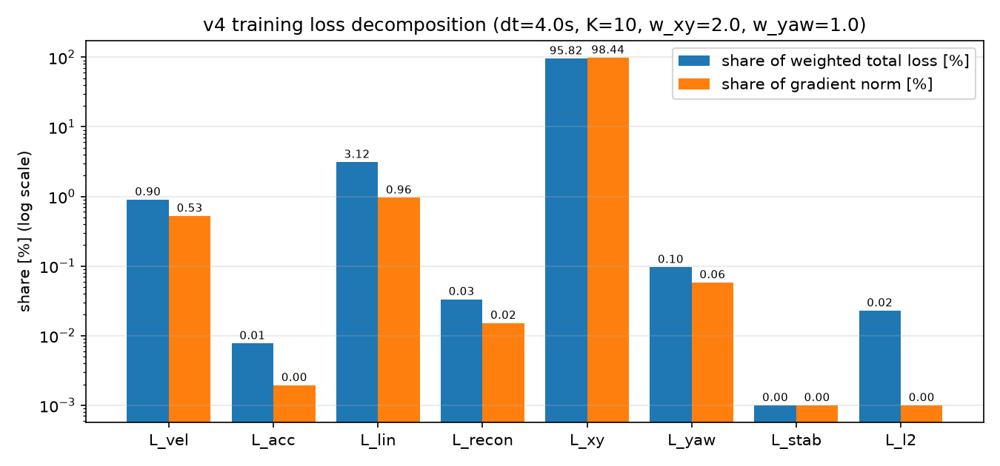
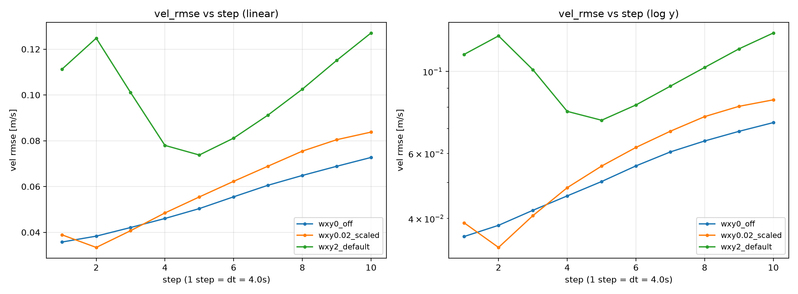
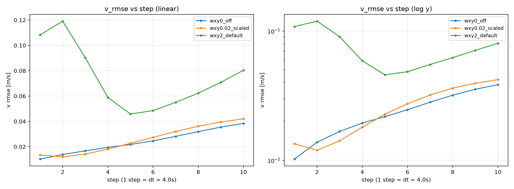

# v4 代价函数设计分析

v4 里存在**两个**代价函数，它们串在同一条链路上却各自独立设计：

| | 训练损失 $L(\theta)$ | MPC 目标 $J(\tilde U)$ |
|---|---|---|
| 位置 | `new_v4_dict_input/train_v4_dict_input.py:327-411`（`compute_losses`） | `cpp/koopman_control/src/latent_mpc_qp.cpp`（+ `pose_linearize.cpp`） |
| 决策变量 | encoder / decoder / $A$ / $B$ 权重 | 归一化控制序列 $\tilde U \in \mathbb{R}^{4N}$ |
| 口径 | 归一化速度残差 + 物理位姿残差 | 48 维潜变量残差 + 控制幅值/增量（Tier-2 再加物理位姿） |
| 决定什么 | 模型（预测精度、算子谱、潜空间几何） | 控制（跟踪性能、平滑性、控制权限利用率） |

本文分析两者的设计、量化各项的实际影响、指出设计与实现层面的不一致，并给出改进优先级。

**数值口径**：除消融实验外，所有数字由 `scripts/analyze_v4_cost.py` 在部署用 checkpoint
`checkpoints/v4_dt4s/run_v4_20260617_123100/koopman_v4_best.pth`（dt=4 s、K=10、240 epoch、$w_{xy}=2$）
与 `data/koopman_test.npz`（512 个窗口 / 64 个真实参考窗口）上实测，完整日志见
`logs/analyze_v4_cost.txt`。MPC 侧参数取 `cpp/koopman_control/config/mpc_config.yaml`
（$N=10$、$dt=4$ s、$w_z=1$、$w_u=10^{-4}$、$w_{du}=0.05$、`opt_control_steps=2`）。

---

## 0 结论速览

| # | 问题 | 实测证据 | 严重度 |
|---|------|----------|--------|
| 1 | **位姿项支配训练**：$w_{xy}=2$ 默认值下 $L_{xy}$ 占加权总损失 95.8%、占梯度范数 98.4%，$L_{vel}$ 只剩 0.53% | 消融（60 epoch，2 个种子）：关掉位姿项后 `vel_rmse_mean` 0.1006→0.0535 / 0.0907→0.0564（**−38%~−47%**），`traj_xy_rmse@10` 也从 4.92/4.90 m 降到 3.80/3.95 m（**−19%~−23%**）——位姿项连它自己的目标都没优化好 | 高 |
| 2 | **$L_{xy}$ 的目标不自洽**：把 GT 速度代入同一欧拉积分，位置 RMSE 已有 3.06 m（$L_{xy}=8.73$），而模型做到 2.32 m（$L_{xy}=4.88$） | 模型位置误差**低于**"完美速度 + 同积分器"的下界，只能靠速度偏差去抵消离散化误差；实测 $\bar e_v=-0.017$ m/s 与积分沿航向 +0.52 m 偏差同向相消 | 高 |
| 3 | **`u_prev` 从未接入**，而代价里又没有 $\|\tilde u_0 - \tilde u_{prev}\|^2$ 软项，首步平滑完全交给硬约束 | `motion_koopman_mpc.cpp` 不写 `u_prev/has_u_prev`、`simulate()` 传 `nullptr` ⇒ `u_prev` 为**物理零**，首步被夹在 ±15 %FS / ±3.5°；实测需要的油门均值 71.6 %FS（最大 100），代价 +54.2% | 高 |
| 4 | **Tier-1 参考滞后一步**：`buildRefLatentStack` 取 `ref_window[0..N−1]`，而 `predictStacked` 第 $k$ 块是 $z_{k+1}$；`buildRefPoseStack` 却取 `ref_window[1..N]` | 相当于速度参考整体滞后 $dt=4$ s；64 窗口实测代价劣化均值 +1.9%、最大 +8.1%，首步舵角差 p95 达 4.7° | 中 |
| 5 | **move-blocking 事后覆写**：QP 在全 horizon 自由求解，解完再把第 2..9 步覆写为第 1 步值 | 真正应用序列的 $J$ 比 QP 所最小化的目标高 **37.9%**（中位 23.3%），比正确 blocked 参数化的最优解差 **10.0%** | 中 |
| 6 | **$w_z$ 对 48 维潜变量等权**，跟踪代价的加权由 encoder 自身尺度隐式决定 | 91.8% 的跟踪误差能量落在 decoder 的**零空间**（对 $(u,v,r)$ 无一阶影响）；折算到物理量的隐含权重 $u:v:r \approx 1:8.8:74$，且存在强非对角耦合 | 中 |
| 7 | **选模判据与训练目标脱节**：best ckpt 只看 `vel_rmse_mean × max(1, instability)` | 训练目标里 95.9% 的份额（位姿项）完全不参与选模 | 中 |
| 8 | 口径/实现细节：$L_{vel}$ 反归一化是恒等往返；$L_{acc}$ 漏乘步权且被 $1/dt$ 压扁（仅 2.2% 落在 Huber 线性区）；$L_{stab}$ 罚形式在边界处梯度消失（$\rho=1.0055>\rho_{max}$ 但 $L_{stab}=2.5\times10^{-7}$）；$L_{l2}$ 与 AdamW `weight_decay` 对 $A/B$ 双重正则；`evalCost` 不含位姿项 | 见 §1.5、§2.6 | 低 |

---

## 1 训练损失

### 1.1 定义

rollout 全程在归一化空间：$z_0=\mathrm{enc}(\tilde x_0)$，$z_{k+1}=z_k+W_A z_k + b_A + W_B\tilde u_k$，
$\hat{\tilde x}_k=\mathrm{dec}(z_k)$。记步权 $w_k=\gamma^k/\overline{\gamma^k}$（$\gamma=0.97$），
通道缩放 $s=1/\sigma_{dyn}$，$\mathrm{hb}_\beta$ 为 $\delta=\beta=0.1$ 的 smooth-L1：

$$L=w_{vel}L_{vel}+w_{acc}L_{acc}+w_{lin}\,r\,L_{lin}+w_{recon}L_{recon}+w_{stab}\,r\,L_{stab}+w_{l2}L_{l2}+w_{xy}\,p\,L_{xy}+w_{yaw}\,p\,L_{yaw}$$

$r=\min(1,(e{+}1)/5)$、$p=\min(1,(e{+}1)/10)$ 为两条 ramp。

| 项 | 定义 | 默认权重 | 步权 | 说明 |
|---|---|---|---|---|
| $L_{vel}$ | $\mathrm{mean}\big(\mathrm{hb}_\beta((\hat x^{phys}-x^{phys})\odot s)\cdot w_k\big)$ | 1.0 | ✓ | 主速度项 |
| $L_{acc}$ | $\mathrm{mean}\big(\mathrm{hb}_\beta((\Delta\hat x^{phys}-\Delta x^{phys})/dt\odot s)\big)$ | 0.2 | ✗ | 相邻步差分 |
| $L_{lin}$ | $\mathrm{MSE}(z_k,\ \mathrm{enc}(\tilde x^{GT}_k))$ | 1.0 | ✗ | 潜空间线性一致性，ramp 5 |
| $L_{recon}$ | $\mathrm{MSE}(\mathrm{dec}(\mathrm{enc}(\tilde x_0)),\tilde x_0)$ | 0.5 | — | **只在 $t_0$ 一点** |
| $L_{xy}$ | $\mathrm{mean}\big((e_x^2+e_y^2)\cdot w_k\big)$，$e$ 由预测速度欧拉积分得位姿 | 2.0 | ✓ | 物理米，无 Huber，ramp 10 |
| $L_{yaw}$ | $\mathrm{mean}\big(\mathrm{hb}_\beta(\mathrm{wrap}(\hat\psi-\psi))\cdot w_k\big)$ | 1.0 | ✓ | ramp 10 |
| $L_{stab}$ | $\mathrm{relu}(\rho(I+W_A)-1.005)^2$ | 0.1 | — | ramp 5 |
| $L_{l2}$ | $\|W_A\|_F^2+\|W_B\|_F^2$ | $10^{-4}$ | — | 另有 AdamW wd $10^{-4}$ |

### 1.2 实测分解

512 个测试窗口、部署 ckpt、稳态权重（ramp 已满）下的分解。`grad%` 为各项**单独反传**时全模型参数梯度 L2 范数的占比，反映它对参数更新方向的实际支配力：

| 项 | 原始值 | 权重 | 加权值 | 占总损失 | 梯度范数 | 占梯度 |
|---|---|---|---|---|---|---|
| $L_{vel}$ | 0.0918 | 1.0 | 0.0918 | 0.90% | 2.70 | 0.53% |
| $L_{acc}$ | 0.00395 | 0.2 | 0.00079 | 0.01% | 0.0100 | 0.00% |
| $L_{lin}$ | 0.3177 | 1.0 | 0.3177 | 3.12% | 4.93 | 0.96% |
| $L_{recon}$ | 0.00679 | 0.5 | 0.00340 | 0.03% | 0.0783 | 0.02% |
| **$L_{xy}$** | **4.883** | **2.0** | **9.766** | **95.82%** | **506.2** | **98.44%** |
| $L_{yaw}$ | 0.00983 | 1.0 | 0.00983 | 0.10% | 0.299 | 0.06% |
| $L_{stab}$ | $2.5\times10^{-7}$ | 0.1 | $2.5\times10^{-8}$ | 0.00% | $5\times10^{-4}$ | 0.00% |
| $L_{l2}$ | 23.36 | $10^{-4}$ | 0.00234 | 0.02% | $10^{-3}$ | 0.00% |
| 合计 | | | 10.19 | 100% | | |



即：**名义上的"多项损失"实际是一个单目标——位姿误差**。$L_{vel}$ 的梯度贡献比 $L_{lin}$ 还小，其余各项（$L_{acc}$/$L_{recon}$/$L_{stab}$/$L_{l2}$）在数值上已接近惰性。

根因是量纲：$L_{xy}$ 用**物理米的平方**，$dt=4$ s、$K=10$ 时位置误差本身就是米级，平方后 $O(5)$；
而 $L_{vel}$ 是归一化残差的 smooth-L1，$O(0.1)$。两者相差约两个数量级，$w_{xy}=2$ 又把差距再放大。
`pose_ramp_epochs=10` 只延后了这个支配关系，并没有改变它。

### 1.3 消融：位姿项在默认权重下同时损害速度与位置

控制变量（60 epoch、种子 42、`dt=4.0`、固定 `pred_len=10`（无 curriculum）、`cosine` 调度、其余全默认），
只改 $w_{xy}/w_{yaw}$，在全 `koopman_test.npz` 上评估（`new_v4_dict_input/compare_runs_v4.py`）：

| 配置 | `vel_rmse_mean` | `vel_rmse@1` | `vel_rmse@10` | `u_rmse@10` | `v_rmse@10` | `traj_xy_rmse@10` [m] | `slope_loglog` |
|---|---|---|---|---|---|---|---|
| $w_{xy}=0,\ w_{yaw}=0$ | **0.0535** | **0.0357** | **0.0727** | **0.0617** | **0.0384** | **3.802** | 0.327 |
| $w_{xy}=0.02,\ w_{yaw}=1$ | 0.0588 | 0.0389 | 0.0838 | 0.0725 | 0.0421 | 4.358 | 0.409 |
| $w_{xy}=2,\ w_{yaw}=1$（默认） | 0.1006 | 0.1112 | 0.1271 | 0.0985 | 0.0803 | 4.916 | −0.030 |

默认权重相对关掉位姿项：速度 RMSE **+88%**，而位置 RMSE 也 **+29%**。
特别是首步速度误差从 0.036 恶化到 0.111（+211%）——位姿项是对 $K$ 步累积量的惩罚，
对"把每一步都算准"没有偏好，于是模型用早期步的偏差去凑末端位置。
`slope_loglog` 从 0.327 掉到 −0.03（误差几乎不随步增长）也印证了这一点：误差被前移到了第一步。



绿线（默认 $w_{xy}=2$）不仅整体更高，形状也异常——第 1–2 步最差、第 5 步附近回落再抬升，
正是"用早期偏差换末端位置"的指纹。横向速度通道的差距更大：



种子 43 复现（同设置，只有 seed 不同）：

| 配置 | `vel_rmse_mean` | `vel_rmse@1` | `u_rmse@10` | `v_rmse@10` | `traj_xy_rmse@10` [m] | `slope_loglog` |
|---|---|---|---|---|---|---|
| $w_{xy}=0,\ w_{yaw}=0$ | **0.0564** | **0.0362** | 0.0726 | **0.0401** | **3.947** | 0.372 |
| $w_{xy}=2,\ w_{yaw}=1$ | 0.0907 | 0.1141 | **0.0573** | 0.0759 | 4.896 | −0.164 |

两个种子上方向一致：速度 RMSE +61%~+88%、位置 RMSE +24%~+29%、首步速度误差 +211%~+215%。
种子 43 上可以看清这笔交易的内容：末步 $u$ 误差略有改善（0.073→0.057），代价是 $v$ 误差几乎翻倍
（0.040→0.076）与首步误差劣化——位姿项只关心 $x,y$ 的累积量，而 $x,y$ 主要由 $u$ 与航向决定，
于是横向速度 $v$ 被牺牲掉了。

> 样本量为 2 个种子 × 60 epoch、固定 `pred_len=10`；结论方向稳定，但绝对数值不代表
> 长训（240 epoch）+ curriculum 的收敛值。若要作为改权重的最终依据，建议在完整训练配置下复跑。

### 1.4 $L_{xy}$ 的目标不自洽

$L_{xy}$ 把预测速度经**船体系前向欧拉**积分再与 GT 位姿比。问题是：这个积分器本身在 $dt=4$ s 下有很大离散化误差，
所以哪怕速度预测完美，$L_{xy}$ 也降不到 0。把 GT 速度代入同一积分器测这个下界：

| | $L_{xy}$ | 位置 RMSE | 末步位置 RMSE | 沿航向有符号误差均值 |
|---|---|---|---|---|
| 模型预测速度 | 4.88 | 2.32 m | 4.43 m | +0.25 m |
| **GT 速度 + 同一积分器** | **8.73** | **3.06 m** | 4.78 m | +0.52 m |

模型的位置误差**比"完美速度"还小**。这不是模型比 GT 更准，而是它在拟合积分器的离散化误差——
用速度上的系统性偏差去换位置上的精度。实测速度有符号偏差 $\bar e_u=+0.002$ m/s、$\bar e_v=-0.017$ m/s、
$\bar e_r=+1.5\times10^{-4}$ rad/s，沿航向位置偏差同时从 GT 积分的 +0.52 m 降到 +0.25 m
（通道归因不是简单线性关系：$\bar e_r$ 在 40 s 内累积约 0.34° 航向偏差，会整体旋转 $x,y$）。

换句话说，**$w_{xy}$ 越大，速度模型越偏**，而部署时 MPC 用的恰恰是速度/潜空间模型，
Tier-2 位姿还走它自己的（逐步线性化的）积分链路。这解释了 §1.3 中"位置指标也一起变差"的现象：
训练时补偿掉的那部分偏差，在评估/部署的积分口径下并不成立。

如果要保留位姿监督，至少应让目标可达：用 GT 速度积分得到的位姿作为参考（消掉共同的离散化偏差），
或改用 RK2/中点法积分，或直接监督"位移增量"而非绝对位置。

### 1.5 单项细节

**$L_{vel}$：反归一化再乘 $1/\sigma$ 是恒等往返。** 代码先 `pred_phys = pred_norm*σ+μ`，
再乘 `chan_scale = 1/σ`，两步精确抵消——实测 $L_{vel}$ 与直接用归一化残差算出的值逐位相同（差 0）。
所以"物理速度 Huber + 通道缩放"实际就是"归一化残差 Huber"，隐含的物理加权是 $1/\sigma$：

| 通道 | $\sigma$ | 隐含权重 $1/\sigma$ | 相对 $u$ |
|---|---|---|---|
| $u$ | 1.531 m/s | 0.653 | 1× |
| $v$ | 0.2245 m/s | 4.453 | 6.8× |
| $r$ | 0.01497 rad/s | 66.8 | 102× |

即每 rad/s 的 $r$ 误差被算作每 m/s 的 $u$ 误差的 102 倍。这是数据统计量的副产物，不是控制需求的表达
（若按控制需求应显式给 Bryson 型权重 $1/x_{max}^2$）。

**Huber 的工作区按通道分裂。** $\beta=0.1$ 固定在归一化空间，实测 $|res|>\beta$ 的比例：
$u$ 仅 3.1%（几乎全在二次区）、$v$ 69.4%、$r$ 39.7%。即"鲁棒 L1"性质只对 $v/r$ 生效，
$u$ 实际是纯 MSE——同一个 $\beta$ 在三个通道上含义完全不同。

**$L_{acc}$ 已接近惰性。** 一是漏乘 $w_k$（$L_{vel}$ 乘了），口径与主项不一致；
二是残差被 $1/dt=0.25$ 压扁，$dt=4$ s 下只有 2.2% 落在线性区，加权后仅占总损失 0.01%。
它在 v1（$dt=0.1$ s、$w_{acc}=100$）时是主损失，迁到 $dt=4$ s 后权重与 $\beta$ 都没有随之调整。

**$L_{lin}$ 的目标未 detach，但塌缩风险未兑现。** $\mathrm{enc}(\tilde x^{GT}_k)$ 参与反向传播，
理论上 encoder 可以缩小 hidden 输出来同时降低预测与目标（平凡解）。实测这条路径只贡献 0.1% 的梯度量级
（detach 后梯度范数 4.924 vs 4.931），且 $L_{lin}$ 误差能量 87.4% 在 16 维字典原子上——
原子是 $(u,v,r)$ 的闭式函数、不可塌缩，客观上限制了平凡解。
但 hidden 的尺度确实明显偏小（逐维 std 均值 0.243，字典原子 1.169），这条路径值得加 `detach()` 消除隐患。

**$L_{recon}$ 只约束 $t_0$ 一点。** rollout 出来的 $z_k$（$k\ge1$）的可解码性完全靠 $L_{vel}$ 间接保证；
而 Tier-2 MPC 恰恰要对 $z_1..z_N$ 全程解码（还要用它的 Jacobian）。把 $L_{recon}$ 扩到整条轨迹与部署口径更一致。

**$L_{stab}$ 在边界处梯度消失。** 罚形式 $\mathrm{relu}(\rho-\rho_{max})^2$ 的梯度 $\propto 2(\rho-\rho_{max})$，
越接近阈值越弱。实测 $\rho(I+W_A)=1.005502 > \rho_{max}=1.005$，"违约"却只值 $L_{stab}=2.5\times10^{-7}$
（加权后 $2.5\times10^{-8}$，占总损失 $0$）。也就是说这个软约束在当前工作点上**等于没有**，
$\rho>1$ 意味着潜算子边缘不稳定（$N=10$ 步内放大 5.6% 尚可，长程 rollout 会漂）。
若真要约束，应改用带余量的线性罚 $\mathrm{relu}(\rho-\rho_{max})$ 或谱投影（每步把 $\rho$ 缩回阈值）。

**$L_{l2}$ 与 AdamW 重复。** $w_{l2}=10^{-4}$ 显式罚 $A/B$，而 AdamW 的 `weight_decay=1e-4` 已对全部参数
（含 $A/B$）解耦衰减，$A/B$ 被双重正则。$\|W_A\|^2+\|W_B\|^2=23.4$，加权后 0.0023，量级上无害，
但意图重复、调参时会互相干扰。

### 1.6 选模判据与训练目标脱节

best ckpt 用 `test/vel_rmse_mean × max(1, instability_score)`，完全不含位姿项。
于是训练在优化一个 96% 由位姿项构成的目标，而选模在挑速度最好的 epoch——两个目标在 §1.3 里已被证明是**冲突**的。
这种组合下，"选出来的 best"既不是训练目标的最优，也不是位姿目标的最优。

---

## 2 MPC QP 目标

### 2.1 定义

$$J=\underbrace{\sum_{k=1}^{N}w_z\|z_k-z_{ref,k}\|^2}_{\text{Tier-1 潜空间跟踪}}+\sum_{k=0}^{N-1}w_u\|\tilde u_k\|^2+\sum_{k=1}^{N-1}w_{du}\|\tilde u_k-\tilde u_{k-1}\|^2\;\Big[+\sum_{k}\big(w_{xy}(e_{x,k}^2+e_{y,k}^2)+w_{yaw}e_{\psi,k}^2\big)\Big]$$

代入 condensed 形式 $Z=\Gamma z_0+\Theta\tilde U+\xi$，得 $H=w_z\Theta^T\Theta+w_uI+w_{du}D^TD$、
$P=2H$、$q=2w_z\Theta^T(Z_{free}-Z_{ref})$（Tier-2 再叠 $2\Phi^TW\Phi$ 与 $2\Phi^TWb$）。
推导与实现细节见 [潜空间QP-MPC实现.md](潜空间QP-MPC实现.md)，此处只做设计评估。

### 2.2 $w_z$ 等权 48 维：加权其实是 encoder 权重的副产物

$Q=w_z I_{48N}$ 意味着 16 个字典原子和 32 个 hidden 维**同权**，而它们的尺度差异极大：

- 数据集上逐维方差：字典原子合计 32.5、hidden 合计 2.22 → 跟踪代价的"方差预算"93.6% : 6.4%；
- 逐维方差跨度 781×（0.010 ~ 7.83）→ 少数大尺度维度主导目标。

折算到物理量：在流形上 $\Delta z=\frac{\partial z}{\partial x}\Delta x$，$w_z\|\Delta z\|^2=\Delta x^\top G\Delta x$，
实测（512 个工作点平均）

$$G=\begin{bmatrix}20.7 & -0.71 & -91.8\\ -0.71 & 1616 & -4674\\ -91.8 & -4674 & 1.14\times10^5\end{bmatrix},\qquad \sqrt{\mathrm{diag}G}=(4.55,\ 40.2,\ 338)$$

即隐含通道权重 $u:v:r\approx1:8.8:74$，还带强非对角耦合（$|G_{vr}|=4674$，无法用对角权重等价表达）。
**这个加权没有任何设计者输入**，它是 encoder 训练完之后被动得到的；换一次训练、换一个 ckpt，
$w_z$ 不变而实际的通道权重就变了。

更关键的是**大部分代价花在物理不可见的方向上**：decoder Jacobian $J_p$ 是 $3\times48$（rank 3），
零空间 45 维。用 64 个真实窗口的跟踪误差 $e=Z_{free}-Z_{ref}$ 做正交分解：

- 落在 $J_p$ 行空间（一阶影响 $(u,v,r)$）：**8.25%**
- 落在零空间（对物理速度无一阶影响）：**91.75%**

原因是 $Z_{ref}$ 在 encoder 流形上，而 $Z$ 由线性算子传播必然离开流形，两者的差主要是"离流形"分量。
于是 $w_z\|e\|^2$ 里 9 成的力气用在压一个与物理速度无关的量上。
更合理的 Tier-1 目标是直接罚解码后的速度误差（$Q=J_p^\top W J_p$，或像 Tier-2 那样线性化 decoder），
或至少只罚 16 个字典原子维（它们与 $(u,v,r)$ 一一对应）。

### 2.3 Tier-1 参考滞后一个 $dt$

`predictStacked` 的第 $k$ 块（0-based）是 $z_{k+1}$，即 $t=(k{+}1)dt$；
而 `buildRefLatentStack` 填的是 `ref_window[k]`，即 $t=k\,dt$ —— 整条速度参考滞后一步。
同一文件里的 `buildRefPoseStack` 用的是 $k=1..N$（正确），两者口径不一致，这基本可以断定是 off-by-one 而非有意的延迟补偿。

64 个真实窗口（$u_{prev}$ 取该时刻实测控制）上，把"滞后参考解出的控制"放回**正确**参考下评估：

| 指标 | 值 |
|---|---|
| 首步油门差 \|Δu₀\| | 均值 1.60 %FS，p95 8.32 %FS |
| 首步舵角差 \|Δu₀\| | 均值 0.77°，p95 4.70° |
| 代价劣化 | 均值 +1.87%，中位 +0.65%，最大 +8.09% |

$dt=4$ s 下参考在一步内变化有限，所以平均劣化不大；但在机动段（p95）首步舵角差近 5°，
且这是**系统性**滞后，会在闭环里表现为持续的跟踪滞后。修复只需把索引改成 $k{+}1$（一行）。

### 2.4 move-blocking：事后覆写而非 blocked 参数化

QP 的决策变量始终是全 $4N=40$ 维，`opt_control_steps=2` / `control_hold_steps` 只在求解**之后**由
`expandToFull` 把第 $n_{opt}..N-1$ 步覆写成第 $n_{opt}-1$ 步的值。
（`docs/工程全景说明文档.md` 的"控制块（move blocking）的实际行为"一段已记录这个实现与文档描述的不一致，本节补上量化。）

后果：QP 在"未来 8 步可以自由变化"的假设下选前 2 步，而实际执行的是"后 8 步冻结"的序列。
64 个窗口均值：

| 量 | 值 | 含义 |
|---|---|---|
| $J(\tilde U^*)$ | 122.7 | QP 实际最小化的目标 |
| $J(\mathrm{expandToFull}(\tilde U^*))$ | 160.7 | **真正应用**的序列的代价（`evalCost` 上报值），+37.9% |
| $J$（blocked 参数化下的真最优） | 150.3 | 把 $\tilde U=M v$ 代入后解 $M^\top PM$ 的结果 |

也就是说：现方案比"正确做 move-blocking"差 **10.0%**（最大 31.7%），
而 QP 自以为的最优值又比实际低 24%——上报的 cost 与被优化的量不是一回事。
影响也不止于"计划质量"：改成 blocked 参数化后首步下发值最多变化 **20.3 %FS**（油门通道），
因为"未来能不能动"会改变当前该怎么动。
正确做法是把 blocking 作为参数化代入 QP（$P_b=M^\top PM,\ q_b=M^\top q,\ A_b=AM$），
决策变量降到 $2\times4=8$ 维，QP 更小更快，且解就是该参数化下的最优。

### 2.5 缺 $\Delta u_0$ 软项，且 $u_{prev}$ 从未接入

代价里的增量项只覆盖 $k=1..N-1$（horizon 内相邻步），**没有** $\|\tilde u_0-\tilde u_{prev}\|^2$。
于是"这一拍相对上一拍的跳变"完全由硬速率约束决定。实测 64 个窗口的首步速率饱和度
（$|\tilde u_0-\tilde u_{prev}|$ 与速率上限之比）：均值 0.78~0.92，有 66%~81% 的窗口**顶死上限**。
即首步永远贴着限幅走，代价对它没有任何整形能力。

更严重的是这个"上一拍"根本没接上：

- `cpp/motion_koopman_mpc.cpp` 组装 `MotionSolveInput` 时只写 `u/v/r` 与参考，**从不写** `u_prev` / `has_u_prev`；
- `motion_bridge.cpp` 于是传 `nullptr`；`simulate()`（闭环 demo / `validate_v4_dt4s.sh`）也传 `nullptr`；
- `solveStep` 里 `std::array<float,4> u_prev{}` 是**物理零**，不是"无约束"。

结果：每一拍的首步都被夹在 $[-15,+15]$ %FS 油门、$[-3.5,+3.5]$° 舵内。实测对比：

| | 首步油门均值 | 首步油门最大 | 首步舵角 \|max\| | 代价均值 |
|---|---|---|---|---|
| $u_{prev}=0$（现状） | 15.00 %FS | 15.00 | 3.50° | 189.3 |
| $u_{prev}=$ 实测控制 | 71.63 %FS | 100.00 | 34.95° | 122.7（−35%） |

油门被钉在 15 %FS，而任务需要的是 71.6 %FS 均值——**控制权限被削掉了 4/5**，
且这条路径同时影响实船桥接与所有闭环 demo 的结论。这是本次分析中最需要优先修的一条。

### 2.6 其它结构性观察

- **无终端代价 / 无折扣**：$Q=w_z I$ 对 $k=1..N$ 等权，末步不加权。训练侧反而有 $\gamma^k$ 折扣，两边的"时间偏好"相反。
  对 $\rho(I+W_A)=1.0055>1$ 的模型，终端代价（S-KMPC 的 Riccati→Lyapunov $\hat P$）本就是文档 P2-2 已规划的项。
- **`w_u` 的零点是数据集平均控制**，不是物理零输入：$\tilde u=0 \Leftrightarrow$ 油门 47.0 %FS、舵 0.045°。
  所以 $w_u$ 是"回归巡航工况"的正则而非"省能量"；$w_u=10^{-4}$ 下影响很小，但语义应写清楚。
- **`evalCost` 只累加 $z/u/du$ 三项**：Tier-2 开启时上报的 `cost` 不含位姿项，
  SQP 外迭代（默认 2 轮，无线搜索/信赖域）也就无法用它判敛或做回退。
- **Hessian 构造浪费**：`buildHessian` 显式构造 $(48\cdot10)^2=0.23$ M 元素的稠密 $Q=w_zI$ 再算 $\Theta^TQ\Theta$，
  等价于 $w_z(\Theta^T\Theta)$。当前只在首次 solve 时做一次，影响有限，但若将来做在线权重调整会成为热点。
- **常数项被丢弃**：$P/q$ 省略了 $w_z\|e\|^2$（不影响 argmin），因此 OSQP 的 `obj_val` 与 `evalCost` 不同口径，
  日志对比时容易误判。

---

## 3 改进建议

按"收益/改动量"排序。P0 是**先修错、再谈调参**的部分。

| 优先级 | 改动 | 位置 | 预期 |
|---|---|---|---|
| **P0-1** | 接入 `u_prev`：调用方缓存上一拍实际下发的 4 维控制并填 `in.u_prev`/`has_u_prev`，`simulate()` 传上一步控制；`u_prev` 缺失时应显式松弛速率约束（±inf）而不是静默落到物理零 | `cpp/motion_koopman_mpc.cpp:19-40`、`mpc_controller.cpp:119-122, 213` | 恢复被削掉 4/5 的控制权限，实测代价 −35% |
| **P0-2** | Tier-1 参考对齐：`buildRefLatentStack` 索引改 $k{+}1$，与 `buildRefPoseStack` 统一 | `mpc_controller.cpp:75-89` | 消除 4 s 系统性滞后（一行） |
| **P0-3** | 重新标定 $w_{xy}$（或先置 0），并把 $L_{xy}$ 改成量纲无关：除以 $(K\,dt\,\bar u)^2$ 之类的尺度，或按 §1.4 消掉积分偏差 | `train_v4_dict_input.py:373-383` + 默认值 | 消融显示速度 RMSE −38%~−47%、位置 RMSE −19%~−23% |
| **P0-4** | 选模判据与训练目标对齐：composite 里加入位姿分量（若保留位姿项），或位姿项只做诊断不进 loss | `train_v4_dict_input.py:1029` | 消除"训练/选模互相拆台" |
| **P1-1** | move-blocking 改参数化：$P_b=M^\top PM$、$q_b=M^\top q$、$A_b=AM$，决策变量 40→8 | `latent_mpc_qp.cpp:120-190` | 同口径最优，代价 −10%，QP 更小 |
| **P1-2** | 代价加 $w_{du0}\|\tilde u_0-\tilde u_{prev}\|^2$ 软项，让首步平滑可整形而非只靠限幅 | `latent_mpc_qp.cpp` | 抑抖不再依赖硬约束顶死 |
| **P1-3** | Tier-1 目标换成物理口径：$Q=J_p^\top W J_p$（decoder 线性化，Tier-2 已有全部零件），或只罚 16 维字典分量；$W$ 用 Bryson 法则显式给 | `latent_mpc_qp.cpp:120-144` | 让 91.75% 的"零空间代价"变成有意义的速度跟踪 |
| **P1-4** | `evalCost` 补位姿项；SQP 用它做单调性检查 + 回退 | `latent_mpc_qp.cpp:192-213`、`mpc_controller.cpp:134-146` | 上报值可信、SQP 可判敛 |
| **P2-1** | $L_{acc}$ 补步权、$\beta$ 按通道分别设（或改成相对残差）、$L_{recon}$ 扩到整条 rollout、$L_{lin}$ 目标 `detach()` | `train_v4_dict_input.py:327-411` | 消除口径不一致与塌缩隐患 |
| **P2-2** | $L_{stab}$ 换线性罚或谱投影并留余量（$\rho_{max}=0.999$）；$L_{l2}$ 与 AdamW `weight_decay` 二选一 | 同上 | 让稳定性约束真正起作用 |
| **P2-3** | 终端代价 $V_f=z_N^\top\hat P z_N$（S-KMPC）；训练与 MPC 的时间折扣口径统一 | `latent_mpc_qp.cpp` | 长程稳定性保证（已在 P2 路线图） |

---

## 4 复现

```bash
# 代价函数量化分析（训练损失分解 + QP 目标诊断）
python3 scripts/analyze_v4_cost.py \
  --ckpt checkpoints/v4_dt4s/run_v4_20260617_123100/koopman_v4_best.pth \
  --data data/koopman_test.npz \
  --out logs/analyze_v4_cost.txt --fig logs/v4_loss_shares.png

# 位姿权重消融（60 epoch × 3 配置，CPU 约 20 min）
COMMON="--dt 4.0 --pred_len_start 10 --pred_len_max 10 --epochs 60 --batch_size 512 \
        --grad_accum_steps 1 --scheduler cosine --seed 42 --no-final-eval"
python3 new_v4_dict_input/train_v4_dict_input.py $COMMON --w_xy 0.0 --w_yaw 0.0 --ckpt_dir /tmp/abl/pose_off
python3 new_v4_dict_input/train_v4_dict_input.py $COMMON --w_xy 2.0 --w_yaw 1.0 --ckpt_dir /tmp/abl/pose_default
python3 new_v4_dict_input/compare_runs_v4.py --pred_len 10 --dt 4.0 \
  --models <off>/koopman_v4_best.pth:wxy0 <default>/koopman_v4_best.pth:wxy2 \
  --out_dir logs/abl_pose_compare
```

`scripts/analyze_v4_cost.py` 依赖 `osqp`（Python 侧镜像 C++ QP 组装，用于对照实验）：`pip install osqp`。
