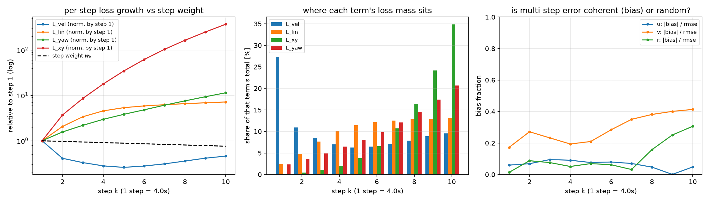

# v4 多步训练代价函数分析

本文是 [v4代价函数设计分析.md](v4代价函数设计分析.md) 在**多步（multi-step）维度**上的深入展开：
同样的损失表达式，在 $K$ 步开环 rollout 上展开后，损失质量、梯度归属、量级随 $K$ 的漂移都会呈现
出与"单步视角"完全不同的图景。这些性质直接决定了模型在 40 s 预测时域上的行为，也解释了
[v4代价函数设计分析.md](v4代价函数设计分析.md) §1.3 消融里"位姿项让首步误差劣化 3 倍"的现象。

**数值口径**：部署用 checkpoint `checkpoints/v4_dt4s/run_v4_20260617_123100/koopman_v4_best.pth`
（$dt=4$ s、$K=10$、240 epoch、$w_{xy}=2$、$\gamma_{step}=0.97$），`data/koopman_test.npz`
512 个窗口（ZOH 一节用 3000 个窗口）。复现：`python3 scripts/analyze_v4_multistep_cost.py`，
完整输出 `logs/analyze_v4_multistep.txt`。

---

## 0 结论速览

| # | 现象 | 数值 |
|---|------|------|
| 1 | **损失质量高度集中在末段**，且各项集中度差异极大 | 末 3 步份额：$L_{xy}$ 75.4%（末步单独 34.8%）、$L_{yaw}$ 52.7%、$L_{lin}$ 38.9%、$L_{vel}$ 26.3% |
| 2 | **$\gamma_{step}$ 不是有效旋钮**：步权在 $K=10$ 上首末只差 1.32×，被误差增长（$L_{xy}$ 增长 370×）完全淹没 | $\gamma$ 从 0.80 调到 1.05，$L_{vel}$ 末段份额只从 9.5% 变到 36.3%，$L_{xy}$ 始终 61%~80% |
| 3 | **curriculum 扩窗在偷偷放大位姿权重**：$L_{vel}$ 对 $K$ 近似不变，$L_{xy}$ 随 $K$ 近似二次增长 | 位姿项占比 $K{=}1$ 时 26.9% → $K{=}5$ 时 80.7% → $K{=}10$ 时 95.9%（$L_{xy}$ 放大 92.6×） |
| 4 | **梯度方向几乎只由位姿项决定**，而 grad-clip 把幅值压到 1.0，其它项无法"靠幅值补回来" | $\cos(\nabla L,\nabla L_{xy})=0.9999$、$\cos(\nabla L,\nabla L_{vel})=0.175$、$\cos(\nabla L,\nabla L_{yaw})=\mathbf{-0.149}$（反向！）；裁剪前 $\|\nabla L\|=508$ |
| 5 | **误差的逐步形状被扭曲成 U 型**：首步误差最大、第 5 步最小、之后回升 | $L_{vel}$ 逐步 0.220 → 0.057（k=5）→ 0.101；$v$ 通道 rmse 0.126 → 0.041 → 0.067；log-log 斜率 −0.118 |
| 6 | **末段误差越来越"相干"**（偏差主导而非随机），而 v4 已删掉 $L_{bias}/L_{slope}$，没有任何一项约束它 | $|bias|/rmse$：$v$ 0.17→0.41、$r$ 0.01→0.31 |
| 7 | **多步监督的输入口径有系统性失配**：4 s 步长内的指令变化被当作 ZOH（只取块首） | 45.2% 的窗口块内指令非恒定（油门均值偏 2.1 %FS、舵 2.3°）；高机动组里非恒定窗口误差是恒定窗口的 1.87×，控制机动强度后偏相关仍 +0.283 |
| 8 | 结构上合理的部分：全开环 rollout（无 teacher forcing）、训练 $K$ 与 MPC $N$ 一致、$\Bar A^K$ 增益适中不致梯度消失/爆炸 | $\|\bar A^{10}\|_2=7.76$、$\rho^{10}=1.056$ |



---

## 1 多步 rollout 与损失的展开形式

训练 rollout 是**纯开环**（`train_v4_dict_input.py:298-324`）：只在 $t_0$ 编码一次，之后 $K$ 步全部
用模型自身输出推进，与部署侧 condensed rollout（$Z=\Gamma z_0+\Theta\tilde U+\xi$）口径一致：

$$z_0=\mathrm{enc}(\tilde x_0),\qquad z_{k}=z_{k-1}+W_Az_{k-1}+b_A+W_B\tilde u_{k-1},\qquad \hat{\tilde x}_k=\mathrm{dec}(z_k)$$

于是损失的每一项都是"逐步项 × 步权"的和。把 $K$ 步展开后写成逐步形式（$w_k=\gamma^k/\overline{\gamma^k}$）：

$$L_{vel}=\frac{1}{K}\sum_{k=1}^{K}w_k\,\ell^{vel}_k,\quad L_{xy}=\frac{1}{K}\sum_{k=1}^{K}w_k\,\ell^{xy}_k,\quad L_{lin}=\frac{1}{K}\sum_{k=1}^{K}\ell^{lin}_k,\quad L_{acc}=\frac{1}{K-1}\sum_{k=1}^{K-1}\ell^{acc}_k$$

注意三处不对称，它们在多步下会放大：

- $L_{vel}$/$L_{xy}$/$L_{yaw}$ 乘了 $w_k$，$L_{lin}$/$L_{acc}$ **没乘**；
- $L_{acc}$ 是 $dt=4$ s 的一阶差分——在 4 s 尺度上它已不是"加速度"，而是"相邻两步速度差"；
- $L_{recon}$ 只作用在 $t_0$，$k\ge1$ 的 $z_k$ 的可解码性完全靠 $L_{vel}$ 间接保证，
  而 Tier-2 MPC 恰恰要对 $z_1..z_N$ 全程解码并取 Jacobian。

---

## 2 损失质量在预测步上的分布

### 2.1 步权几乎是平的，真正的分布由误差增长决定

| step $k$ | 1 | 2 | 3 | 4 | 5 | 6 | 7 | 8 | 9 | 10 |
|---|---|---|---|---|---|---|---|---|---|---|
| $w_k$ | 1.143 | 1.108 | 1.075 | 1.043 | 1.011 | 0.981 | 0.952 | 0.923 | 0.895 | 0.869 |
| $\ell^{vel}_k$ | 0.2199 | 0.0904 | 0.0726 | 0.0616 | **0.0571** | 0.0611 | 0.0682 | 0.0786 | 0.0910 | 0.1011 |
| $\ell^{lin}_k$ | 0.0646 | 0.1338 | 0.2194 | 0.2954 | 0.3470 | 0.3794 | 0.4037 | 0.4258 | 0.4445 | 0.4636 |
| $\ell^{yaw}_k$ | 0.0020 | 0.0032 | 0.0045 | 0.0061 | 0.0078 | 0.0098 | 0.0125 | 0.0155 | 0.0191 | 0.0234 |
| $\ell^{xy}_k$ | 0.053 | 0.195 | 0.454 | 0.945 | 1.821 | 3.264 | 5.480 | 8.673 | 13.185 | **19.577** |

$\gamma_{step}=0.97$ 在 $K=10$ 上只造成 1.32× 的首末差异，而 $\ell^{xy}$ 从首步到末步涨了 **370×**。
加权后每步占该项总量的份额：

| 项 | 前 3 步 | 后 3 步 | 末步单独 |
|---|---|---|---|
| $L_{vel}$ | 46.8% | 26.3% | 9.6% |
| $L_{lin}$ | 14.9% | 38.9% | 13.1% |
| $L_{yaw}$ | 10.9% | 52.7% | 20.7% |
| $L_{xy}$ | **1.6%** | **75.4%** | **34.8%** |

$L_{vel}$ 前 3 步占比高是**异常**而非设计意图——它来自首步误差本身畸高（见 §3）。

### 2.2 $\gamma_{step}$ 不是控制多步权衡的有效旋钮

同一 batch 只换步权：

| $\gamma$ | $L_{vel}$ 末 3 步 % | $L_{xy}$ 末 3 步 % | $L_{vel}$ 首步 % | $L_{xy}$ 首步 % |
|---|---|---|---|---|
| 0.80 | 9.5 | 61.1 | 46.1 | 0.5 |
| 0.90 | 18.4 | 70.4 | 34.9 | 0.2 |
| **0.97**（默认） | 26.3 | 75.4 | 27.4 | 0.1 |
| 1.00 | 30.0 | 77.2 | 24.4 | 0.1 |
| 1.05 | 36.3 | 79.9 | 19.9 | 0.1 |

即使把 $\gamma$ 推到 0.80（强烈偏向早期），$L_{xy}$ 的末 3 步份额仍有 61%，首步份额仍只有 0.5%。
**几何级数的步权压不过多项式级数的误差增长**。要控制"早期精度 vs 末端精度"的权衡，得改误差的量纲
（§5）或直接按步给显式权重表，而不是调 $\gamma$。

---

## 3 多步误差的形状：被扭曲成 U 型，且末段越来越"相干"

逐步 RMSE（物理量）：

| 通道 | k=1 | k=2 | k=5 | k=8 | k=10 |
|---|---|---|---|---|---|
| $u$ [m/s] | 0.0440 | 0.0500 | 0.0551 | 0.0644 | 0.0673 |
| $v$ [m/s] | **0.1262** | 0.0697 | 0.0410 | 0.0551 | 0.0669 |
| $r$ [rad/s] | **0.00488** | 0.00190 | 0.00240 | 0.00283 | 0.00338 |

一个正常的多步预测器，误差应当随步单调增长（log-log 斜率在 0.5~1 之间）。这里 $v$/$r$ 的**首步误差
反而是全程最大**（$v$ 首步 0.126，是第 5 步 0.041 的 3.1×），总 RMSE 的 log-log 斜率是 **−0.118**。

这正是位姿项的指纹：$L_{xy}$ 只关心 $K$ 步累积的位置，对"每一步都准"没有偏好，于是模型可以在早期
放一个偏差、后面再修回来，只要位置积分对得上。§0 表格里"消融后首步速度误差从 0.111 降到 0.036"
和这里的 U 型剖面是同一件事的两个侧面。

**误差的相干性随步上升**（$|\mathrm{mean}(e)|/\mathrm{rmse}(e)$，越接近 1 越是同向偏差）：

| 通道 | k=1 | k=3 | k=6 | k=8 | k=10 |
|---|---|---|---|---|---|
| $u$ | 0.060 | 0.095 | 0.079 | 0.047 | 0.048 |
| $v$ | 0.172 | 0.233 | 0.284 | 0.381 | **0.413** |
| $r$ | 0.014 | 0.076 | 0.062 | 0.158 | **0.306** |

$v$ 的偏差占比翻了 2.4 倍，$r$ 翻了 20 倍。相干误差是长程漂移的直接来源（也是 v1→v2 重写的
历史动因），但 v4 的损失里**没有任何一项约束它**：v3a 时代的 $L_{bias}$（逐步 batch 均值误差平方，
$\gamma_{bias}=1.05$ 强调晚期步）与 $L_{slope}$（log-log 斜率上限罚）在 v4 中被移除，
而位姿项恰恰在**鼓励**用偏差换累积量。

---

## 4 梯度的多步归属

### 4.1 控制侧：梯度集中在早期步

$\|\partial L/\partial \tilde u_k\|$（同一 batch）：

| step $k$ | 1 | 2 | 3 | 5 | 8 | 10 |
|---|---|---|---|---|---|---|
| 范数 | 1.308 | 0.850 | 0.730 | 0.483 | 0.177 | 0.050 |
| 占比 | 26.5% | 17.2% | 14.8% | 9.8% | 3.6% | 1.0% |

首/末步相差 26×，这是结构性的：$\tilde u_0$ 通过 $\bar A^{K-1}B$ 影响后面所有步，$\tilde u_{K-1}$ 只影响末步。
含义是：**多步损失对"早期控制的辨识"信息量最大，对末段控制几乎不提供辨识信号**——若将来要用同一
损失去学"控制到状态"的增益（$B$ 矩阵的末段行为），需要意识到这个不对称。

### 4.2 参数侧：末段损失支配参数更新

只保留第 $k$ 步的损失（含步权与项权重）反传，全模型参数梯度范数：

| step $k$ | 1 | 2 | 5 | 8 | 10 | 末 3 步占比 |
|---|---|---|---|---|---|---|
| $L_{vel}$ | 0.299 | 0.215 | 0.310 | 0.395 | 0.423 | 37.7% |
| $L_{lin}$ | 0.055 | 0.159 | 0.582 | 0.766 | 0.821 | 44.7% |
| $L_{xy}$ | 0.318 | 1.260 | 15.64 | 83.84 | **196.3** | **79.0%** |

$L_{xy}$ 在末步的梯度范数是首步的 617×，也是同一步 $L_{vel}$ 梯度的 464×。

### 4.3 与 grad-clip 的相互作用（关键）

训练里有 `clip_grad_norm_(params, 1.0)`（`train_v4_dict_input.py:989`），而实测完整损失的梯度范数是
**507.8** → 裁剪系数 $1.97\times10^{-3}$。裁剪只改幅值不改方向，所以"方向由谁决定"才是关键：

| 项 | $\cos(\nabla L,\ \nabla(\text{项}))$ |
|---|---|
| $L_{xy}$ | **+0.9999** |
| $L_{lin}$ | +0.250 |
| $L_{vel}$ | +0.175 |
| $L_{acc}$ | +0.084 |
| $L_{yaw}$ | **−0.149** |

两点结论：

1. 更新方向与位姿项的梯度方向几乎完全重合（余弦 0.9999），其余各项只能做微小修正——
   这比"占加权损失 95.8%"更强的说法：**它们不是被投票压倒，而是被裁剪抹掉**
   （裁剪把总范数压到 1.0，各项的绝对贡献同比缩小，相对方向不变）。
2. $L_{yaw}$ 的梯度与总梯度**反向**（−0.149）。也就是说在当前工作点上，
   降低 $L_{xy}$ 与降低 $L_{yaw}$ 是互相冲突的，而 $L_{yaw}$ 因为量级小（0.0098 vs 4.88）永远输。
   位姿项内部这一对（位置 vs 航向）本身就没有标定过相对权重。

---

## 5 curriculum 扩窗时的量级漂移

`pred_len` 从 `pred_len_start` 长到 `pred_len_max`（dt4s 配置：5 → 10 步）。把同一 batch 的损失按
$K'=1..10$ 截断（步权按 $K'$ 重新归一化），即可复现各阶段的量级：

| $K$ | $L_{vel}$ | $L_{acc}$ | $L_{lin}$ | $L_{xy}$ | $L_{yaw}$ | 加权总 | **位姿占比** |
|---|---|---|---|---|---|---|---|
| 1 | 0.2199 | 0 | 0.0646 | 0.053 | 0.0020 | 0.392 | **26.9%** |
| 2 | 0.1561 | 0.0168 | 0.0992 | 0.123 | 0.0026 | 0.507 | 49.0% |
| 3 | 0.1291 | 0.0100 | 0.1393 | 0.230 | 0.0032 | 0.734 | 63.1% |
| 5 | 0.1025 | 0.0061 | 0.2121 | 0.668 | 0.0046 | 1.656 | **80.9%** |
| 8 | 0.0909 | 0.0044 | 0.2836 | 2.431 | 0.0074 | 5.244 | 92.8% |
| 10 | 0.0918 | 0.0040 | 0.3177 | 4.883 | 0.0098 | 10.186 | **96.0%** |

$K{=}1\to10$：$L_{vel}$ ×0.4（步权的 `/mean` 归一化让它对 $K$ 基本不敏感）、$L_{lin}$ ×4.9、
**$L_{xy}$ ×92.6**。也就是说 **curriculum 每扩一次窗，都在无声地提高位姿项的有效权重**；
dt4s 配置从 5 步长到 10 步，位姿占比 80.9% → 96.0%。这与 `pose_ramp_epochs=10` 的显式 ramp 叠加：
ramp 在第 10 epoch 就结束（此时 `pred_len=9`），而 curriculum 到第 15 epoch 才扩到 10 步
（`pred_len_start=5`、`pred_len_step=2`、`pred_len_grow_every=5`），也就是 ramp 结束之后位姿项
的有效权重还在继续往上走。

**把位姿误差按行进距离无量纲化就能消掉这个 $K$ 依赖**。定义
$L^{rel}_{xy}=\mathrm{mean}_k\big[w_k\,(e_x^2+e_y^2)/(k\,dt\,\bar u)^2\big]$（$\bar u=2.251$ m/s 为平均纵向速度）：

| $K$ | $L_{xy}$（现状） | $L^{rel}_{xy}$ | 现状位姿占比 | 无量纲化后占比 |
|---|---|---|---|---|
| 1 | 0.053 | 0.00065 | 26.9% | 0.45% |
| 2 | 0.123 | 0.00063 | 48.5% | 0.48% |
| 5 | 0.668 | 0.00070 | 80.7% | 0.43% |
| 10 | 4.883 | 0.00116 | 95.9% | 0.55% |

$L^{rel}_{xy}$ 只涨 1.8×（相对误差本身确实随步略增），占比稳定在 0.4%~0.6%——权重重新变成一个
**可标定的量**（当然要重新选量级）。作为参考，若要位姿项与速度项在 $K=10$ 上等份额，需要
$w_{xy}\approx 0.019$，比当前默认 2.0 小 **106×**（这也正好解释了为什么
[v4代价函数设计分析.md](v4代价函数设计分析.md) §1.3 里 $w_{xy}=0.02$ 的那组消融表现明显更接近关掉位姿项的一组）。

---

## 6 多步监督的输入一致性：4 s 内的指令变化被当作 ZOH

Dataset 取控制的方式（`train_v4_dict_input.py:213`）是
`u_seq = ctrls_full[t0 : t0+K*ms : ms]`，即每 `ms=40` 个 0.1 s 采样只取**块首**一个值，
并把它当作整个 4 s 步的输入。但真实指令在块内是会变的，这给多步监督带来一个系统性失配。

3000 个窗口的统计：

| 量 | 值 |
|---|---|
| 块内指令完全恒定的窗口占比 | 54.8%（采集时指令是分段保持的） |
| 非恒定窗口的块内偏离（相对块首） | 油门 均值 2.07 %FS（p90 4.20）、舵 均值 2.33°（p90 4.60） |
| 归一化偏离（通道最大 / $\sigma_{ctrl}$） | 均值 0.058、p90 0.214、最大 0.340 |

与多步误差的关系（按块内偏离分组，误差为窗口内 $K$ 步的归一化 RMSE）：

| 分组 | 块内偏离 [$\sigma$] | 窗口数 | 归一化 RMSE | 物理 vel RMSE |
|---|---|---|---|---|
| 常值块 | 0.000 | 1644 | 0.1663 | 0.0404 |
| 偏离小 | 0.039 | 432 | 0.1641 | 0.0413 |
| 偏离中 | 0.107 | 446 | 0.2315 | 0.0584 |
| 偏离大 | 0.229 | 478 | 0.2203 | 0.0535 |

Pearson $r=+0.324$、Spearman $\rho=+0.292$。这里有个明显的混淆：**指令变化多的窗口往往也是机动
更剧烈的窗口**，后者本身就更难预测。用"窗口内 GT 归一化速度的 std"作机动强度代理做分层：

| 机动强度分位 | 常值块 RMSE | 非常值 RMSE | 比值 | 窗口数（常/非） |
|---|---|---|---|---|
| Q1（最平稳） | 0.1807 | 0.1609 | 0.89 | 556 / 194 |
| Q2 | 0.1742 | 0.1789 | 1.03 | 431 / 319 |
| Q3 | 0.1607 | 0.1975 | 1.23 | 344 / 406 |
| Q4（最剧烈） | 0.1361 | 0.2540 | **1.87** | 313 / 437 |

控制机动强度后的偏相关 $r(\text{dev},\text{rmse}\mid\text{intensity})=+0.283$。
结论要谨慎但方向清楚：ZOH 失配的影响**集中在高机动段**（Q4 里非恒定窗口误差是恒定窗口的 1.87×，
而 Q1 里没有差别），这与物理直觉一致——指令在块内变化，只有在动态活跃时才明显改变 4 s 后的状态。
这部分误差属于建模口径带来的下界，**再怎么优化损失也消不掉**。

可选改法（按侵入性排序）：块内控制取**均值**而非块首（ZOH 的最小二乘最优近似）；
按块内偏离给样本降权；或用 `--ctrl_noise_std`（建议 0.003~0.005，与实测偏离 0.058σ 同量级）
把这部分失配显式建模成输入噪声。

---

## 7 多步传播与 rollout 设置

| 项 | 实测 / 现状 | 评价 |
|---|---|---|
| $\rho(\bar A)$ | 1.005502 | 边缘不稳定，但 $\rho^{10}=1.056$，40 s 内可接受；$L_{stab}$ 在此处梯度已消失（见设计分析 §1.5） |
| $\|\bar A^{k}\|_2$ | $k=1$: 1.89、$k=5$: 5.12、$k=10$: 7.76 | $\partial z_K/\partial z_0$ 增益适中，多步反传既不消失也不爆炸——末步损失能完整传回首步（这也是 §4.2 里末段支配的机制） |
| teacher forcing | 无，全开环 $K$ 步 | 与部署 condensed rollout 口径一致（好） |
| 训练 $K$ vs MPC $N$ | $K=10$（40 s） vs $N=10$（40 s） | 一致（好）；损失不约束 40 s 以外的行为，与部署需求匹配 |
| 噪声注入 | 部署 ckpt `noise_std=0`、`ctrl_noise_std=0` | 多步训练里**没有**任何抗累积误差正则；文档《数据增强技术方案》建议实船 0.02~0.03 / 0.003~0.005 |
| scheduled sampling / 逐步状态噪声 | 无 | 模型只见过"从真实 $t_0$ 出发"的轨迹，闭环状态分布偏移无监督 |
| 多步一致性约束 | 无（无前向-后向一致性、无潜能量上限） | 文档 P2-8 已规划 ConsKAE |

---

## 8 针对多步的改进清单

在 [v4代价函数设计分析.md](v4代价函数设计分析.md) §3 的基础上，补充"多步专属"的几条：

| 优先级 | 改动 | 依据 |
|---|---|---|
| **M0-1** | 位姿误差按行进距离无量纲化（或按 $k^2$ 归一），再重新标定 $w_{xy}$ | §5：消掉 92.6× 的 $K$ 依赖，让 curriculum 不再偷改权重 |
| **M0-2** | 位姿项与 curriculum 解耦：ramp 跟 `pred_len` 走而不是只跟 epoch 走；或达到 `pred_len_max` 后再开位姿项 | §5：ramp 第 10 epoch 结束，curriculum 到第 15 epoch 才扩满，之后权重仍在上升 |
| **M1-1** | 恢复对"相干偏差"的显式约束（v3a 的 $L_{bias}$ 或 slope 罚），或在选模 composite 里计入 `slope_loglog` | §3：$v$/$r$ 的偏差占比随步翻 2.4×/20×，无一项约束 |
| **M1-2** | 逐步误差按"步内可达精度"归一（如除以该步 GT 变化幅度），让首步不被末段淹没；同时监控逐步剖面是否单调 | §3：当前剖面是 U 型，首步误差是第 5 步的 3.1× |
| **M1-3** | $L_{acc}$ 补步权，或在 $dt=4$ s 下直接去掉（它已不是加速度） | §1、设计分析 §1.5：占总损失 0.01%、仅 2.2% 落在 Huber 线性区 |
| **M1-4** | $L_{recon}$ 扩到 $z_1..z_K$ 全程 | §1：Tier-2 MPC 需要全程解码与 Jacobian |
| **M2-1** | 块内控制取均值（而非块首），或按块内偏离给样本降权 | §6：高机动段 1.87× 误差比、偏相关 +0.283 |
| **M2-2** | 打开噪声注入（`noise_std` 0.02~0.03、`ctrl_noise_std` 0.003~0.005），或加 scheduled sampling | §7：当前多步训练无任何抗累积误差正则 |
| **M2-3** | 若保留位姿项，位置与航向的相对权重需要标定（当前二者梯度方向冲突） | §4.3：$\cos(\nabla L,\nabla L_{yaw})=-0.149$ |

---

## 9 复现

```bash
python3 scripts/analyze_v4_multistep_cost.py \
  --ckpt checkpoints/v4_dt4s/run_v4_20260617_123100/koopman_v4_best.pth \
  --data data/koopman_test.npz \
  --out logs/analyze_v4_multistep.txt --fig logs/v4_multistep_profile.png
```

输出分 A~F 六节，分别对应本文 §2（A）、§3（B）、§4（C）、§5（D）、§6（E）、§7（F）。
