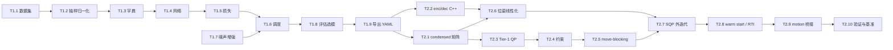
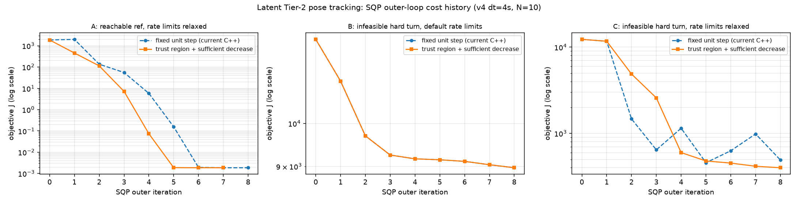

# v4 训练模型与 MPC 算法：任务拆解、SQP 方案推导与选型理由

> 配套代码：`koopman/mpc/sqp_latent.py`（SQP 参考实现）、`tests/test_sqp_latent_reference.py`（推导校验）、
> `cpp/koopman_control/tools/benchmark_latent_sqp.cpp`（耗时基准）。
> 前置阅读：[潜空间QP-MPC实现.md](潜空间QP-MPC实现.md)（QP 组装与 C++ 模块）、
> [训练流程指南.md](训练流程指南.md)（训练参数）、[工程全景说明文档.md](工程全景说明文档.md)（工程演进）。

## 0. 本文定位

已有文档回答了「代码怎么写的」。本文回答另外三个问题：

1. **任务拆解**：v4 训练模型与其配套 MPC，可以切成哪些**可独立验证的最小任务**，彼此依赖关系如何（§2）；
2. **SQP 推导**：Tier-2 位姿跟踪那一层，为什么必须是序列二次规划（SQP），完整推导到可实现的算法（§3–§4）；
3. **选型理由**：每一步为什么这么选，替代方案为什么被排除，并给出**实测数字**支撑（§5–§7）。

本文所有结论都可复现，命令见 §7.4。文中出现的所有数值均来自本仓库
checkpoint `checkpoints/v4_dt4s/run_v4_20260617_123100/koopman_v4_best.pth`（dt=4 s、10 步、
`best_metric=0.0747`）与配置 `cpp/koopman_control/config/mpc_config.yaml`（N=10、dt=4 s）。

### 符号约定

| 符号 | 含义 | 代码 / 值 |
|------|------|-----------|
| $x=(u,v,r)$ | 船体系速度（纵向 / 横向 / 转艏率） | 数据集 `Vel`、`pqr[0]` |
| $p=(x_p,y_p,\psi)$ | 位姿（随体参考系，见 §2.3 T2.9） | 数据集 `Pos`、`Euler[2]` |
| $\tilde{\cdot}$ | 归一化量，$\tilde x=(x-\mu)/\sigma$ | `normalization` 段 |
| $\varphi_{16}(\tilde x)$ | 16 阶物理字典原子（含 clamp） | `FEATURE_DICT_ATOMS_16` |
| $z\in\mathbb R^{48}$ | 潜变量 $[\varphi_{16};h_{32}]$ | `latent_dim=48` |
| $\bar A,B,\beta$ | 潜空间仿射动力学 | `koopman.{A_bar,B,bias}` |
| $N,\ \Delta t$ | 预测步数 / 步长 | 10 / 4.0 s |
| $n_u,\ n_{\rm var}$ | 控制维 / 决策变量维 | 4 / $N n_u=40$ |
| $U=[\tilde u_0;\dots;\tilde u_{N-1}]$ | 堆叠归一化控制序列 | QP 决策变量 |
| $\Gamma,\Theta,\xi$ | condensed 预测矩阵 | `precomputePredictionMatrices` |
| $\Phi,b$ | 位姿残差的一阶模型 $g(U)\approx\Phi U+b$ | `buildPoseLinearization` |
| $F(U)$ | 精确非线性代价（§3.5） | — |
| $m_{U^0}(U)$ | 在 $U^0$ 处的 Gauss-Newton 二次模型 | QP 的 $\tfrac12U^\top PU+q^\top U$ |

---

## 1. 系统全景与训练/控制接口契约

### 1.1 数据到舵令的六个环节

```text
[E1] 采集      rosbag（10 Hz）→ npz 段（Pos/Euler/Vel/pqr/Thrusters_CMD）
      │
[E2] 抽样      model_stride = dt/data_dt = 40（dt=4 s）；窗口 (x_t, x_1..x_K, u_0..u_{K-1})
      │
[E3] 训练      encode → 潜空间线性递推 → decode，8 项损失（§2.2 T1.5）
      │
[E4] 导出      koopman_v4_latent.yaml：A_bar / B / bias / 归一化 / encoder / decoder
      │
[E5] 求解      Tier-1 condensed QP（精确）+ Tier-2 位姿 SQP（本文重点）
      │
[E6] 下发      Ũ* 首步反归一化 → (cp, δp, cs, δs) → motion.cpp
```

### 1.2 接口契约：`koopman_v4_latent.yaml` 就是训练与控制的边界

控制侧**不加载 PyTorch**，只消费 YAML 中的 6 类数据。这决定了训练侧哪些自由度是"可动的"、
哪些一动就要改 C++：

| YAML 字段 | 控制侧用途 | 训练侧一改就要同步改 C++？ |
|-----------|-----------|---------------------------|
| `latent_dim` / `control_dim` / `hidden_dim` | 维度检查 | 否（运行时读取） |
| `clamp_pif` | encoder 原子截断 | 否 |
| `feature_dict_atoms` | 仅记录 | **是**（原子集合变了要改 `computeAtoms16`） |
| `normalization.{dyn,ctrl}_{mean,std}` | 状态/控制归一化、约束映射 | 否 |
| `koopman.{A_bar,bias,B}` | $\Gamma,\Theta,\xi$ 与 QP 全部矩阵 | 否 |
| `encoder.layers` | $z_0$ 与 $Z_{\rm ref}$ | **是**（`encoder_arch=mlp` 当前导出会抛异常，见 §6 G9） |
| `decoder.layers` | Tier-2 速度解码 + 解析 Jacobian | 否（限 Linear/GELU 交替） |

---

## 2. 任务拆解（WBS）

### 2.1 拆解原则

按「**可独立验证的最小单元**」切分，而不是按文件或按人切分。每个任务给出：

- **输入 / 输出**：明确的数据契约；
- **落地位置**：代码文件与关键函数；
- **验收标准**：一条可执行的判据（数值阈值或已有测试脚本）。

判定一个任务"拆得对"的标准是：**它能在不运行下游的情况下被证伪**。例如 T2.1（condensed 矩阵）
可以只用 `tests/test_latent_qp_matrices.py` 判定，不需要跑 QP；T2.6（位姿线性化）可以用
二阶收敛率判定，不需要跑闭环。

### 2.2 训练侧任务树 T1

| ID | 任务 | 输入 → 输出 | 落地位置 | 验收标准 |
|----|------|-------------|----------|----------|
| **T1.1** | 数据集构建 | rosbag → `data/*.npz`（段数组） | `scripts/data/auto_split_bag.py`、`merge_npz.py` | `check_dataset.py` 通过；控制/状态时间对齐误差 < 1 个采样周期 |
| **T1.2** | 抽样与归一化 | npz + `dt` → 归一化窗口 | `KoopmanVoyageDataset`（`train_v4_dict_input.py`） | `model_stride=round(dt/data_dt)` 为整数；统计量**仅由训练集**估计并随 ckpt 保存 |
| **T1.3** | 字典设计 | $(u,v,r)$ → 16 原子（clamp 5.0） | `_compute_atoms_16`、`compute_pif_atoms` | `_self_check_dict` 逐原子比对；C++ `computeAtoms16` 与 PyTorch 一致（`tests/test_v4_encode_reference.py`） |
| **T1.4** | 网络结构 | 原子 → $z$；$z$ → $(u,v,r)$；$\bar A,B$ | `HorizontalKoopmanModelV4DictInput` | $z$ 维度 = 16+32；`latent_step` 为**仿射**（无激活） |
| **T1.5** | 损失设计 | 8 项加权（下表） | `compute_losses` | 每项可单独开关；`--smoketest` 全项有限值 |
| **T1.6** | 训练调度 | curriculum / EMA / scheduler / 早停 | `train_v4_dict_input.py` main | `pred_len` 按 `pred_len_start + step·⌊epoch/grow⌋` 单调增至 `pred_len_max` |
| **T1.7** | 噪声增强 | 归一化空间状态/控制噪声 | `rollout_train`（`noise_std`、`ctrl_noise_std`） | `tests/test_v4_noise_augment.py`；验证/评估强制 0 |
| **T1.8** | 评估与选模 | rollout → per-step 指标 + 复合指标 | `eval_v4_dict_input.py`、`koopman/evalkit.py` | best = $\overline{\rm vel\_rmse}\cdot\max(1,{\rm instability})$；本文 ckpt = 0.0747 |
| **T1.9** | 导出 | ckpt → latent YAML / ONNX | `export_v4_encode_weights.py`、`export_v4_onnx.py` | $\bar A = I+W_A$（§3.1）；ONNX vs PyTorch 最大误差 < 1e-4 |

**T1.5 展开（这是与 MPC 耦合最紧的一项）**：

| 损失 | 公式（要点） | 权重 | 对 MPC 的直接作用 |
|------|--------------|------|-------------------|
| $L_{\rm vel}$ | 多步自回归速度 Huber（$\beta=0.1$，步权 $\gamma^k,\gamma=0.97$） | 1.0 | 决定 Tier-1 跟踪的物理意义 |
| $L_{\rm acc}$ | 一阶差分（加速度）Huber | 0.2 | 抑制预测抖动 → $\Theta$ 更平滑 |
| $L_{\rm lin}$ | $\lVert \hat z_k-\text{encode}(x_k^{\rm GT})\rVert ^2$，前 5 epoch ramp | 1.0 | **QP 合法性的根**：潜空间线性递推是否成立 |
| $L_{\rm recon}$ | $\lVert \text{dec}(\text{enc}(x_0))-x_0\rVert ^2$ | 0.5 | decoder 可逆 → Tier-2 Jacobian 有意义 |
| $L_{xy},L_{\rm yaw}$ | 预测速度欧拉积分出的位姿误差（前 10 epoch ramp） | 2.0 / 1.0 | **与 Tier-2 目标函数同构**（同一套欧拉积分） |
| $L_{\rm stab}$ | ${\rm relu}(\rho(I+W_A)-1.005)^2$ | 0.1 | 约束 $\rho(\bar A)$ → $\Gamma,\Theta$ 不爆炸 |
| $L_{\ell 2}$ | $\lVert W_A\rVert _F^2+\lVert W_B\rVert _F^2$ | 1e-4 | 矩阵条件数 |

### 2.3 控制侧任务树 T2

| ID | 任务 | 输入 → 输出 | 落地位置 | 验收标准 |
|----|------|-------------|----------|----------|
| **T2.1** | 潜空间模型与 condensed 矩阵 | YAML → $\Gamma,\Theta,\xi$ | `koopman_latent_model.cpp:77` | condensed 与逐步递推最大误差 < 1e-4（`tests/test_latent_qp_matrices.py`，float64 参考下实测 2.4e-15） |
| **T2.2** | encoder / decoder C++ 复算 | $(u,v,r)\to z$；$z\to(u,v,r)$ + Jacobian | `koopman_encode.cpp`、`koopman_decoder.cpp` | encode 与 PyTorch 一致；Jacobian vs autograd < 1e-4（实测 4.6e-8） |
| **T2.3** | Tier-1 QP 组装 | $z_0,Z_{\rm ref}$ → $P,q$ | `latent_mpc_qp.cpp:120,229` | $P=2H$ 与 §3.2 闭式一致；$H$ 只算一次并缓存 |
| **T2.4** | 约束构造 | 物理限幅 → 归一化盒 + 速率 | `latent_mpc_qp.cpp:281-321` | 首步速率锚定**实际下发值**（现状缺陷见 §6 G1） |
| **T2.5** | move-blocking | $n_{\rm opt}$、`hold` | `latent_mpc_qp.cpp:99,165` | 解在 blocking 子空间内且逐步满足速率约束（现状缺陷 G2） |
| **T2.6** | Tier-2 位姿线性化 | $z_0,p_0,U^0,p_{\rm ref}$ → $\Phi,b$ | `pose_linearize.cpp` | 线性化误差 $O(\lVert dU\rVert ^2)$（实测比值 4.00–4.01） |
| **T2.7** | **SQP 外迭代** | $\Phi,b$ + QP → $U^\star$ | `mpc_controller.cpp:134-146` | 代价单调不增 + KKT 残差下降（现状缺陷 G3/G4） |
| **T2.8** | warm start / RTI | 上周期解 → 本周期初值 | `mpc_controller.cpp:130,149` | 初值**可行**且按时间平移（现状缺陷 G1/G5） |
| **T2.9** | motion 桥接 | 全局参考 → 随体窗口 | `motion_bridge.cpp:99,150` | 重采样 + $p_{\rm body}=R(-\psi)(p_{\rm global}-p_{\rm cur})$；yaw 沿 horizon 需 unwrap（缺陷 G6） |
| **T2.10** | 验证与基准 | — | `verify_latent_qp`、`verify_pose_linearize`、`benchmark_latent_sqp` | 三件套全绿；耗时占控制周期 < 1%（实测 0.17%） |

### 2.4 依赖图与关键路径



**关键路径**：T1.5 → T1.9 → T2.1 → T2.3 → T2.6 → T2.7。其中 T1.5 的 $L_{\rm lin}$、$L_{\rm stab}$
与 T2.7 的收敛性直接相关（§2.5），T2.6/T2.7 是本文推导的对象。

### 2.5 契约表：哪一项训练指标决定哪一条 MPC 假设

这是拆解里最容易被忽略、但最要紧的一张表。**MPC 的每一个数学前提，都由训练侧的某一项损失/指标兑现**：

| MPC 依赖的前提 | 由训练侧什么兑现 | 本文 ckpt 实测 | 违背后果 |
|----------------|------------------|----------------|----------|
| $z_{k+1}=\bar Az_k+B\tilde u_k+\beta$ 在 $N$ 步内成立 | $L_{\rm lin}$ + curriculum（`pred_len_max=10` 恰为 MPC 的 $N$） | 训练 horizon 与 MPC horizon 相同 | $\Theta$ 失真 → QP 优化的是错的模型 |
| $\Gamma,\Theta$ 数值有界 | $L_{\rm stab}$（$\rho_{\max}=1.005$） | $\rho(\bar A)=1.00550$，$\rho^{N}=1.056$ | $\rho^N$ 指数放大 → QP 病态 |
| $g(U)$ 对 $U$ 是 $C^\infty$（GN 的前提） | decoder 用 GELU（无 ReLU / abs / clamp） | 解析 Jacobian 与 autograd 差 4.6e-8 | 线搜索/收敛判据失效 |
| Tier-2 代价与训练目标同构 | $L_{xy},L_{\rm yaw}$ 用**同一套船体系欧拉积分** | 训练与 MPC 均为 $p_m=p_{m-1}+\Delta t\,R(\psi_{m-1})[u_m,v_m]^\top$ | 训练最优 ≠ 控制最优 |
| 约束映射正确 | 归一化统计量随 ckpt 保存 | $\sigma_{\rm ctrl}=[44.92,19.12,44.91,19.12]$ | 限幅错位，物理越界 |
| $z_0$ 可由测量瞬时得到 | encoder 只吃 $(u,v,r)$，无历史 | encode 耗时 0.003 ms | 需要状态估计器（另见 `koopman/estimation`） |

> **注意一个结构性事实**：预测得到的 $z_k$（$k\ge1$）**不再位于流形** $\{[\varphi_{16}(\tilde x);h(\varphi_{16}(\tilde x))]\}$ 上，
> 因为线性递推不会重新过一次 encoder。因此 Tier-1 的 $\|z_k-z_{{\rm ref},k}\|^2$ 对 32 维 hidden 分量的加权是"顺带的"，
> 缺乏物理量纲意义。要把速度跟踪写成物理量，就必须经 decoder → 于是它也变成非线性最小二乘，
> **和 Tier-2 用同一套 SQP 机制**（见 §6 G7）。这是把 SQP 做扎实的额外理由。

---

## 3. MPC 优化问题的精确形式

### 3.1 预测方程（精确、无近似）

训练模型 `latent_step` 为 $z_{k+1}=z_k+W_Az_k+b_A+W_B\tilde u_k$，导出时合并：

$$\bar A = I + W_A,\qquad \beta=b_A,\qquad B=W_B
\;\Longrightarrow\; z_{k+1}=\bar A z_k + B\tilde u_k + \beta$$

递推 $N$ 步并堆叠 $Z=[z_1;\dots;z_N]$：

$$z_k=\bar A^kz_0+\sum_{j=0}^{k-1}\bar A^{k-1-j}B\tilde u_j+\sum_{i=0}^{k-1}\bar A^i\beta
\;\Longrightarrow\;
\boxed{Z=\Gamma z_0+\Theta U+\xi}$$

$\Gamma$ 第 $k$ 行块 $=\bar A^k$；$\Theta$ 为下三角 Toeplitz，$(k,j)$ 块 $=\bar A^{k-1-j}B$；
$\xi$ 第 $k$ 块 $=\sum_{i<k}\bar A^i\beta$。**$Z$ 对 $U$ 是精确仿射的**——这一条是整个方案的地基。

实测：$\|\Theta\|_2=2.647$，$\|\Gamma\|_2=16.26$（$N=10$，$\rho(\bar A)=1.0055$）。

### 3.2 Tier-1 代价：精确二次

$$J_1(U)=\underbrace{w_z\sum_{k=1}^{N}\|z_k-z_{{\rm ref},k}\|^2}_{\text{潜空间跟踪}}
+\underbrace{w_u\sum_{k=0}^{N-1}\|\tilde u_k\|^2}_{\text{幅值}}
+\underbrace{w_{du}\sum_{k=1}^{N-1}\|\tilde u_k-\tilde u_{k-1}\|^2}_{\text{平滑}}$$

代入 $Z=Z_{\rm free}+\Theta U$（$Z_{\rm free}=\Gamma z_0+\xi$）、$e=Z_{\rm free}-Z_{\rm ref}$：

$$J_1(U)=U^\top H U+2w_ze^\top\Theta U+{\rm const},\qquad
\boxed{H=w_z\Theta^\top\Theta+w_uI+w_{du}D^\top D}$$

$D$ 为相邻差分矩阵（`latent_mpc_qp.cpp:146`）。**$J_1$ 是 $U$ 的精确二次函数，与展开点无关**。

> 代价里的平滑项从 $k=1$ 起算，**不含** $\tilde u_0-\tilde u_{\rm prev}$（`latent_mpc_qp.cpp:205`）；
> 周期间的连续性只由**约束**（§3.4）保证，不由代价保证。

### 3.3 Tier-2 代价：非线性

decoder 解码物理速度 $d_m={\rm diag}(\sigma_{\rm dyn})\,{\rm MLP}(z_m)+\mu_{\rm dyn}$，位姿按船体系欧拉积分
（速度 $d_m$ 配艏向 $\psi_{m-1}$，与训练侧 $L_{xy}$ 完全一致）：

$$\begin{bmatrix}x_m\\y_m\end{bmatrix}
=\begin{bmatrix}x_{m-1}\\y_{m-1}\end{bmatrix}+\Delta t\,R(\psi_{m-1})\begin{bmatrix}u_m\\v_m\end{bmatrix},
\qquad \psi_m=\psi_{m-1}+\Delta t\,r_m$$

位姿残差 $g(U)\in\mathbb R^{3N}$，$g_{3(m-1)+\cdot}=(x_m-x_{{\rm ref},m},\;y_m-y_{{\rm ref},m},\;{\rm wrap}(\psi_m-\psi_{{\rm ref},m}))$：

$$J_2(U)=\|W^{1/2}g(U)\|^2,\qquad W={\rm diag}(w_{xy},w_{xy},w_{\rm yaw})\otimes I_N$$

### 3.4 可行集：多面体（线性）

$$\mathcal F=\Big\{U:\ \tfrac{u_{\min,c}-\mu_c}{\sigma_c}\le\tilde u_{k,c}\le\tfrac{u_{\max,c}-\mu_c}{\sigma_c},\ \
\lvert\tilde u_{k,c}-\tilde u_{k-1,c}\rvert\le\tfrac{\Delta u_{\max,c}}{\sigma_c},\ \ \tilde u_{-1}:=\tilde u_{\rm prev}\Big\}$$

$\mathcal F$ 是**凸多面体**，且**不含决策变量的非线性函数**。这一点在 §4.1 会被反复使用。

### 3.5 结构定理

$$\boxed{\min_{U\in\mathcal F}\ F(U)=\underbrace{U^\top HU+2w_ze^\top\Theta U}_{\text{精确二次}}+\underbrace{\|W^{1/2}g(U)\|^2}_{\text{非线性最小二乘}}}$$

即：**线性约束 + （二次 ⊕ 非线性最小二乘）目标**。它不是一般 NLP，而是"约束最小二乘"，
这带来三条可利用的结构：

1. **约束无需线性化**（已经是线性的）→ SQP 退化为**约束 Gauss-Newton**，不需要约束 Jacobian、不需要罚函数；
2. **迭代点可以始终可行** → 允许**任意提前终止**（实时迭代的前提，§4.13）；
3. **非线性只来自 3 处**，其余"看起来非线性"的部分与 $U$ 无关：

| 环节 | 对 $U$ 是否非线性 | 说明 |
|------|------------------|------|
| 字典原子 $u\lvert u\rvert$、`clamp_pif` | **否** | 只作用于 $z_0$ 与 $z_{\rm ref}$，两者在一个控制周期内是常量 |
| encoder 残差 MLP | **否** | 同上 |
| 潜空间递推 $\bar A,B,\beta$ | **否**（仿射） | §3.1 |
| **decoder MLP** | 是（$C^\infty$，GELU） | $d_m={\rm dec}(z_m(U))$ |
| **旋转 $R(\psi_{m-1})$** | 是（$C^\infty$） | $\psi_{m-1}$ 依赖 $U$ |
| **yaw wrap** | 分段常数跳变 | 见 §4.10 |

> 换言之：**Tier-1 无需任何迭代，Tier-2 的非线性完全集中在 decoder + 旋转积分上**。
> 非线性度量：实测在首次 QP 步长 $\|d\|_\infty=2.16$（归一化）处，位姿增量的一阶模型相对误差 **39.1%**。
> 这就是必须迭代、且必须控制步长的直接证据。

---

## 4. SQP 方案推导

### 4.1 从一般 SQP 到本问题的简化

一般 SQP 求解 $\min f(U)$ s.t. $c(U)\le0$，每步解

$$\min_d\ \nabla f^\top d+\tfrac12 d^\top \mathcal B d\quad{\rm s.t.}\quad c(U^0)+\nabla c^\top d\le0$$

并需要**罚函数/滤波器**处理"约束线性化后不可行"的问题。本问题里 $c$ 本身线性
（$\mathcal F$ 由 §3.4 给出），于是：

- 约束线性化**恰好等于**原约束，$U^0+d\in\mathcal F\iff$ 子问题可行；
- 只要 $U^0\in\mathcal F$，子问题**必可行**（$d=0$ 可行），不存在 SQP 常见的"子问题不可行"分支；
- **可以直接用目标函数 $F$ 本身作为 merit function**，无需 $\ell_1$ 罚项、无需惩罚参数自适应。

这就是把问题写成 §3.5 结构的收益：**方案从"通用 SQP"塌缩成"带线性约束的 Gauss-Newton + 步长控制"**，
可靠性和可实现性都大幅提升。

### 4.2 KKT 条件

记 $\mathcal F=\{U: A_cU\le c\}$（把盒与速率约束都写成 $A_cU\le c$），Lagrange 函数
$\mathcal L(U,\lambda)=F(U)+\lambda^\top(A_cU-c)$。一阶必要条件：

$$\nabla F(U^\star)+A_c^\top\lambda^\star=0,\qquad
\lambda^\star\ge0,\quad A_cU^\star\le c,\quad \lambda_i^\star(A_cU^\star-c)_i=0$$

其中精确梯度

$$\nabla F(U)=2\big[w_z\Theta^\top(\Theta U+e)+w_uU+w_{du}D^\top DU+\Phi(U)^\top Wg(U)\big],
\qquad \Phi(U):=\frac{\partial g}{\partial U}$$

由于 $\mathcal F$ 是多面体，KKT 等价于**投影梯度为零**：
$\;U^\star={\rm Proj}_{\mathcal F}\big(U^\star-\nabla F(U^\star)\big)$。这给出一个无需显式乘子的
终止判据（§4.11）。

### 4.3 位姿 Jacobian $\Phi$ 的解析推导

对 $m=1..N$，$z_m$ 对 $U$ 的导数就是 $\Theta$ 的第 $m$ 行块（精确，§3.1）。链式法则：

$$V_m:=\frac{\partial d_m}{\partial U}=J^{\rm dec}_m\,\Theta_{[m]},\qquad
J^{\rm dec}_m={\rm diag}(\sigma_{\rm dyn})\prod_{\ell}\big(W_\ell\ \text{或}\ {\rm diag}({\rm gelu}'(h_\ell))\big)$$

位姿灵敏度按步递推（$S^\bullet_m:=\partial p^\bullet_m/\partial U$ 为 $n_{\rm var}$ 维行向量，
$c=\cos\psi^0_{m-1},\ s=\sin\psi^0_{m-1}$）：

$$\begin{aligned}
S^x_m&=S^x_{m-1}+\Delta t\,(c\,V_m^u-s\,V_m^v)+\underbrace{(-u_ms-v_mc)\Delta t}_{\partial x_m/\partial\psi_{m-1}}S^\psi_{m-1}\\
S^y_m&=S^y_{m-1}+\Delta t\,(s\,V_m^u+c\,V_m^v)+\underbrace{(u_mc-v_ms)\Delta t}_{\partial y_m/\partial\psi_{m-1}}S^\psi_{m-1}\\
S^\psi_m&=S^\psi_{m-1}+\Delta t\,V_m^r
\end{aligned}$$

第三项（艏向扰动经旋转矩阵传入位置）是旋转线性化的核心。它常被忽略，但在 $\Delta t=4$ s 下
**从第 3 步起就超过速度项本身**（下表为沿名义轨迹逐步的两项 Frobenius 范数，
$U^0$ 取 $u=[80,-12,80,-12]$，转过 0.46 rad）：

| $m$ | 1 | 2 | 3 | 5 | 8 | 10 |
|-----|---|---|---|---|---|----|
| 速度项 $\Delta t(cV^u-sV^v)$ | 0.661 | 0.794 | 0.906 | 1.056 | 1.159 | 1.246 |
| 旋转耦合项 $(\partial p/\partial\psi)S^\psi_{m-1}$ | 0.000 | 0.624 | 0.954 | 1.574 | 2.329 | 2.820 |
| 比值 | 0.00 | 0.79 | **1.05** | 1.49 | 2.01 | **2.26** |

$\Phi$ 的第 $m$ 行块即 $(S^x_m;S^y_m;S^\psi_m)$，偏置

$$b=g(U^0)-\Phi U^0\quad\Longrightarrow\quad g(U)\approx\Phi U+b,\quad \Phi U^0+b=g(U^0)$$

对应 `pose_linearize.cpp:77-131`。实测二阶收敛（步长减半，误差降 4.00–4.01 倍）。

### 4.4 Gauss-Newton：丢掉哪一项，为什么

精确 Hessian：

$$\nabla^2F(U)=2\underbrace{\big[w_z\Theta^\top\Theta+w_uI+w_{du}D^\top D+\Phi^\top W\Phi\big]}_{\textstyle \mathcal B_{\rm GN}\ \succeq\ 0}
+\;2\underbrace{\sum_{i=1}^{3N}W_{ii}\,g_i(U)\,\nabla^2g_i(U)}_{\textstyle \text{残差}\times\text{曲率，丢弃}}$$

丢弃第二项即 Gauss-Newton（更准确地说是 **Generalized Gauss-Newton**）。四条理由：

1. **半正定性**：$\mathcal B_{\rm GN}\succeq w_uI\succ0$，子问题**恒为凸 QP**，OSQP 可直接求解，
   不需要惯性修正（inertia correction）或正则化启发式；
2. **无二阶导数**：$\nabla^2g_i$ 需要 decoder 的二阶导 + 旋转二阶导，实现与验证成本高，收益低；
3. **零残差时无损**：$g\to0$ 时第二项 $\to0$，GN 与精确 Hessian 一致，**局部二次收敛**；
4. **大残差时反而更稳**：精确 Hessian 此时**不定**，子问题非凸。

实测（`tests/test_sqp_latent_reference.py` §8）：

（下表 $P=2\mathcal B_{\rm GN}$，即 §4.5 的 QP Hessian；$\nabla^2F$ 由梯度中心差分得到）

| 工况 | $\lVert g\rVert _\infty$ | $\lVert \nabla^2F-P\rVert /\lVert P\rVert $ | $\lambda_{\min}(\nabla^2F)$ | $\lambda_{\min}(P)$ |
|------|------|------|------|------|
| 可达参考、收敛点 | 0.000 | **0.000** | +1.36e-3 | +1.36e-3 |
| 不可达参考、收敛点 | 6.73 | 0.256 | **−1.44e+2** | +3.19e-3 |
| 不可达参考、$U=0$ | 63.7 | 3.576 | **−6.87e+2** | +8.24e-4 |

即：**残差越大，精确 Hessian 越不定（$\lambda_{\min}$ 到 −687），而 GN 始终正定**。
这正是把"曲率信息"换成"步长控制"（§4.8/4.9）的原因——用便宜且安全的方式处理曲率。

### 4.5 QP 子问题（condensed 显式形式）

在 $U^0$ 处的 GN 模型：

$$m_{U^0}(U)=w_z\|\Theta U+e\|^2+w_u\|U\|^2+w_{du}\|DU\|^2+\|W^{1/2}(\Phi U+b)\|^2$$

$$\boxed{P=2\big(w_z\Theta^\top\Theta+w_uI+w_{du}D^\top D+\Phi^\top W\Phi\big),\qquad
q=2\big(w_z\Theta^\top e+\Phi^\top Wb\big)}$$

与代码逐项对应：$P=2H$（`latent_mpc_qp.cpp:239`）、$q=2w_z\Theta^\top(Z_{\rm free}-Z_{\rm ref})$
（`:229-237`）、Tier-2 增量 $P\mathrel{+}=2\Phi^\top W\Phi,\ q\mathrel{+}=2\Phi^\top Wb$（`:246-273`）。
$H$ 中与 $U^0$ 无关的部分只算一次（`buildHessian`+`ensureMats`）。

**条件数实测**（$N=10$）：

| 权重 | $\lambda_{\min}(P)$ | $\lambda_{\max}(P)$ | ${\rm cond}(P)$ |
|------|------|------|------|
| Tier-1 默认（$w_z{=}1,w_u{=}10^{-4},w_{du}{=}0.05$） | 7.86e-2 | 14.0 | 1.8e2 |
| Tier-2（$w_z{=}1,w_{xy}{=}1,w_{\rm yaw}{=}50$） | 8.24e-2 | 4.01e2 | 4.9e3 |
| Tier-2 only（$w_z{=}0$） | **8.24e-4** | 3.89e2 | **4.7e5** |

结论：$w_z=0$ 时 $\lambda_{\min}(P)\approx2w_u$，即 **$w_u$ 是 QP 唯一可解性的保证项**，
不只是"控制能耗惩罚"；且 ${\rm cond}(P)\sim5\times10^5$ 在 float32（$\varepsilon\approx1.2\times10^{-7}$）下
相对误差已达 $10^{-2}$ 量级 → 建议保留 $w_z>0$ 或把 $P$ 的组装升为 double（§6 G8）。

### 4.6 引理 1：模型梯度与真实梯度在展开点相等

$$\nabla m_{U^0}(U^0)=2\big[w_z\Theta^\top(\Theta U^0+e)+w_uU^0+w_{du}D^\top DU^0+\Phi^\top W(\Phi U^0+b)\big]
\overset{\Phi U^0+b=g(U^0)}{=}\nabla F(U^0)$$

**这条等式是全部步长控制的合法性来源**：它保证 QP 给出的方向是关于**真实**目标的下降方向，
而不只是关于近似模型的。实测相对误差 0（$U=0$）与 2.3e-16（随机可行点）。

> 注意它成立的**前提**：$b$ 必须严格由 $b=g(U^0)-\Phi U^0$ 构造（代码确实如此）。
> 若把 $b$ 近似为 $g(U^0)$ 或换用别的展开点，本引理立即失效。

### 4.7 引理 2：QP 解给出下降方向（前提：$U^0$ 可行）

设 $U^{\rm qp}=\arg\min_{U\in\mathcal F}m_{U^0}(U)$，$d=U^{\rm qp}-U^0$。若 $U^0\in\mathcal F$，则

$$m_{U^0}(U^0+d)\le m_{U^0}(U^0)
\;\Longrightarrow\;
\nabla m_{U^0}(U^0)^\top d+\tfrac12 d^\top Pd\le0
\;\overset{\text{引理 1}}{\Longrightarrow}\;
\boxed{\nabla F(U^0)^\top d\le-\tfrac12 d^\top Pd\le0}$$

由 $P\succ0$：只要 $d\ne0$，$d$ 就是 $F$ 的**严格下降方向**。实测 4 组随机可行点，
$\nabla F^\top d+\tfrac12d^\top Pd$ 分别为 −2.2e3、−3.4e3、−2.6e3、−5.5e3，全部 $\le0$。

**前提被破坏会发生什么**：若 $U^0\notin\mathcal F$（例如 warm start 来自上一周期、而本周期的
首步速率锚 $\tilde u_{\rm prev}$ 变了），$m_{U^0}(U^{\rm qp})\le m_{U^0}(U^0)$ 不再成立，下降性丧失。
实测：随机构造 40 个不可行 warm start，**其中 15 个（37.5%）令定步长首轮迭代把真实代价推高**。
修复只需一步——先把初值**收缩到可行集**（顺序钳位，$O(Nn_u)$）：

$$\tilde u_k\leftarrow{\rm clip}\Big({\rm clip}(\tilde u_k,\tilde u_{\min},\tilde u_{\max}),\
\tilde u_{k-1}-\Delta\tilde u,\ \tilde u_{k-1}+\Delta\tilde u\Big),\quad k=0..N-1$$

### 4.8 步长控制（一）：充分下降判据与线搜索

取 $U^{+}=U^0+\alpha d$。**关键几何事实**：$\mathcal F$ 凸且 $U^0,U^{\rm qp}\in\mathcal F$
$\Rightarrow U^0+\alpha d\in\mathcal F,\ \forall\alpha\in[0,1]$。
**因此线搜索永远不会破坏盒约束与速率约束**——不需要在线搜索里再做投影或可行性检查。

充分下降判据用**模型预测下降量** $\Delta m:=m_{U^0}(U^0)-m_{U^0}(U^{\rm qp})>0$：

$$\text{接受 }\alpha\quad\Longleftrightarrow\quad F(U^0)-F(U^0+\alpha d)\ \ge\ c_1\,\alpha\,\Delta m,
\qquad c_1=10^{-4}$$

它与 Armijo 的关系：由引理 2，$\Delta m=-(\nabla F^\top d+\tfrac12d^\top Pd)\ge-\tfrac12\nabla F^\top d>0$，
故该判据**强于**常数为 $c_1/2$ 的 Armijo 条件；同时因方向导数为负，充分小的 $\alpha$ 必满足它 → 回溯必然终止。
而当 $F$ 精确二次（Tier-1、无位姿项）时，实际下降量 $=\Delta m$，$\alpha=1$ **必被接受**，
方案自动退化为"一次 QP"，**零额外代价**。

回溯：$\alpha\leftarrow\tfrac12\alpha$，上限 12 次；全部拒绝则 $\alpha=0$（本轮不动），交由信赖域收缩。

### 4.9 步长控制（二）：自适应信赖域

线搜索只沿 $d$ 方向缩放；当线性化方向本身不可信时，应该**换一个更短的方向**。为此在 QP 上加无穷范数盒：

$$\|U-U^0\|_\infty\le\Delta_{\rm tr}$$

（仍是线性约束，QP 结构不变。）比值检验（用 $r_{\rm tr}$ 记，避免与谱半径 $\rho$ 混淆）
$r_{\rm tr}=\dfrac{F(U^0)-F(U^+)}{\Delta m}$：

$$\Delta_{\rm tr}\leftarrow\begin{cases}
\max\{\Delta_{\min},\ \tfrac12\min(\|d\|_\infty,\Delta_{\rm tr})\}, & r_{\rm tr}<0.25\quad(\text{模型不可信，收缩})\\
\min\{\Delta_{\max},\ 2\Delta_{\rm tr}\}, & r_{\rm tr}>0.75\ \wedge\ \|d\|_\infty\ge0.9\Delta_{\rm tr}\quad(\text{放大})\\
\Delta_{\rm tr}, & \text{otherwise}
\end{cases}$$

**初值取 $\Delta_{\rm tr}=\infty$**：良态时与定步长完全同速（实测场景 B 两者迭代序列逐位相同），
只有出现 $r_{\rm tr}<0.25$ 才开始限幅。这条选择很重要——若像教科书那样初值取小值（如 0.5），
在本问题上会**无谓地拖慢前几轮**（把 `SqpScheme.trust_radius_init` 改成 0.5 可复现：
场景 B 下 6 轮后代价 9267，而定步长为 9112）。

> **速率约束是一个"隐式信赖域"**：默认 $\Delta u_{\max}=(15,3.5)$ 换算到归一化即 $(0.334,0.183)$，
> 逐步累积把 $\|d\|_\infty$ 限制在 $O(N\Delta\tilde u)$ 内。实测场景 B（默认速率约束）下
> 定步长与加固方案**完全一致**，即现状实现"没炸"很大程度上靠这条约束兜着；一旦
> 配置里把 `throttle_du_max`/`rudder_du_max` 置 0（代码语义 = ±∞，`latent_mpc_qp.cpp:299`），
> 兜底消失，定步长立刻出现振荡（§7.2 场景 C）。

### 4.10 yaw wrap 的处理：冻结圈数

`pose_linearize.cpp:124` 每次线性化都对 $\psi_m-\psi_{{\rm ref},m}$ 做 `wrapAngle`。
若某一轮迭代让某个 $\psi_m$ 跨过 $\pm\pi$ 边界，则 $g_\psi$ **跳变 $2\pi$**，于是：

- merit function 不连续 → 线搜索的"下降"判断可能被跳变污染；
- $\Delta m$ 与实际下降量不可比 → 比值检验 $r_{\rm tr}$ 失去意义。

推导中的处理：在**外循环开始时**一次性确定圈数
$k_m={\rm round}\big((\delta_m-{\rm wrap}(\delta_m))/2\pi\big),\ \delta_m=\psi_m-\psi_{{\rm ref},m}$，
之后整个 SQP 过程用固定 $k_m$ 定义

$$g_\psi^{(m)}(U)=\psi_m(U)-\psi_{{\rm ref},m}-2\pi k_m$$

这样 $g$ 在一个控制周期内是 $C^\infty$ 的，引理 1/2 与所有判据都成立；下一周期重新计算 $k_m$。
代价是"绕最短路径"的选择在周期内被冻结——在 $\Delta t\cdot N=40$ s、转艏率量级 0.03 rad/s
（合计约 1.2 rad/周期）的场景下不会跨界，安全。

### 4.11 终止判据

| 判据 | 表达式 | 建议阈值 |
|------|--------|----------|
| 步长 | $\lVert d\rVert _\infty\le\epsilon_d$ | 1e-3（归一化控制） |
| 相对下降 | $F(U^0)-F(U^+)\le\epsilon_F\max(1,|F|)$ | 1e-4 |
| 一阶最优（KKT） | $\big\lVert U-{\rm Proj}_{\mathcal F}(U-\nabla F(U))\big\rVert _\infty\le\epsilon_g$ | 1e-3 |
| 预算 | 迭代数 $\ge$ `sqp_iters` | 见 §5.8 |
| 拒绝保护 | $\alpha=0\ \wedge\ \Delta_{\rm tr}\le\Delta_{\min}$ | 直接退出 |

投影判据的实现只是**再解一个单位 Hessian 的 QP**（$P=2I$），复用同一套约束装配，代价可忽略。

### 4.12 收敛性质

**全局（对固定的一个控制周期）**：迭代点始终可行；$\{F(U^{(i)})\}$ 单调不增且有下界；
充分下降 + 信赖域收缩保证任何聚点满足 KKT（标准约束 GN/TR 结论，因 $\mathcal B_{\rm GN}\succ0$ 且 $\mathcal F$ 紧）。

**局部速率**：设 $U^\star$ 为解、$g^\star=g(U^\star)$。GN 的线性收敛因子 $\propto\|g^\star\|\cdot\|\nabla^2g\|/\lambda_{\min}(\mathcal B_{\rm GN})$：

- $\|g^\star\|\to0$（参考可达）→ **二次收敛**。实测 $\|d\|_\infty$：5.66e-2 → 4.10e-4 → 3.54e-8，
  收敛阶估计 2.2–2.7；
- $\|g^\star\|$ 大（参考不可达，例如超出操纵能力的急转）→ 线性收敛，且因子可能接近 1
  → **这正是需要迭代预算 + 步长控制的场景**。

### 4.13 实时迭代（RTI）与 warm start

MPC 每 $\Delta t$ 重解一次，不必解到收敛。RTI 的做法：

1. **时间平移**：$U^{(0)}_{\rm new}=[\tilde u^\star_1,\dots,\tilde u^\star_{N-1},\tilde u^\star_{N-1}]$
   （现状是直接沿用未平移的整条解，`mpc_controller.cpp:130`）；
2. **投影**：按 §4.7 收缩到本周期 $\mathcal F$（本周期 $\tilde u_{\rm prev}$ 已变）；
3. **少量迭代**：1–2 轮 GN，靠"周期间的连续性"补足收敛（相邻周期的解相差 $O(\Delta t)$）；
4. **热启动 OSQP**：原始变量 $x$ 已热启动（`latent_mpc_qp.cpp:359`），**对偶变量 $y$ 未热启动**
   且每次 `osqp_setup`/`osqp_cleanup`（`:349,376`），浪费了 KKT 分解复用（§6 G5）。

### 4.14 完整算法

```text
输入: z0（当前测量 encode）, Z_ref, p0, p_ref, ũ_prev, U_warm
 0  U ← Π_blocking(U_warm)                       # 投到 move-blocking 子空间（§4.15）
 1  U ← retract_feasible(U, ũ_prev)              # §4.7：顺序钳位，恢复引理 2 前提
 2  若 Tier-2 关闭:  解一次 QP（P=2H, q）→ 返回   # §5.1：精确二次，单次即全局最优
 3  k_m ← wrap_offsets(U)                        # §4.10：冻结 yaw 圈数
 4  Δ_tr ← ∞;  F0 ← F(U; k)
 5  repeat i = 1..sqp_iters:
 6      (Φ, b) ← linearize(U; k)                 # §4.3
 7      (P, q) ← GN model                        # §4.5
 8      V ← argmin_V ½VᵀM'PMV + (M'q)ᵀV  s.t. V∈F_red ∩ {|V−V⁰|∞ ≤ Δ_tr}
 9      d ← MV − U;  若 ‖d‖∞ ≤ ε_d: break
10      Δm ← m(U) − m(U+d)
11      α ← 1;  while F(U+αd) > F(U) − c₁αΔm and α > α_min:  α ← α/2
12      r_tr ← (F(U) − F(U+αd)) / Δm
13      Δ_tr ← update(Δ_tr, r_tr, ‖d‖∞)          # §4.9
14      若 α > 0:  U ← U + αd
15      若 收敛判据满足（§4.11）: break
16  返回 u0 = denormalize(U[0:4]),  以及 F(U) 作为**含位姿项**的代价
```

### 4.15 move-blocking 的正确处理：降维而非事后覆写

现状：QP 在全 $n_{\rm var}=40$ 维求解，**解完再覆写**尾部与块内（`expandToFull`，`latent_mpc_qp.cpp:165`）。
这不是"求解带 blocking 的问题"，而是"求解不带 blocking 的问题再破坏它"，后果有三：

1. 返回的 $U$ 一般**不是** blocking 子空间上的最优解；
2. `hold>1` 时块边界跳变可达 $h\cdot\Delta\tilde u$ → **速率约束被违反**；
3. 覆写后的 $U$ 又被当作下一轮 SQP 的展开点与 warm start → 引理 2 前提再次被破坏。

正确做法：把 blocking 写成**线性子空间** $U=MV$，$M\in\mathbb R^{n_{\rm var}\times n_bn_u}$，
$M_{[kn_u+j,\ b(k)n_u+j]}=1$，$b(k)=\min(\lfloor k/h\rfloor,\ n_b-1)$，$n_b$ 为自由块数。在 $V$ 空间求解：

$$\min_V\ \tfrac12V^\top(M^\top PM)V+(M^\top q)^\top V\quad{\rm s.t.}\quad
V\in\mathcal F_{\rm red}$$

约束在 $V$ 空间的化简（推导要点）：盒约束逐块保留；速率约束在**块内自动满足**（差分为 0，可删行），
只在**块边界**保留 $|V_b-V_{b-1}|\le\Delta\tilde u$，$k=0$ 处锚定 $\tilde u_{\rm prev}$。

**收益**：默认配置 `horizon=10, opt_control_steps=2, hold=1` → 决策变量 $40\to8$（−80%），
约束行数同比下降，且解**真正最优**。实测（Tier-1 默认权重）：

| 配置 | 事后覆写 $J$ | 降维求解 $J$ | 事后覆写解可行 | 首步控制差异（物理量） |
|------|-------------|-------------|---------------|----------------------|
| `opt=2, hold=1`（默认） | 126.563 | **126.222**（−0.27%） | 是 | `[34.7,−3.5,17.2,−3.5]` → `[34.9,−3.5,15.0,−3.5]` |
| `opt=N, hold=5`（控制周期 20 s） | 127.506 | **125.892**（−1.28%） | **否**（违反速率约束） | `[34.7,…]` → `[20.8,…]` |

### 4.16 复杂度与实时预算

单轮迭代的三块开销（$N=10,\ n_z=48,\ n_u=4,\ h=64$）：

| 环节 | 乘法次数（每轮） | 实测耗时 |
|------|------------------|----------|
| decoder Jacobian（**前向**累乘，现状） | $N(hn_z^2+h^2n_z+3hn_z)\approx3.5\times10^6$ | 含在下行 |
| $V_m=J^{\rm dec}_m\Theta_{[m]}$ | $N\cdot3n_zn_{\rm var}=5.8\times10^4$ | — |
| $\Phi,b$ 组装合计 | — | **0.668 ms** |
| $P\mathrel{+}=2\Phi^\top W\Phi$ + OSQP setup/solve | $\sim n_{\rm var}^2\cdot3N=4.8\times10^4$ | **0.174 ms** |

实测（`benchmark_latent_sqp`，300 次，Release）：

| 项目 | mean | p95 |
|------|------|-----|
| encoder encode | 0.003 ms | 0.003 ms |
| `buildPoseLinearization` | 0.668 ms | 0.672 ms |
| QP solve（Tier-1 / Tier-2） | 0.178 / 0.174 ms | 0.181 / 0.180 ms |
| `solveStep` Tier-1 | 0.204 ms | 0.208 ms |
| `solveStep` Tier-2, `sqp_iters=1/2/4/8` | 0.875 / 1.720 / 3.403 / **6.819** ms | 6.99 ms |

**结论：8 轮 SQP 只占 4000 ms 控制周期的 0.17%。迭代预算不是算力问题**（§5.8）。
另注意线性化耗时是 QP 的 3.8 倍，且 decoder Jacobian 用前向累乘；因输出维 3 $\ll n_z=48$，
改为**从输出侧反向累乘**可把乘法从 3.5e6 降到 2.2e5（**16×**，§6 G10）。

---

## 5. 为什么这么做（选型理由）

### 5.1 为什么 Tier-1 不需要 SQP

$J_1$ 对 $U$ **精确二次**（§3.2），$\mathcal F$ 凸 → 一次 QP 即**全局最优**，迭代不会带来任何改进。
代码里 `sqp_iters` 只在 Tier-2 开启时生效（`mpc_controller.cpp:134`），这个判断是对的。
本文方案进一步把它写成显式规则："**Tier-2 关闭 ⇒ 跳过所有步长控制**"（§4.14 第 2 行），
保证加固不带来 Tier-1 的额外开销。

**什么时候 Tier-1 也会变成非线性？** 一旦把速度跟踪改成物理量（经 decoder，§2.5 注记），
$J_1$ 也变成非线性最小二乘 → 复用同一套 GN-SQP。这是"把 SQP 做成通用机制"而非"给位姿打补丁"的理由。

### 5.2 为什么 Tier-2 必须迭代

一阶模型只在标称轨迹的小邻域成立。实测：在**首次 QP 给出的实际步长** $\|d\|_\infty=2.16$ 处，
位姿增量的线性化相对误差达 **39.1%**；C++ 侧独立测量也显示 $|dU|\sim4\times10^{-2}$ 时相对误差
已有 4.3%（`verify_pose_linearize`）。用一次线性化的解直接下发，等于相信一个误差 40% 的模型。

$\Delta t=4$ s 放大了这一点：单步位移就有 $\Delta t\cdot|V|\approx4\,{\rm s}\times3\,{\rm m/s}=12$ m，
而旋转耦合项按 $\Delta t^2$ 累积（§4.3 表：第 3 步起即超过速度项本身）。

### 5.3 为什么用 Gauss-Newton 而不是精确 Hessian

见 §4.4 表：残差大时精确 Hessian 的 $\lambda_{\min}$ 达 −687，子问题非凸，需要惯性修正/正则化
才能用 OSQP（OSQP 只保证凸 QP）。GN 恒正定，实现只需**一阶** Jacobian（已有解析实现且已验证）。
代价是大残差时收敛变慢——用步长控制和迭代预算换取，而算力上完全够（§4.16）。

### 5.4 为什么用 condensed 而不是 sparse / multiple-shooting

| 方案 | 决策变量 | 约束行 | 是否需要 $z$ 的等式约束 | 评价 |
|------|----------|--------|------------------------|------|
| **condensed（现状）** | $Nn_u=40$（降维后 8） | 80 | 否（$Z$ 已被代入） | ✅ 小而稠密，OSQP 直接吃 |
| sparse / multiple-shooting | $N(n_z+n_u)=520$ | +$Nn_z=480$ 等式 | 是 | 需稀疏 KKT 求解器（HPIPM/acados）才划算 |

本问题 $n_z=48\gg n_u=4$ 且**没有状态硬约束**，condensed 的 $\Theta^\top\Theta$ 稠密化代价完全可接受
（$H$ 还能缓存复用），因此 condensed 明显更优。若将来加入"速度/横倾不得超限"这类**状态硬约束**、
或 horizon 显著增大，再评估 sparse 方案。

### 5.5 为什么位姿只做软约束

位姿参考常常**动力学不可达**（急转、逆流）。若写成硬约束，QP 直接不可行 → 无解可下发。
软约束把"不可达"转成"折中"，配合 $w_{xy},w_{\rm yaw}$ 调节优先级。实测场景 B：不可达参考下
最优 $xy$ RMSE 仍有 29.8 m —— 硬约束在这里必然不可行，软约束仍能输出一个"尽力"的解。

### 5.6 为什么不用其他非线性 MPC 求解路线

| 备选 | 为什么不选 |
|------|-----------|
| **投影梯度 / Adam**（历史实现，已删） | 无约束处理保证、收敛慢、步长需手调；本问题有现成的凸 QP 结构不用可惜 |
| **iLQR / DDP** | 天然处理动力学非线性，但**不支持硬输入约束**（只能做 box-DDP 近似），而本问题的盒 + 速率约束是安全边界，必须精确满足 |
| **内点法 NLP（IPOPT）** | 需要二阶导 / 稀疏结构声明，依赖重；实时性与嵌入式部署（motion.cpp）不友好 |
| **CasADi / acados 自动生成** | 功能强，但引入代码生成链与新依赖；本问题的 Jacobian 已可解析写出，且 $n_{\rm var}=40$，收益不足以抵消部署复杂度 |
| **ONNX 内的 rollout 直接做优化** | ONNX 图只做前向，不给 Jacobian；且 plant 与优化器解耦本身是设计意图（优化器只用潜空间矩阵） |
| **纯 Tier-1（放弃位姿跟踪）** | 速度跟踪无法纠正累积的位置偏差（航迹跟踪必需） |

选定路线：**condensed + 约束 Gauss-Newton + OSQP + 步长控制**，理由是它同时满足
①约束精确；②子问题恒凸；③只需一阶导；④依赖极轻（OSQP + yaml-cpp）；⑤可任意提前终止。

### 5.7 为什么必须有步长控制（而不是"迭代几次就够"）

实测场景 C（不可达参考 + 速率约束放开）定步长的代价序列：

```
12280 → 11690 → 1472 → 645.3 → 1147 → 457.8 → 629.4 → 986.3 → 491.9
```

**非单调、且最终迭代比自身最好迭代差 7.5%**。由于控制器下发的是**最后一轮**的解，
"多迭代"在这里反而可能变差。加固方案同工况：

```
12280 → 11690 → 4872 → 2578 → 599.4 → 479.6 → 453.0 → 416.3 → 400.1   （单调，且优于定步长的最好值 457.8）
```

即：**步长控制不是为了更快，而是为了"多迭代一定不会更差"**——这是能把 `sqp_iters` 放心调大的前提。

### 5.8 为什么迭代预算不该由"算力"决定

`sqp_iters` 默认 2。实测 8 轮 Tier-2 `solveStep` 只需 6.8 ms（控制周期 4000 ms 的 0.17%）。
所以现状的保守设置不是算力所限，而是"多迭代未必更好"（§5.7）造成的**被动保守**。
修好单调性之后，推荐 `sqp_iters=4~8` 并以 §4.11 判据提前退出。

迭代预算对跟踪精度的实测影响（$xy$ RMSE / $J$）：

| 场景 | iters=1 | iters=2（现状默认） | iters=4 | iters=8 |
|------|---------|--------------------|---------|---------|
| A 可达参考（定步长） | 13.93 m | 3.68 m | 0.76 m | 0.000 m |
| A 可达参考（加固） | 6.75 m | 3.37 m | **0.084 m** | 0.000 m |
| B 不可达 + 默认速率约束（两者相同） | 32.95 m | 30.85 m | 30.04 m | 29.77 m |
| C 不可达 + 速率放开（定步长） | 34.07 m | 12.10 m | 10.66 m | 6.95 m |
| C 不可达 + 速率放开（加固） | 34.07 m | 22.01 m | 7.67 m | **6.22 m** |

读法：可达参考下 iters=4 时加固方案比定步长精 **9 倍**（0.084 m vs 0.76 m）；
场景 C 中 iters=2 时加固更差（22.0 vs 12.1 m，因为它拒绝了一个"侥幸好"的大步），
但 iters≥4 后反超并稳定收敛——这正是"稳健 vs 侥幸"的取舍，而**稳健才是可上船的**。

### 5.9 为什么全程在归一化空间求解

- 4 个控制通道量纲差 2 个数量级（$\sigma$：44.9 vs 19.1；油门 ±100、舵 ±35）；
- 潜变量本身是归一化量的函数；
- 归一化后 $P$ 各方向尺度接近 → OSQP（ADMM，对尺度敏感）迭代数更少、更稳；
- 权重 $w_u,w_{du}$ 有跨通道可比的物理含义。

代价是所有物理约束都要显式映射：$(u_{\min}-\mu)/\sigma$（`latent_mpc_qp.cpp:286`）。

### 5.10 为什么 move-blocking 要降维

见 §4.15：降维让 blocking 变成"问题定义"的一部分（求解真正的最优），而事后覆写让它成为
"解的破坏"。附带收益是决策变量 40→8，OSQP 更快、warm start 更有效。

---

## 6. 现状实现 vs 推导方案：差距清单

按优先级排序。**G1–G4 是让 Tier-2 可用的前提**，G5–G10 是性能与工程完善。

| ID | 问题 | 代码位置 | 后果 | 修复 | 验收 |
|----|------|----------|------|------|------|
| **G1** | warm start / 初值**未投影**到本周期可行集；且 `u_prev` 缺省为**物理 0** | `mpc_controller.cpp:119-132`、`latent_mpc_qp.cpp:307-312` | 引理 2 前提被破坏（实测 37.5% 的不可行初值会让首轮代价上升）；`simulate()` 恒传 `nullptr` → 速率约束把油门锁在 ±15，闭环仿真"跟不上" | §4.7 顺序钳位；`u_prev` 缺省改为上次实际下发值（无则跳过 $k=0$ 速率行） | 初值 `is_feasible`；闭环 demo 油门可达 100 |
| **G2** | move-blocking **事后覆写** | `latent_mpc_qp.cpp:165-190,378` | 解非子空间最优（−0.27%）；`hold>1` 时**违反速率约束** | §4.15 降维 $U=MV$ | 解在子空间内且逐步满足速率；$J$ 不劣于覆写 |
| **G3** | SQP 外循环**定步长、无收敛判据**（固定 `sqp_iters`） | `mpc_controller.cpp:134-146` | 代价非单调（实测最终比最好差 7.5%），无法安全增大迭代数 | §4.8/4.9 充分下降 + 自适应信赖域 + §4.11 判据 | 代价序列单调不增；KKT 残差下降 |
| **G4** | 返回的 `cost` **不含位姿项** | `latent_mpc_qp.cpp:192-213` | merit function 缺项 → 无法在线判断 Tier-2 是否在改善、无法做步长决策 | `evalCost` 增加 $\lVert W^{1/2}g(U)\rVert ^2$（需 decoder rollout） | 与参考实现 `LatentPoseNlp.objective` 一致（1e-5 内） |
| **G5** | 每次 solve 都 `osqp_setup`/`cleanup`；只热启动原始变量 | `latent_mpc_qp.cpp:349,376,359` | 重复 KKT 分解；对偶信息丢失，ADMM 迭代数偏多 | 复用 workspace（`osqp_update_P/q/bounds`）+ `osqp_warm_start_x_y` | QP 耗时下降；OSQP 迭代数下降 |
| **G6** | 参考窗口 yaw **逐帧 wrap**，未沿 horizon unwrap | `motion_bridge.cpp:165` | 参考转过 $\pm\pi$ 时位姿参考堆叠出现 $2\pi$ 跳变 → 残差不连续 | 沿 $k$ 做 unwrap（累加连续化）；配合 §4.10 冻结圈数 | 构造跨 $\pi$ 参考的单测 |
| **G7** | Tier-1 在**潜空间**度量误差，含 32 维无量纲 hidden | `mpc_controller.cpp:75-89` | 权重缺乏物理意义；预测 $z_k$ 不在流形上（§2.5 注记） | 可选：改为经 decoder 的物理速度残差（复用同一 GN-SQP） | 与 Tier-1 潜空间版对照跟踪精度 |
| **G8** | $P$ 组装与 OSQP 求解为 float32；Tier-2 only 时 ${\rm cond}(P)\approx4.7\times10^5$ | `dense_matrix.hpp`、`latent_mpc_qp.cpp` | 相对误差 $\sim{\rm cond}\cdot\varepsilon\approx6\times10^{-2}$ | 保留 $w_z>0$；或矩阵组装升 double（OSQP 本身可编 double） | 与 float64 参考实现对齐 |
| **G9** | `encoder_arch=mlp` 的 ckpt **导出会抛异常** | `export_v4_encode_weights.py:32-50` | 训练侧新增的干净 MLP encoder 无法部署 | `_export_res_mlp` 支持 `_ResidualMLPEncoder` + C++ 侧对应前向 | 两种 arch 都能导出并通过 `test_v4_encode_reference.py` |
| **G10** | decoder Jacobian 用**前向**累乘 | `koopman_decoder.cpp:136-171` | 乘法 3.5e6/轮，占单轮耗时的大头（0.668 ms） | 改为从输出侧反向累乘（$3\times$ 行向量传播） | 乘法降至 2.2e5（16×）；`verify_pose_linearize` 仍通过 |

---

## 7. 实测验证

### 7.1 验证矩阵

| 结论 | 验证脚本 / 工具 | 判据 |
|------|-----------------|------|
| condensed 矩阵正确（§3.1） | `tests/test_latent_qp_matrices.py`、参考实现 §1 | max_err 2.4e-15 |
| decoder Jacobian 正确（§4.3） | 参考实现 §2、`verify_pose_linearize` | 4.6e-8 vs autograd |
| $\Phi$ 是真一阶模型（§4.3） | 参考实现 §3 | 误差比 4.00–4.01（二阶） |
| 一阶模型在实际步长上不可信（§5.2） | 参考实现 §3 | 相对误差 39.1% |
| 引理 1（§4.6） | 参考实现 §4 | rel_err ≤ 2.3e-16 |
| 引理 2 与其前提（§4.7） | 参考实现 §5 | 4/4 满足；40 个不可行初值中 15 个致代价上升 |
| blocking 降维优于覆写（§4.15） | 参考实现 §6 | −0.27% / −1.28% 且恢复可行性 |
| 步长控制保证单调（§5.7） | 参考实现 §7 | 定步长非单调（−7.5%），加固单调 |
| GN vs 精确 Hessian（§4.4） | 参考实现 §8 | $\lambda_{\min}$：−687 vs +8.2e-4 |
| 实时预算（§4.16） | `benchmark_latent_sqp` | 8 轮 6.8 ms / 4000 ms |

### 7.2 关键数值（摘录）



三张图对应 §7.1 的三个场景：**A** 可达参考——定步长在第 1 轮先把代价推高（1869→1995）后才下降，
加固方案（$\alpha=0.5$）单调且更快到近零残差；**B** 默认速率约束——两条曲线完全重合
（隐式信赖域已经在限步，加固零开销）；**C** 速率约束放开——定步长明显振荡，加固单调收敛且终点更优。

```
=== 3. 位姿线性化精度 ===
  |dU|inf=1.00e-02  lin_err=9.013e-05  err(prev)/err=nan
  |dU|inf=5.00e-03  lin_err=2.247e-05  err(prev)/err=4.01
  |dU|inf=2.50e-03  lin_err=5.609e-06  err(prev)/err=4.01
  实际 QP 步长 |d|inf = 2.160 → 位姿增量线性化相对误差 = 39.1%

=== 7. 场景 C（不可达激进回转 + 速率约束放开）===
  定步长(现状)      J=491.9  xy_rmse=6.946m  monotone=False  kkt=4.25e+00
      J: 1.228e4 → 1.169e4 → 1472 → 645.3 → 1147 → 457.8 → 629.4 → 986.3 → 491.9
      * 最终 J 比自身最好迭代差 +7.5%
  信赖域+充分下降   J=400.1  xy_rmse=6.223m  monotone=True   kkt=3.67e+00
      J: 1.228e4 → 1.169e4 → 4872 → 2578 → 599.4 → 479.6 → 453.0 → 416.3 → 400.1
      alpha=[1,1,1,1,0.5,1,1,0.5]   radius=[inf,1.64,3.27,6.55,6.55,6.55,1.56,1.56]
```

### 7.3 场景 B 的意义（负结果同样重要）

默认速率约束下，定步长与加固方案的迭代序列**逐位相同**。这说明：

1. 现状实现在**默认配置**下是可用的——速率约束充当了隐式信赖域；
2. 加固方案在良态工况下**不产生任何额外代价**（$\alpha$ 恒为 1、$\Delta_{\rm tr}$ 恒为 ∞）；
3. 风险集中在"放开速率约束 / 增大 $\Delta u_{\max}$ / 增大 $\Delta t$ / 更激进的参考"这些方向——
   而这些恰恰是提升跟踪性能时会去动的旋钮。

### 7.4 复现命令

```bash
# 0) 导出与本文一致的潜空间权重（N=10, dt=4 s）
python3 new_v4_dict_input/export_v4_encode_weights.py \
  --ckpt checkpoints/v4_dt4s/run_v4_20260617_123100/koopman_v4_best.pth \
  --horizon 10 --dt 4.0

# 1) SQP 推导校验（float64 参考实现，含方案对照与代价曲线）
python3 tests/test_sqp_latent_reference.py --plot_dir eval_out/sqp

# 2) 既有算法一致性
python3 tests/test_latent_qp_matrices.py --ckpt checkpoints/v4_dt4s/run_v4_20260617_123100/koopman_v4_best.pth --horizon 10
python3 tests/test_pose_linearize.py

# 3) C++（仅 MPC，无 ONNX）：构建 + 线性化验证 + 耗时基准
bash cpp/koopman_control/build_mpc_only.sh
./cpp/koopman_control/build/benchmark_latent_sqp cpp/koopman_mpc/weights/koopman_v4_latent.yaml 300
```

---

## 8. 参数与调优建议

| 参数 | 现状 | 建议 | 依据 |
|------|------|------|------|
| `sqp_iters` | 2 | 修好 G3 后设 4–8，并开启提前退出 | §5.8（8 轮仅 6.8 ms；iters=4 时精度提升 9×） |
| `w_xy` / `w_yaw` | 0 / 0（Tier-2 关闭） | 启用前先完成 G1–G4 | §6 |
| `w_u` | 1e-4 | 不要设 0 | $\lambda_{\min}(P)\approx2w_u$，是唯一可解性保证（§4.5） |
| `w_z`（Tier-2 同时开启时） | 1.0 | 保留 > 0 | $w_z=0$ 时 ${\rm cond}(P)$ 从 4.9e3 升到 4.7e5（§4.5） |
| `throttle_du_max` / `rudder_du_max` | 15 / 3.5 | 放宽时**必须**先有步长控制 | §4.9 隐式信赖域 |
| `opt_control_steps` / `control_hold_steps` | 2 / 1 | 改用降维实现后可自由调 | §4.15（`hold>1` 现状会违反速率约束） |
| 信赖域初值 $\Delta_{\rm tr}^{(0)}$ | — | ∞（不要取小值） | §4.9（取 0.5 会拖慢前几轮） |
| $c_1$（充分下降） | — | 1e-4 | §4.8 |

## 9. 风险与限制

1. **模型误差 ≠ 优化误差**。本文保证的是"在给定潜空间模型下把优化问题解对"。参考不可达时
   残差本身很大（场景 B 最优 $xy$ RMSE 29.8 m），这属于模型/参考的问题，需回到 T1.5/T1.8 与参考生成。
2. **$\rho(\bar A)=1.0055>1$**：训练允许轻微不稳定（$\rho_{\max}=1.005$）。$N=10$ 时 $\rho^N=1.056$ 无碍，
   但若把 horizon 拉长到 40+ 步，$\Gamma$ 会显著放大，需要收紧 $L_{\rm stab}$。
3. **软约束不提供安全保证**。避碰/禁航区这类要求必须另加硬约束（届时需重新评估 condensed vs sparse，§5.4）。
4. **float32 与条件数**：见 G8。Tier-2 权重远大于 Tier-1 时优先做双精度组装。
5. **参考系约定**：MPC 内部位姿均在"当前船位为原点、当前艏向为 x 轴"的随体系（`motion_bridge.cpp:150`），
   与训练侧的全局位姿积分不同；跨系比较指标时务必对齐。
6. **一个周期内 yaw 圈数冻结**（§4.10）：极端场景（单周期内需要转过 $\pm\pi$）下需按 G6 的 unwrap 处理。

---

## 附录 A：代码索引

| 主题 | 文件:行 |
|------|---------|
| 潜空间仿射递推 | `new_v4_dict_input/model_v4_dict_input.py:158` |
| 导出 $\bar A=I+W_A$ | `new_v4_dict_input/export_v4_encode_weights.py:105` |
| condensed $\Gamma,\Theta,\xi$ | `cpp/koopman_control/src/koopman_latent_model.cpp:77` |
| Tier-1 Hessian $H$ | `cpp/koopman_control/src/latent_mpc_qp.cpp:120` |
| $q$ 组装 | `cpp/koopman_control/src/latent_mpc_qp.cpp:229` |
| Tier-2 $P,q$ 增量 | `cpp/koopman_control/src/latent_mpc_qp.cpp:246` |
| 盒 + 速率约束 | `cpp/koopman_control/src/latent_mpc_qp.cpp:281` |
| move-blocking 事后覆写 | `cpp/koopman_control/src/latent_mpc_qp.cpp:165` |
| 代价评估（缺位姿项） | `cpp/koopman_control/src/latent_mpc_qp.cpp:192` |
| 位姿线性化 $\Phi,b$ | `cpp/koopman_control/src/pose_linearize.cpp:77-131` |
| decoder Jacobian | `cpp/koopman_control/src/koopman_decoder.cpp:128` |
| SQP 外循环 | `cpp/koopman_control/src/mpc_controller.cpp:134-146` |
| 参考重采样 + 坐标变换 | `cpp/koopman_control/src/motion_bridge.cpp:58,150` |
| SQP 参考实现 | `koopman/mpc/sqp_latent.py` |
| 推导校验 | `tests/test_sqp_latent_reference.py` |
| 耗时基准 | `cpp/koopman_control/tools/benchmark_latent_sqp.cpp` |

## 附录 B：参考实现与 C++ 的对应关系

| `koopman/mpc/sqp_latent.py` | C++ |
|------|-----|
| `LatentSystem.condensed` | `KoopmanLatentModel::precomputePredictionMatrices` |
| `LatentSystem.decode_physical / decode_jacobian_physical` | `KoopmanDecoder::decodePhysical / jacobianPhysical` |
| `LatentPoseNlp.pose_rollout` | `verify_pose_linearize.cpp::rolloutPose` |
| `LatentPoseNlp.pose_jacobian / linearize` | `buildPoseLinearization` |
| `LatentPoseNlp.gn_model` | `LatentMpcQpSolver::solve` 的 $P/q$ 组装 |
| `LatentPoseNlp.feasible_constraints` | `LatentMpcQpSolver::solve` 的 $A,l,u$ 组装 |
| `Blocking.expand_posthoc` | `LatentMpcQpSolver::expandToFull` |
| `Blocking.selector`（$M$） | **待实现**（G2） |
| `SqpSolver.solve(SqpScheme.baseline_cpp())` | `KoopmanMpcController::solveStep` 现状 |
| `SqpSolver.solve(SqpScheme.guarded())` | **待实现**（G1/G3/G4） |
