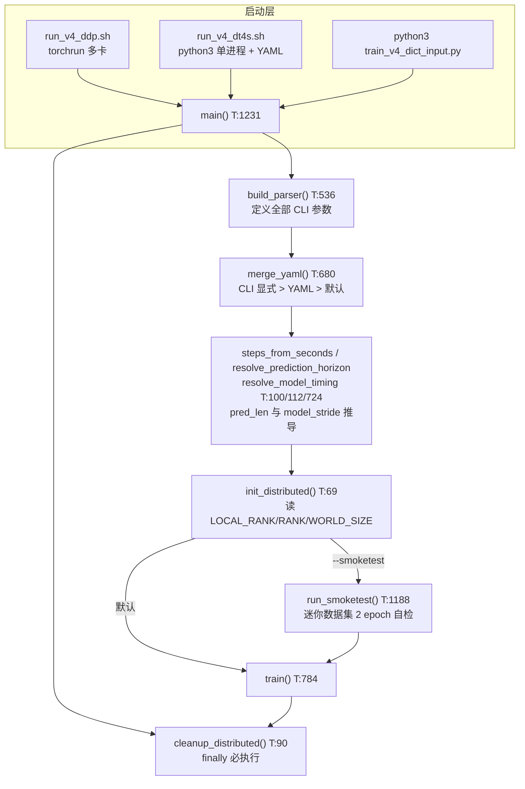
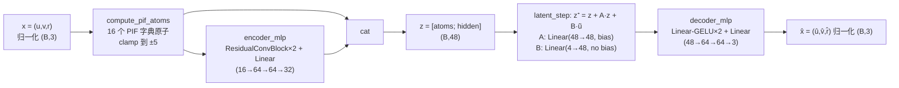
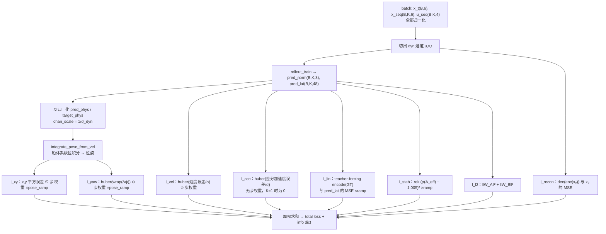
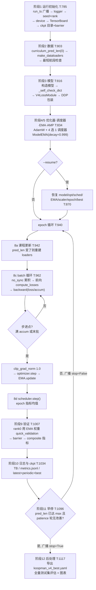

# v4 模型训练脚本梳理（`train_v4_dict_input.py`）

本文梳理 v4 dict-input Koopman 模型的训练脚本 `new_v4_dict_input/train_v4_dict_input.py`（1255 行），
说明其函数调用流程与各函数功能，并覆盖配套的模型定义、启动脚本与 YAML 配置。
文中行号均指 `train_v4_dict_input.py`（记为 **T**），外部文件单独注明。

## 1. 总体视图

训练脚本训练的对象是 `HorizontalKoopmanModelV4DictInput`（`new_v4_dict_input/model_v4_dict_input.py`）：

\[
x=[u,v,r]\in\mathbb{R}^3 \;\xrightarrow{\;\phi(\cdot)\;}\; 16\text{ 维 PIF 字典原子}
\;\xrightarrow{\;\text{encoder}\;}\; z=[\phi(x);\,h]\in\mathbb{R}^{48}
\;\xrightarrow{\;z^+ = z + Az + B\tilde u\;}\; z^+
\;\xrightarrow{\;\text{decoder}\;}\; \hat x\in\mathbb{R}^3
\]

训练流程参考 `scripts/train_v2.py`（数据集 / 课程学习 / EMA / 多项损失），但完全独立。
脚本支持单机多卡 DDP（torchrun）与单进程两种拓扑，入口都是 `main()`。



## 2. 入口流程：`main()`（T:1231）

按执行顺序：

1. **参数解析**：`build_parser()`（T:536）→ `parse_args()`；
2. **YAML 合并**：`merge_yaml(args, parser, sys.argv[1:])`（T:680）——读取 `--config` 指定的 YAML，
   只覆盖**未在命令行显式出现**的键，优先级为 **CLI 显式参数 > YAML > argparse 默认值**
   （注意：对 `--key=value` 写法的显式参数会漏判，此时 YAML 会覆盖命令行）；
3. **预测时域换算**：`pred_len_max` / `pred_len_start` 未显式给出时，由秒数换算
   （`steps_from_seconds`，T:100）：$k = \max(1, \mathrm{round}(T/\Delta t))$；
4. **合法性夹取**：`resolve_prediction_horizon`（T:112）保证 $p_{max}\ge 1$ 且 $1 \le p_{start} \le p_{max}$；
5. **模型步长推导**：`resolve_model_timing`（T:724）→ `ek.model_stride_from_dt(dt, data_dt)`，
   即 $s = \mathrm{round}(dt / data\_dt)$（要求整除；dt=4.0、data_dt=0.1 时 s=40，一个模型步跨 40 行原始数据）；
6. `--val_data` 已弃用，指定则覆盖 `test_data`；
7. **分布式初始化**：`init_distributed(backend)`（T:69）——无 `LOCAL_RANK` 或 `WORLD_SIZE≤1` 返回单进程
   `DistInfo`；nccl 后端强制要求 CUDA（CPU 调试用 `--dist_backend gloo`）；
   然后 `torch.cuda.set_device(local_rank)` + `dist.init_process_group(init_method="env://")`；
8. **分派**：`--smoketest` → `run_smoketest()`，否则 `train()`；`finally` 中 `cleanup_distributed()`
   （T:90，先 `barrier` 再 `destroy_process_group`），异常路径也能正确清理。

## 3. 启动脚本与配置

### 3.1 两个启动脚本

| 维度 | `run_v4_ddp.sh` | `run_v4_dt4s.sh` |
|---|---|---|
| 启动方式 | `torchrun --standalone --nproc_per_node=N --master_port=29500`；N≤1 时退化为 `python3` | 始终 `python3` 单进程 |
| 配置来源 | 不带 `--config`，全靠 `--` 后透传 CLI 参数 + 默认值 | 强制 `--config configs/v4_dt4s_train.yaml`，可选 `--resume` |
| GPU 数 | `nvidia-smi -L` 自动探测 | 由环境决定 |
| 职责 | 只做训练 | 训练 → 定位/补齐 best ckpt → 从 YAML 推 pred_len → 自动调 `eval_v4_dict_input.py` 评估 |

### 3.2 两份 YAML 配置对比

| 键 | `v4_dt4s_train.yaml`（基础） | `v4_dt4s_10step_train.yaml`（续训） |
|---|---|---|
| `dt` / `data_dt` | 4.0 / 0.1（model_stride=40） | 同左 |
| 预测时域 | `pred_time_sec=20` → 5 步；`pred_time_start_sec=4` → 1 步 | 显式 `pred_len_max=10`、`pred_len_start=5`（40s 窗） |
| `epochs` | 120 | 240 |
| `batch_size` / `grad_accum_steps` | 512 / 2（等效 1024） | 同左 |
| `hidden_dim` | 32（latent = 16+32 = 48） | 同左 |
| 用法 | 从头训练 5 步模型 | `--resume` 加载 5 步 best，微调到 10 步 |

两配置都未设 `noise_std` / `ctrl_noise_std`，正式训练默认关闭噪声注入（仅 smoketest 强制打开）。

## 4. 数据管线

### 4.1 数据布局前提

原始 npz 按"航段"存储，`koopman/evalkit.py` 的 `_load_segments_cached` / `_flatten_segments`
把所有航段拼成两张只读大表（带模块级内存缓存，key = 路径+mtime+size，curriculum 扩窗重建 Dataset 时不重复 IO）：

- `states_full` (N,6) float32：通道顺序 `[x, y, yaw, u, v, r]`（前 3 位姿、后 3 船体系速度/艏摇）；
- `ctrls_full` (N,4) float32：4 通道推进器指令。

一个模型步对应 `model_stride = dt/data_dt` 行原始数据；窗口总跨度 `data_span = pred_len × model_stride`。

### 4.2 `KoopmanVoyageDataset`（T:154）

滑动窗口数据集，返回"当前状态 + 未来 k 步状态/控制序列"：

- **`__init__(npz_path, pred_len, stride, stats, model_stride, data_dt)`**（T:161）：
  调 `ek._flatten_segments` 得合法窗口起点表 `t0_global`（窗口末端不越出段尾）；
  `stats=None` 时自算归一化统计量；
- **`_compute_stats()`**（T:195）：在全量训练序列上求 z-score 统计
  $\mu,\ \sigma = \mathrm{std} + 10^{-6}$（防除零），键为 `state_mean/state_std` (6,) 与 `ctrl_mean/ctrl_std` (4,)；
- **`__getitem__(index)`**（T:206）：设 k=pred_len、m=model_stride、t₀=`t0_global[index]`——

  | 字段 | 取数方式 | 形状 |
  |---|---|---|
  | `x_t_n` | `states_full[t0]`，当前全状态 | (6,) |
  | `x_seq_n` | `states_full[t0+m : t0+km : m]`，未来第 1..k 个模型步末状态 | (k,6) |
  | `u_seq_n` | `ctrls_full[t0 : t0+(k-1)m : m]`，每个模型步起点的控制 | (k,4) |

  全部做 z-score 归一化后经 DataLoader 组 batch → `(B,6) / (B,k,6) / (B,k,4)`。

### 4.3 `make_dataloaders`（T:729）

构建 train/test 数据集与训练 DataLoader。要点：

- test_ds 复用**训练集统计量**归一化（口径一致、防泄漏）；
- DDP 时挂 `DistributedSampler(shuffle=True, drop_last=True)`（此时 `DataLoader.shuffle=False`，二者互斥）；
- `num_workers=8`、`pin_memory`（有 CUDA 时）、`persistent_workers=True`、`drop_last` 仅 DDP；
- 课程学习每次扩窗都会**重建** Dataset/DataLoader，但传入已缓存的 `stats` 避免重算；
- 只建 train_loader；验证 loader 在 `quick_validation` 内按需另建（`shuffle=False, num_workers=0`）。

## 5. 模型结构（`model_v4_dict_input.py`）



- **16 个 PIF 字典原子**（`FEATURE_DICT_ATOMS_16`）：二次阻尼项（$u|u|$、$v|v|$、$r|r|$）、耦合项
  （$vr$、$ur$、$uvr$）、三阶项（$u^2r$、$v^2r$、$ur^2$、$vr^2$、$u|v|v$、$v|u|u$、$r|u|u$、$r|v|v$）
  与带符号三次项 $u^2|u|$、$v^2|v|$（变量名 `uuu/vvv` 有误导性），对应 MMG 类水动力模型的典型结构；
  `clamp_pif=5` 截断防止外推时高次项爆炸；
- **encoder**：默认 `encoder_arch="conv"` 走历史 `res_mlp`（兼容旧 ckpt；其 Conv1d 在长度 1 序列上退化为逐通道缩放），
  `"mlp"` 走干净的 `_ResidualMLPEncoder`；
- **latent_step 仿射形式**：$z^+ = z + Az + b_A + B\tilde u$，有效转移矩阵 $A_{eff} = I + W_A$——
  稳定性监控对 $\rho(I + W_A)$ 求谱半径（基类 `BaseKoopmanModel.spectral_radius`，`koopman/model_v1_v2.py:36`）；
- **初始化**（`reset_parameters`）：`A.weight ~ N(0, 0.01²)`、`A.bias=0`（初始近恒等映射，训练初期稳定），
  `B.weight` 取 xavier(gain=0.1) 小增益；
- **`_self_check_dict`**：用纯 Python 公式逐元素核对 16 个原子（训练启动前 T:821 调用）；
- 训练**不走** `model.forward`（仅为接口兼容保留），统一经 `V4LossModule` 包裹的 `compute_losses`。

## 6. 训练核心：rollout 与损失

### 6.1 `rollout_train`（T:298）

```python
rollout_train(model, x_t_dyn_n: (B,3), u_seq_n: (B,K,4),
              noise_std=0.0, ctrl_noise_std=0.0) -> (pred_norm: (B,K,3), pred_lat: (B,K,48))
```

在归一化空间做 K 步开环 rollout：`encode(x₀)` 一次 → 循环 `z ← latent_step(z, u_i)`，
每步收集潜变量与 `reconstruct_state(z)`。可选对初始状态/每步控制注入高斯噪声（sim→real 增强），
由 `compute_losses` 按 `model.training` 门控——验证时强制为 0，是纯开环评估。

### 6.2 `compute_losses`（T:327）：8 个损失项



| 损失 | 定义 | 权重（默认） | ramp |
|---|---|---|---|
| `l_vel` 速度 | $\mathrm{mean}[\mathrm{huber}((\hat\nu-\nu)/\sigma_{dyn})\odot w_i]$，β=0.1 | `w_vel` 1.0 | 无 |
| `l_acc` 加速度 | 差分 $a=\Delta\nu/\Delta t$ 的 huber；K=1 时为 0 | `w_acc` 0.2 | 无 |
| `l_lin` 潜空间线性 | GT 经 `encode` 得目标潜变量，与预测潜序列 MSE | `w_lin` 1.0 | `ramp` |
| `l_recon` 重构 | t0 时刻 $\mathrm{MSE}(dec(enc(\nu_0)), \nu_0)$ | `w_recon` 0.5 | 无 |
| `l_xy` 平面位姿 | 预测速度欧拉积分后的 x,y 误差 ⊙ 步权重 | `w_xy` 2.0 | `pose_ramp` |
| `l_yaw` 航向 | $\mathrm{huber}(\mathrm{wrap}(\hat\psi-\psi))\odot w_i$ | `w_yaw` 1.0 | `pose_ramp` |
| `l_stab` 谱半径 | $\mathrm{relu}(\rho(A_{eff}) - \rho_{max})^2$，$\rho_{max}$=1.005 | `w_stab` 0.1 | `ramp` |
| `l_l2` 参数正则 | $\|W_A\|_F^2 + \|W_B\|_F^2$ | `w_l2` 1e-4 | 无 |

配套工具函数：

- **`huber(x, β=0.1)`**（T:242）：平滑 L1，$|x|<\beta$ 时 $x^2/2\beta$，否则 $|x|-\beta/2$；
- **`make_step_weights(k, γ=0.97)`**（T:249）：$w_i = \gamma^i$ 再均值归一化（近期步权重大、远期小，
  且损失量级不随 k 漂移）；
- **`wrap_yaw_diff(a, b)`**（T:254）：$\mathrm{atan2}(\sin(a-b), \cos(a-b))$，航向差 wrap 到 $[-\pi,\pi]$；
- **`integrate_pose_from_vel(pose0, vel, dt)`**（T:260）：船体系欧拉积分
  $x \mathrel{+}= (u\cos\psi - v\sin\psi)dt$、$y \mathrel{+}= (u\sin\psi + v\cos\psi)dt$、$\psi \mathrel{+}= r\,dt$，
  位置用**本步开始时**的 ψ（分段线性近似），与 MPC / ONNX rollout 口径一致；积分后不 wrap，
  角度差在损失端处理；
- **`denorm_pose`**（T:291）：位姿通道的 z-score 逆变换，用独立的 `pose_mean/std = state_mean/std[:3]`；
- **warmup ramp**：`ramp = min(1, (epoch+1)/5)` 作用于 `l_lin`/`l_stab`；
  `pose_ramp = min(1, (epoch+1)/10)` 作用于 `l_xy`/`l_yaw`——先学短程速度，再逐步引入位姿与稳定性约束。

### 6.3 `V4LossModule`（T:414）：为 DDP 而生的薄壳

把整套损失计算包进 `forward` 委托给 `compute_losses`。原因：DDP 的梯度 all-reduce 依赖
`DDP.forward()` 触发 reducer；直接对 DDP 包装对象调 `model.encode()` 等自定义方法会报
AttributeError（DDP 不转发自定义方法），即使绕过也会跳过梯度同步。包进 `forward` 后整个
计算图都在 DDP 覆盖之下。**验证路径不经过它**（`quick_validation` 直接调 `compute_losses`）。

## 7. `train()` 主循环（T:784）



### 7.1 初始化顺序（阶段 1–7）

1. `torch.set_num_threads`（可选）；
2. `run_ts` 仅 rank0 生成，经 `broadcast_run_id`（`dist.broadcast_object_list`）广播——**分布式同步点 ①**，
   保证各 rank 的日志/ckpt/metrics 文件名对齐到同一个 run；
3. `setup_logger`：仅 rank0 写文件+控制台，其余 rank 挂 `NullHandler`；
4. `seed_everything(args.seed + rank)`：按 rank 偏移种子（未设 cudnn.deterministic，是常规可复现）；
5. `resolve_device`：DDP → `cuda:{local_rank}`；单进程 → `auto`（有 CUDA 用 CUDA）；
6. rank0 建 TensorBoard（`tb_v4_{ts}`）；`ckpt_dir` 拼 `run_v4_{ts}/` 子目录，rank0 创建后 `barrier`——**同步点 ②**；
7. `make_dataloaders`（初始 pred_len 来自课程起点）；`ek.data_span_for_pred_len` 做最短航段告警；
8. 构造模型 → `_self_check_dict` 自检 → `V4LossModule` 包裹 → DDP 包装（只包 train_module，
   `base_model` 保持裸引用用于取参/存 ckpt）；
9. `AdamW(lr, weight_decay)`；调度器四选一：`warmrestart`（默认，$T_0$=1000 近似恒定 LR）、
   `cosine`、`cosine_warmup`（LinearLR warmup + CosineAnnealing 串联）、`constant`；
10. `ModelEMA(base_model, decay=0.999)`（`--no_ema` 关闭）；AMP 仅 CUDA 生效（`GradScaler`）；
11. `--resume` 时依次恢复 model / optimizer / scheduler（类型不匹配则跳过）/ EMA / scaler / epoch / best_metric。

### 7.2 batch 循环细节（阶段 8）

- **梯度累积**：`step_now = (batch_idx+1) % accum == 0 or 末批`；非步进的 micro-batch 用
  `train_module.no_sync()` 上下文跳过梯度 all-reduce（省通信，数值不变）——隐式分布式同步控制点；
- **前向**：`train_module(...)` → `V4LossModule.forward` → `compute_losses`；AMP 路径走
  `autocast` + `scaler.scale(loss/accum).backward()`；
- **步进块**：AMP 先 `scaler.unscale_` 还原梯度 → `clip_grad_norm_(params, 1.0)` 全局范数裁剪 →
  `optimizer.step()` → **`ema.update(base_model)`（每个 optimizer step 一次）** → `zero_grad`；
- 指标按 micro-batch 累加，epoch 末除以 `n_batches` 得均值；`scheduler.step()` 每 epoch 一次。

### 7.3 验证与 best 判定（阶段 9–10）

- 验证模型为 **EMA 权重**（`ema.module`，无 EMA 时用裸模型）；仅 rank0 执行 `quick_validation`，
  其余 rank 在 `barrier` 等待——**同步点 ③**；
- **复合选优指标**：$\mathrm{composite} = \overline{\mathrm{RMSE}}_{vel} \times \max(1,\ s_{instability})$
  （`test/vel_rmse_mean × max(1, test/instability_score)`），loss 指标不参与选优；
- checkpoint 共 12 个键：`epoch / model_state_dict / stats / best_metric / optimizer_state_dict /
  scheduler_state_dict / scaler_state_dict / ema_state_dict / args / model_class / feature_dict_atoms / latent_dim`；
- 保存策略：每 epoch 覆盖 `koopman_v4_latest.pth`；**最后 30 个 epoch 内每 5 个 epoch**另存
  `koopman_v4_epoch{N}.pth`；composite 严格改善才写 `koopman_v4_best.pth`。

### 7.4 早停（阶段 11）

`early_stop_patience > 0` 才启用；**只有 pred_len 到达 pred_len_max 后才开始计数**（课程未满时计数器清零）。
rank0 判定后把 stop_flag 经 `broadcast_object_list` 广播——**同步点 ④**，所有 rank 统一 break。

### 7.5 训练后处理（阶段 12，仅 rank0）

1. `barrier` 后非 rank0 直接返回——**同步点 ⑤**；
2. **YAML 导出**：加载 best ckpt（权重优先取 `ema_state_dict`）→ `export_params_to_yaml`（T:694）
   导出 `koopman_v4_best.yaml`，字段含 `normalization.{dyn_mean,dyn_std,ctrl_mean,ctrl_std}`、
   `system_matrices.{A_weight = W_A+I, A_bias, B}`、`dictionary.{atoms_16, latent_dim, hidden_dim}`——
   这是 Python 训练 → C++ 潜空间 QP-MPC 部署的接口文件（C++ 侧 `koopman_latent_model.cpp` 读取）；
3. `--no-final-eval` 时跳过；否则用 best ckpt 调 `eval_v4_dict_input.py` 的 `evaluate(...)`
   （`pred_len=pred_len_max`、全量样本），产出逐步指标 CSV、`summary.json` 与 u/v 通道 RMSE/散点/样本曲线图，
   整体包在 try/except 中（失败只记日志不中断）。

### 7.6 分布式同步点一览

| 位置 | 原语 | 目的 |
|---|---|---|
| T:788 | `broadcast_object_list` | run 时间戳 rank0 → 全员 |
| T:800 | `dist.barrier()` | ckpt 目录创建后再继续 |
| batch 反向 | DDP gradient all-reduce | `no_sync()` 跳过非步进 micro-batch 的同步 |
| T:1027 | `dist.barrier()` | 等 rank0 完成验证 |
| T:1112 | `broadcast_object_list` | 早停标志 rank0 → 全员 |
| T:1117 | `dist.barrier()` | 训练循环退出后对齐 |

## 8. 验证：`quick_validation`（T:447）

`@torch.no_grad()` + `model.eval()`，在 hold-out 测试集上输出 17 个 `test/` 前缀指标，分两类：

**① Rollout 指标（8 个）**：对 `t0_global` 等距子采样（`val_max_samples=512`）后调
`ek.rollout_dataset`（向量化开环 rollout；GT 轨迹用 GT 速度 + 相同初值做同样的欧拉积分，保证 xy 对比口径一致），
再经 `ek.compute_per_step_metrics` / `compute_divergence_metrics` 提取：

| 键 | 含义 | 单位 |
|---|---|---|
| `test/vel_rmse_mean` | K 步水平速度 RMSE 的均值 | m/s |
| `test/slope_loglog` | log k ~ log(RMSE_k) 斜率（≈0 不增长，>1 超线性发散） | — |
| `test/instability_score` | $\sigma(slope)\cdot(1 + ratio/10)$，ratio=末步/首步 RMSE | — |
| `test/vel_rmse_stepK` `u/v/r_rmse_stepK` | 预测末端各通道 RMSE | m/s、rad/s |
| `test/traj_xy_rmse_stepK` | 末端位置 RMSE（各自速度欧拉积分） | m |

**② 训练同款 Loss（9 个）**：用 `compute_losses` 同一代码路径复算（噪声门控自动关闭），
键为 `test/L_total … L_stab, test/spec_radius`，按 batch 数算术平均。

注意：EMA 的取舍发生在调用方——每个 epoch 只验证一个模型（EMA 或裸模型），不存在并排对比。

## 9. 冒烟测试：`run_smoketest`（T:1188）

`--smoketest` 触发的端到端自检：从训练/测试 npz 各切迷你集（前 2 / 前 1 个航段），覆写超参为
`epochs=2, batch_size=16, pred_len_start=pred_len_max=4`（`grow_every=999` 冻结课程）、
强制打开噪声注入（0.02 / 0.003），然后跑完整 `train()`；rank0 校验三件产物存在：
`koopman_v4_latest.pth`、`koopman_v4_best.pth`、`koopman_v4_best.yaml`。

## 10. 函数速查表

| 函数/类 | 位置 | 功能 |
|---|---|---|
| `DistInfo` | T:56 | DDP 状态值对象（enabled/rank/local_rank/world_size/backend） |
| `unwrap_model` | T:65 | 剥 DDP 外壳（**当前无调用者**，预留工具） |
| `init_distributed` | T:69 | 按 torchrun 环境变量初始化进程组 |
| `cleanup_distributed` | T:90 | barrier + 销毁进程组（main 的 finally） |
| `is_main_process` | T:96 | 是否 rank0 |
| `steps_from_seconds` | T:100 | 秒 → 步数，$k=\max(1,\mathrm{round}(T/\Delta t))$ |
| `curriculum_pred_len` | T:104 | 课程学习：$p(e)=\min(p_{max}, p_{start}+s\lfloor e/g\rfloor)$ |
| `resolve_prediction_horizon` | T:112 | 预测时域参数夹取 |
| `setup_logger` | T:118 | 仅 rank0 写日志文件+控制台 |
| `broadcast_run_id` | T:138 | 时间戳 run_id rank0 → 全员 |
| `seed_everything` | T:146 | 统一播种（seed+rank） |
| `KoopmanVoyageDataset` | T:154 | 滑动窗口数据集（归一化三元组样本） |
| `ModelEMA` | T:224 | 参数指数滑动平均副本（decay=0.999） |
| `huber` | T:242 | 平滑 L1 |
| `make_step_weights` | T:249 | $\gamma^i$ 步权重（均值归一） |
| `wrap_yaw_diff` | T:254 | 航向差 wrap 到 ±π |
| `integrate_pose_from_vel` | T:260 | 船体系欧拉积分求位姿 |
| `denorm_pose` | T:291 | 位姿反归一化 |
| `rollout_train` | T:298 | K 步开环 rollout（可注噪） |
| `compute_losses` | T:327 | 8 项损失加权合成 |
| `V4LossModule` | T:414 | 损失薄壳（DDP reducer 正确注册） |
| `quick_validation` | T:447 | 验证：8 rollout 指标 + 9 loss 键 |
| `build_parser` | T:536 | 全部 CLI 参数定义 |
| `merge_yaml` | T:680 | YAML 合并（CLI > YAML > 默认） |
| `export_params_to_yaml` | T:694 | 导出 C++ MPC 用 YAML（A+I、统计量） |
| `TrainState` | T:718 | epoch / best_metric 记录 |
| `resolve_model_timing` | T:724 | model_stride = round(dt/data_dt) |
| `make_dataloaders` | T:729 | 数据集 + DataLoader + DistributedSampler |
| `resolve_device` | T:774 | 训练设备解析 |
| `train` | T:784 | 主训练流程（§7 的 12 个阶段） |
| `run_smoketest` | T:1188 | 迷你集端到端自检 |
| `main` | T:1231 | 总入口（§2） |
