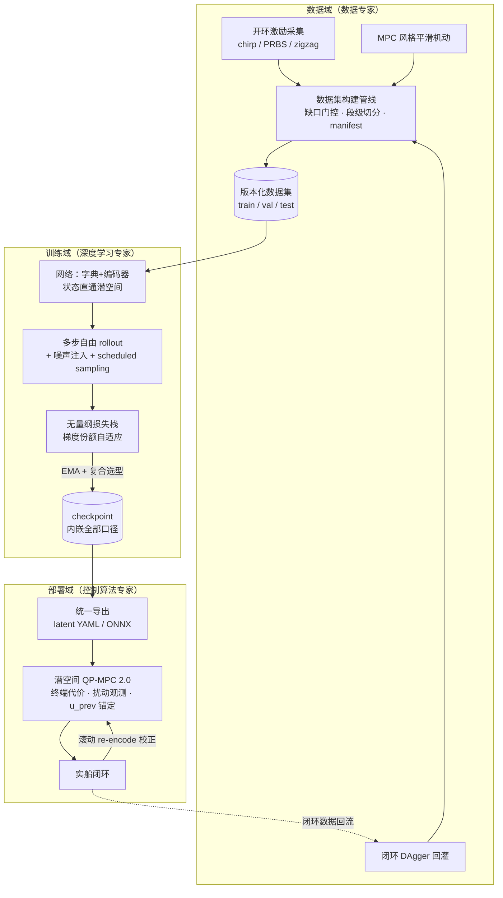
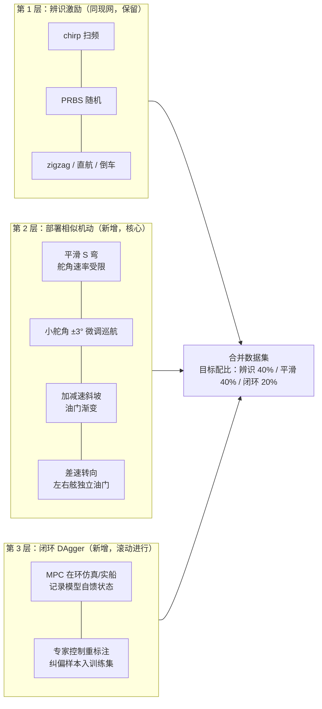
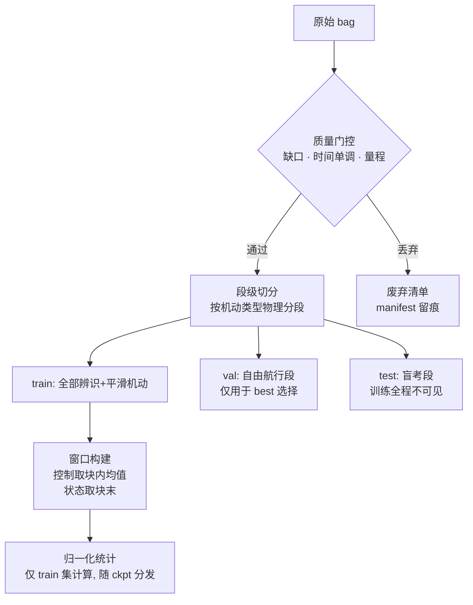
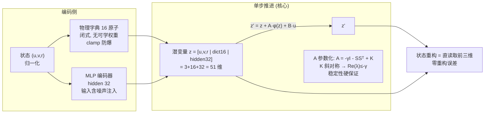
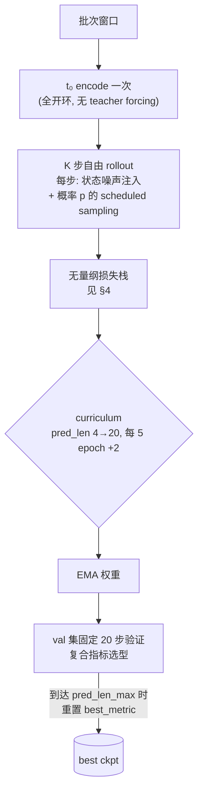
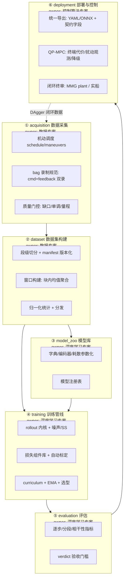

# 下一代系统设计方案（数据 × 深度学习 × 控制 三视角）

> 本文是一份**全新设计**文档：以深度学习专家、控制算法专家、数据专家三个视角，
> 重新设计「数据采集与切分 → 训练网络 → 代价函数 → 模型应用于控制」全链路，并给出功能拆分。
> 设计依据是本仓库已积累的全部实证结论（见《多步漂移优化方案.md》《v4多步训练代价函数分析.md》等），
> 每个设计决策都标注了它要解决的具体问题。与《架构重构方案.md》的关系：那份文档改代码结构，本文定技术形态。

## 0. 设计目标与原则

**目标**：多步预测在长 horizon（≥4× 训练窗）下误差不相干累积，模型可直接服务于潜空间 QP-MPC 闭环。

四条设计原则（全部由教训反推）：

1. **量纲一致**：所有损失项先无量纲化再加权，权重 = 期望份额，禁止用拍脑袋数值（现网 L_xy 占梯度 98.4% 的教训）；
2. **口径即契约**：dt、控制聚合方式、归一化统计、状态定义，从采集到 C++ 全链路同一语义、机器可校验；
3. **训练分布 ⊇ 部署分布**：模型在训练中必须见过 MPC 风格的平滑控制序列与自馈误差状态；
4. **每项目标单一**：一个损失项只管一件事，一个模块只担一个职责。

## 1. 总体架构



关键闭环：**部署产生的闭环数据经 DAgger 回灌训练域**，这是消除"开环训练 vs 闭环部署"分布差的结构性手段，而非补丁。

## 2. 数据专家视角：数据采集与切分设计

### 2.1 现状问题（设计要消灭什么）

| 问题 | 证据 | 后果 |
|---|---|---|
| zigzag 占训练帧 ~64%，直航/小舵 <10% | 99 段实测分桶 | 小激励工况欠辨识，稳态附近易漂 |
| 4 维控制退化为 2 维（81/99 段左右舷油门相同） | 数据集实测 | 差速动力学未激励 |
| 录的是执行器反馈而非下发指令 | `scripts/data/bag_test.py:6` | 指令→反馈动态被吸进模型，部署口径错位 |
| 1s/4s 块只取块首控制（ZOH） | `train_v4_dict_input.py:213` | 45.2% 窗口块内指令非恒定，高机动段误差 1.87×，构成不可约误差下界 |
| 测试集当验证集做 best 选择 | `train_v4_dict_input.py:540-550` | 模型选择无独立护栏 |
| 旧管线缺口外推补值 | `split_high_density_bag.py:55-59` | 训练样本含伪造数据 |

### 2.2 采集设计：三层激励体系



设计依据：

- **第 2 层直接消除分布差**：MPC 下发的是平滑、小幅、带速率约束的序列，训练集必须有同分布样本（现网漂移主因之一）；
- **差速激励补齐控制维度**：B4 机动让 4 维控制真正独立变化，否则差速动力学永远学不到；
- **第 3 层 DAgger 是抗漂移的终极手段**：模型 rollout 到偏出训练流形的状态时，用专家（MMG 仿真器或人工）控制重标注，把"错误状态的纠正"显式教给模型。

### 2.3 采集规范（记录口径）

1. **双录控制**：`/control/control_cmd`（下发指令）与 `/system/chassis_feedback`（执行器反馈）**同时记录**；训练默认用指令，反馈留作执行器延迟建模的备选；
2. 10Hz 采样不变（与现网对齐，窗口语义不变）；
3. 每段附带元数据：机动类型、海况、载况，写入 manifest（沿用 `auto_split_bag.py` 的 manifest 纪律）；
4. 质量门控：缺口 >0.5s 整段丢弃，**禁止外推补值**（`auto_split_bag.py:121-127` 的 valid 掩码纪律推广为唯一管线）。

### 2.4 切分与样本构建



硬性规则：

- **切分单位是"段"不是"窗口"**，杜绝同段窗口同时出现在 train/val（现网 19.7 万全重叠滑窗高度自相关，有效样本远小于名义值）；
- **控制聚合改为块内均值**（或中值），消灭 ZOH 口径误差下界；
- **三集职责**：train 训练、val 做 best 选择与早停、test 只做最终一次性评估——纠正现网"test 当 val"的误用；
- 归一化统计只由 train 计算，随 ckpt 分发到评估/导出/C++，全链路唯一。

## 3. 深度学习专家视角：训练网络设计

### 3.1 设计约束（从漂移根因反推）

1. 现役模型 ρ(Ā)=0.99982 贴单位圆，慢模态方向误差线性累积且拉不回 → **稳定性要硬参数化，不靠软惩罚**（现网 L_stab 平方罚在边界梯度消失，名存实亡）；
2. v4 取消状态直通后，物理误差 = latent 漂移 × decoder 雅可比 + decoder 固有误差，多一层误差通道 → **恢复状态直通**；
3. 模型只见过"从真实 t₀ 出发"的轨迹 → **训练中注入自馈误差**；
4. v3a 已实证线性潜空间 slope 下界 ≈0.70 → **预留非线性/混合扩展位**，但不在首版启用。

### 3.2 网络结构



与现网 v4 的三处本质差异：

| 设计点 | 现网 v4 | 本设计 | 解决的问题 |
|---|---|---|---|
| 状态重构 | decoder MLP 回归（有误差） | **z 前 3 维即状态直通** | 消除 decoder 误差通道；`L_recon` 项退役 |
| 稳定性 | `L_stab=relu(ρ-1.005)²` 软罚 | **耗散参数化**：增量矩阵 `A = -γI - SSᵀ + K`（S 任意、K 斜对称），Re(λ)≤−γ 恒成立 | 慢模态贴单位圆的线性累积；罚项梯度消失 |
| 编码鲁棒 | 噪声注入默认关 | **训练恒开** `noise_std=0.02~0.03`（含 ctrl 通道 0.003~0.005） | encoder 对自馈误差状态的泛化 |

潜空间维度 51 = 3（状态直通）+ 16（物理字典）+ 32（MLP hidden）。字典沿用 16 物理原子（已验证的先验，不动）。**预留扩展位**（首版关闭）：低秩双线性项表达 U²δ 舵效（`工程全景说明文档.md:1138` 已论证）、MMG 残差并联分支（P2-2 裁决后启用）。

### 3.3 训练机制



三个机制要点：

1. **全开环 rollout 保留**（训练-评估-部署口径一致，这是现网做对的地方），但**叠加两路抗累积正则**：输入噪声注入（常开）+ scheduled sampling（以概率 p 把上一步预测值而非真值作为下一步输入，p 随 epoch 从 0 升到 0.2）——后者直接教模型"在自己跑偏的状态上如何继续"，对应漂移的微观机理；
2. **curriculum 到顶重置 best_metric**（修现网 B-1：短 horizon 口径选出的模型被部署）；
3. **EMA + 复合选型**保留，选型指标见 §4.3。

## 4. 代价函数设计

### 4.1 设计原则

现网的教训：L_xy（物理米²，O(5)）对 L_vel（归一化 Huber，O(0.1)）形成 98.4% 的梯度劫持，grad-clip 进一步把其他项抹成零。因此本设计的铁律：

> **每一项损失先除以自身量纲标度变成 O(1) 无量纲量，权重只表达"期望份额"；所有项的梯度范数在训练启动时自动标定到同一量级。**

### 4.2 损失栈

| 项 | 形式（均已无量纲化） | 默认权重 | 职责 | 解决的现网问题 |
|---|---|---|---|---|
| `L_vel` | 多步速度 Huber / σ_ch²，逐步权重 w_k=k（**递增**，非 γ^k 衰减） | 1.0 | 主预测目标 | γ_step=0.97 与末端精度目标相悖 |
| `L_bias` | 批均值逐步偏置平方 / σ_ch² | 0.5 | 压相干偏差 | v4 删掉了它，而末段误差恰是偏差主导（v: 0.17→0.41） |
| `L_slope` | log-log 斜率闭式惩罚 | 0.3 | 压误差增长率 | 直接对齐漂移指标 |
| `L_lin` | 潜一致性 MSE / ‖z‖²，**目标 detach** | 1.0 | 防 latent 跑偏 | 现网目标未 detach 是 moving target |
| `L_pose` | 位姿误差 / (k·dt·ū)² **按行进距离无量纲化** | 0.2（等效现网 w_xy≈0.019 标定） | 末端位姿弱约束 | L_xy 92.6× curriculum 量级漂移、梯度劫持 |
| `L_yaw` | 航向 wrap Huber / π² | 0.3 | 航向 | 与 L_pose 解耦后不再冲突 |
| `L_acc` | 相邻步差分 Huber / σ²，**补步权** | 0.1 | 平滑 | 现网漏乘步权 |
| `L_l2` | A/B F 范数 | 1e-4 | 正则 | 保留 |

退役项：`L_recon`（状态直通后零误差，无需约束）、`L_stab`（稳定性已由硬参数化保证，软罚退役）。

### 4.3 权重标定与选型指标

- **自动标定**：训练第 0 个 epoch 记录各项梯度范数 g_i，权重缩放为 w_i ← w_i · (g_ref / g_i)，此后冻结——消除"w_xy=2 拍出 106 倍偏差"这类事故的制度性可能；
- **梯度冲突监控**：定期记录 cos(∇L_i, ∇L_j)，持续负相关（如现网 L_xy vs L_yaw 的 −0.149）报警而非静默；
- **best 选型复合指标**（val 集、固定 20 步口径）：
  `score = vel_rmse_mean × (1 + max(0, slope_窗外)) × (1 + max|bias|/rmse 末段)`，
  其中 slope 分窗内/窗外**分段拟合**（现网单一 ratio 掩盖"窗内平、窗外漂"的真实形态）。

## 5. 控制算法专家视角：模型应用于控制

### 5.1 控制回路总体设计

```mermaid
flowchart TB
    REF[参考轨迹<br/>速度/位姿] --> ENC2["参考潜变量<br/>每拍 encode"]
    SEN[实船传感<br/>(u,v,r)] --> EKF[状态估计/滤波]
    EKF --> ENC1["z₀ = encode(实测状态)<br/>每拍重新 encode<br/>→ 闭环内漂移周期重置"]
    ENC1 --> QP["潜空间 condensed QP<br/>H = w_z ΘᵀΘ + w_u I + w_du DᵀD<br/>+ 终端代价 P_N (S-KMPC)"]
    ENC2 --> QP
    DO["扰动观测器 d̂<br/>(offset-free)<br/>比较预测 vs 实测<br/>修正自由响应偏置"] --> QP
    QP --> SEL["取前 m=2 步下发<br/>u_prev 锚定速率约束"]
    SEL --> ACT[执行器] --> SHIP[船舶] --> SEN
    QP -.->|求解失败| FB["降级: 保持上一拍控制<br/>+ 告警计数"]
```

### 5.2 控制侧四个设计点

| 设计点 | 内容 | 依据 |
|---|---|---|
| **终端代价（S-KMPC）** | QP 末端块加 P_N 权重（离线由 Ā 的 Lyapunov 方程解出），只改 P/q 不动结构 | 文档自评"性价比最高"（`工程全景说明文档.md:1136`）；补偿短 horizon 截断 |
| **offset-free 扰动观测** | 每拍比较"上拍预测 z₁"与"本拍实测 encode(z₀)"，偏差 d̂ 低通后注入自由响应常数项 | 把残余模型失配从"污染代价梯度"转为"被观测补偿"，是模型漂移在控制侧的对冲 |
| **u_prev 锚定 + 速率约束** | 上一拍实际下发控制锚定首块约束 | 现网未接入，首步油门被静默钳位（实测代价 +54%） |
| **契约校验与降级** | 启动时校验 latent YAML 的 dt ↔ mpc_config dt ↔ ONNX 图内步长；OSQP 失败保持上一拍控制 | 现网 dt 错配无检查、求解失败直接抛异常 |

### 5.3 horizon 与 dt 选型

| 方案 | 参数 | 评价 |
|---|---|---|
| dt=1s, N=20（20s） | 现网默认 | 步数多、rollout 链长，漂移暴露面大 |
| dt=4s, N=10（40s） | 现网部署 | 步数少但 ZOH 误差大（45.2% 窗口非恒定），必须配合块内均值聚合 |
| **dt=2s, N=15（30s）** | 本设计默认 | 折中：ZOH 误差减半、链长适中；最终以闭环对比裁决 |

选型不由开环指标决定，**终审是 MPC 闭环跟踪误差**（现网闭环仿真 plant=模型，自证不了，需 MMG plant 或实船）。

## 6. 功能拆分



拆分原则与现网问题一一对应：

1. **单一事实源**：rollout 内核、损失组件、模型加载、归一化统计各只有一份（对应《架构重构方案》D-1/D-2/D-5）；
2. **ckpt 是唯一配置事实源**：dt/pred_len/归一化随 ckpt 走，eval/export/C++ 启动校验（D-3/D-4）；
3. **每个模块有明确 owner 视角**：数据口径问题找 ①②，训练行为问题找 ③④，控制性能问题找 ⑥——现网"损失问题藏在 1255 行训练脚本里"的状态终结。

## 7. 实施路线与验收

与已有两份方案的衔接顺序：

1. **近期（1~2 周）**：《架构重构方案》阶段 0/1 + 《多步漂移优化方案》P0——先让现网 v4 达到其结构上限（消融已证 −38%~−47% 空间），同时按 §2.2 启动第 2 层平滑机动采集；
2. **中期（3~6 周）**：本设计 §3 网络（状态直通 + 耗散参数化）与 §4 损失栈在重构后的损失组件库内落地；§5.2 终端代价与 u_prev 上 C++；
3. **远期（裁决制）**：§2.2 第 3 层 DAgger、低秩双线性、MMG 残差并联——以 MPC 闭环跟踪误差终审裁决投入。

验收指标（同一 test 盲考集 + 固定评估协议）：

- 开环：step20 RMSE、step200 漂移率、分段 slope（窗内/窗外）、末段 |bias|/rmse；
- 闭环：MPC 跟踪 xy/yaw RMSE（MMG plant 或实船）；
- 工程：新增损失项/模型改动文件数 ≤2；dt 口径错配启动即报错。

## 8. 风险与对策

| 风险 | 对策 |
|---|---|
| 耗散参数化过度收缩（γ 偏大）损失表达力 | γ 可学 + 下界 1e-4；以 val 20 步指标裁决 |
| scheduled sampling 训练不稳 | p 上限 0.2、ramp 10 epoch；与噪声注入二选一消融先行 |
| 第 2 层采集排期受海试窗口限制 | 先用 MMG 仿真生成同分布平滑序列过渡（`koopman/mmg_model.py` 已在库） |
| 双录控制增加后处理对齐负担 | `auto_split_bag.py` 已支持 control_cmd 通道，沿用其时间对齐与 valid 掩码 |
