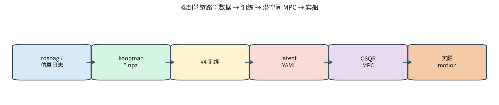
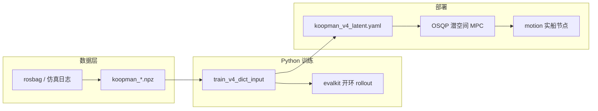
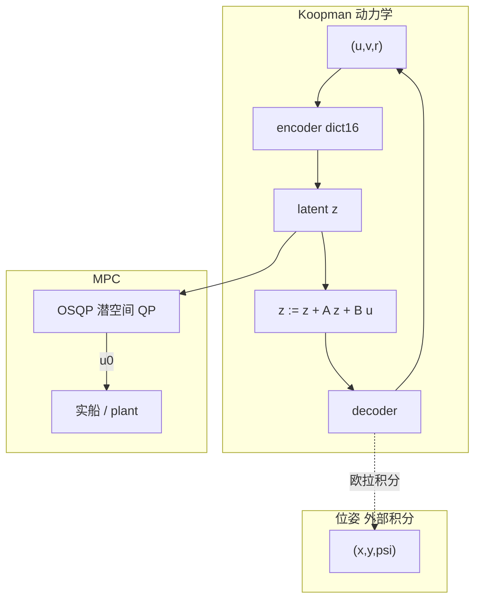
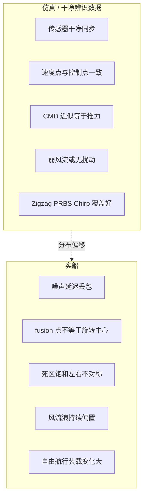
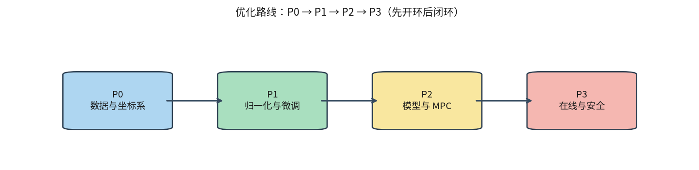
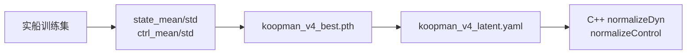
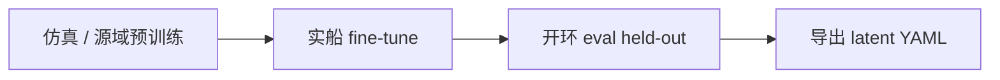
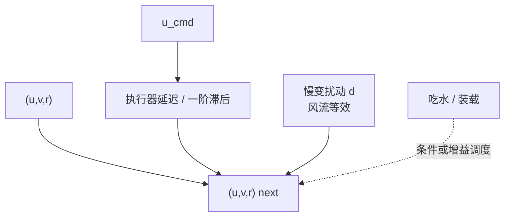
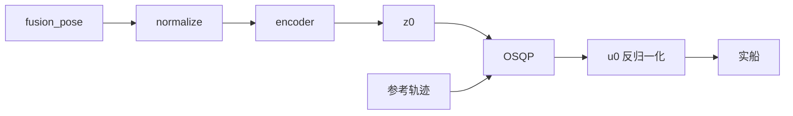
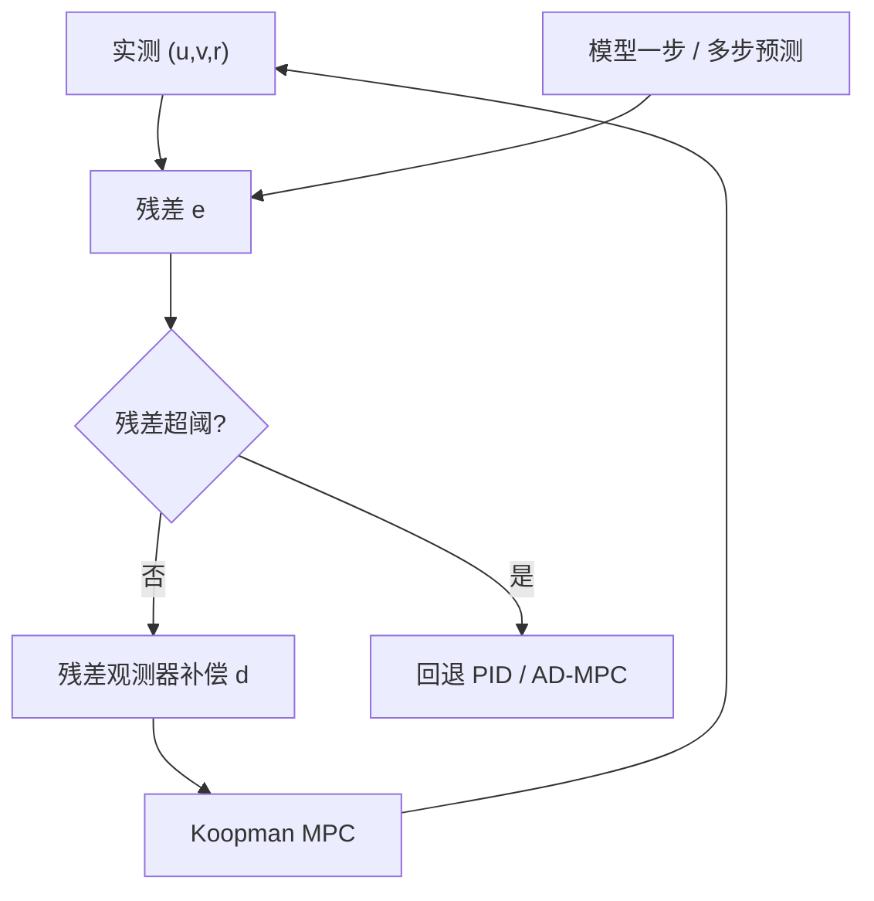

# 仿真到实船优化指南

本文档说明：当训练数据来自**仿真环境**（或结构化系统辨识工况），要切换到**实船数据**并部署 Deep-Koopman + OSQP MPC 时，应做哪些优化。配套文档：[项目指南](./项目指南.md)、[训练流程指南](./训练流程指南.md)、[MPC 使用指南](./MPC使用指南.md)、[工程分析与优化](./工程分析与优化.md)、[数据增强技术方案](./数据增强技术方案.md)。

> **版本主线**：v4 dict-input 模型 + C++ OSQP 潜空间 MPC（`koopman_v4_latent.yaml`）。ONNX plant 仅用于闭环仿真 demo，不参与实船优化器。

---

## 1. 背景与目标

### 1.1 工程在解决什么

本仓库为无人船 / 船舶水平面运动学习 Deep-Koopman 动力学：在给定推进器控制下多步预测 `(u, v, r)`，再经外部欧拉积分恢复 `(x, y, ψ)`，并由潜空间 QP-MPC 做航迹跟踪。

### 1.2 本文定位

| 问题 | 说明 |
|------|------|
| 从哪到哪 | 仿真采集 / 干净辨识数据 → 实船 rosbag / 在线控制 |
| 不做什么 | 不替代训练脚本细节（见训练流程指南）；不替代 QP 推导（见潜空间 QP 文档） |
| 做什么 | 给出差距分析、分阶段优化清单、验收标准与代码落点 |

### 1.3 关于当前数据来源

仓库文档将主训练集 `koopman_train_merged.npz` 描述为 **rosbag 海试切分**（`/localization/fusion_pose` + `/system/chassis_feedback` → 10 Hz）。另有 [`data/sim_10HZ.npz`](../data/README.md) **未接入任何训练脚本**。

无论当前数据实际来自仿真还是海试，切到**新船、新装载、新水域**时，下列缺口高度重合：归一化漂移、坐标系不一致、执行器延迟、环境扰动未建模、开环训练 vs 闭环控制分布差。

---

## 2. 工程全景

### 2.1 端到端链路

### 2.2 关键模块

| 模块 | 路径 | 作用 |
|------|------|------|
| 数据处理 | [`scripts/data/`](../scripts/data/) | rosbag → 对齐 10 Hz → 按机动切段 → NPZ |
| 路径常量 | [`koopman/paths.py`](../koopman/paths.py) | 默认 train/val/test、`sim_10HZ` 路径 |
| v4 训练 | [`new_v4_dict_input/train_v4_dict_input.py`](../new_v4_dict_input/train_v4_dict_input.py) | 主推训练入口 |
| v4 模型 | [`new_v4_dict_input/model_v4_dict_input.py`](../new_v4_dict_input/model_v4_dict_input.py) | dict16 + hidden32，decoder 回归 `(u,v,r)` |
| 潜空间导出 | [`new_v4_dict_input/export_v4_encode_weights.py`](../new_v4_dict_input/export_v4_encode_weights.py) | MPC 用 latent YAML |
| MPC 配置 | [`cpp/koopman_control/config/mpc_config.yaml`](../cpp/koopman_control/config/mpc_config.yaml) | horizon、dt、代价、约束 |
| 实船桥接 | [`cpp/motion.cpp`](../cpp/motion.cpp)、[`cpp/motion_koopman_mpc.cpp`](../cpp/motion_koopman_mpc.cpp) | fusion_pose、外参、0.5 s 控制周期 |

### 2.3 模型与控制分工

- **动力学只学速度** `(u,v,r)`；位姿不在 Koopman 状态内。
- **实船**只加载 latent YAML；**ONNX** 仅作仿真 plant。

---

## 3. 仿真 vs 实船：差距全景

### 3.1 对照示意

### 3.2 差距 → 代码假设映射

| 维度 | 仿真侧常见特征 | 实船现实 | 当前代码假设 / 风险点 |
|------|----------------|----------|------------------------|
| 传感器 | 干净、同步好 | 噪声、延迟、丢包 | [`bag_test.py`](../scripts/data/bag_test.py) 用 `fill_value="extrapolate"`，缺口处可造非物理样本 |
| 坐标系 | 质心 / 统一点 | fusion ≠ 旋转中心 | 训练直接用 fusion 速度；[`motion.cpp`](../cpp/motion.cpp) 另有外参，训练与控制可能不一致 |
| 执行器 | CMD ≈ 力 | 延迟、死区、饱和 | 开环把录制 CMD 当真实输入；无延迟状态 |
| 环境 | 无风流 | 风、流、浪 | 状态仅 `(u,v,r)`；吃水话题已订阅读水但**未进 Koopman** |
| 工况 | 结构化机动 | 自由航行 + 装载变化 | 训练集偏辨识机动；val 仅 3 段 |
| 归一化 | 单次统计固定 | 船型/航速分布变 | `dyn_mean/std`、`ctrl_mean/std` 写死进 YAML；复用仿真 ckpt 会漂 |
| 训练噪声 | v2 / **v4** 均可注入 | 实船噪声更大 | 默认关闭；实船见 [数据增强技术方案](./数据增强技术方案.md) |
| 控制分布 | 开环录制 | MPC 闭环 | 闭环可把状态推到训练流形外 |

### 3.3 当前管线中「已有 / 没有」

| 已有 | 没有 |
|------|------|
| rosbag → NPZ 统一 schema | Domain randomization |
| z-score 归一化 + 导出 YAML | 仿真预训练 → 实船 fine-tune 脚本化流程 |
| 谱半径稳定正则 | 执行器延迟 / 风流状态 |
| v2 / **v4** 状态与控制噪声（`--noise_std` / `--ctrl_noise_std`，默认关） | Mixup / 时序扭曲等破坏动力学一致性的增强 |
| motion 外参、吃水订阅 | 吃水进模型；在线自适应 |
| ONNX 闭环仿真 plant | 用 `sim_10HZ.npz` 混合训练 |

---

## 4. 优化总览（P0 → P3）

### 4.1 路线图

**原则**：先开环 eval 过关，再上 MPC；不要直接拿仿真 ckpt 上实船。

### 4.2 一页总表

| 阶段 | 改动面 | 预期收益 | 风险 |
|------|--------|----------|------|
| **P0** 数据清洗、坐标系统一、质量门控 | `scripts/data/`、采集规范 | 消除系统性偏差，否则后续全白做 | 低；改数据不改模型 |
| **P0/P1** 每船重算归一化、重导出 YAML | 训练统计 + 导出 | 避免部署尺度错位 | 低；必须做 |
| **P1** 预训练→微调、v4 噪声、`v/r` 权重、谱半径 | `train_v4_dict_input.py` | 缩小 sim-real 差距、抗噪 | 中；需实船数据量 |
| **P2** 延迟/扰动增广、`dt`、MPC 权重约束 | 模型 + `mpc_config.yaml` | 闭环更稳、跟踪更好 | 中高；接口可能变 |
| **P3** 残差观测、回退策略 | motion / 监控 | 长期工况与安全 | 高；需新模块 |

---

## 5. P0 — 数据与坐标系（必做）

### 5.1 目标

保证：**训练用的 `(u,v,r)` 与 MPC / motion 使用的是同一参考点、同一单位、同一时间对齐规则**。

### 5.2 推荐数据流

### 5.3 具体措施

#### （1）统一坐标系

- [`motion.cpp`](../cpp/motion.cpp) 使用 `fusion_pose_to_ship_front_edge` 等外参，把观测变换到旋转中心附近。
- **训练侧**应在 bag→NPZ 阶段做同样变换，而不是只在控制侧改。
- 验收：同一段数据，训练 NPZ 中的 `(u,v,r)` 与 motion 喂给 MPC 的 `(u,v,r)` 数值一致（允许浮点误差）。

#### （2）插值与丢包

当前 [`bag_test.py`](../scripts/data/bag_test.py) 对位姿与指令均使用线性插值且 `fill_value="extrapolate"`。实船建议：

- 缺口超过阈值（例如 >0.5 s）→ **丢弃该窗或整段**，禁止外推；
- 记录丢包率，作为段质量标签；
- yaw 继续 `unwrap` 后再插值。

#### （3）执行器对齐

- 优先使用**实际反馈**（若 chassis 有实测油门/舵角）；否则至少估计输入延迟并做时间平移对齐。
- 记录左右推进器是否对称；实船常不对称，后续归一化与 `B` 矩阵会体现。

#### （4）工况覆盖

在结构化机动（直航、倒车、差速、Zigzag、Chirp、PRBS）之外，增加：

- 自由航行、顶风/顺流、不同吃水、低速靠泊；
- 若已有 MPC 闭环日志，单独成集，供 P1/P2 再训。

验证集不要长期只有 3 段；建议按工况分层 hold-out。

#### （5）质量门控

过滤或降权：速度跳变、定位发散、舵角/油门长时间饱和、时间戳乱序、段长 < 20 s（与现脚本一致）。

工具入口：[`scripts/data/check_dataset.py`](../scripts/data/check_dataset.py)。

---

## 6. P0/P1 — 归一化与域偏移

### 6.1 为什么必须重算

训练时对 6 维状态、4 维控制做 z-score，统计量写入 checkpoint / YAML，C++ 侧 `normalizeDyn` / `normalizeControl` 依赖同一组数。仿真与实船的航速均值、油门分布往往差一截（部署 YAML 中常见油门均值约 47%），**直接复用仿真归一化会导致 encoder 输入尺度错误**。

### 6.2 部署数据流

### 6.3 操作要点

1. 用**目标船、目标装载**的实船 train 集重算统计（训练脚本会自动从 Dataset 统计）。
2. 用 [`export_v4_encode_weights.py`](../new_v4_dict_input/export_v4_encode_weights.py) 重新导出 latent YAML（含 normalization + encoder/decoder）。
3. 更新 [`mpc_config.yaml`](../cpp/koopman_control/config/mpc_config.yaml) 中 `latent_model` 路径。
4. 可选：按航速分段统计；对幅值小的 `v`（横荡）单独检查 std，避免被数值噪声主导。

**禁止**：只换权重、不换归一化；或混用 A 船统计 + B 船权重。

---

## 7. P1 — 训练策略（sim → real）

### 7.1 推荐流程

### 7.2 仿真预训练 → 实船微调

| 步骤 | 建议 |
|------|------|
| 预训练 | 在仿真或源域数据上完整训 v4（可沿用现有 curriculum、EMA） |
| 微调 | 加载预训练权重；学习率降为原来的 1/5～1/10；epoch 数减少 |
| 解冻策略 | 优先更新 decoder 与 `B`；再视数据量解冻 encoder / `A` |
| 数据量 | 实船有效段过少时，冻结 encoder，只适配输出与控制通道 |

### 7.3 为 v4 增加噪声增强

v4 已与 v2 对齐，支持 `--noise_std`、`--ctrl_noise_std`（默认 `0.0` 关闭）。实船 / sim→real 训练建议打开：

- 归一化后的动力学状态噪声：约 `0.02～0.03`（可扫参）；
- 控制噪声：约 `0.003～0.005`。

目的：模拟传感器抖动与指令量化，减轻过拟合干净轨迹。是否必要、端到端流程、相对传统方案的优势与开/关验收，见 **[数据增强技术方案](./数据增强技术方案.md)**（§1 必要性、§3 技术流程、§4 优势对照）。

### 7.4 损失与稳定性

| 项 | 建议 | 原因 |
|----|------|------|
| `v` / `r` 通道权重 | 相对提高 | 工程分析文档指出 sway 易被 surge 压制；实船横漂更关键 |
| `w_stab` / `rho_max` | 略收紧（如 `rho_max≤1.0` 附近） | 实船更怕长程发散 |
| 长 horizon eval | 除 K=20 外看 K=40/60 | 暴露谱半径 >1 的累积误差 |
| 闭环再训 | MPC 采数后追加一轮 | 缓解开环→闭环分布差（DAgger 思路） |

训练入口与超参见 [训练流程指南](./训练流程指南.md)、[`new_v4_dict_input/configs/`](../new_v4_dict_input/configs/)。

---

## 8. P2 — 模型与执行器扩展

### 8.1 增广状态示意

当前隐式假设：下一拍速度只由当前 `(u,v,r)` 与指令 `u_cmd` 决定。实船更接近：

### 8.2 优先扩展项

| 扩展 | 做法 | 收益 |
|------|------|------|
| 输入延迟 | 时间对齐对齐，或把延迟指令作为额外输入 / 状态 | 闭环相位更准 |
| 慢变偏置 `d` | 增广状态或在线观测器（见 P3） | 抑制常值风流偏差 |
| 吃水 / 装载 | 条件输入、分工况模型，或增益调度 | [`motion.cpp`](../cpp/motion.cpp) 已订阅读水，可接到模型 |
| `dt` | 快动态优先 `dt=1.0`；`dt=4.0` 需确认 ZOH 假设 | 减少 yaw/sway 漏捕 |
| `clamp_pif` | 默认 5.0，极端机动复核是否饱和 | 避免字典截断失真 |

> 增广会改变 latent 维度或输入维，需同步改 C++ encoder/MPC 接口与导出脚本；改前先冻结接口评审。

---

## 9. P2 — MPC 联合标定

### 9.1 控制链路回顾

配置见 [`cpp/koopman_control/config/mpc_config.yaml`](../cpp/koopman_control/config/mpc_config.yaml)；用法见 [MPC 使用指南](./MPC使用指南.md)。

### 9.2 标定清单

| 项 | 建议 |
|----|------|
| 控制周期 vs 模型 `dt` | motion 约 **0.5 s**；模型 `dt` 为 1～4 s 时，明确零阶保持是否成立 |
| `w_z` / `w_u` / `w_du` | 实船先加大 `w_du` 抑抖，再逐步放开跟踪 |
| `u_min` / `u_max`、`throttle_du_max` | 与实船物理限幅一致，勿照搬仿真 |
| Tier-1 vs Tier-2 | **先** `w_xy=w_yaw=0` 把速度层跑稳；再开位姿项 |
| 参考系 | 参考轨迹与训练速度同为船体系或经桥接统一变换 |
| 暖启动 | 保持上一拍 QP 解，减少抖动 |

### 9.3 实船部署注意

- 实船：`KoopmanMotionMpc(latent_yaml)`，**不需要 ONNX**。
- 每次求解常用 `state0 = [0,0,0,u,v,r]`（相对原点）；位姿跟踪需 `has_pose=true` 并提供全局 `(x,y,ψ)`。
- 换船或换归一化后，必须同步换 latent YAML。

---

## 10. P3 — 在线层与安全回退

当前仓库**没有**在线自适应模块；以下为中长期能力规划。

### 10.1 在线监控闭环

### 10.2 能力项

| 能力 | 说明 |
|------|------|
| 残差观测器 | 在线估慢变 `d`，补偿风流 |
| 短窗自适应 | 用近期实船窗轻量更新偏置或 `B` |
| 健康监控 | 对比预测 vs 实测；记录超限事件 |
| 安全回退 | 残差或求解失败时切备用控制器 |

---

## 11. 验收标准与检查清单

### 11.1 开环（先过）

在**实船 held-out** 段上，用与训练一致的 `dt` / `model_stride` 做无 teacher-forcing rollout：

| 指标 | 关注点 |
|------|--------|
| `vel_rmse@1` | 短程是否贴合 |
| `vel_rmse@20`（及更长） | 长程是否发散 |
| 分通道 `u/v/r` | `v` 是否被牺牲 |
| `traj_xy` | 速度误差积分后的航迹误差 |
| `instability_score` / `slope_loglog` | 结合绝对误差曲线解读，避免口径陷阱 |

评估入口：[`new_v4_dict_input/eval_v4_dict_input.py`](../new_v4_dict_input/eval_v4_dict_input.py)、[`scripts/eval.py`](../scripts/eval.py)（注意 v4 必须正确传 `model_stride`）。

### 11.2 闭环（后上）

| 指标 | 关注点 |
|------|--------|
| 航迹 / 航向跟踪误差 | 是否满足任务 |
| 控制抖动 | `Δu`、舵角高频分量 |
| 约束违反 | 是否频繁顶限幅 |
| 发散 / 求解失败 | OSQP 状态、残差监控 |

### 11.3 分阶段 Checklist

**P0 数据**

- [ ] 训练与 motion 使用同一旋转中心 / 外参
- [ ] 丢包禁止外推；短段与坏段已过滤
- [ ] CMD/反馈时间对齐；单位与限幅已核对
- [ ] 工况覆盖含自由航行；val/test 分层合理
- [ ] `check_dataset` 通过

**P0/P1 归一化**

- [ ] 用目标船实船数据重算 mean/std
- [ ] 重新导出 `koopman_v4_latent.yaml`
- [ ] MPC 配置指向新 YAML

**P1 训练**

- [ ] 完成预训练 → 实船 fine-tune（或纯实船重训）
- [ ] v4 启用状态/控制噪声增强（见 [数据增强技术方案](./数据增强技术方案.md)；开/关对照）
- [ ] 调整 `v`/`r` 权重与稳定正则
- [ ] held-out 开环指标达标（评估时不加噪）

**P2 模型与 MPC**

- [ ] 延迟 / `dt` / `clamp_pif` 已评估
- [ ] MPC 权重与约束按实船标定
- [ ] Tier-1 稳定后再开 Tier-2
- [ ] 控制周期与模型步长关系已文档化

**P3 在线（可选）**

- [ ] 残差监控上线
- [ ] 超阈回退策略验证
- [ ] 吃水/扰动补偿方案评审

---

## 12. 相关文档与代码索引

### 12.1 文档

| 文档 | 内容 |
|------|------|
| [项目指南](./项目指南.md) | 总览、数据格式、端到端流程 |
| [训练流程指南](./训练流程指南.md) | 训练机制、导出、参数 |
| [MPC 使用指南](./MPC使用指南.md) | OSQP MPC 上手 |
| [潜空间 QP-MPC 实现](./潜空间QP-MPC实现.md) | QP 推导与 C++ 模块 |
| [工程分析与优化](./工程分析与优化.md) | 训练侧优化实验与 v 通道问题 |
| [数据增强技术方案](./数据增强技术方案.md) | v4 状态/控制噪声：参数、边界、开/关验收 |
| [模型输入输出接口说明](../cpp/koopman_control/模型输入输出接口说明.md) | v4 ONNX / MPC 接口 |

### 12.2 代码速查

| 用途 | 路径 |
|------|------|
| 海试开环采集 | [`scripts/sea_trial/run_collection.py`](../scripts/sea_trial/run_collection.py)、[数据采集运行指南](./数据采集运行指南.md) |
| bag 切分 | [`scripts/data/bag_test.py`](../scripts/data/bag_test.py)、[`split_high_density_bag.py`](../scripts/data/split_high_density_bag.py) |
| 数据检查 | [`scripts/data/check_dataset.py`](../scripts/data/check_dataset.py) |
| v4 训练 | [`new_v4_dict_input/train_v4_dict_input.py`](../new_v4_dict_input/train_v4_dict_input.py) |
| 潜空间导出 | [`new_v4_dict_input/export_v4_encode_weights.py`](../new_v4_dict_input/export_v4_encode_weights.py) |
| MPC 配置 | [`cpp/koopman_control/config/mpc_config.yaml`](../cpp/koopman_control/config/mpc_config.yaml) |
| 实船节点 | [`cpp/motion.cpp`](../cpp/motion.cpp) |

---

## 13. 小结

切到实船时，收益最大的通常不是改网络宽度，而是：

1. **数据与坐标系对齐**（P0）  
2. **归一化与 fine-tune**（P0/P1）  
3. **噪声 / 延迟 / 扰动建模**（P1/P2）  
4. **MPC 与模型步长、约束的联合标定**（P2）  
5. **在线监控与安全回退**（P3）

按 P0→P3 推进，并坚持「开环达标再闭环」，可系统降低仿真到实船的风险。
