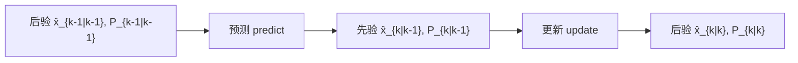
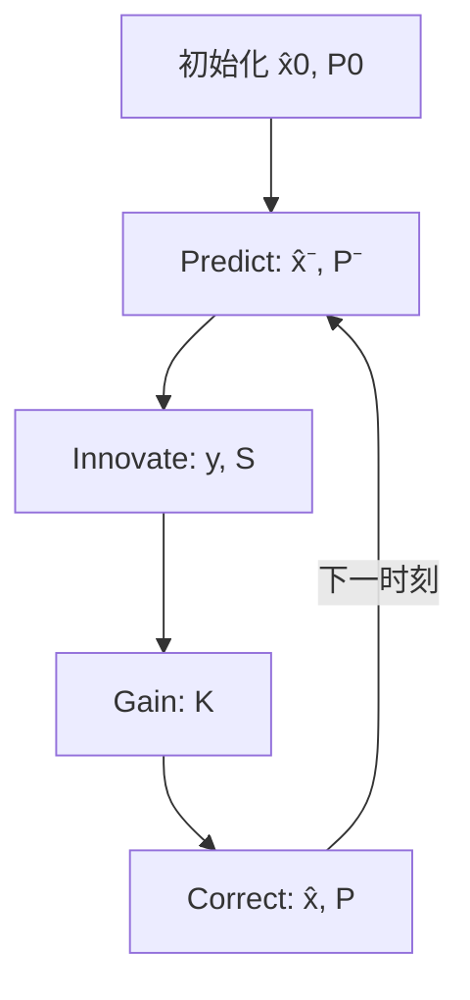

# 卡尔曼滤波推导

本文给出**线性卡尔曼滤波（Linear Kalman Filter, KF）**的完整推导：从线性高斯状态空间模型出发，经 MMSE / 贝叶斯两步得到预测与更新公式，并说明 Joseph 协方差形式。配套参考实现：`koopman/estimation/kalman.py`。

> **定位**：通用理论推导 + 可运行参考代码，**不**替代本仓库上游的 `/localization/fusion_pose` 融合定位，也不接入 `motion.cpp` / MPC。  
> **扩展**：非线性情形见 EKF / UKF（本文不展开）。

---

## 1. 问题设定

### 1.1 线性高斯状态空间模型

离散时间系统：

\[
\begin{aligned}
x_k &= F\, x_{k-1} + B\, u_{k-1} + w_{k-1}, \\
z_k &= H\, x_k + v_k,
\end{aligned}
\]

其中：

| 符号 | 含义 | 维度 |
|------|------|------|
| \(x_k\) | 状态 | \(n\times 1\) |
| \(u_{k-1}\) | 已知控制输入 | \(m\times 1\) |
| \(z_k\) | 观测 | \(p\times 1\) |
| \(F\) | 状态转移矩阵 | \(n\times n\) |
| \(B\) | 控制输入矩阵 | \(n\times m\) |
| \(H\) | 观测矩阵 | \(p\times n\) |
| \(w_{k-1}\) | 过程噪声 | \(n\times 1\) |
| \(v_k\) | 观测噪声 | \(p\times 1\) |

噪声假设（零均值、互不相关、白噪声）：

\[
\begin{aligned}
w_k &\sim \mathcal{N}(0, Q),\qquad
v_k \sim \mathcal{N}(0, R), \\
\mathbb{E}[w_i w_j^\top] &= Q\,\delta_{ij},\qquad
\mathbb{E}[v_i v_j^\top] = R\,\delta_{ij},\qquad
\mathbb{E}[w_i v_j^\top] = 0.
\end{aligned}
\]

\(Q\succeq 0\)、\(R\succ 0\)（观测噪声协方差通常取正定以保证 \(S\) 可逆）。

### 1.2 记号

| 符号 | 含义 |
|------|------|
| \(\hat{x}_{k|k-1}\) | 用到 \(k-1\) 时刻观测后，对 \(x_k\) 的一步预测（先验） |
| \(\hat{x}_{k|k}\) | 用到 \(k\) 时刻观测后的估计（后验） |
| \(P_{k|k-1}\) | 先验误差协方差 \(\mathbb{E}[(x_k-\hat{x}_{k|k-1})(\cdot)^\top]\) |
| \(P_{k|k}\) | 后验误差协方差 |
| \(y_k\) | 创新（innovation / residual）\(z_k - H\hat{x}_{k|k-1}\) |
| \(S_k\) | 创新协方差 |
| \(K_k\) | Kalman 增益 |

---

## 2. 最优准则与贝叶斯两步

### 2.1 MMSE 估计

在均方误差意义下，最优估计是条件均值：

\[
\hat{x}_{k|k}
= \mathbb{E}[x_k \mid z_{1:k},\, u_{0:k-1}].
\]

对应的误差协方差：

\[
P_{k|k}
= \mathbb{E}\bigl[(x_k-\hat{x}_{k|k})(x_k-\hat{x}_{k|k})^\top \bigm| z_{1:k},\, u_{0:k-1}\bigr].
\]

线性高斯模型下，条件分布仍为高斯，条件均值与线性 MMSE 估计一致，且可用递推实现——即卡尔曼滤波。

### 2.2 贝叶斯滤波结构

每个时刻拆成两步：



1. **预测（时间更新）**：用动力学把后验推到下一时刻先验。  
2. **更新（测量更新）**：用新观测 \(z_k\) 修正先验得到后验。

---

## 3. 预测步

设已知 \(\hat{x}_{k-1|k-1}\)、\(P_{k-1|k-1}\) 与控制 \(u_{k-1}\)。

对状态方程取条件期望（\(w\) 零均值）：

\[
\hat{x}_{k|k-1}
= F\, \hat{x}_{k-1|k-1} + B\, u_{k-1}.
\]

误差：

\[
\begin{aligned}
\tilde{x}_{k|k-1}
&= x_k - \hat{x}_{k|k-1} \\
&= F(x_{k-1}-\hat{x}_{k-1|k-1}) + w_{k-1}.
\end{aligned}
\]

因 \(w_{k-1}\) 与过去误差无关：

\[
P_{k|k-1}
= F\, P_{k-1|k-1}\, F^\top + Q.
\]

无控制时令 \(B=0\) 或 \(u=0\) 即可。

---

## 4. 更新步

### 4.1 创新与创新协方差

预测观测 \(\hat{z}_{k|k-1}=H\hat{x}_{k|k-1}\)，创新：

\[
y_k = z_k - H\hat{x}_{k|k-1}
= H\tilde{x}_{k|k-1} + v_k.
\]

\[
S_k
= \mathbb{E}[y_k y_k^\top]
= H\, P_{k|k-1}\, H^\top + R.
\]

### 4.2 联合高斯与条件均值

\((x_k,\, z_k)\) 在先验下联合高斯。对联合正态随机变量，条件均值公式为：

\[
\mathbb{E}[x\mid z]
= \mu_x + \Sigma_{xz}\Sigma_{zz}^{-1}(z-\mu_z).
\]

此处 \(\mu_x=\hat{x}_{k|k-1}\)，\(\mu_z=H\hat{x}_{k|k-1}\)，且

\[
\Sigma_{xz}
= \mathbb{E}[\tilde{x}_{k|k-1}\, y_k^\top]
= P_{k|k-1} H^\top,\qquad
\Sigma_{zz}=S_k.
\]

因此：

\[
\hat{x}_{k|k}
= \hat{x}_{k|k-1} + K_k\, y_k,
\]

其中 **Kalman 增益**

\[
K_k
= P_{k|k-1} H^\top S_k^{-1}.
\]

### 4.3 正交原理（等价视角）

线性估计 \(\hat{x}=\hat{x}^- + K(z-H\hat{x}^-)\) 的最优 \(K\) 使估计误差与创新正交：

\[
\mathbb{E}\bigl[(x-\hat{x})\, y^\top\bigr]=0.
\]

展开并解出 \(K\)，得到与上式相同的 \(K=P^-H^\top S^{-1}\)。

### 4.4 后验协方差

朴素形式（代数上正确，数值上对舍入误差敏感）：

\[
P_{k|k}
= (I - K_k H)\, P_{k|k-1}.
\]

**Joseph 形式**（对称、正定保持更好，推荐实现使用）：

\[
P_{k|k}
= (I - K_k H)\, P_{k|k-1}\, (I - K_k H)^\top
+ K_k\, R\, K_k^\top.
\]

推导要点：令 \(L=I-KH\)，则 \(\tilde{x}^+=L\tilde{x}^--Kv\)，展开协方差并利用 \(v\) 与先验误差无关即得 Joseph 式。当 \(K\) 恰为最优增益时，Joseph 式与朴素式代数等价；\(K\) 有数值误差时 Joseph 式仍保持对称半正定结构。

### 4.5 增益的计算实现

避免显式求逆：解线性方程 \(S^\top X^\top = (P^-H^\top)^\top\)，或对 \(S\) 做 Cholesky 后回代，得到 \(K=P^-H^\top S^{-1}\)。

---

## 5. 算法小结

### 5.1 单步伪代码

| 步骤 | 公式 |
|------|------|
| 预测均值 | \(\hat{x}^- = F\hat{x} + Bu\) |
| 预测协方差 | \(P^- = FPF^\top + Q\) |
| 创新 | \(y = z - H\hat{x}^-\) |
| 创新协方差 | \(S = HP^-H^\top + R\) |
| 增益 | \(K = P^-H^\top S^{-1}\) |
| 后验均值 | \(\hat{x} = \hat{x}^- + Ky\) |
| 后验协方差 | \(P = (I-KH)P^-(I-KH)^\top + KRK^\top\)（Joseph） |



### 5.2 初始化

- \(\hat{x}_{0|0}\)：先验均值（可取首次观测反推，或设计值）。  
- \(P_{0|0}\)：先验不确定性；过大则初期更信观测，过小则初期更信模型。

---

## 6. 可观性与 \(Q,R\) 调参直觉

### 6.1 可观性

线性时不变情形，\((F,H)\) 可观（可观测性矩阵满秩）时，在适当噪声假设下滤波误差协方差有意义地收敛。不可观模态的不确定性无法被观测修正，\(P\) 中对应方向会发散或依赖 \(Q\)。

### 6.2 \(Q\) 与 \(R\)

| 增大 | 效果 |
|------|------|
| \(Q\) | 更不信任模型 → 增益偏大 → 更跟观测、轨迹更「抖」 |
| \(R\) | 更不信任观测 → 增益偏小 → 更平滑、滞后更大 |

工程经验：先按传感器手册定 \(R\) 量级，再扫 \(Q\)（或过程噪声标准差）；用创新序列 \(y_k\) 的白化程度与 \(y^\top S^{-1}y\)（NIS）做一致性检查。

---

## 7. 与本仓库的关系

| 组件 | 关系 |
|------|------|
| `/localization/fusion_pose` | 上游定位融合输出；本仓库 **消费** \((u,v,r)\) 等，**不**在本模块内做传感器融合 |
| `koopman/estimation/kalman.py` | 线性 KF 参考实现，用于理论验证与教学/实验 |
| 训练噪声增强（`--noise_std`） | 训练域鲁棒性，不是在线滤波 |
| 仿真到实船 P3 残差观测器 | 未来可选方向；可借鉴本文增广状态 / 增益结构，但产品代码尚未接入 |

一句话：**本文 + 参考代码是通用 KF 工具；实船状态估计仍由外部定位栈负责。**

---

## 8. 运行

```bash
# 单测（解析一步 + Joseph 一致性）
python3 tests/test_kalman.py

# 2D 常速模型演示
python3 scripts/demo_kalman.py
python3 scripts/demo_kalman.py --plot   # 可选画图
```

模块导入：

```python
from koopman.estimation import LinearKalmanFilter
```

---

## 9. 相关文档

- [潜空间QP-MPC实现.md](./潜空间QP-MPC实现.md) — 控制侧 QP 推导（同风格的形式化文档）
- [仿真到实船优化指南.md](./仿真到实船优化指南.md) — P3 在线层 / 残差观测规划
- [数据增强技术方案.md](./数据增强技术方案.md) — 训练侧噪声 vs 部署侧滤波边界
- [项目指南.md](./项目指南.md) — 仓库总览
