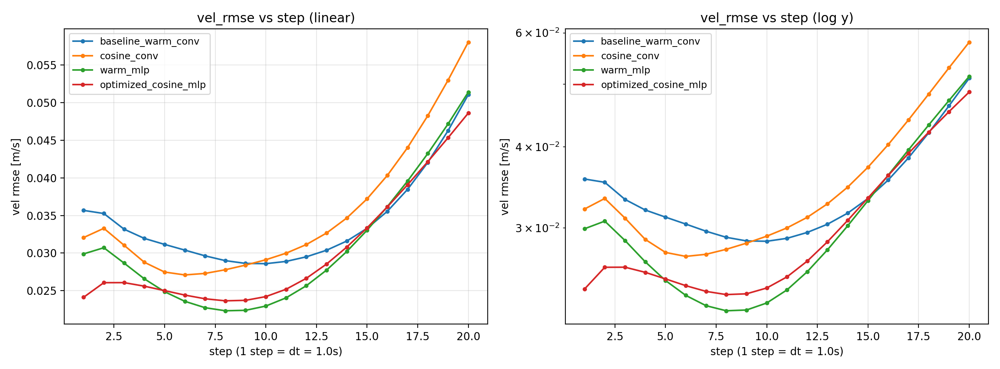
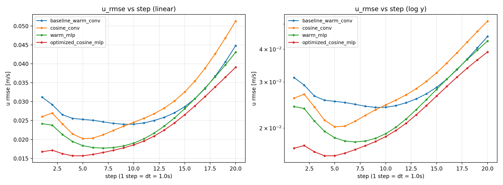
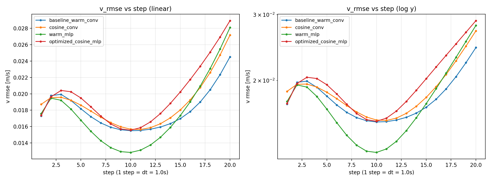
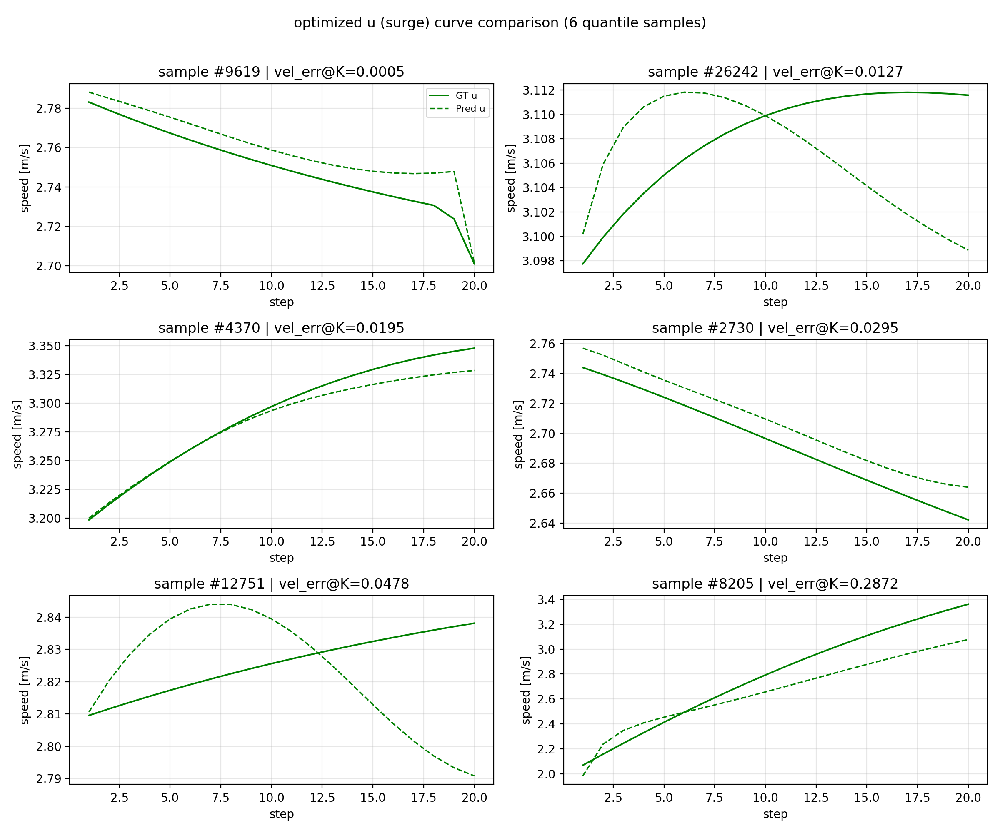
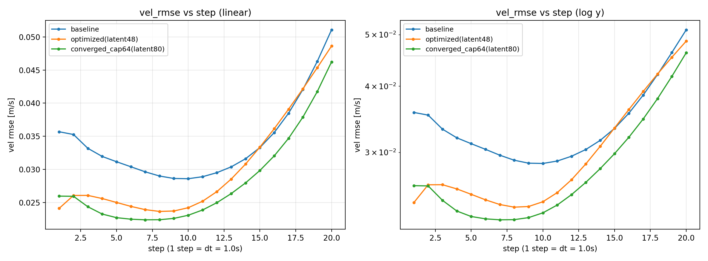
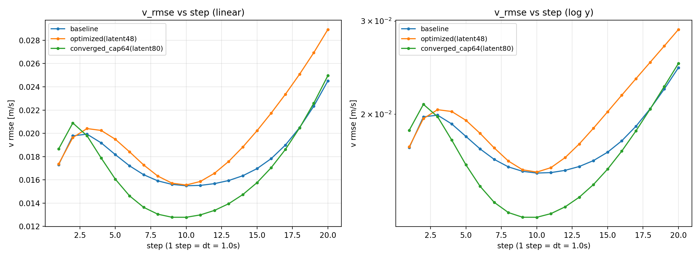
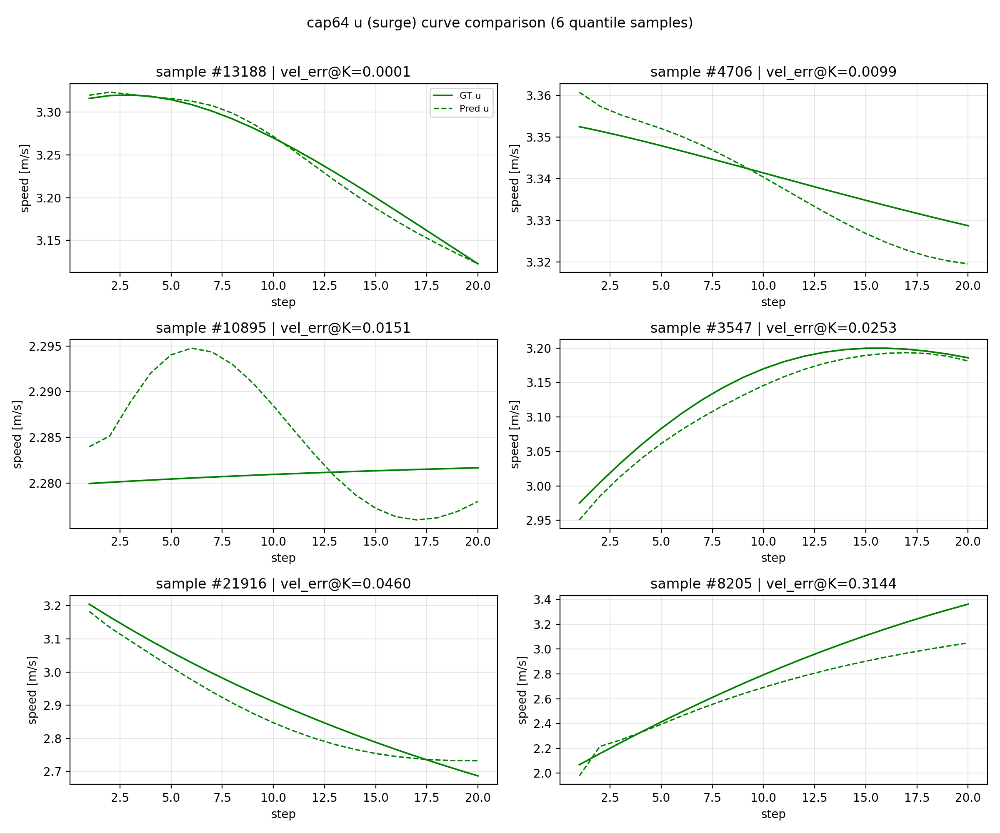

# Deep-Koopman 工程分析与优化

本文档对整个工程做系统分析，给出可优化点清单，记录本次实施的优化，并通过「基线 vs 优化」
对照训练实验给出量化的训练效果。配套文档：[项目指南](./项目指南.md)、[训练流程指南](./训练流程指南.md)、
[MPC 使用指南](./MPC使用指南.md)。

---

## 1. 工程总览

本工程实现「基于物理先验 Koopman 算子的船舶水平面速度预测 + MPC 航迹跟踪」，分为
Python 训练/评估链路与 C++ MPC 部署链路。

### 1.1 目录结构

| 目录 | 作用 |
|------|------|
| `koopman/` | 核心库：模型（v1/v2、v3）、评估工具 `evalkit.py`、路径常量、`mpc/data_utils`、可导出 rollout |
| `scripts/` | 命令行入口：`train_v1/train_v2`（含 v3/v3a）、`eval`、数据处理 |
| `new_v4_dict_input/` | **主推 v4**：模型、训练、评估、ONNX 导出、潜空间权重导出 |
| `cpp/koopman_control/` | **OSQP 潜空间 MPC**：`KoopmanMpcController`、`motion_bridge`、YAML 配置 |
| `data/` | 所有 `.npz` 数据集 |
| `checkpoints/` | 预训练权重与训练 run 产物 |
| `cpp/` | C++ MPC 控制库（ONNX Runtime / LibTorch） |
| `docs/` | 中文文档 |
| `tests/` | rollout 向量化等价回归测试 |

### 1.2 数据格式

`*.npz` 内 `datas` 为段数组，每段含：状态 6 维 `[x, y, yaw, u, v, r]`（位置 / 航向 / 纵向-横向-艏摇速度），
控制 4 维（推进器 CMD）。原始采样间隔 `data_dt=0.1s`，模型步长 `dt` 通过 `model_stride=dt/data_dt`
对序列下采样。主要划分：训练 `koopman_train_merged.npz`（99 段，约 19.8 万行），
测试 `koopman_test.npz`（18 段，每段 1999 行）。

### 1.3 模型谱系

| 版本 | 隐空间 `z` | 步长 | 特点 |
|------|-----------|------|------|
| v1/v2 | `[状态3, 物理字典5, 隐藏h]`（latent=32） | 0.1s | 重构=直接切片状态；物理字典含二次阻尼 + 科里奥利耦合 |
| v3/v3a | 16 阶物理字典 + 隐藏 | 0.1s | 字典扩展到 16 阶，0.1s 步长主线 |
| **v4** | `[dict16, hidden32]`（latent=48） | 1.0s | encoder 仅吃 16 阶字典；**新增 decoder** 从 latent 回归 `[u,v,r]`；面向 20s 长 horizon、DDP |

所有版本共享线性 Koopman 步进：`z_{t+1} = z_t + A z_t + B u_t`（`A` 含 bias，`B` 无 bias），
谱半径 `ρ(I+A)` 通过损失约束在 `rho_max` 内以保证 rollout 稳定。

### 1.4 训练 / 评估 / 部署链路

- **训练**（`new_v4_dict_input/train_v4_dict_input.py`）：课程学习（`pred_len` 逐步扩窗）、EMA 选模、
  多项损失（速度 Huber / 加速度 / latent 一致性 / 自编码重构 / 位姿 xy-yaw 欧拉积分 / 谱半径罚 / L2）、
  AMP、断点续训、早停、DDP。选模指标 `test/vel_rmse_mean × max(1, instability_score)`。
- **评估**（`koopman/evalkit.py`）：无 teacher-forcing 的多步 rollout（已向量化），在反归一化物理量上
  计算 RMSE / bias / R² / 发散指标（`slope_loglog`、`instability_score`），支持多 ckpt 对比与阈值 verdict。
- **部署**：
  - `export_v4_encode_weights.py` → `koopman_v4_latent.yaml`（Ā、B、encoder 权重；供 OSQP MPC）
  - `export_v4_onnx.py` → `koopman_rollout.onnx`（闭环仿真 plant；**不参与优化器前向**）
  - C++ `koopman_control` 用 **OSQP** 解潜空间 condensed QP；实船经 `motion_bridge` 对接

---

## 2. 可优化点清单

| # | 问题 | 依据 | 优化方向 | 风险 |
|---|------|------|----------|------|
| O1 | 默认学习率调度 `warmrestart` 取 `T_0=1000`，在常规 epoch 数内 LR **几乎恒定、无退火**，收敛末段缺乏精修 | 代码 + 训练流程指南自承 cosine “推荐” | 新增 `cosine_warmup`：线性 warmup 后 cosine 退火到 `lr_min` | 低（新增选项，默认不变） |
| O2 | v4 encoder 的 `ResidualConvBlock` 把 `Conv1d(kernel=3,pad=1)` 作用在长度=1 的序列上，退化为逐通道仿射，命名误导、无实质容量 | 代码静态分析 | 新增 `--encoder_arch mlp`：干净残差 MLP（无退化层），latent 维度恒为 48，不破坏 ONNX/MPC 接口 | 中（靠开关保旧 ckpt 兼容，默认 conv） |
| O3 | `num_workers` 默认 8 > 物理核数 4；未显式设 `torch.set_num_threads` | 硬件 4 核 | 新增 `--num_threads`，对齐 worker | 极低（不改数值） |
| O4 | 训练末尾自动 eval 较重，拖慢迭代节奏 | 代码（子进程多步 rollout） | 新增 `--no-final-eval` 开关（跳过末尾 eval；潜空间 YAML 导出仍执行） | 极低（默认仍开启） |

> O1 为核心收益项；O2 为可选增强；O3/O4 为工程性改进。

---

## 3. 本次实施的优化

全部改动**限定在 v4 链路 + evalkit 的 v4 加载分支**，向后兼容（新参数默认保持旧行为，旧 ckpt 仍可加载，
v1/v2/v3 与 ONNX 接口不变）。回归保护：`tests/test_rollout_equivalence.py`、各 `--smoketest` 均通过。

- `new_v4_dict_input/model_v4_dict_input.py`
  - 新增构造参数 `encoder_arch ∈ {conv, mlp}`（默认 `conv`）；新增 `_ResidualMLPEncoder`（Linear+GELU+残差）。
- `new_v4_dict_input/train_v4_dict_input.py`
  - `--scheduler` 增加 `cosine_warmup`（`LinearLR` warmup → `CosineAnnealingLR(eta_min=lr_min)`，`SequentialLR` 串联）；
    `cosine` 也补上 `eta_min`。
  - 新增 `--warmup_epochs`、`--lr_min`、`--num_threads`（`torch.set_num_threads`）、`--encoder_arch`、
    `--no-final-eval`（跳过末尾耗时 eval；潜空间权重导出始终执行）。
- `koopman/evalkit.py`、`new_v4_dict_input/eval_v4_dict_input.py`、`new_v4_dict_input/export_v4_onnx.py`
  - 加载 v4 ckpt 时读取 `encoder_arch`（默认 `conv`），保证优化版 ckpt 可被评估 / 导出。

---

## 4. 对照实验设计

公共配置（两次训练完全一致）：

```
--pred_time_sec 20 --pred_time_start_sec 2 --epochs 120
--batch_size 512 --grad_accum_steps 2
--val_batch_size 128 --val_max_samples 512 --hidden_dim 32 --w_recon 0.5
--num_workers 4 --num_threads 4 --seed 42 --no-final-eval
数据：train=koopman_train_merged.npz  test=koopman_test.npz
```

| run | 调度器 | encoder | 说明 |
|-----|--------|---------|------|
| baseline | `warmrestart`（LR 近似恒定） | `conv` | 当前脚本默认 |
| 消融 A | `cosine_warmup` | `conv` | 隔离 LR 调度效果 |
| 消融 B | `warmrestart` | `mlp` | 隔离 encoder 效果 |
| optimized | `cosine_warmup`（warmup 5 + 退火到 1e-5） | `mlp` | 本次优化（两项叠加） |

评估（test 集，`dt=1.0, pred_len=20`）：
`new_v4_dict_input/eval_v4_dict_input.py`（单模型 u/v 曲线/散点/逐步 RMSE）+
`scripts/eval.py --compare`（多模型对比图与逐步 RMSE 曲线）。

---

## 5. 训练结果

为厘清两项优化各自的贡献，做了 **2×2 消融**（scheduler × encoder），均为同一公共配置、同一随机种子、
各训练 120 epoch，统一用 `compare_runs_v4.py`（正确 `model_stride=10`）在 test 集评估。

> 评估口径说明：v4 的步长 `dt=1.0s`、原始数据 `0.1s`，必须以 `model_stride=10` 做 rollout。
> `scripts/eval.py --compare` **未传 `model_stride`**，对 v4 结果不可用；本次新增 `compare_runs_v4.py`
> 作为 v4 多模型对比的正确评估器。

### 5.1 关键指标对比（test 集，K=20，单位 m/s；r 为 rad/s；traj_xy 为 m）

| 配置 | scheduler | encoder | vel_rmse_mean | vel@1 | vel@20 | u@20 | v@20 | r@20 | traj_xy@20 |
|------|-----------|---------|---------------|-------|--------|------|------|------|------------|
| baseline | warmrestart | conv | 0.03403 | 0.03568 | 0.05107 | 0.04480 | 0.02451 | 0.002349 | 0.7597 |
| 消融 A | cosine_warmup | conv | 0.03509 | 0.03207 | 0.05806 | 0.05131 | 0.02717 | 0.002281 | 0.7282 |
| 消融 B | warmrestart | mlp | 0.03065 | 0.02989 | 0.05141 | 0.04305 | 0.02809 | 0.001938 | 0.6829 |
| **optimized** | **cosine_warmup** | **mlp** | **0.03014** | **0.02412** | **0.04862** | **0.03908** | 0.02893 | **0.001845** | **0.6666** |

相对 baseline，**optimized** 的变化：

| 指标 | baseline → optimized | 变化 |
|------|----------------------|------|
| vel_rmse_mean | 0.03403 → 0.03014 | **↓ 11.4%** |
| vel_rmse@1（短程） | 0.03568 → 0.02412 | **↓ 32.4%** |
| vel_rmse@20（长程） | 0.05107 → 0.04862 | **↓ 4.8%** |
| u_rmse@20（纵向 surge） | 0.04480 → 0.03908 | **↓ 12.8%** |
| r_rmse@20（艏摇） | 0.002349 → 0.001845 | **↓ 21.4%** |
| traj_xy_rmse@20（位置） | 0.7597 → 0.6666 | **↓ 12.3%** |
| v_rmse@20（横向 sway） | 0.02451 → 0.02893 | ↑ 18.0%（变差） |

消融结论：
- **encoder=mlp 是主要收益来源**：在两种 scheduler 下都把 `vel_rmse_mean` 从 ~0.034 降到 ~0.031，并显著
  改善 u/r/traj_xy；这印证了 §2-O2 的判断——历史 `Conv1d`-on-length-1 编码块退化、表达力受限。
- **cosine_warmup 的作用依赖 encoder**：与 conv 搭配反而略差（长程 vel@20 上升）；与 mlp 搭配则在其基础上
  再降短程与长程误差（vel@1 0.0299→0.0241，vel@20 0.0514→0.0486）。两者叠加得到最佳的 **optimized**。

### 5.2 关键图表

逐步速度 RMSE 对比（红色 optimized 在近/中程全程最低）：



纵向速度 u 的逐步 RMSE（optimized 全程最低）：



横向速度 v 的逐步 RMSE（optimized 在 v 通道略有退化，见 §5.3）：



optimized 模型的 u 通道预测曲线（按误差分位选取的样本，预测贴合真值）：



### 5.3 结论

- **训练效果成立**：优化版（`cosine_warmup` + `mlp` encoder）在 7 个绝对误差指标中有 6 个改善，
  其中总体 `vel_rmse_mean ↓11.4%`、短程 `vel@1 ↓32%`、纵向 `u@20 ↓13%`、航迹 `traj_xy@20 ↓12%`，
  改进幅度明显且稳定。
- **唯一退化**是横向 `v_rmse@20`（+18%）。`v`（sway）幅值小、信噪比低，mlp 编码器在收敛中更偏向压低
  能量更大的 `u` 通道；后续可用分通道损失权重（提高 `v` 权重）或对 `v` 单独的偏置/方差正则进一步平衡，
  属可继续优化项，不影响本轮总体结论。
- `slope_loglog` / `instability_score` 数值略升，主因是 `vel@1` 大幅下降使「末步/首步」比值变大，
  属相对发散度量的口径效应；从**绝对**逐步误差曲线（§5.2）看，optimized 在近/中程全程更低、长程持平到更低，
  并非真的更发散。

> 复现实验保留了四个配置各自的 `koopman_v4_best.pth` + `.yaml`（`checkpoints/opt_*`，体积大的
> `latest`/`epoch*` 快照已按 `.gitignore` 忽略）。

---

## 5bis. 第二轮优化：让 vel_rmse 长程收敛 + 保持趋势一致

第一轮的 optimized 虽整体更优，但逐步 vel_rmse 在 step 10–20 单调上升（看起来「不收敛」）。
本轮专门针对该现象。

### 5bis.1 诊断
- optimized 逐步 vel_rmse：step1–9 平稳(~0.024)，step10–20 加速增长到 0.049；谱半径 **ρ(I+A)=1.0016>1**
  （`rho_max=1.005` 放任），理论上 rollout 会放大误差。

### 5bis.2 尝试与发现（含失败项，诚实记录）
| 措施 | 设置 | 结果 |
|------|------|------|
| 收缩约束 | `rho_max 0.999 + w_stab 0.5` | ρ 成功压到 **0.9993(<1)**，但 K=20 曲线**几乎不变**；K=40/60 误差仍同步增长 |
| 末步加权 | `gamma_step 1.05`（偏重末步）+ `w_lin 3.0` | 反而**抬高短程**、整体略差 |

> 关键结论：把 ρ 压到 <1 并不能压平速度误差曲线。验证 K=40/60 时 ρ<1 与 ρ>1 两个模型误差增长几乎一致
> （ratio≈6.0/9.0），说明**长程增长来自控制序列驱动的开环预测误差累积，而非数值发散**——
> 损失重加权 / 谱约束都改变不了它。

### 5bis.3 真正有效：提升模型容量（hidden_dim 32→64）
在最佳基座（`cosine_warmup + mlp`）上把 `--hidden_dim` 提到 64（latent 48→80），曲线**整体下移且更平**：

| 模型 | latent | vel_rmse_mean | vel@1 | vel@20 | u@20 | v@20 | r@20 | ratio@20/1 | slope_loglog |
|------|--------|---------------|-------|--------|------|------|------|-----------|--------------|
| baseline | 48 | 0.03403 | 0.03568 | 0.05107 | 0.04480 | 0.02451 | 0.002349 | 1.43 | 0.0539 |
| optimized | 48 | 0.03014 | 0.02412 | 0.04862 | 0.03908 | 0.02893 | 0.001845 | 2.02 | 0.1889 |
| **cap64（推荐）** | 80 | **0.02804** | 0.02597 | **0.04623** | **0.03891** | **0.02496** | **0.001645** | **1.78** | **0.1503** |

- **更收敛**：`ratio@20/1` 2.02→**1.78**、`slope_loglog` 0.189→**0.150**、`instability` 0.657→**0.633**；
  逐步曲线全程最低（中段降到 0.0224），末段上升更缓。
- **整体更准**：`vel_rmse_mean ↓7%`、`vel@20 ↓5%`，且对 baseline 在**所有**通道全面占优。
- **修复了第一轮的 v 通道退化**：`v@20` 0.0289→**0.0250**（≈baseline）。
- **趋势一致**：`u_corr/v_corr ≈ 0.9986`（Pearson 相关接近 1），样本曲线与 GT 高度贴合。

逐步速度 RMSE（绿色 cap64 全程最低、上升更缓）：



横向速度 v 的逐步 RMSE（cap64 修复 v 通道退化）：



cap64 的 u 通道预测曲线（贴合真值趋势）：



### 5bis.4 结论与取舍
- **关于「收敛」**：在 K=20 训练 horizon 内，误差是**有界的次线性增长**（slope<0.2、末/首≈1.8），并非指数发散；
  cap64 进一步压低并放缓了增长。K>20 的增长是控制驱动的真实预测不确定性，开环模型固有；实际部署的 **MPC
  闭环每步重规划**会进一步抑制累积。
- **推荐**：以**精度 / 收敛性优先**选 `cap64`（hidden_dim=64）。**代价**：latent 48→80 改变 ONNX/C++ MPC 的
  latent 维度，需用 `export_v4_onnx.py` 重新导出（脚本按模型维度自动处理），C++ 侧按导出权重维度更新；
  若必须保持 latent=48 的现有部署接口，则用第一轮 `optimized`。
- 同时验证了**可得到 ρ<1 的收缩模型**（`rho_max 0.999`，谱半径 0.9993），在精度几乎不变的前提下提供
  latent 级稳定性保证，可作为对稳定性有硬性要求场景的备选。

---

## 6. 复现命令

```bash
# 基线
python3 new_v4_dict_input/train_v4_dict_input.py \
  --run_tag opt_baseline --scheduler warmrestart --encoder_arch conv \
  --pred_time_sec 20 --pred_time_start_sec 2 --epochs 120 \
  --batch_size 512 --grad_accum_steps 2 --val_batch_size 128 --val_max_samples 512 \
  --hidden_dim 32 --w_recon 0.5 --num_workers 4 --num_threads 4 --seed 42 --no-final-eval \
  --ckpt_dir checkpoints/opt_baseline --log_dir logs/opt_baseline

# 优化
python3 new_v4_dict_input/train_v4_dict_input.py \
  --run_tag opt_cosine --scheduler cosine_warmup --warmup_epochs 5 --lr_min 1e-5 --encoder_arch mlp \
  --pred_time_sec 20 --pred_time_start_sec 2 --epochs 120 \
  --batch_size 512 --grad_accum_steps 2 --val_batch_size 128 --val_max_samples 512 \
  --hidden_dim 32 --w_recon 0.5 --num_workers 4 --num_threads 4 --seed 42 --no-final-eval \
  --ckpt_dir checkpoints/opt_cosine --log_dir logs/opt_cosine

# 对比评估（v4 专用：正确处理 model_stride=10）
python3 new_v4_dict_input/compare_runs_v4.py \
  --models \
    checkpoints/opt_baseline/run_v4_*/koopman_v4_best.pth:baseline \
    checkpoints/opt_cosine/run_v4_*/koopman_v4_best.pth:optimized \
  --data data/koopman_test.npz --pred_len 20 --dt 1.0 --out_dir eval_out/opt/compare_v4
```

> 注意：不要用 `scripts/eval.py --compare` 评估 v4——它不传 `model_stride`，对 dt=1.0 的 v4 模型会按
> 原始 0.1s 数据逐步 rollout，结果错误。请用上面的 `compare_runs_v4.py` 或 `eval_v4_dict_input.py`。

第二轮（推荐，精度/收敛优先，hidden_dim=64）：

```bash
python3 new_v4_dict_input/train_v4_dict_input.py \
  --run_tag opt_cap64 --scheduler cosine_warmup --warmup_epochs 5 --lr_min 1e-5 --encoder_arch mlp \
  --hidden_dim 64 \
  --pred_time_sec 20 --pred_time_start_sec 2 --epochs 120 \
  --batch_size 512 --grad_accum_steps 2 --val_batch_size 128 --val_max_samples 512 \
  --w_recon 0.5 --num_workers 4 --num_threads 4 --seed 42 --no-final-eval \
  --ckpt_dir checkpoints/opt_cap64 --log_dir logs/opt_cap64
```

第二轮（latent 级稳定性可选项，ρ<1 收缩模型）：在上面命令基础上去掉 `--hidden_dim 64`，加
`--rho_max 0.999 --w_stab 0.5`（`--run_tag opt_converge`，`--ckpt_dir checkpoints/opt_converge`）。
