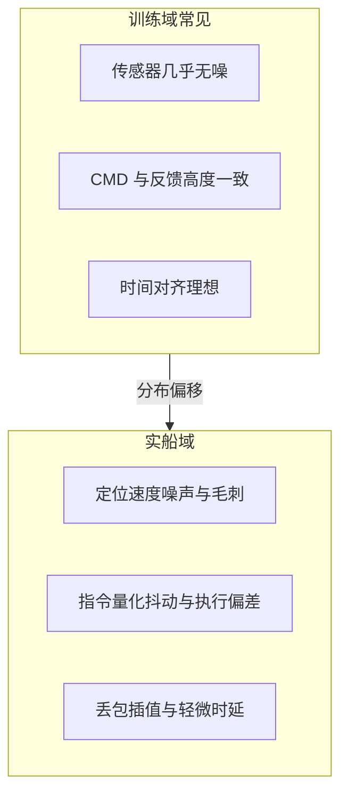
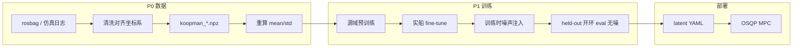
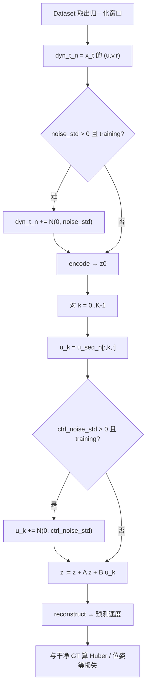

# 数据增强技术方案（仿真 → 实船）

本文给出 Deep-Koopman **v4** 在仿真/辨识数据切到实船时的轻量数据增强方案：论证**是否必要**、给出**端到端技术流程**，并对比**相对传统方案的优势**。配套：[仿真到实船优化指南](./仿真到实船优化指南.md)、[训练流程指南](./训练流程指南.md)。

> **定位**：P1 工程手段，不是大型 domain randomization 研究课题。  
> **前提**：先完成 P0（坐标系统一、清洗、重算归一化）；脏数据上做增强会放大坏样本。  
> **实现**：v4 已支持 `--noise_std` / `--ctrl_noise_std`（默认 `0.0` 关闭），与 v2 对齐。

---

## 1. 使用数据增强是否有必要

### 1.1 结论（先说清楚）

| 场景 | 是否必要 | 说明 |
|------|----------|------|
| 仿真/干净辨识数据 → 实船部署 | **有必要（轻量）** | 传感器噪声、指令抖动是确定存在的分布差；成本极低、可消融 |
| 仅在同一干净数据集上刷开环指标 | **非必须** | 默认关噪即可；开噪可能略伤短程 RMSE |
| 尚未完成 P0（坐标/清洗/归一化） | **先不做** | 增强会放大坏样本与系统性偏差 |
| 用增强替代实船采数 / fine-tune | **不可行** | 增强只补「扰动鲁棒」，不补装载、风流、船型等结构性差异 |

一句话：**对 sim→real / 实船 fine-tune，推荐做；对历史基线复现，保持关闭。**

### 1.2 为什么「有必要」——问题从哪来

本工程动力学只学 `(u, v, r)`，训练默认把录制轨迹当作干净开环监督。实船相对仿真/结构化海试，至少有三类**输入侧**差异：



| 差异 | 对 Koopman 的影响 | 增强能否覆盖 |
|------|-------------------|--------------|
| 状态噪声（fusion 速度） | `encode(u,v,r)` 落点漂移 → 潜空间初值偏 | **能**（`noise_std`） |
| 控制噪声（油门/舵指令） | `B u` 每步扰动 → 长程 rollout 累积 | **能**（`ctrl_noise_std`） |
| 归一化漂移（船型/航速） | 尺度整体错位 | **不能**（靠重算 mean/std） |
| 风流/吃水/延迟动力学 | 模型结构未建模 | **不能**（靠 P2 增广或 fine-tune） |
| 开环→闭环分布 | MPC 推到训练流形外 | **部分缓解**（抗扰）；仍需闭环再训 |

因此：增强是 **P1 的必要补丁**，不是 P0/P2 的替代品。

### 1.3 不做会怎样

- Encoder 过拟合「过干净」的 `(u,v,r)`，实船轻微毛刺即可让 `z0` 偏一截。  
- 多步 rollout / MPC 预测在噪声下误差更接近**线性累积**，而非更接近随机游走式的缓慢增长。  
- v2 文档已说明：训练时见过扰动，推断时噪声不易同向累加（见 [`scripts/train_v2.py`](../scripts/train_v2.py) `rollout_train` 注释）。v4 主线若长期关噪，实船侧会重复该缺口。

### 1.4 何时可以不做或少做

- 数据已是高噪声实船日志，且开环指标已达标、闭环无抖振。  
- 消融显示开噪后 `vel@1` 明显变差、长程无收益 → 降 σ，或仅在 fine-tune 阶段开噪。  
- 纯算法对比、复现历史 ckpt：保持默认 `0.0`。

---

## 2. 目标与边界

### 2.1 目标

在**归一化空间**对训练输入注入小幅高斯噪声，使 encoder / `B` 对传感器与指令扰动更鲁棒，减轻对「过干净」开环轨迹的过拟合。

### 2.2 做（推荐）

| 项 | 做法 | 默认建议 |
|----|------|----------|
| 状态噪声 | 仅对 `t0` 的归一化 `(u,v,r)` 加 `N(0, σ)` | `--noise_std 0.02～0.03` |
| 控制噪声 | 对每步归一化 4 维 CMD 加 `N(0, σ)` | `--ctrl_noise_std 0.003～0.005` |
| 作用域 | **仅 `model.training=True`**；验证 / eval / 导出不加噪 | 与 v2 一致 |
| 段重采样 | 高方差机动过采样（v3a `--seg_resample`） | 实船段少时可选；v4 暂不强制 |

### 2.3 不做（现阶段）

- 大规模 domain randomization（质量、风、流随机）——缺物理仿真闭环，收益不确定  
- Mixup / 时序扭曲 / 随机裁剪——易破坏动力学一致性与位姿积分监督  
- 对 GT 目标序列加噪（监督信号保持干净）  
- 用增强替代实船 fine-tune 或闭环再训  

---

## 3. 具体技术流程

### 3.1 端到端流水线（增强在哪一步）



增强**只发生在训练前向**（`rollout_train`），不改 NPZ 落盘，不改 C++ 推理图。

### 3.2 单步训练前向（注入细节）



要点：

1. **噪声加在输入，不加在标签**：`x_target_seq` / 位姿 GT 保持干净，避免监督被污染。  
2. **只扰动 t0 状态 + 逐步控制**：与 MPC 在线「测到的速度有噪、下发的指令有抖」同构。  
3. **eval / `model.eval()` 路径 σ=0**：验收与导出和部署一致，避免「训练开噪、测试也开噪」虚高鲁棒指标。

### 3.3 代码落点

| 环节 | 路径 |
|------|------|
| v4 注入 | [`new_v4_dict_input/train_v4_dict_input.py`](../new_v4_dict_input/train_v4_dict_input.py) → `rollout_train` / `compute_losses` |
| v2 原实现 | [`scripts/train_v2.py`](../scripts/train_v2.py) → `rollout_train` |
| CLI | `--noise_std`、`--ctrl_noise_std`（默认 `0.0`） |
| 静态检查 | [`tests/test_v4_noise_augment.py`](../tests/test_v4_noise_augment.py) |

伪代码（与实现一致）：

```python
if noise_std > 0:  # 由上层保证仅 training 时传入 >0
    x_t_dyn_n = x_t_dyn_n + torch.randn_like(x_t_dyn_n) * noise_std
z = model.encode(x_t_dyn_n)
for k in range(K):
    u_in = u_seq_n[:, k, :]
    if ctrl_noise_std > 0:
        u_in = u_in + torch.randn_like(u_in) * ctrl_noise_std
    z = model.latent_step(z, u_in)
    # reconstruct → 与干净 GT 比损失
```

`compute_losses` 中：

```python
noise_std = args.noise_std if model.training else 0.0
ctrl_noise_std = args.ctrl_noise_std if model.training else 0.0
```

### 3.4 推荐作业顺序（可执行）

```text
① P0   清洗 + 坐标系统一 + 重算 mean/std
② P1a  源域预训练（可关噪或小噪，保基线）
③ P1b  实船 fine-tune：--noise_std 0.02 --ctrl_noise_std 0.003
④ P1c  同配置关噪对照 run（仅改两个 σ）
⑤ P1d  held-out 开环 eval（无噪）对比 vel@1 / vel@20 / traj_xy
⑥      达标后 export latent YAML → MPC；不达标则降 σ 或仅 fine-tune 开噪
```

### 3.5 命令示例

```bash
# 开噪（实船 / sim→real 推荐起点）
python3 new_v4_dict_input/train_v4_dict_input.py \
  --train_data data/koopman_train_merged.npz \
  --test_data data/koopman_test.npz \
  --noise_std 0.02 --ctrl_noise_std 0.003 \
  --run_tag v4_noise_on

# 关噪对照（同 seed / 同数据 / 同其余超参）
python3 new_v4_dict_input/train_v4_dict_input.py \
  --noise_std 0.0 --ctrl_noise_std 0.0 \
  --run_tag v4_noise_off

# 冒烟（脚本在 smoketest 下会自动打开噪声路径）
python3 new_v4_dict_input/train_v4_dict_input.py --smoketest
```

扫参：`noise_std ∈ {0.02, 0.03}`，`ctrl_noise_std ∈ {0.003, 0.005}`；一次只动一个轴。

---

## 4. 相对传统方案的优势

这里的「传统方案」指船舶辨识与控制里常见、且本仓库周边容易想到的做法。

### 4.1 对照总表

| 传统 / 常见做法 | 本方案（归一化空间高斯噪声） | 优势 |
|-----------------|------------------------------|------|
| **只靠更多海试采数** | 在现有 NPZ 上训练时注入扰动 | 不增加出海成本；立刻可跑开/关消融 |
| **手工加传感器滤波后再训** | 训练见噪、部署仍用原融合速度 | 避免「训练过平滑、实船仍毛刺」的二次分布差 |
| **辨识后固定线性模型 + 保守增益** | 在 Deep-Koopman 多步损失里学鲁棒算子 | 保留非线性字典表达力，同时压输入敏感度 |
| **大规模 domain randomization**（随机质量/风/流） | 仅状态/控制小幅噪声 | 无需高保真扰动仿真器；实现改动小、风险低 |
| **Mixup / 时序扭曲 / 随机裁窗** | 不改时间对齐与 GT | 不破坏欧拉积分位姿损失与动力学因果 |
| **Dropout 当数据增强** | 输入噪声；encoder dropout 仍建议 0 | 避免 `encode(target)` 与 rollout 分布不一致（v2/v3 已强调） |
| **部署侧再加观测器/滤波才抗噪** | 训练期先具备输入鲁棒 | 与在线残差观测器互补：模型本身更稳，观测器负担更轻 |
| **关噪刷短程 RMSE** | 允许短程略换长程/实船稳定性 | 更贴近 MPC 多步预测与闭环使用方式 |

### 4.2 相对「纯采数 / 纯 fine-tune」

- **边际成本低**：两个 CLI 参数，无需改数据管线或 MPC 接口。  
- **可复现对照**：同一数据划分下开/关噪，归因清晰。  
- **与 fine-tune 正交**：先对齐分布（fine-tune + 归一化），再用噪声提高局部鲁棒；二者叠加，而不是互相替代。

### 4.3 相对「重型 sim-to-real（DR / 对抗域自适应）」

- **假设更弱**：不假设能仿真风浪流与船体水动力全套；只假设实船输入比训练集「更吵一点」。  
- **失败模式可控**：σ 过大时短程变差，降 σ 即可；DR 失败时常表现为不可解释的动力学漂移。  
- **与现有损失兼容**：仍用速度 Huber、位姿积分、谱半径约束，不引入额外对抗网络。

### 4.4 相对「只在控制侧加滤波 / 限幅」

- 滤波会改变 `(u,v,r)` 相位，若训练未见到滤波后的统计，反而制造新域差。  
- 本方案让模型在**与部署相同的观测定义**下学会容忍噪声；控制侧限幅、`w_du` 等仍可保留，作为第二道防线。

### 4.5 优势成立的条件（避免过度承诺）

增强的优势建立在：

1. P0 已对齐坐标系与归一化；  
2. σ 落在「小扰动」区间（本文推荐量级）；  
3. 用 held-out **无噪**评估做决策，而不是训练 loss。  

若不满足，应优先修数据与 fine-tune，而不是加大噪声。

---

## 5. 验收与开/关对照

### 5.1 指标（held-out，**评估时不加噪**）

| 指标 | 期望 |
|------|------|
| `vel_rmse@1` | 开噪后不显著变差（允许小幅波动） |
| `vel_rmse@20` / 更长 | 开噪后持平或略好（抗累积） |
| `traj_xy` | 不恶化 |
| `instability_score` | 不显著上升 |

评估入口：[`new_v4_dict_input/eval_v4_dict_input.py`](../new_v4_dict_input/eval_v4_dict_input.py)。

### 5.2 对照协议

1. 同一数据划分、同一 seed、同一 `dt` / `pred_len`  
2. 仅开关 `noise_std` / `ctrl_noise_std`  
3. 用 EMA best ckpt 在同一 test 集评估  
4. 若开噪后短程明显变差、长程无收益 → 降 σ 或仅 fine-tune 阶段开噪  

### 5.3 默认策略

- **仓库默认**：`0.0`（关闭），避免改变历史基线  
- **实船 / sim→real 推荐**：`noise_std=0.02`，`ctrl_noise_std=0.003` 起扫  

---

## 6. 相关代码与文档

| 路径 | 说明 |
|------|------|
| [`new_v4_dict_input/train_v4_dict_input.py`](../new_v4_dict_input/train_v4_dict_input.py) | v4：`--noise_std` / `--ctrl_noise_std` |
| [`scripts/train_v2.py`](../scripts/train_v2.py) | v2/v3 原有实现 |
| [`tests/test_v4_noise_augment.py`](../tests/test_v4_noise_augment.py) | 注入逻辑静态/运行时检查 |
| [仿真到实船优化指南 §7](./仿真到实船优化指南.md) | P1 训练策略总览 |
| [训练流程指南](./训练流程指南.md) | 训练机制与导出 |

---

## 7. 小结

| 问题 | 答案 |
|------|------|
| 有没有必要？ | **sim→real / 实船 fine-tune：有必要（轻量）**；复现基线可关；未做 P0 时先不做 |
| 技术流程？ | P0 对齐 → 训练 `rollout` 对 t0 状态与逐步控制加噪 → 无噪 held-out 验收 → 导出 YAML |
| 相对传统方案？ | 比加采数/重型 DR/破坏性序列增强更便宜、可控；与 fine-tune、MPC 限幅互补，不替代结构性建模 |

数据增强在本工程中应是：**归一化空间的小幅状态/控制高斯噪声 + 开/关消融**，服务于仿真到实船的输入鲁棒性，而不是替代数据质量、归一化与 fine-tune。
