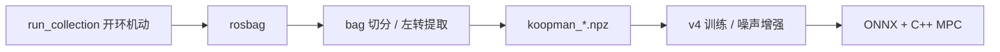

# 数据采集运行指南

船舶 Koopman 辨识/训练数据的**开环机动调度**入口。日程与后处理脚本时间轴对齐，覆盖训练、验证、测试及左转补充所需全部动作。

## 1. 入口与目录

| 路径 | 作用 |
|------|------|
| [`scripts/sea_trial/run_collection.py`](../scripts/sea_trial/run_collection.py) | CLI：打印日程 / 导出 JSON / ROS 开环下发 |
| [`scripts/sea_trial/schedule.py`](../scripts/sea_trial/schedule.py) | `dense` / `standard` / `smoke` / `left_turn` 时间表 |
| [`scripts/sea_trial/maneuvers.py`](../scripts/sea_trial/maneuvers.py) | 各机动指令生成器（节流 + 舵角） |

指令约定与 NPZ / `chassis_feedback` 一致：

```text
[port_throttle, port_angle_deg, stbd_throttle, stbd_angle_deg]
```

发布话题：`/control/control_cmd`（`elane_msgs/ControlCmd`）。

## 2. 机动一览

| 名称 | 中文 | 典型用途 | 划分 |
|------|------|----------|------|
| `fwd` | 直航 | 基线推进 / 稳态 | train |
| `astern` | 倒车 | 反向推力 | train |
| `diff_turn` | 差速转向 | 左右差推 + 小舵 | train |
| `zigzag` | Z 字操舵 | 经典辨识 | train |
| `chirp` | 扫频 | 舵角频率扫描 | train |
| `prbs` | PRBS | 伪随机激励 | train |
| `fig8` | 8 字航行 | 持续弯道 | val |
| `crash_stop` | 急停 | 巡航→倒车 | val |
| `uturn` | U 型转弯 | 大舵回转 | val |
| `random` | 自由随机航行 | 分布外测试 | test |
| `left_turn` | 左转差速补充 | 左转偏置补集 | supplement |
| `idle` | 停泊间隙 | 段间清零（smoke） | — |

```bash
python3 scripts/sea_trial/run_collection.py --list
```

## 3. 日程档位（profile）

| profile | 总时长 | 对齐后处理 |
|---------|--------|------------|
| `dense` | 25200 s（7 h） | [`split_high_density_bag.py`](../scripts/data/split_high_density_bag.py) |
| `standard` | 15000 s（~4.1 h） | [`bag_test.py`](../scripts/data/bag_test.py) |
| `smoke` | ~565 s | 每种机动各一段，码头/短航冒烟 |
| `left_turn` | `N×200` s | [`extract_left_turn.py`](../scripts/data/extract_left_turn.py) |

## 4. 推荐试验流程

### 4.1 先看日程（不发指令）

```bash
# 短冒烟日程 + 样例指令
python3 scripts/sea_trial/run_collection.py --profile smoke --dry-run

# 导出 dense 日程给试验员 / 与切段脚本对照
python3 scripts/sea_trial/run_collection.py \
  --profile dense \
  --export-schedule docs/assets/sea_trial_dense_schedule.json
```

### 4.2 录包话题

**必录**（后处理硬依赖）：

- `/localization/fusion_pose`
- `/system/chassis_feedback`

**建议同录**（延迟 / 接管分析）：

- `/control/control_cmd`
- `/planning/trajectory`
- `/state/controller_state`

```bash
rosbag record -O sea_trial_YYYYMMDD_HHMMSS.bag \
  /localization/fusion_pose \
  /system/chassis_feedback \
  /control/control_cmd \
  /planning/trajectory \
  /state/controller_state
```

先启动 `rosbag record`，再跑采集脚本。

### 4.3 实船开环下发

需 Elane ROS 环境与 `elane_msgs`，船舶在安全水域且已人工接管权。

```bash
# 冒烟（约 9 分钟）
python3 scripts/sea_trial/run_collection.py --profile smoke --ros --rate 2

# 正式高密度（7 h，对齐 dense 切分）
python3 scripts/sea_trial/run_collection.py --profile dense --ros --rate 2

# 左转补充
python3 scripts/sea_trial/run_collection.py --profile left_turn --ros \
  --left-turn-segments 10

# 中断后续跑（从第 N 段开始）
python3 scripts/sea_trial/run_collection.py --profile dense --ros --start-index 25
```

安全约定：

- 默认限幅：节流 ±100、舵角 ±35°，并做变化率限制
- `Ctrl+C` 会连续发布零推力后退出
- `--ros` 默认交互确认；脚本自动化可用 `--no-confirm`

### 4.4 录完后处理

推荐用自动切分（日程驱动 + 控制命令 onset 自动对时，无需手工维护时间边界）：

```bash
# 采集时导出过日程 JSON 的情况
python3 scripts/data/auto_split_bag.py --bag sea_trial.bag \
  --schedule /tmp/schedule.json

# 或按 profile 重建日程（须与采集时一致）
python3 scripts/data/auto_split_bag.py --bag sea_trial.bag --profile dense
```

输出写入 `data/auto_<时间戳>/`（train/val/test/supplement 四个 npz + manifest.json），
不覆盖现有数据集；段内含元数据（机动名/划分/时间边界），缺口段按"禁外推"纪律自动丢弃。

旧的手工时间边界脚本仍保留，用于复现历史数据集：

```bash
# dense 包
python3 scripts/data/split_high_density_bag.py

# 或 standard 包
python3 scripts/data/bag_test.py

# 左转补充 → 合并 → 检查
python3 scripts/data/extract_left_turn.py
python3 scripts/data/merge_npz.py
python3 scripts/data/check_dataset.py --data koopman_train_merged.npz --seg 0 --out dataset_plots
```

更完整的数据格式与切分说明见 [项目指南 §4–§5](./项目指南.md)。仿真/实船差异与质量门槛见 [仿真到实船优化指南](./仿真到实船优化指南.md)。

## 5. 与工程其它部分的关系



本脚本只负责**采集侧动作覆盖与时间表**；不替代人工安全监控，也不在环运行 MPC。闭环跟踪仍走 `cpp/motion.cpp`。

## 6. 常用参数

| 参数 | 说明 |
|------|------|
| `--profile` | `dense` / `standard` / `smoke` / `left_turn` |
| `--dry-run` | 只打印日程（默认行为，不加 `--ros` 即 dry-run） |
| `--ros` | 发布到 `/control/control_cmd` |
| `--rate` | 发布频率，默认 2 Hz |
| `--throttle-max` / `--rudder-max` | 限幅 |
| `--export-schedule PATH` | 导出 JSON 日程 |
| `--start-index N` | 从第 N 个 phase 续跑 |
| `--list` | 打印机动目录 |

```bash
python3 scripts/sea_trial/run_collection.py --help
```
