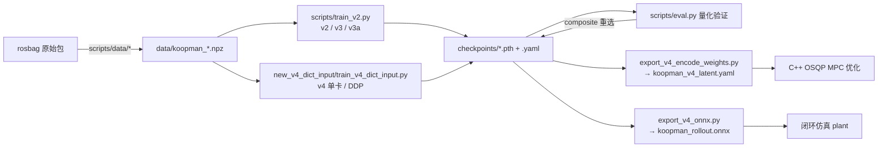
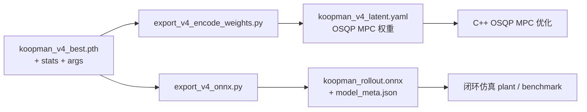

# Deep-Koopman 训练流程指南

本文档面向**训练侧**：从数据集到 checkpoint 的完整流程、各训练脚本的机制与推荐用法，以及本轮训练流程优化的内容、基准数据与兼容性说明。项目总览见 [项目指南.md](./项目指南.md)，MPC 部署见 [MPC使用指南.md](./MPC使用指南.md)。

---

## 1. 训练链路总览



| 版本 | 训练入口 | 模型 | 适用场景 |
|------|----------|------|----------|
| v1 | `scripts/train_v1.py` | `koopman.model_v1_v2` | 历史 baseline，主要做退化对比 |
| v2 | `scripts/train_v2.py --model v2` | 同上 | 5 阶字典 + 物理速度 Huber |
| v3 / v3a | `scripts/train_v2.py --model v3` | `koopman.model_v3` | 16 阶字典，当前 0.1s 步长主线 |
| v4 | `new_v4_dict_input/train_v4_dict_input.py` | `model_v4_dict_input` | dict16 主输入，1s 步长 / 20s 长 horizon，DDP |

所有命令都在**仓库根目录**执行；脚本会自动 `chdir` 到根目录。无 GPU 时全部脚本可在 CPU 上以 smoketest 规模运行。

---

## 2. 数据准备

数据格式（npz 内 `datas` 段数组、6 维状态 `[x, y, yaw, u, v, r]`、4 维控制）详见 [项目指南.md §4](./项目指南.md)。训练默认数据划分：

| 文件 | 用途 |
|------|------|
| `data/koopman_train_merged.npz` | 训练集（99 段，主集 + 左转补充） |
| `data/koopman_val.npz` | v2/v3/v3a 每 epoch 验证与选模 |
| `data/koopman_test.npz` | 最终测试；v4 直接用它做每 epoch 验证 |

训练前建议目视检查：

```bash
python3 scripts/data/check_dataset.py --data data/koopman_train_merged.npz --seg 0 --out dataset_plots
```

冒烟自检（环境验证，CPU 约 1–2 分钟）：

```bash
python3 scripts/train_v2.py --smoketest
python3 scripts/eval.py --smoketest
python3 new_v4_dict_input/train_v4_dict_input.py --smoketest
```

---

## 3. 训练机制详解

### 3.1 课程学习（curriculum）

预测步数 `pred_len` 从 `--pred_len_start` 起，每 `--pred_len_grow_every` 个 epoch 增加（v2 固定 +2，v4 由 `--pred_len_step` 控制），直至 `--pred_len_max`。每次扩窗会重建 Dataset / DataLoader（扩窗后窗口更长、可用起点更少）。

> 优化说明：扩窗重建曾经每次重新加载并拼接整个 npz，现在拼接结果按文件缓存（见 §6.1），重建只需重算窗口索引。

### 3.2 损失构成

| 损失 | v2/v3/v3a | v4 | 含义 |
|------|:--:|:--:|------|
| `L_vel` | ✓ | ✓ | 多步 rollout 物理速度 Huber（主损失，γ^k 步加权 + per-channel 1/std 缩放） |
| `L_acc` | ✓ | ✓ | 相邻步差分加速度 Huber |
| `L_lin` | ✓ | ✓ | latent 一致性：rollout latent vs encode(GT)，前 `--ramp_epochs` 线性 ramp |
| `L_bias` | ✓ | — | batch 平均误差（系统性偏置）平方惩罚，`--w_bias_u/v/r` 分通道加权 |
| `L_slope` | ✓ | — | batch vel_rmse 的 log-log 斜率超过 `--slope_target` 时的惩罚 |
| `L_recon` | ✓ | ✓ | 自编码恒等（v4 因 latent 无状态直通分量而必需，`--w_recon 0.5`） |
| `L_xy` / `L_yaw` | — | ✓ | 速度经欧拉积分得到位姿后与 GT 对齐（与 MPC/ONNX rollout 一致），`--pose_ramp_epochs` ramp |
| `L_stab` | ✓ | ✓ | 谱半径 ρ(I+A) 超过 `--rho_max` 的惩罚 |
| `L_l2` | ✓ | ✓ | A、B 矩阵的 L2 |

### 3.3 EMA 与选模

- 默认启用 EMA（`--ema_decay 0.999`，`--no_ema` 关闭）；**每 epoch 验证与最终导出都用 EMA 权重**。
- v2/v3/v3a 选模指标 `--best_metric`：
  - `composite`（默认）= `vel_rmse_mean × max(1, instability_score)`；
  - `composite_v3a` 额外乘 slope 超界惩罚与「相对 v1 退化样本占比」惩罚（需 `--baseline_ckpt`，默认 `checkpoints/koopman_v1_best.pth`）。
- v4 固定用 `test/vel_rmse_mean × max(1, instability_score)`。

### 3.4 归一化统计

训练集一次性计算 `state_mean/std`、`ctrl_mean/std`，写入 ckpt 的 `stats` 字段并导出到部署 YAML；验证/测试/部署全部复用同一份统计，**严禁混用不同训练 run 的 stats**。

### 3.5 验证 rollout

每 epoch 在验证集上做无 teacher-forcing 的 K 步 rollout（`koopman/evalkit.py::rollout_dataset`），在**反归一化物理量**上计算 `vel_rmse`、`slope_loglog`、`instability_score` 等指标。`--val_max_samples` 控制等距子采样数（v2 默认 2048，v4 默认 512）。

---

## 4. v2 / v3 / v3a 训练实操

推荐命令见 [项目指南.md §5 阶段 B](./项目指南.md)（B2 v2、B3 v3、B4 v3a Plan-A），此处不重复。训练流程优化后新增以下通用参数：

| 参数 | 默认 | 说明 |
|------|------|------|
| `--early_stop_patience N` | 0（禁用） | best 指标连续 N 个 epoch 无改善则提前停止；**仅在 curriculum 到达 `--pred_len_max` 后开始计数**，避免扩窗瞬间指标跳变误触发。停止后仍正常导出 YAML 并跑 test 评估 |

示例（v3a + 早停）：

```bash
python3 scripts/train_v2.py --model v3 --run_tag v3a --epochs 60 \
    --w_bias_v 100.0 --best_metric composite_v3a \
    --early_stop_patience 10
```

其它说明：

- 断点续训：`--resume checkpoints/koopman_latest.pth`（恢复 optimizer / scheduler / EMA / epoch / best）。
- 日志行新增吞吐指标 `(N samp/s)`，便于对比 dataloader / 硬件配置。
- AMP：CUDA 下默认开启（`--no-amp` 关闭），实现已迁移到 `torch.amp` 新 API。

---

## 5. v4 训练实操

### 5.1 单卡

```bash
python3 new_v4_dict_input/train_v4_dict_input.py \
  --run_tag v4_dict_input_20s \
  --pred_time_sec 20 --pred_time_start_sec 2 \
  --epochs 120 --batch_size 512 --grad_accum_steps 2 \
  --val_batch_size 128 --val_max_samples 512 \
  --hidden_dim 32 --w_recon 0.5
```

等效 batch = `batch_size × grad_accum_steps × GPU 数`。显存建议表见 [new_v4_dict_input/README.md](../new_v4_dict_input/README.md)。

### 5.2 多卡 DDP

```bash
# 4 卡（nccl）
bash new_v4_dict_input/run_v4_ddp.sh --nproc 4 -- --epochs 120 --run_tag v4_ddp

# 无 GPU 环境调试 DDP 流程（gloo，仅用于冒烟/CI）
torchrun --standalone --nproc_per_node 2 \
  new_v4_dict_input/train_v4_dict_input.py --smoketest --dist_backend gloo
```

> **重要修复**：历史版本的 v4 DDP 路径实际不可用——训练损失直接对 DDP 包装对象调用
> `model.encode(...)` 等自定义方法，而 `DistributedDataParallel` 不转发这些方法，
> 多卡启动即 `AttributeError` 崩溃；即便转发也会绕过 DDP reducer 导致梯度不同步。
> 现已将整套损失计算包进 `V4LossModule.forward`，DDP 正确覆盖整个计算图；
> 并在梯度累积的非步进 micro-batch 上使用 `no_sync()` 省去多余的 all-reduce。

### 5.3 v4 新增 / 调整参数一览

| 参数 | 默认 | 说明 |
|------|------|------|
| `--amp` | 关 | CUDA 混合精度（与梯度累积兼容；CPU 自动关闭并打日志） |
| `--resume <ckpt>` | — | 断点续训：恢复 model / optimizer / scheduler / EMA / scaler / epoch / best；curriculum 按恢复后的 epoch 自动对齐 |
| `--scheduler` | `warmrestart` | `warmrestart`=历史默认 `CosineAnnealingWarmRestarts(T_0=cos_T0)`，注意 **T_0=1000 时在常规 epoch 数内 LR 几乎恒定**；`cosine`=`CosineAnnealingLR(T_max=epochs, eta_min=lr_min)`；`cosine_warmup`=线性 warmup(`--warmup_epochs`) 后 cosine 退火到 `--lr_min`（**推荐**，见 [工程分析与优化](./工程分析与优化.md)）；`constant`=恒定 LR |
| `--cos_T0` | 1000 | warmrestart 的 T_0 |
| `--warmup_epochs` | 5 | `cosine_warmup` 的线性 warmup epoch 数 |
| `--lr_min` | 1e-5 | `cosine` / `cosine_warmup` 退火的最小学习率 `eta_min` |
| `--encoder_arch` | `conv` | v4 encoder 结构：`conv`=历史默认（`res_mlp`/ResidualConvBlock，旧 ckpt 兼容；其 Conv1d 作用在长度=1 序列上会退化为逐通道仿射）；`mlp`=干净残差 MLP（无退化层，实测更优，见 [工程分析与优化](./工程分析与优化.md)）。latent 维度恒为 dict16+hidden，不影响 ONNX/MPC 接口 |
| `--num_threads` | 0 | `torch.set_num_threads`；0=不显式设置。CPU 训练建议设为物理核数 |
| `--no-final-eval` | （默认开启 eval） | 跳过训练末尾的 test 评估 + 多模型 MPC 跟踪对比（耗时尾段）；YAML 导出始终执行 |
| `--early_stop_patience` | 0（禁用） | 同 v2；DDP 下由 rank0 判定并广播到所有进程 |
| `--val_loss_max_samples` | None | 每 epoch 验证中「训练同款 loss」部分的最大样本数；**None=跟随 `--val_max_samples`（新默认，等距子采样）**；`-1`=遍历全量 test 集（旧行为） |
| `--dist_backend` | `nccl` | 多卡后端；CPU 调试可用 `gloo`（不再强制要求 CUDA） |

**关于 `--val_loss_max_samples` 的口径说明**：旧实现每个 epoch 把整个 test 集（3 万+ 窗口）过一遍训练损失，仅用于日志记录；新默认与 rollout 指标一致采样 512 个窗口，CPU 实测该环节 2.02s → 0.05s/epoch。`test/L_*` 日志数值因此变为子集统计口径；**best ckpt 的选择只依赖 rollout 指标（`test/vel_rmse_mean` × instability），完全不受影响**。需要和历史日志逐位对比时传 `-1` 还原旧口径。

### 5.4 断点续训示例

```bash
python3 new_v4_dict_input/train_v4_dict_input.py \
  --resume checkpoints/run_v4_20260520_034545/koopman_v4_latest.pth \
  --epochs 150 --run_tag v4_resume
```

注意：`--resume` 会从 ckpt 内记录的 epoch 继续，新的 `--epochs` 应大于已完成 epoch 数；切换 `--scheduler` 类型时旧调度器状态无法加载，会告警并以新调度器从当前 epoch 重新计程。

### 5.5 训练产物目录

v4 训练在 `--ckpt_dir`（默认 `checkpoints/`）下自动创建 `run_v4_<timestamp>/` 子目录，产物如下：

| 文件 | 内容 | 用途 |
|------|------|------|
| `koopman_v4_best.pth` | best ckpt（按 `test/vel_rmse_mean × instability` 选） | 部署导出的输入 |
| `koopman_v4_latest.pth` | 最近一次 epoch 快照（含 optimizer/scheduler/EMA/scaler） | 断点续训 `--resume` |
| `koopman_v4_epoch{N}.pth` | 末 30 epoch 每 5 步快照 | 离线挑选 / 回溯 |
| `koopman_v4_best.yaml` | **训练侧自动导出**（`system_matrices` 简表，见 §5.6） | 速查 / 历史兼容，**非 C++ MPC 直接加载格式** |

**checkpoint（`.pth`）内部字段**：

| 键 | 说明 |
|----|------|
| `model_state_dict` / `ema_state_dict` | 原始权重 / EMA 权重（导出默认优先 EMA） |
| `stats` | 归一化统计 `state_mean/std`（6 维）、`ctrl_mean/std`（4 维） |
| `args` | 训练超参（`hidden_dim`、`clamp_pif`、`encoder_arch` 等，导出脚本据此重建模型） |
| `model_class` / `feature_dict_atoms` / `latent_dim` | 模型类名、16 阶字典原子顺序、潜维度 |
| `best_metric` | best ckpt 的选模指标值 |

> ⚠️ `.gitignore` 仅忽略 `opt_*/**/koopman_v4_latest.pth`、`epoch*.pth`；`best.pth`/`best.yaml` 默认纳入 git。

### 5.6 参数导出（部署权重）

从 best ckpt 导出**两种用途分明**的部署产物。理解二者区别是关键：



#### ① OSQP MPC 权重 —— `export_v4_encode_weights.py`（MPC 必需）

```bash
python3 new_v4_dict_input/export_v4_encode_weights.py \
  --ckpt checkpoints/run_v4_<ts>/koopman_v4_best.pth \
  --horizon 20 \
  --out cpp/koopman_mpc/weights/koopman_v4_latent.yaml
```

生成 `koopman_v4_latent.yaml`（同时写一份 `.json`），是 **C++ `KoopmanLatentModel`/`KoopmanEncoder`/`KoopmanDecoder` 实际加载的文件**，结构：

| 段 | 内容 | 消费方 |
|----|------|--------|
| `koopman.A_bar` / `bias` / `B` | 线性动力学 `z_{k+1}=Ā z_k + B̃ ũ_k + c`（`A_bar = A.weight + I`） | condensed QP 预计算 Γ/Θ/ξ |
| `encoder.layers` | dict16 + res_mlp 编码权重（`fc`/`conv_weight`/`conv_bias`/`shortcut`） | `KoopmanEncoder`（z₀、z_ref） |
| `decoder.layers` | decoder `Linear/GELU` 序列权重 | `KoopmanDecoder`（**Tier-2 位姿跟踪**） |
| `normalization` | `dyn_mean/std`、`ctrl_mean/std` | 归一化 / 反归一化 |
| `clamp_pif`、`latent_dim`、`horizon_default` 等 | 元信息 | 一致性校验 |

- `--horizon` 须与 `mpc_config.yaml` 的 `horizon` 一致；更换后需重新导出。
- decoder 自 v4 起**自动一并导出**，无需额外开关；无 decoder 的旧 YAML 会静默禁用 Tier-2。
- 仅支持 `encoder_arch=conv` 的 ckpt（导出脚本只识别 `ResidualConvBlock`+末尾 `Linear`）。

#### ② ONNX plant —— `export_v4_onnx.py`（闭环仿真 / benchmark，可选）

```bash
python3 new_v4_dict_input/export_v4_onnx.py \
  --ckpt checkpoints/run_v4_<ts>/koopman_v4_best.pth \
  --pred_len 200 --out_dir cpp/koopman_mpc/weights
```

生成 `koopman_rollout.onnx`（图内含归一化 → encode → latent_step → reconstruct → 反归一化 → 欧拉积分）+ `model_meta.json`。**仅作被控对象**（`simulate()`/demo），**不参与 MPC 优化**。导出时自动做 PT/ONNX 精度对比（阈值 `max_abs_err < 1e-4`）。详见 [ONNX导出说明.md](../new_v4_dict_input/ONNX导出说明.md)。

> ONNX 的 `--pred_len`（细步 rollout 步数，dt=0.1 → 200）与 MPC `horizon`（粗步，dt=1.0 → 20）**互相独立**：前者是仿真细步长，后者是优化预测步长，`KoopmanMotionMpc` 仅依赖 latent YAML。

#### ③ 训练自动导出 YAML（`koopman_v4_best.yaml`）—— 与 ① 不同

训练结束自动写出的 `koopman_v4_best.yaml` 采用 `system_matrices.{A_weight,A_bias,B}` + `dictionary` 简表，**只含线性矩阵与归一化，不含 encoder/decoder 逐层权重**，因此**不能直接喂给 C++ MPC**。它面向速查与历史兼容；部署 MPC 请始终用 ①（`export_v4_encode_weights.py`）。

#### 导出产物去向与 git

| 产物 | 默认路径 | git |
|------|----------|-----|
| `koopman_v4_latent.yaml/.json` | `cpp/koopman_mpc/weights/` | ❌ 忽略（须自行导出） |
| `koopman_rollout.onnx` / `model_meta.json` | `cpp/koopman_mpc/weights/` | ❌ 忽略 |
| `koopman_v4_best.yaml`（训练简表） | `checkpoints/run_v4_<ts>/` | ✅（随 best 一起） |

> 克隆仓库后 `cpp/koopman_mpc/weights/` 为空，**跑 C++ MPC 前必须先运行 ① 导出 latent YAML**（仿真另需 ②）。

---

## 6. 本轮训练流程优化说明

原则：**性能优化不改变数值行为**（已用逐位对比验证）；**功能增强默认关闭或保持现状**。

### 6.1 性能优化（行为保持）

| # | 改动 | 位置 | 效果（CPU 实测） |
|---|------|------|------|
| 1 | 验证 rollout 取数由逐样本逐步 Python 双层循环改为 numpy fancy-indexing 一次 gather | `koopman/evalkit.py::rollout_dataset` | 与 #2 合计：v1 K=20、35622 窗口 0.631s → 0.179s（**3.5×**）；v4 K=200 1.4× |
| 2 | rollout 循环内逐步 6 次 device→host 小拷贝合并为每 batch 一次 | 同上 | 同上（GPU 上收益更大：消除每步同步点） |
| 3 | npz 扁平化结果按 `(路径, mtime, size)` 模块级缓存，curriculum 扩窗重建 Dataset 不再重复 IO/拼接 | `koopman/evalkit.py::_load_segments_cached` | 9 次重建 0.388s → 0.048s（**8×**） |
| 4 | train_v2 验证去重：degraded_pct 所需 per-sample 误差复用同一次验证 rollout（旧实现某些配置下整套验证 rollout 跑两遍） | `scripts/train_v2.py` | 受影响配置下验证耗时减半 |
| 5 | v4 每 epoch 验证 loss 部分支持子采样（默认 512，旧为全量 3.2 万窗口） | `train_v4_dict_input.py::quick_validation` | 2.02s → 0.05s/epoch（**~40×**） |
| 6 | v4 DDP 梯度累积加 `no_sync()`，非步进 micro-batch 不做 all-reduce | `train_v4_dict_input.py` | 多卡通信量随 `grad_accum_steps` 成倍下降，梯度数值不变 |
| 7 | `torch.cuda.amp.*` → `torch.amp.*` 新 API | `scripts/train_v2.py` | 消除 deprecation 告警，行为一致 |

数值等价性保障：`tests/test_rollout_equivalence.py` 将向量化实现与优化前的朴素实现在 v1（dt=0.1）与 v4（dt=1.0, model_stride=10）两条路径上逐位对比；固定 seed 的 smoketest 训练指标（loss 与全部验证指标）与优化前**逐位一致**（v4 需 `--val_loss_max_samples -1` 对齐日志口径）。

```bash
python3 tests/test_rollout_equivalence.py   # 回归测试入口
```

### 6.2 Bug 修复

| # | 问题 | 修复 |
|---|------|------|
| 1 | `koopman/paths.py` 的 `CKPT_DIR` 被误改为某次 v4 run 子目录，导致 `CKPT_V1_BEST` 等常量失效、`scripts/eval.py --smoketest` 找不到 ckpt、train_v1/v2 默认把权重写进 v4 run 目录 | 改回 `checkpoints/` 根目录（v4 训练自动创建 `run_v4_<ts>/` 子目录，不受影响） |
| 2 | v4 DDP 多卡训练启动即崩溃（`DistributedDataParallel` 不转发 `encode` 等自定义方法），且该写法本质上会绕过梯度同步 | 损失计算包进 `V4LossModule.forward`；CPU gloo 双进程冒烟验证通过（见 §5.2） |

### 6.3 功能增强（默认行为不变）

- v4：AMP（`--amp`）、断点续训（`--resume`）、学习率调度选项（`--scheduler`）、CPU gloo DDP 调试；
- v2 + v4：早停（`--early_stop_patience`）、epoch 日志吞吐指标（`samp/s`）；
- v4 ckpt 新增 `scaler_state_dict` 字段（AMP 续训用），对旧 ckpt 完全向后兼容。

---

## 7. 监控与产物

### 7.1 日志与 TensorBoard

```bash
tensorboard --logdir logs
```

| 渠道 | 内容 |
|------|------|
| `logs/train_v2_*.log` / `logs/train_v4_*.log` | 文本日志：每 epoch 损失、验证指标、`samp/s` 吞吐、early-stop / curriculum 事件 |
| `logs/tensorboard_v2_*` / `logs/tb_v4_*` | `Train/L_*`、`Train/lr`、`Train/pred_len`、`val/*`（v2）或 `test/*`（v4）、发散指标 |
| `logs/metrics_*.jsonl` | 机器可读的逐 epoch 记录（含全部验证指标），便于脚本比对 |

### 7.2 checkpoint 产物

| 文件 | 说明 |
|------|------|
| `koopman_latest.pth` / `koopman_v4_latest.pth` | 每 epoch 覆盖写，含 optimizer/scheduler/EMA（/scaler），用于 `--resume` |
| `koopman_best.pth` / `koopman_v4_best.pth` | 选模指标最优的 ckpt（验证用 EMA 权重） |
| `koopman_best.yaml` / `koopman_v4_best.yaml` | 部署用归一化统计 + A/B 矩阵 + 字典说明 |
| `koopman_v4_epochN.pth` | v4 最后 30 个 epoch 每 5 个 epoch 的周期快照（MPC 对比用） |

训练结束自动在 test 集上评估 best ckpt 并打印 `QUANTITATIVE VERDICT`（v2/v3/v3a）或落盘对比图（v4）。

---

## 8. FAQ

**Q：训练慢 / 显存不足？**
减小 `--batch_size` 并用 `--grad_accum_steps` 维持等效 batch（v4）；确认 CUDA 下 AMP 已开启（v2 默认开，v4 需 `--amp`）；观察日志中 `samp/s`，若远低于硬件能力优先调 `--num_workers`。

**Q：每 epoch 验证太耗时？**
减小 `--val_max_samples`（v2/v4）与 `--val_loss_max_samples`（v4）。验证 rollout 本身已向量化（§6.1）。

**Q：早停为什么迟迟不触发？**
计数仅在 curriculum 到达 `--pred_len_max` 后开始；扩窗阶段任何 epoch 都不会累计耐心值。

**Q：v4 日志里 `test/L_*` 与旧版本对不上？**
新默认对 loss 评估子采样（§5.3）；传 `--val_loss_max_samples -1` 还原旧口径。`test/vel_rmse_mean` 等 rollout 指标口径未变。

**Q：断点续训后 LR 曲线不连续？**
若续训时更换了 `--scheduler` 类型，旧调度状态无法加载（日志有告警），调度从当前 epoch 重新计程；保持原调度类型则完全连续。

**Q：多卡训练结果和单卡不一致？**
DDP 下等效 batch = `batch_size × grad_accum_steps × world_size`，且 `DistributedSampler` 以 `drop_last=True` 分片，与单卡的样本顺序/数量天然不同，指标有差异属预期；关注收敛后的验证指标而非逐 epoch 对齐。

**Q：如何复现优化前后的性能对比？**
`python3 tests/test_rollout_equivalence.py` 含朴素参考实现，可自行计时对比；训练日志中的 `samp/s` 可用于跨配置比较。
