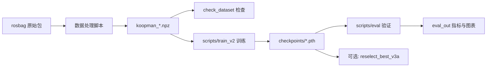

# Deep-Koopman 船舶速度跟踪 — 项目指南

本文档介绍仓库整体目标、代码结构、数据格式，以及从原始 rosbag 到训练、验证的完整脚本使用流程。快速命令可参考根目录 [`README.md`](../README.md)。

---

## 1. 项目简介

### 1.1 要解决什么问题

本项目为**无人船 / 船舶水平面运动**学习一个 **Deep-Koopman** 动力学模型，用于在给定推进器控制输入下，**多步预测**船体速度 `(u, v, r)`（纵荡、横荡、艏摇角速度），并可通过外部欧拉积分恢复平面轨迹 `(x, y, ψ)`。

典型应用场景：

- 模型预测控制（MPC）中的短期航迹推演
- 仿真与实船之间的动力学近似
- 不同操纵工况（直航、倒车、Z 字、扫频、随机航行等）下的 rollout 稳定性评估

### 1.2 核心思路

1. **物理先验字典**：把 `u|u|、v|v、r|r、vr、ur` 等已知非线性项作为 Koopman 隐空间中的**显式基函数**，减轻纯黑盒拟合负担。
2. **v3 扩展字典**：在 5 个二次项基础上增加 11 个三次项（共 16 阶物理 atom），提升大舵角、强耦合工况下的表达能力。
3. **多步 rollout 监督**：训练时直接在预测 horizon 上对物理速度做 Huber 损失，并配合 curriculum（预测步数从短到长逐步增加）。
4. **量化验证闭环**：`scripts/eval.py` 在物理空间计算 RMSE、bias、发散斜率、段间 worst-case 等指标，并输出 CSV / JSON / 图表。

### 1.3 版本演进（v1 → v2 → v3 → v3a）

| 版本 | 训练入口 | 模型 | 特点 |
|------|----------|------|------|
| **v1** | `scripts/train_v1.py` | `koopman.model_v1_v2` | 历史 baseline；加速度 + 线性化损失为主 |
| **v2** | `scripts/train_v2.py --model v2` | `koopman.model_v1_v2` | 物理速度 Huber + curriculum + EMA；5 阶字典 |
| **v3** | `scripts/train_v2.py --model v3` | `koopman.model_v3` | 16 阶字典；per-channel bias 权重 |
| **v3a** | `scripts/train_v2.py --model v3` + Plan-A 参数 | `koopman.model_v3` | 强化 `w_bias_v`、`composite_v3a` 选模、可选段加权采样 |

当前推荐主线：**v3 / v3a 训练 + `scripts/eval.py` 验证**。

---

## 2. 仓库结构

```
.
├── koopman/                   # Python 包
│   ├── model_v1_v2.py         # v1/v2 模型（latent_dim=32）
│   ├── model_v3.py            # v3 模型（latent_dim=43）
│   ├── evalkit.py             # 评估 / rollout 工具函数
│   ├── export/rollout.py      # 可导出 rollout（TorchScript / ONNX 共用）
│   ├── paths.py               # 默认路径（data/、checkpoints/）
│   └── mpc/data_utils.py      # MPC 参考构造与跟踪指标（求解器在 C++）
├── scripts/                   # CLI 入口（在仓库根目录执行）
│   ├── train_v2.py            # v2/v3/v3a 训练
│   ├── train_v1.py            # v1 训练
│   ├── eval.py                # 评估
│   ├── reselect_v3a.py        # v3a 离线重选 ckpt
│   └── data/                  # rosbag → npz、合并、可视化
├── data/                      # 所有 koopman_*.npz 数据集
├── checkpoints/               # 预训练权重
├── cpp/koopman_control/       # C++ MPC 控制库（v4、motion 桥接、mpc_config.yaml）
├── cpp/koopman_mpc/           # C++ demo / 构建（ONNX Runtime）
├── new_v4_dict_input/         # v4 训练、ONNX 导出、benchmark
│   ├── scripts/               # PT→ONNX 导出、端到端验证
│   └── weights/               # koopman_rollout.onnx 等（生成物）
├── docs/                      # 文档（含本指南）
├── logs/                      # 训练日志（gitignore）
└── eval_out/                  # 评估与 MPC 输出（gitignore）
```

**可执行脚本均在 `scripts/` 或 `cpp/koopman_mpc/scripts/`**，根目录仅保留 `README.md`、`requirements.txt` 等索引文件。路径常量见 `koopman/paths.py`。

---

## 3. 环境与依赖

### 3.1 Python 包

| 包 | 用途 |
|----|------|
| `torch` | 模型训练与推理 |
| `numpy` | 数据集读写 |
| `matplotlib` | 评估与 `check_dataset` 绘图 |
| `pyyaml` | checkpoint 导出部署 YAML |
| `scipy` | bag 处理脚本中的插值 |
| `onnx` / `onnxruntime` / `onnxscript` | PT→ONNX 导出与精度验证（C++ 部署） |
| `rosbag` | **仅数据处理脚本**需要（ROS 环境） |

### 3.2 硬件建议

- **CPU**：冒烟自测与小规模实验可在 CPU 上完成（`--no-amp`）。
- **GPU**：完整 60 epoch 训练建议使用 CUDA；训练脚本会自动检测并启用 AMP（可用 `--no-amp` 关闭）。

### 3.3 冒烟自检（无需数据准备）

```bash
python3 scripts/train_v2.py --smoketest
python3 scripts/eval.py --smoketest
```

两条命令均应在约 1 分钟内打印 `[smoketest] OK`。

---

## 4. 数据格式说明

### 4.1 NPZ 文件结构

所有 `koopman_*.npz` 使用统一格式：

```python
data = np.load("koopman_train_merged.npz", allow_pickle=True)
segments = data["datas"]  # object 数组，每个元素是一段航迹 dict
```

每段 `seg` 包含：

| 字段 | shape | 含义 |
|------|-------|------|
| `len` | 标量 | 有效时间步数 T |
| `Pos` | (2, T) | 平面位置 x, y [m] |
| `Euler` | (3, T) | 欧拉角；训练主要用 `Euler[2,:]` 即 yaw ψ [rad] |
| `Vel` | (2, T) | 船体速度 u, v [m/s]（与 Pos 同坐标系） |
| `pqr` | (1, T) | 角速度 r [rad/s]（只用第 0 行） |
| `Thrusters_CMD` | (4, T) | 左右推进器油门 + 舵角 |

训练 / 评估时，6 维状态向量为 **`[x, y, yaw, u, v, r]`**，4 维控制为 **`Thrusters_CMD`**。Koopman 动力学仅在 **`(u, v, r)`** 子空间上建模；位置通过评估脚本中的**外部欧拉积分**恢复。

### 4.2 仓库内数据集一览

| 文件 | 段数 | 用途 |
|------|------|------|
| `koopman_train_merged.npz` | 99 | **默认训练集**（主集 + 左转补充合并） |
| `koopman_val.npz` | 3 | 验证集（Fig-8 / 急停 / U-turn 等） |
| `koopman_test.npz` | 18 | **默认测试集**（随机航行 200s 切段） |
| `koopman_train.npz` | — | 原始训练切分（合并前） |
| `koopman_train_left_turn.npz` | — | 左转差速补充段 |
| `koopman_dataset_v1.npz` | — | v1 历史数据 |
| `sim_10HZ.npz` | — | 仿真 10Hz 数据 |
| `test_ds/koopman_test_dataset.npz` | 7 | 小规模测试子集 |

### 4.3 数据时间对齐

rosbag 处理脚本（`bag_test.py`、`split_high_density_bag.py`、`extract_left_turn.py`）均会：

1. 订阅 `/localization/fusion_pose` 与 `/system/chassis_feedback`
2. 将 odom 与推进器指令插值到统一时间轴（默认 **10 Hz**）
3. 按物理机动边界切成多段，写入 `datas` 数组

---

## 5. 端到端使用流程

整体流水线如下：



### 阶段 A：从 rosbag 构建数据集（可选）

若已提供 `koopman_train_merged.npz` 等文件，可跳过本阶段。

**方案 1 — 15000s 标准海试切分**（`bag_test.py`）：

```bash
# 需将 bag 路径改为实际路径（脚本内默认 ../replay.bag）
python3 bag_test.py
# 输出: koopman_train.npz, koopman_val.npz, koopman_test.npz
```

**方案 2 — 7 小时高密度包切分**（`split_high_density_bag.py`）：

```bash
python3 split_high_density_bag.py
# 同样输出 train / val / test 三个 npz
```

**补充左转数据并合并**：

```bash
python3 extract_left_turn.py
# 输出: koopman_train_left_turn.npz

python3 merge_npz.py
# 默认: koopman_train.npz + koopman_train_left_turn.npz → koopman_train_merged.npz
```

**数据质量检查**：

```bash
# 绘制第 0 段
python3 check_dataset.py --data koopman_train_merged.npz --seg 0 --out dataset_plots

# 绘制全部段（段数多时会较慢）
python3 check_dataset.py --data koopman_train_merged.npz --seg -1 --out dataset_plots
```

### 阶段 B：训练模型

> 训练机制详解（curriculum / 损失 / EMA / 选模）、v4 训练、早停 / AMP / 断点续训等
> 新参数，以及本轮训练流程优化的内容与基准数据，见 **[训练流程指南.md](./训练流程指南.md)**。

#### B1. v1 baseline（可选）

```bash
python3 scripts/train_v1.py \
    --train_data koopman_train_merged.npz \
    --val_data koopman_val.npz \
    --epochs 150 \
    --pred_len 20
```

权重写入 `checkpoints/`（由 `--ckpt_dir` 控制）。

#### B2. v2 推荐配置

```bash
python3 scripts/train_v2.py --model v2 \
    --epochs 60 \
    --pred_len_start 4 --pred_len_max 20 --pred_len_grow_every 3 \
    --batch_size 1024 --num_workers 4 --no-amp --val_max_samples 8192 \
    --w_vel 1.0 --w_acc 0.5 --w_lin 0.0 --w_stab 5.0 --w_bias 50.0 \
    --gamma_step 1.20 --gamma_bias 1.10 --huber_beta 0.1 \
    --rho_max 0.999 --noise_std 0.03 --ctrl_noise_std 0.005 \
    --best_metric composite \
    --run_tag v2 --out_dir eval_out/v2
```

#### B3. v3 推荐配置

```bash
python3 scripts/train_v2.py --model v3 \
    --epochs 60 \
    --pred_len_start 4 --pred_len_max 20 --pred_len_grow_every 3 \
    --batch_size 1024 --num_workers 4 --no-amp --val_max_samples 8192 \
    --w_vel 1.0 --w_acc 0.5 --w_lin 0.0 --w_stab 5.0 \
    --w_bias_u 80.0 --w_bias_v 30.0 --w_bias_r 30.0 \
    --w_l2 1e-4 --gamma_step 1.10 --gamma_bias 1.10 --huber_beta 0.1 \
    --rho_max 0.999 --noise_std 0.02 --ctrl_noise_std 0.003 --clamp_pif 30.0 \
    --ema_decay 0.999 --best_metric composite \
    --run_tag v3 --out_dir eval_out/v3
```

#### B4. v3a Plan-A 配置

在 v3 基础上增加：

- **A1**：`--w_bias_v 100.0`（强化横荡通道 bias 惩罚）
- **A2**：`--best_metric composite_v3a`（选模时惩罚 slope 过大、相对 v1 退化比例过高）
- **A3**：`--seg_resample u_var_r_var`（按段 u/r 方差加权采样，可选）

```bash
python3 scripts/train_v2.py --model v3 \
    --epochs 60 \
    --pred_len_start 4 --pred_len_max 20 --pred_len_grow_every 3 \
    --batch_size 1024 --num_workers 4 --no-amp --val_max_samples 8192 \
    --w_vel 1.0 --w_acc 0.5 --w_lin 0.0 --w_stab 5.0 \
    --w_bias_u 80.0 --w_bias_v 100.0 --w_bias_r 30.0 \
    --w_l2 1e-4 --gamma_step 1.10 --gamma_bias 1.10 --huber_beta 0.1 \
    --rho_max 0.999 --noise_std 0.02 --ctrl_noise_std 0.005 --clamp_pif 30.0 \
    --seg_resample u_var_r_var --seg_resample_alpha 1.0 \
    --baseline_ckpt checkpoints/koopman_v1_best.pth \
    --ema_decay 0.999 --best_metric composite_v3a \
    --run_tag v3a --out_dir eval_out/v3a
```

#### 训练产出

| 路径 | 说明 |
|------|------|
| `checkpoints/koopman_{run_tag}_best.pth` | 验证集最优权重 |
| `checkpoints/koopman_best.pth` | 同步导出的部署 ckpt |
| `checkpoints/koopman_best.yaml` | 部署用 scaler + 模型结构参数 |
| `logs/train_v2_*.log` | 文本训练日志 |
| `logs/tensorboard_v2_*` | TensorBoard 事件 |
| `eval_out/<run_tag>/` | 训练结束自动在 test 集上跑一次评估 |

常用 CLI 补充：

```bash
# 查看全部参数
python3 scripts/train_v2.py --help

# 从 YAML 加载默认超参（CLI 显式参数仍优先）
python3 scripts/train_v2.py --config my_config.yaml

# 断点续训
python3 scripts/train_v2.py --resume checkpoints/koopman_v3_best.pth
```

### 阶段 C：验证与对比

#### C1. 单模型评估

```bash
python3 scripts/eval.py \
    --ckpt checkpoints/koopman_v3a_best.pth \
    --data koopman_test.npz \
    --pred_len 20 \
    --tag v3a \
    --out_dir eval_out/v3a \
    --baseline_ckpt checkpoints/koopman_v1_best.pth
```

`--baseline_ckpt` 用于计算 **相对 v1 的退化比例** `degraded_pct_vs_baseline`（v3a 验收常用）。

#### C2. 多模型横向对比

```bash
python3 scripts/eval.py --compare \
    checkpoints/koopman_v1_best.pth:v1 \
    checkpoints/koopman_v2_best.pth:v2 \
    checkpoints/koopman_v3_best.pth:v3 \
    checkpoints/koopman_v3a_best.pth:v3a \
    --data koopman_test.npz \
    --pred_len 20 \
    --out_dir eval_out/compare_v1_v2_v3_v3a
```

#### 评估产出（每个 tag 一份）

| 文件 | 内容 |
|------|------|
| `<tag>_summary.json` | 汇总指标（step-1/20 RMSE、bias、slope、instability 等） |
| `<tag>_per_step_metrics.csv` | 逐步误差曲线 |
| `<tag>_per_step_metrics.md` | 人类可读摘要 |
| `<tag>_per_segment_metrics.csv` | 分航段 worst/best 统计 |
| `<tag>_per_sample_step20.csv` | 第 K 步逐样本误差 |
| `*.png` | 误差曲线、轨迹网格、分通道 band 等 |

对比模式额外生成 `compare_summary.md`、`compare_summary.csv` 及对比图。

终端会打印 **`=== QUANTITATIVE VERDICT (test set) ===`** 块，便于快速判断是否发散。

### 阶段 D：MPC 航迹跟踪（C++ OSQP）

> 详细说明见 **[MPC使用指南.md](./MPC使用指南.md)** 与 **[潜空间QP-MPC实现.md](./潜空间QP-MPC实现.md)**。

MPC 求解**仅保留 C++ OSQP 潜空间路径**。已移除 Python `KoopmanMPC`、`scripts/mpc_track.py` 及 C++ Adam 迭代优化。

**原理简述（Tier-1 潜空间跟踪）**

1. 用 `encode(u,v,r)` 将当前与参考速度映射到潜变量 `z`（48 维：`dict16 + hidden32`）；
2. 利用训练得到的线性动力学 `z_{k+1} = Ā z_k + B̃ ũ_k + c` 预计算 condensed 矩阵 Γ、Θ、ξ；
3. 每步解凸 QP：`min ½ U'PU + q'U`，含控制盒约束与变化率约束（**OSQP**）；
4. 施加优化得到的 `u₀`，滚动时域重复。

闭环 demo / 仿真中的被控对象可用 ONNX plant（`koopman_rollout.onnx`）前向；**优化器内不做 ONNX rollout**。

**导出与运行**

```bash
# 潜空间权重（MPC 必需）
python3 new_v4_dict_input/export_v4_encode_weights.py \
  --ckpt checkpoints/run_v4_20260520_034545/koopman_v4_best.pth \
  --horizon 20 \
  --out cpp/koopman_mpc/weights/koopman_v4_latent.yaml

# ONNX plant（闭环仿真 demo 用，可选）
python3 new_v4_dict_input/export_v4_onnx.py \
  --ckpt checkpoints/run_v4_20260520_034545/koopman_v4_best.pth \
  --pred_len 200 --out_dir cpp/koopman_mpc/weights

bash cpp/koopman_mpc/build_v4.sh
export LD_LIBRARY_PATH=cpp/koopman_mpc/third_party/onnxruntime/lib:$LD_LIBRARY_PATH
./cpp/koopman_mpc/build/koopman_mpc_cpp \
  --config cpp/koopman_control/config/mpc_config.yaml --smoketest
```

**主要参数**（`cpp/koopman_control/config/mpc_config.yaml`）

| 参数 | 默认 | 含义 |
|------|------|------|
| `latent_model` | `koopman_v4_latent.yaml` | 潜空间动力学 + encoder 权重 |
| `horizon` | 20 | MPC 预测步数（粗步长 `dt`） |
| `dt` | 1.0 | MPC 时间步（秒） |
| `opt_control_steps` | 2 | 参与优化的控制步数 |
| `control_hold_steps` | 1 | 控制零阶保持（块大小） |
| `w_z` / `w_u` / `w_du` | 1.0 / 1e-4 / 0.05 | 潜空间跟踪 / 控制幅值 / 增量惩罚 |
| `throttle_du_max` / `rudder_du_max` | 15 / 3.5 | 块间变化速率硬约束 |
| `osqp_max_iter` 等 | — | OSQP 容差与迭代上限 |

Python 侧仍提供 `koopman.mpc.data_utils`（`segment_to_state_ctrl`、`tracking_metrics` 等）用于构造参考与评估，**不含求解器**。

### 阶段 D2：motion.cpp 集成

C++ 实现分为两层：

| 目录 | 作用 |
|------|------|
| **`cpp/koopman_control/`** | OSQP MPC：`KoopmanMpcController`、`KoopmanMotionMpc`、YAML 配置 |
| **`cpp/koopman_mpc/`** | demo 程序、`build_v4.sh`、ONNX 权重目录 |

实船对接使用 `KoopmanMotionMpc(latent_yaml, cfg)`（仅需潜空间 YAML，无需 ONNX）：

```cpp
koopman_control::MpcConfig cfg =
    koopman_control::loadMpcConfigFromYaml("config/koopman_mpc.yaml");
koopman_control::KoopmanMotionMpc solver(cfg.latent_model, cfg);
```

桥接层将 motion 侧稀疏参考重采样为 `horizon+1` 个点，调用 `solveStep` 返回 4 维控制。

详见 [`cpp/koopman_control/README_CN.md`](../cpp/koopman_control/README_CN.md)、[`cpp/koopman_mpc/README.md`](../cpp/koopman_mpc/README.md) 与 [`MPC使用指南.md`](./MPC使用指南.md)。

### 阶段 E：v3a 离线重选（可选）

当进行了多轮 v3 训练、得到 `checkpoints/koopman_v3_run*_best.pth` 时，可不重训而按 `composite_v3a` 在验证集上选最优：

```bash
python3 scripts/reselect_v3a.py \
    --ckpt_glob 'checkpoints/koopman_v3_run*_best.pth' \
    --data koopman_val.npz \
    --baseline_ckpt checkpoints/koopman_v1_best.pth \
    --out checkpoints/koopman_v3a_reselect_best.pth \
    --out_dir eval_out/v3a_reselect
```

输出 `reselect_table.md`（各 ckpt 得分表）及复制后的 best 权重。

---

## 6. 各脚本详细说明

### 6.1 模型

#### `koopman.py` — `HorizontalKoopmanModel`

- 隐状态：`z = [u,v,r | 5个物理atom | 24维MLP特征]`，共 **32** 维。
- 接口：`encode` → `latent_step` → `reconstruct_state`；`spectral_radius` 约束稳定性。
- v1 / v2 共用此类；差别在训练损失与数据增强策略。

#### `koopman_v3.py` — `HorizontalKoopmanModelV3`

- 隐状态：`z = [u,v,r | 5二次 | 11三次 | hidden]`，默认 **43** 维。
- `FEATURE_DICT_ATOMS` 定义 16 个 atom 的**固定顺序**（与 YAML 部署对齐）。
- 可单独自检：`python3 koopman_v3.py`

### 6.2 训练

#### `scripts/train_v1.py`

v1 训练脚本。以加速度匹配 + 线性化损失为主，接口与历史部署兼容。新实验优先使用 `scripts/train_v2.py`。

#### `scripts/train_v2.py`

v2/v3/v3a **统一训练入口**。关键机制：

| 机制 | 说明 |
|------|------|
| Curriculum | `--pred_len_start` → `--pred_len_max`，每 `--pred_len_grow_every` epoch 增加 |
| 损失 | `L_vel`（Huber）+ `L_acc` + `L_lin` + `L_stab` + per-channel `L_bias` |
| 选模指标 | `composite` 或 `composite_v3a`（含 slope / degraded 软惩罚） |
| EMA | 默认 decay=0.999，验证用 EMA 权重 |
| 段采样 | `--seg_resample u_var_r_var` 按段方差加权 |
| 早停 | `--early_stop_patience N`（默认禁用；curriculum 到 max 后才计数） |
| 断点续训 | `--resume checkpoints/koopman_latest.pth` |
| AMP | CUDA 默认开启（`--no-amp` 关闭），已迁移 `torch.amp` 新 API |

机制详解与 v4 训练（DDP / AMP / `--scheduler` 等）见 [训练流程指南.md](./训练流程指南.md)。

### 6.3 验证

#### `scripts/eval.py`

独立于训练脚本的评估器，可在任意机器上对已有 ckpt 复现指标。所有误差在**反归一化物理量**上计算。

#### `koopman/mpc/data_utils.py`

提供 MPC 参考航迹构造（`segment_to_state_ctrl`、`make_circle_reference` 等）与 `tracking_metrics`；**求解器在 C++ `koopman_control`（OSQP）**。

#### `cpp/koopman_mpc/scripts/export_onnx.py`

从 `.pth` 导出 `koopman_rollout.onnx` 并校验 PT/ONNX 数值一致；`verify_pipeline.py` 串联 Python 与 C++ 对照。

### 6.4 数据处理

| 脚本 | 输入 | 输出 | 备注 |
|------|------|------|------|
| `bag_test.py` | rosbag | `koopman_train/val/test.npz` | 15000s 时间轴切分 |
| `split_high_density_bag.py` | rosbag | 同上 | 18000s 高密度方案 |
| `extract_left_turn.py` | rosbag | `koopman_train_left_turn.npz` | 200s 段长左转数据 |
| `merge_npz.py` | 两个 npz | `koopman_train_merged.npz` | 段级拼接 |
| `check_dataset.py` | npz | PNG 到 `dataset_plots/` | 质量目视检查 |

### 6.5 辅助

#### `scripts/reselect_best_v3a.py`

见 [阶段 D](#阶段-dv3a-离线重选可选)。

---

## 7. Checkpoint 与部署

### 7.1 文件格式

`.pth` 字典至少包含：

```python
{
    "epoch": int,
    "model_state_dict": ...,
    "stats": {
        "state_mean": (6,), "state_std": (6,),
        "ctrl_mean": (4,),  "ctrl_std": (4,),
    },
}
```

v3 ckpt 可能额外带有 `model_tag`、`feature_dict_atoms` 等字段供 `scripts/eval.py` 自动识别架构。

### 7.2 仓库预置权重

| 文件 | 说明 |
|------|------|
| `koopman_v1_best.pth` | v1 baseline（v3a 退化对比用） |
| `koopman_v2_best.pth` | v2 最优 |
| `koopman_v3_best.pth` | v3 最优 |
| `koopman_v3a_best.pth` | v3a Plan-A 最优 |
| `koopman_best.pth` + `.yaml` | 当前推荐部署导出 |

---

## 8. 常见问题

**Q: 训练很慢 / OOM？**  
减小 `--batch_size`，增加 `--val_max_samples` 上限的反面（减小采样），或使用 `--no-amp` 在 CPU 上调试。

**Q: `scripts/eval.py` 报找不到 v3 模块？**  
确保 `koopman/model_v3.py` 在包内；v1/v2 ckpt 不需要 v3。

**Q: 数据处理报 `No module named rosbag`？**  
仅在需要重新从 bag 生成数据时安装 ROS + rosbag；使用现成 npz 可跳过。

**Q: 评估输出目录在哪？**  
由 `--out_dir` 指定，默认 `test_analysis/run`；建议统一改为 `eval_out/<tag>`（已在 `.gitignore` 中忽略）。

**Q: v2 与 v3 能否共用同一个 ckpt 加载？**  
不能混用；`scripts/eval.py` 根据 ckpt 内元数据或 state_dict 键自动选择 `HorizontalKoopmanModel` 或 `HorizontalKoopmanModelV3`。

---

## 9. 推荐阅读顺序

1. 本文档 §1–§4：理解目标与数据格式  
2. 运行 §3.3 冒烟自测，确认环境可用  
3. 若有现成 npz：直接 §5 阶段 B → C  
4. 若需重建数据：§5 阶段 A → `check_dataset` → 训练 → 评估  
5. 航迹跟踪控制：§5 阶段 D（C++ OSQP MPC）与 D2（motion 集成）
6. 调 v3a 时：§5 阶段 B4 + 阶段 E  

更完整的命令行参数以各脚本 `--help` 为准。
